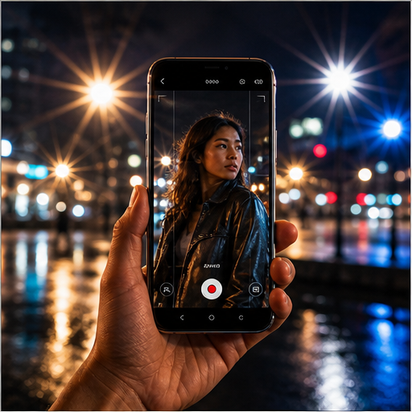

# 01. 既有 112 条机会库

> `idea_only` 图文页面。图片是概念示意，不代表已量产效果；来源链接用于理解相关技术或产品边界。

*图 01：既有 112 条机会库的概念示意。画面用于帮助理解用户最终看到的效果，不是论文原图或真实产品截图。*

## 看图理解

这是此前证据型机会库的完整映射。图中用手机取景、夜景光源、运动主体和分层信息表达旧方向如何落到录像链路；页面下方保留全部 112 条原始机会，便于从概念图回查历史记录。

本簇收录 112 条基础 IDEA，默认真实性边界包括 faithful, generative, perceptual；代表场景：夜景, 车灯, 演唱会, 逆光, 城市灯光, 人像, 婚礼, 创作。

## 本簇 IDEA

### LEGACY-OP-001｜动态星芒方向

- **用户效果**：视频化思路：把高亮点检测和可控光学核参数化，迁移到时序视频。已有能力/来源仅证明原型或相关技术，不证明本功能已经在手机中量产。
- **核心机制**：temporal feature propagation; tracking; mask-aware rendering
- **手机输入**：YUV/RGB、连续帧、语义 Mask、运动估计
- **适用场景**：夜景、车灯、演唱会
- **真实性边界**：`perceptual`
- **主要风险**：闪烁、纹理游走、边缘泄漏、运动拖影、曝光呼吸

### LEGACY-OP-002｜电影眩光与鬼影仿真

- **用户效果**：视频化思路：以光源轨迹和镜头姿态驱动跨帧 flare，而不是逐帧贴图。已有能力/来源仅证明原型或相关技术，不证明本功能已经在手机中量产。
- **核心机制**：temporal feature propagation; tracking; mask-aware rendering
- **手机输入**：YUV/RGB、连续帧、语义 Mask、运动估计
- **适用场景**：夜景、逆光、城市灯光
- **真实性边界**：`perceptual`
- **主要风险**：闪烁、纹理游走、边缘泄漏、运动拖影、曝光呼吸

### LEGACY-OP-003｜动态柔焦

- **用户效果**：视频化思路：由深度和运动边界生成可控空间频率衰减。已有能力/来源仅证明原型或相关技术，不证明本功能已经在手机中量产。
- **核心机制**：temporal feature propagation; tracking; mask-aware rendering
- **手机输入**：YUV/RGB、连续帧、语义 Mask、运动估计
- **适用场景**：人像、婚礼、夜景
- **真实性边界**：`perceptual`
- **主要风险**：闪烁、纹理游走、边缘泄漏、运动拖影、曝光呼吸

### LEGACY-OP-004｜旋焦焦外

- **用户效果**：视频化思路：用深度分层和光心估计生成连续旋转焦外。已有能力/来源仅证明原型或相关技术，不证明本功能已经在手机中量产。
- **核心机制**：temporal feature propagation; tracking; mask-aware rendering
- **手机输入**：YUV/RGB、连续帧、语义 Mask、运动估计
- **适用场景**：创作、短视频
- **真实性边界**：`generative`
- **主要风险**：闪烁、纹理游走、边缘泄漏、运动拖影、曝光呼吸

### LEGACY-OP-005｜猫眼与边缘焦外

- **用户效果**：视频化思路：建立离轴点扩散函数的空间变化并稳定光源形状。已有能力/来源仅证明原型或相关技术，不证明本功能已经在手机中量产。
- **核心机制**：temporal feature propagation; tracking; mask-aware rendering
- **手机输入**：YUV/RGB、连续帧、语义 Mask、运动估计
- **适用场景**：夜景人像、城市
- **真实性边界**：`perceptual`
- **主要风险**：闪烁、纹理游走、边缘泄漏、运动拖影、曝光呼吸

### LEGACY-OP-006｜可变光圈叶片

- **用户效果**：视频化思路：由语义/深度控制虚拟 aperture 形状和散景边界。已有能力/来源仅证明原型或相关技术，不证明本功能已经在手机中量产。
- **核心机制**：temporal feature propagation; tracking; mask-aware rendering
- **手机输入**：YUV/RGB、连续帧、语义 Mask、运动估计
- **适用场景**：电影化录像
- **真实性边界**：`perceptual`
- **主要风险**：闪烁、纹理游走、边缘泄漏、运动拖影、曝光呼吸

### LEGACY-OP-007｜镜头呼吸校正

- **用户效果**：视频化思路：估计焦点变化造成的视场变化并做几何补偿。已有能力/来源仅证明原型或相关技术，不证明本功能已经在手机中量产。
- **核心机制**：temporal feature propagation; tracking; mask-aware rendering
- **手机输入**：YUV/RGB、连续帧、语义 Mask、运动估计
- **适用场景**：拉焦、视频人像
- **真实性边界**：`faithful`
- **主要风险**：闪烁、纹理游走、边缘泄漏、运动拖影、曝光呼吸

### LEGACY-OP-008｜雨滴与镜头污渍编辑

- **用户效果**：视频化思路：利用时序背景和镜头污染 mask 做在线抑制或录后清除。已有能力/来源仅证明原型或相关技术，不证明本功能已经在手机中量产。
- **核心机制**：temporal feature propagation; tracking; mask-aware rendering
- **手机输入**：YUV/RGB、连续帧、语义 Mask、运动估计
- **适用场景**：雨天、户外
- **真实性边界**：`faithful`
- **主要风险**：闪烁、纹理游走、边缘泄漏、运动拖影、曝光呼吸

### LEGACY-OP-009｜人像主光方向重定向

- **用户效果**：视频化思路：从人脸法线/光照估计出主光，再以时序 latent rendering 重定向。已有能力/来源仅证明原型或相关技术，不证明本功能已经在手机中量产。
- **核心机制**：temporal feature propagation; tracking; mask-aware rendering
- **手机输入**：YUV/RGB、连续帧、语义 Mask、运动估计
- **适用场景**：自拍视频、直播
- **真实性边界**：`generative`
- **主要风险**：闪烁、纹理游走、边缘泄漏、运动拖影、曝光呼吸

### LEGACY-OP-010｜轮廓光自动生成

- **用户效果**：视频化思路：利用人像 mask 和背景分离生成受控边缘光。已有能力/来源仅证明原型或相关技术，不证明本功能已经在手机中量产。
- **核心机制**：temporal feature propagation; tracking; mask-aware rendering
- **手机输入**：YUV/RGB、连续帧、语义 Mask、运动估计
- **适用场景**：逆光、舞台
- **真实性边界**：`perceptual`
- **主要风险**：闪烁、纹理游走、边缘泄漏、运动拖影、曝光呼吸

### LEGACY-OP-011｜眼神光恢复

- **用户效果**：视频化思路：面部 ROI 内建立眼睛高光的亮度与位置先验。已有能力/来源仅证明原型或相关技术，不证明本功能已经在手机中量产。
- **核心机制**：temporal feature propagation; tracking; mask-aware rendering
- **手机输入**：YUV/RGB、连续帧、语义 Mask、运动估计
- **适用场景**：人像、采访
- **真实性边界**：`perceptual`
- **主要风险**：闪烁、纹理游走、边缘泄漏、运动拖影、曝光呼吸

### LEGACY-OP-012｜多人独立打光

- **用户效果**：视频化思路：每个主体独立估计 light transport，再合成共享环境光。已有能力/来源仅证明原型或相关技术，不证明本功能已经在手机中量产。
- **核心机制**：temporal feature propagation; tracking; mask-aware rendering
- **手机输入**：YUV/RGB、连续帧、语义 Mask、运动估计
- **适用场景**：多人合影、直播
- **真实性边界**：`generative`
- **主要风险**：闪烁、纹理游走、边缘泄漏、运动拖影、曝光呼吸

### LEGACY-OP-013｜环境光颜色重建

- **用户效果**：视频化思路：估计环境 illumination field 并稳定跨帧色彩映射。已有能力/来源仅证明原型或相关技术，不证明本功能已经在手机中量产。
- **核心机制**：temporal feature propagation; tracking; mask-aware rendering
- **手机输入**：YUV/RGB、连续帧、语义 Mask、运动估计
- **适用场景**：霓虹、室内
- **真实性边界**：`perceptual`
- **主要风险**：闪烁、纹理游走、边缘泄漏、运动拖影、曝光呼吸

### LEGACY-OP-014｜舞台追光

- **用户效果**：视频化思路：主体 tracking 与光源轨迹联合，形成可编辑虚拟追光。已有能力/来源仅证明原型或相关技术，不证明本功能已经在手机中量产。
- **核心机制**：temporal feature propagation; tracking; mask-aware rendering
- **手机输入**：YUV/RGB、连续帧、语义 Mask、运动估计
- **适用场景**：演唱会、表演
- **真实性边界**：`generative`
- **主要风险**：闪烁、纹理游走、边缘泄漏、运动拖影、曝光呼吸

### LEGACY-OP-015｜时间变化打光

- **用户效果**：视频化思路：由时间轴控制太阳/灯光方向并保证阴影时序一致。已有能力/来源仅证明原型或相关技术，不证明本功能已经在手机中量产。
- **核心机制**：temporal feature propagation; tracking; mask-aware rendering
- **手机输入**：YUV/RGB、连续帧、语义 Mask、运动估计
- **适用场景**：短视频、MV
- **真实性边界**：`generative`
- **主要风险**：闪烁、纹理游走、边缘泄漏、运动拖影、曝光呼吸

### LEGACY-OP-016｜负补光与局部压暗

- **用户效果**：视频化思路：按脸部/服装/背景区域做可控减光而非全局调色。已有能力/来源仅证明原型或相关技术，不证明本功能已经在手机中量产。
- **核心机制**：temporal feature propagation; tracking; mask-aware rendering
- **手机输入**：YUV/RGB、连续帧、语义 Mask、运动估计
- **适用场景**：人像、逆光
- **真实性边界**：`perceptual`
- **主要风险**：闪烁、纹理游走、边缘泄漏、运动拖影、曝光呼吸

### LEGACY-OP-017｜录后改光圈

- **用户效果**：视频化思路：深度估计加边界修复，支持同一视频多种景深输出。已有能力/来源仅证明原型或相关技术，不证明本功能已经在手机中量产。
- **核心机制**：temporal feature propagation; tracking; mask-aware rendering
- **手机输入**：YUV/RGB、连续帧、语义 Mask、运动估计
- **适用场景**：人像、旅行
- **真实性边界**：`generative`
- **主要风险**：闪烁、纹理游走、边缘泄漏、运动拖影、曝光呼吸

### LEGACY-OP-018｜多人自动拉焦

- **用户效果**：视频化思路：基于视线、语音和主体重要性生成焦点轨迹。已有能力/来源仅证明原型或相关技术，不证明本功能已经在手机中量产。
- **核心机制**：temporal feature propagation; tracking; mask-aware rendering
- **手机输入**：YUV/RGB、连续帧、语义 Mask、运动估计
- **适用场景**：采访、多人对话
- **真实性边界**：`perceptual`
- **主要风险**：闪烁、纹理游走、边缘泄漏、运动拖影、曝光呼吸

### LEGACY-OP-019｜主体/背景独立景深

- **用户效果**：视频化思路：人像 mask 与深度联合控制，避免头发边界发糊。已有能力/来源仅证明原型或相关技术，不证明本功能已经在手机中量产。
- **核心机制**：temporal feature propagation; tracking; mask-aware rendering
- **手机输入**：YUV/RGB、连续帧、语义 Mask、运动估计
- **适用场景**：Vlog、短视频
- **真实性边界**：`perceptual`
- **主要风险**：闪烁、纹理游走、边缘泄漏、运动拖影、曝光呼吸

### LEGACY-OP-020｜虚拟移轴

- **用户效果**：视频化思路：用深度平面模拟倾斜焦平面并稳定相机运动。已有能力/来源仅证明原型或相关技术，不证明本功能已经在手机中量产。
- **核心机制**：temporal feature propagation; tracking; mask-aware rendering
- **手机输入**：YUV/RGB、连续帧、语义 Mask、运动估计
- **适用场景**：建筑、城市
- **真实性边界**：`perceptual`
- **主要风险**：闪烁、纹理游走、边缘泄漏、运动拖影、曝光呼吸

### LEGACY-OP-021｜焦点转移预览

- **用户效果**：视频化思路：预测焦点轨迹和景深变化，实时生成预览。已有能力/来源仅证明原型或相关技术，不证明本功能已经在手机中量产。
- **核心机制**：temporal feature propagation; tracking; mask-aware rendering
- **手机输入**：YUV/RGB、连续帧、语义 Mask、运动估计
- **适用场景**：电影化录像
- **真实性边界**：`perceptual`
- **主要风险**：闪烁、纹理游走、边缘泄漏、运动拖影、曝光呼吸

### LEGACY-OP-022｜微机位视差

- **用户效果**：视频化思路：从单摄深度和背景分层生成有限视差运动。已有能力/来源仅证明原型或相关技术，不证明本功能已经在手机中量产。
- **核心机制**：temporal feature propagation; tracking; mask-aware rendering
- **手机输入**：YUV/RGB、连续帧、语义 Mask、运动估计
- **适用场景**：静态人物、旅行
- **真实性边界**：`generative`
- **主要风险**：闪烁、纹理游走、边缘泄漏、运动拖影、曝光呼吸

### LEGACY-OP-023｜遮挡感知焦点切换

- **用户效果**：视频化思路：通过 occlusion graph 约束焦点和 blur mask 的过渡。已有能力/来源仅证明原型或相关技术，不证明本功能已经在手机中量产。
- **核心机制**：temporal feature propagation; tracking; mask-aware rendering
- **手机输入**：YUV/RGB、连续帧、语义 Mask、运动估计
- **适用场景**：多人、复杂前景
- **真实性边界**：`faithful`
- **主要风险**：闪烁、纹理游走、边缘泄漏、运动拖影、曝光呼吸

### LEGACY-OP-024｜空间层级调色

- **用户效果**：视频化思路：按距离层分配对比度、饱和度、雾化和清晰度。已有能力/来源仅证明原型或相关技术，不证明本功能已经在手机中量产。
- **核心机制**：temporal feature propagation; tracking; mask-aware rendering
- **手机输入**：YUV/RGB、连续帧、语义 Mask、运动估计
- **适用场景**：风景、城市
- **真实性边界**：`perceptual`
- **主要风险**：闪烁、纹理游走、边缘泄漏、运动拖影、曝光呼吸

### LEGACY-OP-025｜语义长曝光

- **用户效果**：视频化思路：主体与背景使用不同时间积分策略，主体保持清晰。已有能力/来源仅证明原型或相关技术，不证明本功能已经在手机中量产。
- **核心机制**：temporal feature propagation; tracking; mask-aware rendering
- **手机输入**：YUV/RGB、连续帧、语义 Mask、运动估计
- **适用场景**：车流、瀑布、光轨
- **真实性边界**：`generative`
- **主要风险**：闪烁、纹理游走、边缘泄漏、运动拖影、曝光呼吸

### LEGACY-OP-026｜局部运动拖影

- **用户效果**：视频化思路：由运动 mask 控制拖影长度和衰减。已有能力/来源仅证明原型或相关技术，不证明本功能已经在手机中量产。
- **核心机制**：temporal feature propagation; tracking; mask-aware rendering
- **手机输入**：YUV/RGB、连续帧、语义 Mask、运动估计
- **适用场景**：舞蹈、运动
- **真实性边界**：`perceptual`
- **主要风险**：闪烁、纹理游走、边缘泄漏、运动拖影、曝光呼吸

### LEGACY-OP-027｜人物清晰背景拖影

- **用户效果**：视频化思路：用相机运动与主体运动分解构造差异化 motion blur。已有能力/来源仅证明原型或相关技术，不证明本功能已经在手机中量产。
- **核心机制**：temporal feature propagation; tracking; mask-aware rendering
- **手机输入**：YUV/RGB、连续帧、语义 Mask、运动估计
- **适用场景**：跑步、骑行
- **真实性边界**：`perceptual`
- **主要风险**：闪烁、纹理游走、边缘泄漏、运动拖影、曝光呼吸

### LEGACY-OP-028｜频闪节奏编辑

- **用户效果**：视频化思路：检测/生成与音频节拍同步的受控曝光变化。已有能力/来源仅证明原型或相关技术，不证明本功能已经在手机中量产。
- **核心机制**：temporal feature propagation; tracking; mask-aware rendering
- **手机输入**：YUV/RGB、连续帧、语义 Mask、运动估计
- **适用场景**：音乐、舞台
- **真实性边界**：`generative`
- **主要风险**：闪烁、纹理游走、边缘泄漏、运动拖影、曝光呼吸

### LEGACY-OP-029｜事件触发慢动作

- **用户效果**：视频化思路：用环形缓存保存事件前后帧并局部插帧。已有能力/来源仅证明原型或相关技术，不证明本功能已经在手机中量产。
- **核心机制**：temporal feature propagation; tracking; mask-aware rendering
- **手机输入**：YUV/RGB、连续帧、语义 Mask、运动估计
- **适用场景**：运动、儿童、宠物
- **真实性边界**：`faithful`
- **主要风险**：闪烁、纹理游走、边缘泄漏、运动拖影、曝光呼吸

### LEGACY-OP-030｜光绘轨迹

- **用户效果**：视频化思路：对高亮运动物体做轨迹累积并保持背景稳定。已有能力/来源仅证明原型或相关技术，不证明本功能已经在手机中量产。
- **核心机制**：temporal feature propagation; tracking; mask-aware rendering
- **手机输入**：YUV/RGB、连续帧、语义 Mask、运动估计
- **适用场景**：夜景、创作
- **真实性边界**：`perceptual`
- **主要风险**：闪烁、纹理游走、边缘泄漏、运动拖影、曝光呼吸

### LEGACY-OP-031｜快门角风格模拟

- **用户效果**：视频化思路：按物体类别控制运动模糊核，模拟不同 shutter angle。已有能力/来源仅证明原型或相关技术，不证明本功能已经在手机中量产。
- **核心机制**：temporal feature propagation; tracking; mask-aware rendering
- **手机输入**：YUV/RGB、连续帧、语义 Mask、运动估计
- **适用场景**：电影化录像
- **真实性边界**：`perceptual`
- **主要风险**：闪烁、纹理游走、边缘泄漏、运动拖影、曝光呼吸

### LEGACY-OP-032｜曝光轨迹平滑

- **用户效果**：视频化思路：预测场景亮度和传感器 AE 轨迹，减少 exposure breathing。已有能力/来源仅证明原型或相关技术，不证明本功能已经在手机中量产。
- **核心机制**：temporal feature propagation; tracking; mask-aware rendering
- **手机输入**：YUV/RGB、连续帧、语义 Mask、运动估计
- **适用场景**：室内外切换
- **真实性边界**：`faithful`
- **主要风险**：闪烁、纹理游走、边缘泄漏、运动拖影、曝光呼吸

### LEGACY-OP-033｜自动构图重裁切

- **用户效果**：视频化思路：主体检测、姿态和语音事件驱动动态 crop。已有能力/来源仅证明原型或相关技术，不证明本功能已经在手机中量产。
- **核心机制**：temporal feature propagation; tracking; mask-aware rendering
- **手机输入**：YUV/RGB、连续帧、语义 Mask、运动估计
- **适用场景**：Vlog、直播
- **真实性边界**：`faithful`
- **主要风险**：闪烁、纹理游走、边缘泄漏、运动拖影、曝光呼吸

### LEGACY-OP-034｜数字滑轨

- **用户效果**：视频化思路：利用高分辨率采集和深度生成受限机位移动。已有能力/来源仅证明原型或相关技术，不证明本功能已经在手机中量产。
- **核心机制**：temporal feature propagation; tracking; mask-aware rendering
- **手机输入**：YUV/RGB、连续帧、语义 Mask、运动估计
- **适用场景**：旅行、静物
- **真实性边界**：`generative`
- **主要风险**：闪烁、纹理游走、边缘泄漏、运动拖影、曝光呼吸

### LEGACY-OP-035｜数字环绕

- **用户效果**：视频化思路：用单目/多摄深度生成小角度环绕视角。已有能力/来源仅证明原型或相关技术，不证明本功能已经在手机中量产。
- **核心机制**：temporal feature propagation; tracking; mask-aware rendering
- **手机输入**：YUV/RGB、连续帧、语义 Mask、运动估计
- **适用场景**：人像、产品
- **真实性边界**：`generative`
- **主要风险**：闪烁、纹理游走、边缘泄漏、运动拖影、曝光呼吸

### LEGACY-OP-036｜自动推拉镜头

- **用户效果**：视频化思路：按说话人、视线和事件自动调整数字焦段。已有能力/来源仅证明原型或相关技术，不证明本功能已经在手机中量产。
- **核心机制**：temporal feature propagation; tracking; mask-aware rendering
- **手机输入**：YUV/RGB、连续帧、语义 Mask、运动估计
- **适用场景**：演讲、剧情
- **真实性边界**：`faithful`
- **主要风险**：闪烁、纹理游走、边缘泄漏、运动拖影、曝光呼吸

### LEGACY-OP-037｜Dolly zoom 模拟

- **用户效果**：视频化思路：联合改变虚拟视场和背景尺度，保持主体尺度。已有能力/来源仅证明原型或相关技术，不证明本功能已经在手机中量产。
- **核心机制**：temporal feature propagation; tracking; mask-aware rendering
- **手机输入**：YUV/RGB、连续帧、语义 Mask、运动估计
- **适用场景**：创作、短视频
- **真实性边界**：`generative`
- **主要风险**：闪烁、纹理游走、边缘泄漏、运动拖影、曝光呼吸

### LEGACY-OP-038｜无人机运动风格模拟

- **用户效果**：视频化思路：从手持视频估计相机姿态并生成平滑轨迹。已有能力/来源仅证明原型或相关技术，不证明本功能已经在手机中量产。
- **核心机制**：temporal feature propagation; tracking; mask-aware rendering
- **手机输入**：YUV/RGB、连续帧、语义 Mask、运动估计
- **适用场景**：旅行、户外
- **真实性边界**：`generative`
- **主要风险**：闪烁、纹理游走、边缘泄漏、运动拖影、曝光呼吸

### LEGACY-OP-039｜斯坦尼康稳定风格

- **用户效果**：视频化思路：稳定低频漂移，保留高频手部运动和主体运动。已有能力/来源仅证明原型或相关技术，不证明本功能已经在手机中量产。
- **核心机制**：temporal feature propagation; tracking; mask-aware rendering
- **手机输入**：YUV/RGB、连续帧、语义 Mask、运动估计
- **适用场景**：Vlog、纪录
- **真实性边界**：`perceptual`
- **主要风险**：闪烁、纹理游走、边缘泄漏、运动拖影、曝光呼吸

### LEGACY-OP-040｜语音驱动取景

- **用户效果**：视频化思路：ASR/声源定位辅助主体选取、景别和构图。已有能力/来源仅证明原型或相关技术，不证明本功能已经在手机中量产。
- **核心机制**：temporal feature propagation; tracking; mask-aware rendering
- **手机输入**：YUV/RGB、连续帧、语义 Mask、运动估计
- **适用场景**：采访、直播
- **真实性边界**：`faithful`
- **主要风险**：闪烁、纹理游走、边缘泄漏、运动拖影、曝光呼吸

### LEGACY-OP-041｜无感切镜曝光连续

- **用户效果**：视频化思路：联合 AE、AWB、色彩和噪声状态做切镜预热。已有能力/来源仅证明原型或相关技术，不证明本功能已经在手机中量产。
- **核心机制**：temporal feature propagation; tracking; mask-aware rendering
- **手机输入**：YUV/RGB、连续帧、语义 Mask、运动估计
- **适用场景**：手机连续变焦
- **真实性边界**：`faithful`
- **主要风险**：闪烁、纹理游走、边缘泄漏、运动拖影、曝光呼吸

### LEGACY-OP-042｜跨摄像头色彩匹配

- **用户效果**：视频化思路：用在线 color transform 和时序统计消除镜头色差。已有能力/来源仅证明原型或相关技术，不证明本功能已经在手机中量产。
- **核心机制**：temporal feature propagation; tracking; mask-aware rendering
- **手机输入**：YUV/RGB、连续帧、语义 Mask、运动估计
- **适用场景**：录像、旅行
- **真实性边界**：`faithful`
- **主要风险**：闪烁、纹理游走、边缘泄漏、运动拖影、曝光呼吸

### LEGACY-OP-043｜长焦细节/主摄稳定融合

- **用户效果**：视频化思路：长焦提供细节，主摄提供稳定和低照度参考。已有能力/来源仅证明原型或相关技术，不证明本功能已经在手机中量产。
- **核心机制**：temporal feature propagation; tracking; mask-aware rendering
- **手机输入**：YUV/RGB、连续帧、语义 Mask、运动估计
- **适用场景**：远景、人像
- **真实性边界**：`faithful`
- **主要风险**：闪烁、纹理游走、边缘泄漏、运动拖影、曝光呼吸

### LEGACY-OP-044｜双摄联合去模糊

- **用户效果**：视频化思路：利用不同焦段和曝光的互补观测联合复原。已有能力/来源仅证明原型或相关技术，不证明本功能已经在手机中量产。
- **核心机制**：temporal feature propagation; tracking; mask-aware rendering
- **手机输入**：YUV/RGB、连续帧、语义 Mask、运动估计
- **适用场景**：夜景、运动
- **真实性边界**：`faithful`
- **主要风险**：闪烁、纹理游走、边缘泄漏、运动拖影、曝光呼吸

### LEGACY-OP-045｜多摄景深融合

- **用户效果**：视频化思路：立体/多摄深度指导前景边界和虚拟景深。已有能力/来源仅证明原型或相关技术，不证明本功能已经在手机中量产。
- **核心机制**：temporal feature propagation; tracking; mask-aware rendering
- **手机输入**：YUV/RGB、连续帧、语义 Mask、运动估计
- **适用场景**：人像、视频
- **真实性边界**：`perceptual`
- **主要风险**：闪烁、纹理游走、边缘泄漏、运动拖影、曝光呼吸

### LEGACY-OP-046｜切镜前后风格延续

- **用户效果**：视频化思路：保持 LUT、颗粒、flare 和肤色的跨镜头连续性。已有能力/来源仅证明原型或相关技术，不证明本功能已经在手机中量产。
- **核心机制**：temporal feature propagation; tracking; mask-aware rendering
- **手机输入**：YUV/RGB、连续帧、语义 Mask、运动估计
- **适用场景**：电影化录像
- **真实性边界**：`perceptual`
- **主要风险**：闪烁、纹理游走、边缘泄漏、运动拖影、曝光呼吸

### LEGACY-OP-047｜跨摄像头运动矢量共享

- **用户效果**：视频化思路：共享 IMU、光流和主体轨迹，减少切镜时运动不一致。已有能力/来源仅证明原型或相关技术，不证明本功能已经在手机中量产。
- **核心机制**：temporal feature propagation; tracking; mask-aware rendering
- **手机输入**：YUV/RGB、连续帧、语义 Mask、运动估计
- **适用场景**：运动录像
- **真实性边界**：`faithful`
- **主要风险**：闪烁、纹理游走、边缘泄漏、运动拖影、曝光呼吸

### LEGACY-OP-048｜异步多摄补帧

- **用户效果**：视频化思路：用主摄和辅摄在时间上的互补缓解丢帧。已有能力/来源仅证明原型或相关技术，不证明本功能已经在手机中量产。
- **核心机制**：temporal feature propagation; tracking; mask-aware rendering
- **手机输入**：YUV/RGB、连续帧、语义 Mask、运动估计
- **适用场景**：高帧率录像
- **真实性边界**：`faithful`
- **主要风险**：闪烁、纹理游走、边缘泄漏、运动拖影、曝光呼吸

### LEGACY-OP-049｜主体运动与相机抖动分离

- **用户效果**：视频化思路：分别估计 camera pose 和 non-rigid subject motion。已有能力/来源仅证明原型或相关技术，不证明本功能已经在手机中量产。
- **核心机制**：temporal feature propagation; tracking; mask-aware rendering
- **手机输入**：YUV/RGB、连续帧、语义 Mask、运动估计
- **适用场景**：运动、人像
- **真实性边界**：`faithful`
- **主要风险**：闪烁、纹理游走、边缘泄漏、运动拖影、曝光呼吸

### LEGACY-OP-050｜滚动快门时序校正

- **用户效果**：视频化思路：使用 IMU/行曝光模型校正逐行几何变形。已有能力/来源仅证明原型或相关技术，不证明本功能已经在手机中量产。
- **核心机制**：temporal feature propagation; tracking; mask-aware rendering
- **手机输入**：YUV/RGB、连续帧、语义 Mask、运动估计
- **适用场景**：运动、快速摇摄
- **真实性边界**：`faithful`
- **主要风险**：闪烁、纹理游走、边缘泄漏、运动拖影、曝光呼吸

### LEGACY-OP-051｜稳定与去模糊联合

- **用户效果**：视频化思路：先在运动补偿坐标系估计 blur，再回到输出坐标。已有能力/来源仅证明原型或相关技术，不证明本功能已经在手机中量产。
- **核心机制**：temporal feature propagation; tracking; mask-aware rendering
- **手机输入**：YUV/RGB、连续帧、语义 Mask、运动估计
- **适用场景**：夜景手持
- **真实性边界**：`faithful`
- **主要风险**：闪烁、纹理游走、边缘泄漏、运动拖影、曝光呼吸

### LEGACY-OP-052｜地平线与建筑垂线锁定

- **用户效果**：视频化思路：从 IMU 和场景线结构联合优化裁切。已有能力/来源仅证明原型或相关技术，不证明本功能已经在手机中量产。
- **核心机制**：temporal feature propagation; tracking; mask-aware rendering
- **手机输入**：YUV/RGB、连续帧、语义 Mask、运动估计
- **适用场景**：旅行、建筑
- **真实性边界**：`faithful`
- **主要风险**：闪烁、纹理游走、边缘泄漏、运动拖影、曝光呼吸

### LEGACY-OP-053｜保留有意运动的稳定

- **用户效果**：视频化思路：区分手抖与有意跟拍，保留构图运动。已有能力/来源仅证明原型或相关技术，不证明本功能已经在手机中量产。
- **核心机制**：temporal feature propagation; tracking; mask-aware rendering
- **手机输入**：YUV/RGB、连续帧、语义 Mask、运动估计
- **适用场景**：运动创作
- **真实性边界**：`perceptual`
- **主要风险**：闪烁、纹理游走、边缘泄漏、运动拖影、曝光呼吸

### LEGACY-OP-054｜局部非刚性稳定

- **用户效果**：视频化思路：背景稳定而人体不被拉扯，支持局部网格变形。已有能力/来源仅证明原型或相关技术，不证明本功能已经在手机中量产。
- **核心机制**：temporal feature propagation; tracking; mask-aware rendering
- **手机输入**：YUV/RGB、连续帧、语义 Mask、运动估计
- **适用场景**：人像、舞蹈
- **真实性边界**：`faithful`
- **主要风险**：闪烁、纹理游走、边缘泄漏、运动拖影、曝光呼吸

### LEGACY-OP-055｜运动主体纹理锚定

- **用户效果**：视频化思路：用特征传播和关键帧抑制纹理 crawl。已有能力/来源仅证明原型或相关技术，不证明本功能已经在手机中量产。
- **核心机制**：temporal feature propagation; tracking; mask-aware rendering
- **手机输入**：YUV/RGB、连续帧、语义 Mask、运动估计
- **适用场景**：宠物、儿童
- **真实性边界**：`faithful`
- **主要风险**：闪烁、纹理游走、边缘泄漏、运动拖影、曝光呼吸

### LEGACY-OP-056｜视频质量实时守护

- **用户效果**：视频化思路：预测失焦、过曝、遮挡、抖动和镜头污渍并提示用户。已有能力/来源仅证明原型或相关技术，不证明本功能已经在手机中量产。
- **核心机制**：temporal feature propagation; tracking; mask-aware rendering
- **手机输入**：YUV/RGB、连续帧、语义 Mask、运动估计
- **适用场景**：所有录像
- **真实性边界**：`faithful`
- **主要风险**：闪烁、纹理游走、边缘泄漏、运动拖影、曝光呼吸

### LEGACY-OP-057｜视频夜视

- **用户效果**：视频化思路：多帧对齐、时序降噪和局部曝光重建。已有能力/来源仅证明原型或相关技术，不证明本功能已经在手机中量产。
- **核心机制**：temporal feature propagation; tracking; mask-aware rendering
- **手机输入**：YUV/RGB、连续帧、语义 Mask、运动估计
- **适用场景**：夜景、室内
- **真实性边界**：`faithful`
- **主要风险**：闪烁、纹理游走、边缘泄漏、运动拖影、曝光呼吸

### LEGACY-OP-058｜舞台高亮保护

- **用户效果**：视频化思路：对灯光/屏幕区域做 highlight roll-off 和时序约束。已有能力/来源仅证明原型或相关技术，不证明本功能已经在手机中量产。
- **核心机制**：temporal feature propagation; tracking; mask-aware rendering
- **手机输入**：YUV/RGB、连续帧、语义 Mask、运动估计
- **适用场景**：演唱会、舞台
- **真实性边界**：`faithful`
- **主要风险**：闪烁、纹理游走、边缘泄漏、运动拖影、曝光呼吸

### LEGACY-OP-059｜局部 HDR 曝光轨迹

- **用户效果**：视频化思路：前景人物和背景亮部分别保持稳定的 tone mapping。已有能力/来源仅证明原型或相关技术，不证明本功能已经在手机中量产。
- **核心机制**：temporal feature propagation; tracking; mask-aware rendering
- **手机输入**：YUV/RGB、连续帧、语义 Mask、运动估计
- **适用场景**：逆光、城市
- **真实性边界**：`faithful`
- **主要风险**：闪烁、纹理游走、边缘泄漏、运动拖影、曝光呼吸

### LEGACY-OP-060｜霓虹颜色稳定

- **用户效果**：视频化思路：高饱和点光源检测与颜色记忆避免跨帧跳变。已有能力/来源仅证明原型或相关技术，不证明本功能已经在手机中量产。
- **核心机制**：temporal feature propagation; tracking; mask-aware rendering
- **手机输入**：YUV/RGB、连续帧、语义 Mask、运动估计
- **适用场景**：夜景城市
- **真实性边界**：`faithful`
- **主要风险**：闪烁、纹理游走、边缘泄漏、运动拖影、曝光呼吸

### LEGACY-OP-061｜烟花与灯牌去闪烁

- **用户效果**：视频化思路：按光源类别建模周期变化，区别真实闪烁和算法闪烁。已有能力/来源仅证明原型或相关技术，不证明本功能已经在手机中量产。
- **核心机制**：temporal feature propagation; tracking; mask-aware rendering
- **手机输入**：YUV/RGB、连续帧、语义 Mask、运动估计
- **适用场景**：节庆、演唱会
- **真实性边界**：`faithful`
- **主要风险**：闪烁、纹理游走、边缘泄漏、运动拖影、曝光呼吸

### LEGACY-OP-062｜暗部彩噪时序抑制

- **用户效果**：视频化思路：色度噪声建模、运动补偿和低频颜色锁定。已有能力/来源仅证明原型或相关技术，不证明本功能已经在手机中量产。
- **核心机制**：temporal feature propagation; tracking; mask-aware rendering
- **手机输入**：YUV/RGB、连续帧、语义 Mask、运动估计
- **适用场景**：夜景录像
- **真实性边界**：`faithful`
- **主要风险**：闪烁、纹理游走、边缘泄漏、运动拖影、曝光呼吸

### LEGACY-OP-063｜逆光人像恢复

- **用户效果**：视频化思路：人脸/人体区域独立曝光与细节恢复。已有能力/来源仅证明原型或相关技术，不证明本功能已经在手机中量产。
- **核心机制**：temporal feature propagation; tracking; mask-aware rendering
- **手机输入**：YUV/RGB、连续帧、语义 Mask、运动估计
- **适用场景**：日落、窗边
- **真实性边界**：`perceptual`
- **主要风险**：闪烁、纹理游走、边缘泄漏、运动拖影、曝光呼吸

### LEGACY-OP-064｜跨场景 HDR 过渡

- **用户效果**：视频化思路：曝光/色调映射状态机避免切换瞬间呼吸。已有能力/来源仅证明原型或相关技术，不证明本功能已经在手机中量产。
- **核心机制**：temporal feature propagation; tracking; mask-aware rendering
- **手机输入**：YUV/RGB、连续帧、语义 Mask、运动估计
- **适用场景**：室内外切换
- **真实性边界**：`faithful`
- **主要风险**：闪烁、纹理游走、边缘泄漏、运动拖影、曝光呼吸

### LEGACY-OP-065｜人像分区细节恢复

- **用户效果**：视频化思路：脸、头发、眼睛、牙齿、服装采用不同增强策略。已有能力/来源仅证明原型或相关技术，不证明本功能已经在手机中量产。
- **核心机制**：temporal feature propagation; tracking; mask-aware rendering
- **手机输入**：YUV/RGB、连续帧、语义 Mask、运动估计
- **适用场景**：自拍视频、直播
- **真实性边界**：`perceptual`
- **主要风险**：闪烁、纹理游走、边缘泄漏、运动拖影、曝光呼吸

### LEGACY-OP-066｜视频身份锚定

- **用户效果**：视频化思路：用 identity embedding 和关键帧约束避免五官漂移。已有能力/来源仅证明原型或相关技术，不证明本功能已经在手机中量产。
- **核心机制**：temporal feature propagation; tracking; mask-aware rendering
- **手机输入**：YUV/RGB、连续帧、语义 Mask、运动估计
- **适用场景**：人像录像
- **真实性边界**：`faithful`
- **主要风险**：闪烁、纹理游走、边缘泄漏、运动拖影、曝光呼吸

### LEGACY-OP-067｜眼镜反光抑制

- **用户效果**：视频化思路：眼镜区域反射分离并利用邻近帧恢复眼睛结构。已有能力/来源仅证明原型或相关技术，不证明本功能已经在手机中量产。
- **核心机制**：temporal feature propagation; tracking; mask-aware rendering
- **手机输入**：YUV/RGB、连续帧、语义 Mask、运动估计
- **适用场景**：室内人像
- **真实性边界**：`perceptual`
- **主要风险**：闪烁、纹理游走、边缘泄漏、运动拖影、曝光呼吸

### LEGACY-OP-068｜头发边界恢复

- **用户效果**：视频化思路：毛发 alpha、深度和纹理联合建模。已有能力/来源仅证明原型或相关技术，不证明本功能已经在手机中量产。
- **核心机制**：temporal feature propagation; tracking; mask-aware rendering
- **手机输入**：YUV/RGB、连续帧、语义 Mask、运动估计
- **适用场景**：人像虚化/打光
- **真实性边界**：`perceptual`
- **主要风险**：闪烁、纹理游走、边缘泄漏、运动拖影、曝光呼吸

### LEGACY-OP-069｜妆容与肤质控制

- **用户效果**：视频化思路：在身份保持约束下控制皮肤高频和色彩风格。已有能力/来源仅证明原型或相关技术，不证明本功能已经在手机中量产。
- **核心机制**：temporal feature propagation; tracking; mask-aware rendering
- **手机输入**：YUV/RGB、连续帧、语义 Mask、运动估计
- **适用场景**：短视频、直播
- **真实性边界**：`perceptual`
- **主要风险**：闪烁、纹理游走、边缘泄漏、运动拖影、曝光呼吸

### LEGACY-OP-070｜视线轻微校正

- **用户效果**：视频化思路：只修正视线方向的低幅度几何变化，保持表情一致。已有能力/来源仅证明原型或相关技术，不证明本功能已经在手机中量产。
- **核心机制**：temporal feature propagation; tracking; mask-aware rendering
- **手机输入**：YUV/RGB、连续帧、语义 Mask、运动估计
- **适用场景**：自拍、会议
- **真实性边界**：`generative`
- **主要风险**：闪烁、纹理游走、边缘泄漏、运动拖影、曝光呼吸

### LEGACY-OP-071｜闭眼/眨眼质量修复

- **用户效果**：视频化思路：利用前后帧和身份特征避免闭眼帧产生错误眼睛。已有能力/来源仅证明原型或相关技术，不证明本功能已经在手机中量产。
- **核心机制**：temporal feature propagation; tracking; mask-aware rendering
- **手机输入**：YUV/RGB、连续帧、语义 Mask、运动估计
- **适用场景**：人像视频
- **真实性边界**：`faithful`
- **主要风险**：闪烁、纹理游走、边缘泄漏、运动拖影、曝光呼吸

### LEGACY-OP-072｜多人身份分离增强

- **用户效果**：视频化思路：按 track ID 维护独立的 enhancement state。已有能力/来源仅证明原型或相关技术，不证明本功能已经在手机中量产。
- **核心机制**：temporal feature propagation; tracking; mask-aware rendering
- **手机输入**：YUV/RGB、连续帧、语义 Mask、运动估计
- **适用场景**：合影、直播
- **真实性边界**：`faithful`
- **主要风险**：闪烁、纹理游走、边缘泄漏、运动拖影、曝光呼吸

### LEGACY-OP-073｜路人时序移除

- **用户效果**：视频化思路：背景板估计、track mask 与时序 inpainting。已有能力/来源仅证明原型或相关技术，不证明本功能已经在手机中量产。
- **核心机制**：temporal feature propagation; tracking; mask-aware rendering
- **手机输入**：YUV/RGB、连续帧、语义 Mask、运动估计
- **适用场景**：旅行、景点
- **真实性边界**：`generative`
- **主要风险**：闪烁、纹理游走、边缘泄漏、运动拖影、曝光呼吸

### LEGACY-OP-074｜反光分层编辑

- **用户效果**：视频化思路：估计反射与透射层并允许独立调节。已有能力/来源仅证明原型或相关技术，不证明本功能已经在手机中量产。
- **核心机制**：temporal feature propagation; tracking; mask-aware rendering
- **手机输入**：YUV/RGB、连续帧、语义 Mask、运动估计
- **适用场景**：玻璃、橱窗、车窗
- **真实性边界**：`generative`
- **主要风险**：闪烁、纹理游走、边缘泄漏、运动拖影、曝光呼吸

### LEGACY-OP-075｜屏幕摩尔纹抑制

- **用户效果**：视频化思路：频域抑制与屏幕几何/刷新率先验联合。已有能力/来源仅证明原型或相关技术，不证明本功能已经在手机中量产。
- **核心机制**：temporal feature propagation; tracking; mask-aware rendering
- **手机输入**：YUV/RGB、连续帧、语义 Mask、运动估计
- **适用场景**：拍屏、直播
- **真实性边界**：`faithful`
- **主要风险**：闪烁、纹理游走、边缘泄漏、运动拖影、曝光呼吸

### LEGACY-OP-076｜电线和污点移除

- **用户效果**：视频化思路：目标检测/分割后做跨帧背景修复。已有能力/来源仅证明原型或相关技术，不证明本功能已经在手机中量产。
- **核心机制**：temporal feature propagation; tracking; mask-aware rendering
- **手机输入**：YUV/RGB、连续帧、语义 Mask、运动估计
- **适用场景**：城市、风景
- **真实性边界**：`generative`
- **主要风险**：闪烁、纹理游走、边缘泄漏、运动拖影、曝光呼吸

### LEGACY-OP-077｜天空替换视频化

- **用户效果**：视频化思路：天空分割、天气参数和地面光照联动。已有能力/来源仅证明原型或相关技术，不证明本功能已经在手机中量产。
- **核心机制**：temporal feature propagation; tracking; mask-aware rendering
- **手机输入**：YUV/RGB、连续帧、语义 Mask、运动估计
- **适用场景**：旅行、城市
- **真实性边界**：`generative`
- **主要风险**：闪烁、纹理游走、边缘泄漏、运动拖影、曝光呼吸

### LEGACY-OP-078｜天气与季节编辑

- **用户效果**：视频化思路：控制雨雪雾和色温，并约束物体运动一致性。已有能力/来源仅证明原型或相关技术，不证明本功能已经在手机中量产。
- **核心机制**：temporal feature propagation; tracking; mask-aware rendering
- **手机输入**：YUV/RGB、连续帧、语义 Mask、运动估计
- **适用场景**：旅行、创作
- **真实性边界**：`generative`
- **主要风险**：闪烁、纹理游走、边缘泄漏、运动拖影、曝光呼吸

### LEGACY-OP-079｜背景延展适配横竖屏

- **用户效果**：视频化思路：基于场景结构延展画外区域，支持回退原始画面。已有能力/来源仅证明原型或相关技术，不证明本功能已经在手机中量产。
- **核心机制**：temporal feature propagation; tracking; mask-aware rendering
- **手机输入**：YUV/RGB、连续帧、语义 Mask、运动估计
- **适用场景**：短视频裁切
- **真实性边界**：`generative`
- **主要风险**：闪烁、纹理游走、边缘泄漏、运动拖影、曝光呼吸

### LEGACY-OP-080｜前景遮挡短时补全

- **用户效果**：视频化思路：用历史帧和生成模型补全被短暂遮挡区域。已有能力/来源仅证明原型或相关技术，不证明本功能已经在手机中量产。
- **核心机制**：temporal feature propagation; tracking; mask-aware rendering
- **手机输入**：YUV/RGB、连续帧、语义 Mask、运动估计
- **适用场景**：人像、运动
- **真实性边界**：`generative`
- **主要风险**：闪烁、纹理游走、边缘泄漏、运动拖影、曝光呼吸

### LEGACY-OP-081｜语义分区 LUT

- **用户效果**：视频化思路：人脸、天空、植被、灯光使用不同颜色变换。已有能力/来源仅证明原型或相关技术，不证明本功能已经在手机中量产。
- **核心机制**：temporal feature propagation; tracking; mask-aware rendering
- **手机输入**：YUV/RGB、连续帧、语义 Mask、运动估计
- **适用场景**：专业创作、人像
- **真实性边界**：`perceptual`
- **主要风险**：闪烁、纹理游走、边缘泄漏、运动拖影、曝光呼吸

### LEGACY-OP-082｜跨设备肤色匹配

- **用户效果**：视频化思路：以肤色统计和 reference look 做连续色彩校正。已有能力/来源仅证明原型或相关技术，不证明本功能已经在手机中量产。
- **核心机制**：temporal feature propagation; tracking; mask-aware rendering
- **手机输入**：YUV/RGB、连续帧、语义 Mask、运动估计
- **适用场景**：多机位、换镜
- **真实性边界**：`faithful`
- **主要风险**：闪烁、纹理游走、边缘泄漏、运动拖影、曝光呼吸

### LEGACY-OP-083｜胶片颗粒物理化

- **用户效果**：视频化思路：颗粒随亮度、ISO、运动和时间稳定变化。已有能力/来源仅证明原型或相关技术，不证明本功能已经在手机中量产。
- **核心机制**：temporal feature propagation; tracking; mask-aware rendering
- **手机输入**：YUV/RGB、连续帧、语义 Mask、运动估计
- **适用场景**：电影化录像
- **真实性边界**：`perceptual`
- **主要风险**：闪烁、纹理游走、边缘泄漏、运动拖影、曝光呼吸

### LEGACY-OP-084｜动态晕光

- **用户效果**：视频化思路：由高亮区域和镜头姿态驱动跨帧 halation。已有能力/来源仅证明原型或相关技术，不证明本功能已经在手机中量产。
- **核心机制**：temporal feature propagation; tracking; mask-aware rendering
- **手机输入**：YUV/RGB、连续帧、语义 Mask、运动估计
- **适用场景**：逆光、夜景
- **真实性边界**：`perceptual`
- **主要风险**：闪烁、纹理游走、边缘泄漏、运动拖影、曝光呼吸

### LEGACY-OP-085｜曝光响应曲线迁移

- **用户效果**：视频化思路：从参考相机/胶片估计 tone response 并在线应用。已有能力/来源仅证明原型或相关技术，不证明本功能已经在手机中量产。
- **核心机制**：temporal feature propagation; tracking; mask-aware rendering
- **手机输入**：YUV/RGB、连续帧、语义 Mask、运动估计
- **适用场景**：电影风格、Log
- **真实性边界**：`perceptual`
- **主要风险**：闪烁、纹理游走、边缘泄漏、运动拖影、曝光呼吸

### LEGACY-OP-086｜镜头个性化仿真

- **用户效果**：视频化思路：联合焦外、flare、色散和边缘锐度生成镜头风格。已有能力/来源仅证明原型或相关技术，不证明本功能已经在手机中量产。
- **核心机制**：temporal feature propagation; tracking; mask-aware rendering
- **手机输入**：YUV/RGB、连续帧、语义 Mask、运动估计
- **适用场景**：专业创作
- **真实性边界**：`perceptual`
- **主要风险**：闪烁、纹理游走、边缘泄漏、运动拖影、曝光呼吸

### LEGACY-OP-087｜多段录像风格连续

- **用户效果**：视频化思路：跨片段维护颜色、颗粒和曝光状态。已有能力/来源仅证明原型或相关技术，不证明本功能已经在手机中量产。
- **核心机制**：temporal feature propagation; tracking; mask-aware rendering
- **手机输入**：YUV/RGB、连续帧、语义 Mask、运动估计
- **适用场景**：Vlog、多机位
- **真实性边界**：`faithful`
- **主要风险**：闪烁、纹理游走、边缘泄漏、运动拖影、曝光呼吸

### LEGACY-OP-088｜可逆风格元数据

- **用户效果**：视频化思路：保存原片与参数化 look，支持非破坏式回退。已有能力/来源仅证明原型或相关技术，不证明本功能已经在手机中量产。
- **核心机制**：temporal feature propagation; tracking; mask-aware rendering
- **手机输入**：YUV/RGB、连续帧、语义 Mask、运动估计
- **适用场景**：专业后期
- **真实性边界**：`faithful`
- **主要风险**：闪烁、纹理游走、边缘泄漏、运动拖影、曝光呼吸

### LEGACY-OP-089｜说话人自动构图

- **用户效果**：视频化思路：ASR/声源定位与人脸 tracking 联合调整构图。已有能力/来源仅证明原型或相关技术，不证明本功能已经在手机中量产。
- **核心机制**：temporal feature propagation; tracking; mask-aware rendering
- **手机输入**：YUV/RGB、连续帧、语义 Mask、运动估计
- **适用场景**：采访、会议、直播
- **真实性边界**：`faithful`
- **主要风险**：闪烁、纹理游走、边缘泄漏、运动拖影、曝光呼吸

### LEGACY-OP-090｜声音驱动跟焦

- **用户效果**：视频化思路：声源方向和说话人身份辅助焦点选择。已有能力/来源仅证明原型或相关技术，不证明本功能已经在手机中量产。
- **核心机制**：temporal feature propagation; tracking; mask-aware rendering
- **手机输入**：YUV/RGB、连续帧、语义 Mask、运动估计
- **适用场景**：采访、舞台
- **真实性边界**：`faithful`
- **主要风险**：闪烁、纹理游走、边缘泄漏、运动拖影、曝光呼吸

### LEGACY-OP-091｜音乐节拍运镜

- **用户效果**：视频化思路：节拍驱动数字推拉、灯光和速度变化。已有能力/来源仅证明原型或相关技术，不证明本功能已经在手机中量产。
- **核心机制**：temporal feature propagation; tracking; mask-aware rendering
- **手机输入**：YUV/RGB、连续帧、语义 Mask、运动估计
- **适用场景**：MV、短视频
- **真实性边界**：`generative`
- **主要风险**：闪烁、纹理游走、边缘泄漏、运动拖影、曝光呼吸

### LEGACY-OP-092｜事件声触发高帧率缓存

- **用户效果**：视频化思路：检测掌声/进球/笑声触发前后帧保存。已有能力/来源仅证明原型或相关技术，不证明本功能已经在手机中量产。
- **核心机制**：temporal feature propagation; tracking; mask-aware rendering
- **手机输入**：YUV/RGB、连续帧、语义 Mask、运动估计
- **适用场景**：体育、儿童
- **真实性边界**：`faithful`
- **主要风险**：闪烁、纹理游走、边缘泄漏、运动拖影、曝光呼吸

### LEGACY-OP-093｜多说话人画面调度

- **用户效果**：视频化思路：按说话人轮换生成单人/双人景别。已有能力/来源仅证明原型或相关技术，不证明本功能已经在手机中量产。
- **核心机制**：temporal feature propagation; tracking; mask-aware rendering
- **手机输入**：YUV/RGB、连续帧、语义 Mask、运动估计
- **适用场景**：访谈、播客
- **真实性边界**：`faithful`
- **主要风险**：闪烁、纹理游走、边缘泄漏、运动拖影、曝光呼吸

### LEGACY-OP-094｜声画注意力可视化

- **用户效果**：视频化思路：提示画面主体与收音主体不一致。已有能力/来源仅证明原型或相关技术，不证明本功能已经在手机中量产。
- **核心机制**：temporal feature propagation; tracking; mask-aware rendering
- **手机输入**：YUV/RGB、连续帧、语义 Mask、运动估计
- **适用场景**：拍摄辅助
- **真实性边界**：`faithful`
- **主要风险**：闪烁、纹理游走、边缘泄漏、运动拖影、曝光呼吸

### LEGACY-OP-095｜环境音驱动色彩/光效

- **用户效果**：视频化思路：用环境声类别控制色彩和可选创作光效。已有能力/来源仅证明原型或相关技术，不证明本功能已经在手机中量产。
- **核心机制**：temporal feature propagation; tracking; mask-aware rendering
- **手机输入**：YUV/RGB、连续帧、语义 Mask、运动估计
- **适用场景**：现场、音乐
- **真实性边界**：`generative`
- **主要风险**：闪烁、纹理游走、边缘泄漏、运动拖影、曝光呼吸

### LEGACY-OP-096｜对白驱动节奏剪辑

- **用户效果**：视频化思路：基于语义停顿和情绪生成镜头速度与裁切建议。已有能力/来源仅证明原型或相关技术，不证明本功能已经在手机中量产。
- **核心机制**：temporal feature propagation; tracking; mask-aware rendering
- **手机输入**：YUV/RGB、连续帧、语义 Mask、运动估计
- **适用场景**：Vlog、访谈
- **真实性边界**：`perceptual`
- **主要风险**：闪烁、纹理游走、边缘泄漏、运动拖影、曝光呼吸

### LEGACY-OP-097｜有限视角扩展

- **用户效果**：视频化思路：基于深度/轨迹生成小范围画外视角。已有能力/来源仅证明原型或相关技术，不证明本功能已经在手机中量产。
- **核心机制**：temporal feature propagation; tracking; mask-aware rendering
- **手机输入**：YUV/RGB、连续帧、语义 Mask、运动估计
- **适用场景**：旅行、产品
- **真实性边界**：`generative`
- **主要风险**：闪烁、纹理游走、边缘泄漏、运动拖影、曝光呼吸

### LEGACY-OP-098｜遮挡区域回填

- **用户效果**：视频化思路：用历史帧、mask 和条件生成短时回填。已有能力/来源仅证明原型或相关技术，不证明本功能已经在手机中量产。
- **核心机制**：temporal feature propagation; tracking; mask-aware rendering
- **手机输入**：YUV/RGB、连续帧、语义 Mask、运动估计
- **适用场景**：人物、运动
- **真实性边界**：`generative`
- **主要风险**：闪烁、纹理游走、边缘泄漏、运动拖影、曝光呼吸

### LEGACY-OP-099｜真实天气增强

- **用户效果**：视频化思路：加入雨、雪、雾但保持主体和相机运动。已有能力/来源仅证明原型或相关技术，不证明本功能已经在手机中量产。
- **核心机制**：temporal feature propagation; tracking; mask-aware rendering
- **手机输入**：YUV/RGB、连续帧、语义 Mask、运动估计
- **适用场景**：旅行、MV
- **真实性边界**：`generative`
- **主要风险**：闪烁、纹理游走、边缘泄漏、运动拖影、曝光呼吸

### LEGACY-OP-100｜时间段迁移

- **用户效果**：视频化思路：控制太阳方向、色温和阴影的时序变化。已有能力/来源仅证明原型或相关技术，不证明本功能已经在手机中量产。
- **核心机制**：temporal feature propagation; tracking; mask-aware rendering
- **手机输入**：YUV/RGB、连续帧、语义 Mask、运动估计
- **适用场景**：日景夜景创作
- **真实性边界**：`generative`
- **主要风险**：闪烁、纹理游走、边缘泄漏、运动拖影、曝光呼吸

### LEGACY-OP-101｜视频内容延展

- **用户效果**：视频化思路：扩展画面边界并维护主体运动轨迹。已有能力/来源仅证明原型或相关技术，不证明本功能已经在手机中量产。
- **核心机制**：temporal feature propagation; tracking; mask-aware rendering
- **手机输入**：YUV/RGB、连续帧、语义 Mask、运动估计
- **适用场景**：横竖屏、构图
- **真实性边界**：`generative`
- **主要风险**：闪烁、纹理游走、边缘泄漏、运动拖影、曝光呼吸

### LEGACY-OP-102｜生成式镜头切换

- **用户效果**：视频化思路：在不同焦段/视角间生成连续过渡片段。已有能力/来源仅证明原型或相关技术，不证明本功能已经在手机中量产。
- **核心机制**：temporal feature propagation; tracking; mask-aware rendering
- **手机输入**：YUV/RGB、连续帧、语义 Mask、运动估计
- **适用场景**：短视频、MV
- **真实性边界**：`generative`
- **主要风险**：闪烁、纹理游走、边缘泄漏、运动拖影、曝光呼吸

### LEGACY-OP-103｜可控风格化视频

- **用户效果**：视频化思路：以参考图/文本控制颜色、材质和光效。已有能力/来源仅证明原型或相关技术，不证明本功能已经在手机中量产。
- **核心机制**：temporal feature propagation; tracking; mask-aware rendering
- **手机输入**：YUV/RGB、连续帧、语义 Mask、运动估计
- **适用场景**：短视频、创作
- **真实性边界**：`generative`
- **主要风险**：闪烁、纹理游走、边缘泄漏、运动拖影、曝光呼吸

### LEGACY-OP-104｜事实帧/生成帧分层输出

- **用户效果**：视频化思路：保存生成 mask、源帧和可逆参数。已有能力/来源仅证明原型或相关技术，不证明本功能已经在手机中量产。
- **核心机制**：temporal feature propagation; tracking; mask-aware rendering
- **手机输入**：YUV/RGB、连续帧、语义 Mask、运动估计
- **适用场景**：专业创作与可信视频
- **真实性边界**：`faithful`
- **主要风险**：闪烁、纹理游走、边缘泄漏、运动拖影、曝光呼吸

### LEGACY-OP-105｜录制前环形缓存

- **用户效果**：视频化思路：保留按下录像前的若干秒以捕获事件。已有能力/来源仅证明原型或相关技术，不证明本功能已经在手机中量产。
- **核心机制**：temporal feature propagation; tracking; mask-aware rendering
- **手机输入**：YUV/RGB、连续帧、语义 Mask、运动估计
- **适用场景**：运动、儿童、宠物
- **真实性边界**：`faithful`
- **主要风险**：闪烁、纹理游走、边缘泄漏、运动拖影、曝光呼吸

### LEGACY-OP-106｜失焦预测

- **用户效果**：视频化思路：预测未来数帧失焦并提示或调整 AF。已有能力/来源仅证明原型或相关技术，不证明本功能已经在手机中量产。
- **核心机制**：temporal feature propagation; tracking; mask-aware rendering
- **手机输入**：YUV/RGB、连续帧、语义 Mask、运动估计
- **适用场景**：所有录像
- **真实性边界**：`faithful`
- **主要风险**：闪烁、纹理游走、边缘泄漏、运动拖影、曝光呼吸

### LEGACY-OP-107｜过曝风险预测

- **用户效果**：视频化思路：结合场景语义预测高亮饱和和 AE 轨迹。已有能力/来源仅证明原型或相关技术，不证明本功能已经在手机中量产。
- **核心机制**：temporal feature propagation; tracking; mask-aware rendering
- **手机输入**：YUV/RGB、连续帧、语义 Mask、运动估计
- **适用场景**：舞台、逆光
- **真实性边界**：`faithful`
- **主要风险**：闪烁、纹理游走、边缘泄漏、运动拖影、曝光呼吸

### LEGACY-OP-108｜镜头遮挡检测

- **用户效果**：视频化思路：识别手指、灰尘、雨滴和贴膜遮挡。已有能力/来源仅证明原型或相关技术，不证明本功能已经在手机中量产。
- **核心机制**：temporal feature propagation; tracking; mask-aware rendering
- **手机输入**：YUV/RGB、连续帧、语义 Mask、运动估计
- **适用场景**：手机录像
- **真实性边界**：`faithful`
- **主要风险**：闪烁、纹理游走、边缘泄漏、运动拖影、曝光呼吸

### LEGACY-OP-109｜算法温度降级

- **用户效果**：视频化思路：按温度/电量/帧率动态切换模型与分辨率。已有能力/来源仅证明原型或相关技术，不证明本功能已经在手机中量产。
- **核心机制**：temporal feature propagation; tracking; mask-aware rendering
- **手机输入**：YUV/RGB、连续帧、语义 Mask、运动估计
- **适用场景**：长时间录像
- **真实性边界**：`faithful`
- **主要风险**：闪烁、纹理游走、边缘泄漏、运动拖影、曝光呼吸

### LEGACY-OP-110｜录后高质量重算

- **用户效果**：视频化思路：保存代理、深度、mask、运动和关键帧供录后重算。已有能力/来源仅证明原型或相关技术，不证明本功能已经在手机中量产。
- **核心机制**：temporal feature propagation; tracking; mask-aware rendering
- **手机输入**：YUV/RGB、连续帧、语义 Mask、运动估计
- **适用场景**：旗舰手机
- **真实性边界**：`faithful`
- **主要风险**：闪烁、纹理游走、边缘泄漏、运动拖影、曝光呼吸

### LEGACY-OP-111｜构图安全区提示

- **用户效果**：视频化思路：预测裁切、字幕和主体运动的安全区域。已有能力/来源仅证明原型或相关技术，不证明本功能已经在手机中量产。
- **核心机制**：temporal feature propagation; tracking; mask-aware rendering
- **手机输入**：YUV/RGB、连续帧、语义 Mask、运动估计
- **适用场景**：短视频、直播
- **真实性边界**：`faithful`
- **主要风险**：闪烁、纹理游走、边缘泄漏、运动拖影、曝光呼吸

### LEGACY-OP-112｜失败片段自动标记

- **用户效果**：视频化思路：标记抖动、过曝、遮挡、噪声和生成不确定片段。已有能力/来源仅证明原型或相关技术，不证明本功能已经在手机中量产。
- **核心机制**：temporal feature propagation; tracking; mask-aware rendering
- **手机输入**：YUV/RGB、连续帧、语义 Mask、运动估计
- **适用场景**：所有录像
- **真实性边界**：`faithful`
- **主要风险**：闪烁、纹理游走、边缘泄漏、运动拖影、曝光呼吸

## 相关来源

- **Cinematic mode**（E1，verified）：[外部来源](https://support.apple.com/en-us/HT212778) / [本地缓存](../../sources/official_products/official_apple_cinematic_mode.html)
- **Object tracking**（E1，verified）：[外部来源](https://support.apple.com/guide/final-cut-pro/track-objects-ver2a5f7f2d/mac) / [本地缓存](../../sources/official_products/official_final_cut_object_tracker.html)

## 阅读建议

先看图判断用户效果，再回到上面的 `idea_id` 了解处理对象和输入信号；需要落地时，再从来源、数据、时序一致性、端侧预算和真实性边界分别建立验证任务。

[返回图文图鉴总览](../手机录像后处理_IDEA图文图鉴_20260827.md)
