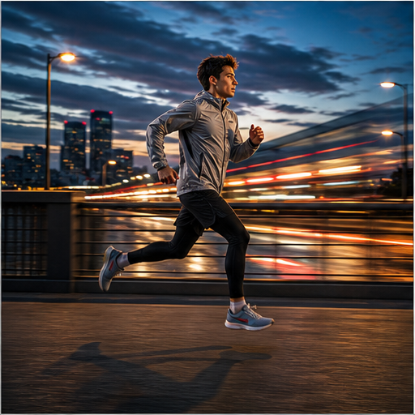

# 04. 对象级曝光与快门

> `idea_only` 图文页面。图片是概念示意，不代表已量产效果；来源链接用于理解相关技术或产品边界。

*图 04：对象级曝光与快门的概念示意。画面用于帮助理解用户最终看到的效果，不是论文原图或真实产品截图。*

## 看图理解

把整帧曝光和快门推广为对象级时间控制。人物、背景、高亮、运动轨迹可以使用不同的等效曝光策略，用户最终看到的是清晰主体与可控运动质感的组合。

本簇收录 24 条基础 IDEA，默认真实性边界包括 faithful, perceptual；代表场景：运动, 演唱会, 夜景, 旅行。

## 本簇 IDEA

### NATIVE-0025｜人物主体：对象级快门录像

- **用户效果**：围绕人物主体，人物清晰并保护肤色；通过对象级快门实现不同对象采用不同等效快门角。
- **核心机制**：对象级快门：不同对象采用不同等效快门角。需要跨帧维护目标状态、遮挡关系和质量置信度。
- **手机输入**：RAW burst、motion、semantic masks、row timestamps
- **适用场景**：运动、演唱会、夜景、旅行
- **真实性边界**：`perceptual`
- **主要风险**：时序闪烁、遮挡错误、用户控制复杂度、端侧功耗

### NATIVE-0026｜人物主体：分层 HDR录像

- **用户效果**：围绕人物主体，人物清晰并保护肤色；通过分层 HDR实现按运动状态分配曝光融合。
- **核心机制**：分层 HDR：按运动状态分配曝光融合。需要跨帧维护目标状态、遮挡关系和质量置信度。
- **手机输入**：RAW burst、motion、semantic masks、row timestamps
- **适用场景**：运动、演唱会、夜景、旅行
- **真实性边界**：`faithful`
- **主要风险**：时序闪烁、遮挡错误、用户控制复杂度、端侧功耗

### NATIVE-0027｜人物主体：曝光轨迹编程录像

- **用户效果**：围绕人物主体，人物清晰并保护肤色；通过曝光轨迹编程实现时间上设计曝光变化。
- **核心机制**：曝光轨迹编程：时间上设计曝光变化。需要跨帧维护目标状态、遮挡关系和质量置信度。
- **手机输入**：RAW burst、motion、semantic masks、row timestamps
- **适用场景**：运动、演唱会、夜景、旅行
- **真实性边界**：`perceptual`
- **主要风险**：时序闪烁、遮挡错误、用户控制复杂度、端侧功耗

### NATIVE-0028｜人物主体：局部长曝光录像

- **用户效果**：围绕人物主体，人物清晰并保护肤色；通过局部长曝光实现只对选定区域时间积分。
- **核心机制**：局部长曝光：只对选定区域时间积分。需要跨帧维护目标状态、遮挡关系和质量置信度。
- **手机输入**：RAW burst、motion、semantic masks、row timestamps
- **适用场景**：运动、演唱会、夜景、旅行
- **真实性边界**：`perceptual`
- **主要风险**：时序闪烁、遮挡错误、用户控制复杂度、端侧功耗

### NATIVE-0029｜人物主体：瞬态短曝光恢复录像

- **用户效果**：围绕人物主体，人物清晰并保护肤色；通过瞬态短曝光恢复实现高速片段自动切换短曝光。
- **核心机制**：瞬态短曝光恢复：高速片段自动切换短曝光。需要跨帧维护目标状态、遮挡关系和质量置信度。
- **手机输入**：RAW burst、motion、semantic masks、row timestamps
- **适用场景**：运动、演唱会、夜景、旅行
- **真实性边界**：`faithful`
- **主要风险**：时序闪烁、遮挡错误、用户控制复杂度、端侧功耗

### NATIVE-0030｜人物主体：曝光呼吸消除录像

- **用户效果**：围绕人物主体，人物清晰并保护肤色；通过曝光呼吸消除实现跨帧约束局部亮度。
- **核心机制**：曝光呼吸消除：跨帧约束局部亮度。需要跨帧维护目标状态、遮挡关系和质量置信度。
- **手机输入**：RAW burst、motion、semantic masks、row timestamps
- **适用场景**：运动、演唱会、夜景、旅行
- **真实性边界**：`faithful`
- **主要风险**：时序闪烁、遮挡错误、用户控制复杂度、端侧功耗

### NATIVE-0031｜运动载具：对象级快门录像

- **用户效果**：围绕运动载具，控制速度感和车灯轨迹；通过对象级快门实现不同对象采用不同等效快门角。
- **核心机制**：对象级快门：不同对象采用不同等效快门角。需要跨帧维护目标状态、遮挡关系和质量置信度。
- **手机输入**：RAW burst、motion、semantic masks、row timestamps
- **适用场景**：运动、演唱会、夜景、旅行
- **真实性边界**：`perceptual`
- **主要风险**：时序闪烁、遮挡错误、用户控制复杂度、端侧功耗

### NATIVE-0032｜运动载具：分层 HDR录像

- **用户效果**：围绕运动载具，控制速度感和车灯轨迹；通过分层 HDR实现按运动状态分配曝光融合。
- **核心机制**：分层 HDR：按运动状态分配曝光融合。需要跨帧维护目标状态、遮挡关系和质量置信度。
- **手机输入**：RAW burst、motion、semantic masks、row timestamps
- **适用场景**：运动、演唱会、夜景、旅行
- **真实性边界**：`faithful`
- **主要风险**：时序闪烁、遮挡错误、用户控制复杂度、端侧功耗

### NATIVE-0033｜运动载具：曝光轨迹编程录像

- **用户效果**：围绕运动载具，控制速度感和车灯轨迹；通过曝光轨迹编程实现时间上设计曝光变化。
- **核心机制**：曝光轨迹编程：时间上设计曝光变化。需要跨帧维护目标状态、遮挡关系和质量置信度。
- **手机输入**：RAW burst、motion、semantic masks、row timestamps
- **适用场景**：运动、演唱会、夜景、旅行
- **真实性边界**：`perceptual`
- **主要风险**：时序闪烁、遮挡错误、用户控制复杂度、端侧功耗

### NATIVE-0034｜运动载具：局部长曝光录像

- **用户效果**：围绕运动载具，控制速度感和车灯轨迹；通过局部长曝光实现只对选定区域时间积分。
- **核心机制**：局部长曝光：只对选定区域时间积分。需要跨帧维护目标状态、遮挡关系和质量置信度。
- **手机输入**：RAW burst、motion、semantic masks、row timestamps
- **适用场景**：运动、演唱会、夜景、旅行
- **真实性边界**：`perceptual`
- **主要风险**：时序闪烁、遮挡错误、用户控制复杂度、端侧功耗

### NATIVE-0035｜运动载具：瞬态短曝光恢复录像

- **用户效果**：围绕运动载具，控制速度感和车灯轨迹；通过瞬态短曝光恢复实现高速片段自动切换短曝光。
- **核心机制**：瞬态短曝光恢复：高速片段自动切换短曝光。需要跨帧维护目标状态、遮挡关系和质量置信度。
- **手机输入**：RAW burst、motion、semantic masks、row timestamps
- **适用场景**：运动、演唱会、夜景、旅行
- **真实性边界**：`faithful`
- **主要风险**：时序闪烁、遮挡错误、用户控制复杂度、端侧功耗

### NATIVE-0036｜运动载具：曝光呼吸消除录像

- **用户效果**：围绕运动载具，控制速度感和车灯轨迹；通过曝光呼吸消除实现跨帧约束局部亮度。
- **核心机制**：曝光呼吸消除：跨帧约束局部亮度。需要跨帧维护目标状态、遮挡关系和质量置信度。
- **手机输入**：RAW burst、motion、semantic masks、row timestamps
- **适用场景**：运动、演唱会、夜景、旅行
- **真实性边界**：`faithful`
- **主要风险**：时序闪烁、遮挡错误、用户控制复杂度、端侧功耗

### NATIVE-0037｜天空水面：对象级快门录像

- **用户效果**：围绕天空水面，分别控制云、水和反射时间积累；通过对象级快门实现不同对象采用不同等效快门角。
- **核心机制**：对象级快门：不同对象采用不同等效快门角。需要跨帧维护目标状态、遮挡关系和质量置信度。
- **手机输入**：RAW burst、motion、semantic masks、row timestamps
- **适用场景**：运动、演唱会、夜景、旅行
- **真实性边界**：`perceptual`
- **主要风险**：时序闪烁、遮挡错误、用户控制复杂度、端侧功耗

### NATIVE-0038｜天空水面：分层 HDR录像

- **用户效果**：围绕天空水面，分别控制云、水和反射时间积累；通过分层 HDR实现按运动状态分配曝光融合。
- **核心机制**：分层 HDR：按运动状态分配曝光融合。需要跨帧维护目标状态、遮挡关系和质量置信度。
- **手机输入**：RAW burst、motion、semantic masks、row timestamps
- **适用场景**：运动、演唱会、夜景、旅行
- **真实性边界**：`faithful`
- **主要风险**：时序闪烁、遮挡错误、用户控制复杂度、端侧功耗

### NATIVE-0039｜天空水面：曝光轨迹编程录像

- **用户效果**：围绕天空水面，分别控制云、水和反射时间积累；通过曝光轨迹编程实现时间上设计曝光变化。
- **核心机制**：曝光轨迹编程：时间上设计曝光变化。需要跨帧维护目标状态、遮挡关系和质量置信度。
- **手机输入**：RAW burst、motion、semantic masks、row timestamps
- **适用场景**：运动、演唱会、夜景、旅行
- **真实性边界**：`perceptual`
- **主要风险**：时序闪烁、遮挡错误、用户控制复杂度、端侧功耗

### NATIVE-0040｜天空水面：局部长曝光录像

- **用户效果**：围绕天空水面，分别控制云、水和反射时间积累；通过局部长曝光实现只对选定区域时间积分。
- **核心机制**：局部长曝光：只对选定区域时间积分。需要跨帧维护目标状态、遮挡关系和质量置信度。
- **手机输入**：RAW burst、motion、semantic masks、row timestamps
- **适用场景**：运动、演唱会、夜景、旅行
- **真实性边界**：`perceptual`
- **主要风险**：时序闪烁、遮挡错误、用户控制复杂度、端侧功耗

### NATIVE-0041｜天空水面：瞬态短曝光恢复录像

- **用户效果**：围绕天空水面，分别控制云、水和反射时间积累；通过瞬态短曝光恢复实现高速片段自动切换短曝光。
- **核心机制**：瞬态短曝光恢复：高速片段自动切换短曝光。需要跨帧维护目标状态、遮挡关系和质量置信度。
- **手机输入**：RAW burst、motion、semantic masks、row timestamps
- **适用场景**：运动、演唱会、夜景、旅行
- **真实性边界**：`faithful`
- **主要风险**：时序闪烁、遮挡错误、用户控制复杂度、端侧功耗

### NATIVE-0042｜天空水面：曝光呼吸消除录像

- **用户效果**：围绕天空水面，分别控制云、水和反射时间积累；通过曝光呼吸消除实现跨帧约束局部亮度。
- **核心机制**：曝光呼吸消除：跨帧约束局部亮度。需要跨帧维护目标状态、遮挡关系和质量置信度。
- **手机输入**：RAW burst、motion、semantic masks、row timestamps
- **适用场景**：运动、演唱会、夜景、旅行
- **真实性边界**：`faithful`
- **主要风险**：时序闪烁、遮挡错误、用户控制复杂度、端侧功耗

### NATIVE-0043｜舞台屏幕：对象级快门录像

- **用户效果**：围绕舞台屏幕，分别保护表演者与 LED 内容；通过对象级快门实现不同对象采用不同等效快门角。
- **核心机制**：对象级快门：不同对象采用不同等效快门角。需要跨帧维护目标状态、遮挡关系和质量置信度。
- **手机输入**：RAW burst、motion、semantic masks、row timestamps
- **适用场景**：运动、演唱会、夜景、旅行
- **真实性边界**：`perceptual`
- **主要风险**：时序闪烁、遮挡错误、用户控制复杂度、端侧功耗

### NATIVE-0044｜舞台屏幕：分层 HDR录像

- **用户效果**：围绕舞台屏幕，分别保护表演者与 LED 内容；通过分层 HDR实现按运动状态分配曝光融合。
- **核心机制**：分层 HDR：按运动状态分配曝光融合。需要跨帧维护目标状态、遮挡关系和质量置信度。
- **手机输入**：RAW burst、motion、semantic masks、row timestamps
- **适用场景**：运动、演唱会、夜景、旅行
- **真实性边界**：`faithful`
- **主要风险**：时序闪烁、遮挡错误、用户控制复杂度、端侧功耗

### NATIVE-0045｜舞台屏幕：曝光轨迹编程录像

- **用户效果**：围绕舞台屏幕，分别保护表演者与 LED 内容；通过曝光轨迹编程实现时间上设计曝光变化。
- **核心机制**：曝光轨迹编程：时间上设计曝光变化。需要跨帧维护目标状态、遮挡关系和质量置信度。
- **手机输入**：RAW burst、motion、semantic masks、row timestamps
- **适用场景**：运动、演唱会、夜景、旅行
- **真实性边界**：`perceptual`
- **主要风险**：时序闪烁、遮挡错误、用户控制复杂度、端侧功耗

### NATIVE-0046｜舞台屏幕：局部长曝光录像

- **用户效果**：围绕舞台屏幕，分别保护表演者与 LED 内容；通过局部长曝光实现只对选定区域时间积分。
- **核心机制**：局部长曝光：只对选定区域时间积分。需要跨帧维护目标状态、遮挡关系和质量置信度。
- **手机输入**：RAW burst、motion、semantic masks、row timestamps
- **适用场景**：运动、演唱会、夜景、旅行
- **真实性边界**：`perceptual`
- **主要风险**：时序闪烁、遮挡错误、用户控制复杂度、端侧功耗

### NATIVE-0047｜舞台屏幕：瞬态短曝光恢复录像

- **用户效果**：围绕舞台屏幕，分别保护表演者与 LED 内容；通过瞬态短曝光恢复实现高速片段自动切换短曝光。
- **核心机制**：瞬态短曝光恢复：高速片段自动切换短曝光。需要跨帧维护目标状态、遮挡关系和质量置信度。
- **手机输入**：RAW burst、motion、semantic masks、row timestamps
- **适用场景**：运动、演唱会、夜景、旅行
- **真实性边界**：`faithful`
- **主要风险**：时序闪烁、遮挡错误、用户控制复杂度、端侧功耗

### NATIVE-0048｜舞台屏幕：曝光呼吸消除录像

- **用户效果**：围绕舞台屏幕，分别保护表演者与 LED 内容；通过曝光呼吸消除实现跨帧约束局部亮度。
- **核心机制**：曝光呼吸消除：跨帧约束局部亮度。需要跨帧维护目标状态、遮挡关系和质量置信度。
- **手机输入**：RAW burst、motion、semantic masks、row timestamps
- **适用场景**：运动、演唱会、夜景、旅行
- **真实性边界**：`faithful`
- **主要风险**：时序闪烁、遮挡错误、用户控制复杂度、端侧功耗

## 相关来源

- **Cinematic mode**（E1，verified）：[外部来源](https://support.apple.com/en-us/HT212778) / [本地缓存](../../sources/official_products/official_apple_cinematic_mode.html)
- **Acquire and then Adapt / FluxIR**（E3，verified）：[本地缓存](../../../Flux/papers/04_image_restoration/acquire_adapt_fluxir_2504.15159.pdf)

## 阅读建议

先看图判断用户效果，再回到上面的 `idea_id` 了解处理对象和输入信号；需要落地时，再从来源、数据、时序一致性、端侧预算和真实性边界分别建立验证任务。

[返回图文图鉴总览](../手机录像后处理_IDEA图文图鉴_20260827.md)
