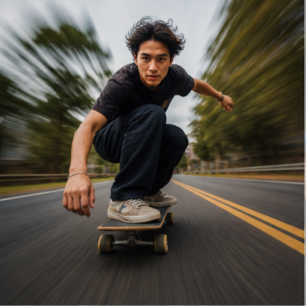

# 07. 运动细节与畸变恢复

> `idea_only` 图文页面。图片是概念示意，不代表已量产效果；来源链接用于理解相关技术或产品边界。

*图 07：运动细节与畸变恢复的概念示意。画面用于帮助理解用户最终看到的效果，不是论文原图或真实产品截图。*

## 看图理解

重点是恢复运动主体的结构与细节，并显式处理运动模糊、滚动快门、遮挡和跨帧纹理传播。适合人脸、手部、器械、车辆文字等高价值 ROI。

本簇收录 24 条基础 IDEA，默认真实性边界包括 faithful, perceptual；代表场景：运动, 夜景, 车载, 演唱会。

## 本簇 IDEA

### NATIVE-0097｜高速人脸：方向感知去模糊录像

- **用户效果**：围绕高速人脸，恢复高速运动中的身份与表情；通过方向感知去模糊实现按局部运动核恢复。
- **核心机制**：方向感知去模糊：按局部运动核恢复。需要跨帧维护目标状态、遮挡关系和质量置信度。
- **手机输入**：short/long exposure、row timestamps、motion vectors、semantic ROI
- **适用场景**：运动、夜景、车载、演唱会
- **真实性边界**：`faithful`
- **主要风险**：时序闪烁、遮挡错误、用户控制复杂度、端侧功耗

### NATIVE-0098｜高速人脸：滚动快门联合校正录像

- **用户效果**：围绕高速人脸，恢复高速运动中的身份与表情；通过滚动快门联合校正实现逐行时间与运动联合优化。
- **核心机制**：滚动快门联合校正：逐行时间与运动联合优化。需要跨帧维护目标状态、遮挡关系和质量置信度。
- **手机输入**：short/long exposure、row timestamps、motion vectors、semantic ROI
- **适用场景**：运动、夜景、车载、演唱会
- **真实性边界**：`faithful`
- **主要风险**：时序闪烁、遮挡错误、用户控制复杂度、端侧功耗

### NATIVE-0099｜高速人脸：多帧细节锚定录像

- **用户效果**：围绕高速人脸，恢复高速运动中的身份与表情；通过多帧细节锚定实现从清晰邻帧传播纹理。
- **核心机制**：多帧细节锚定：从清晰邻帧传播纹理。需要跨帧维护目标状态、遮挡关系和质量置信度。
- **手机输入**：short/long exposure、row timestamps、motion vectors、semantic ROI
- **适用场景**：运动、夜景、车载、演唱会
- **真实性边界**：`faithful`
- **主要风险**：时序闪烁、遮挡错误、用户控制复杂度、端侧功耗

### NATIVE-0100｜高速人脸：短长曝光融合录像

- **用户效果**：围绕高速人脸，恢复高速运动中的身份与表情；通过短长曝光融合实现短曝光保运动、长曝光保信噪比。
- **核心机制**：短长曝光融合：短曝光保运动、长曝光保信噪比。需要跨帧维护目标状态、遮挡关系和质量置信度。
- **手机输入**：short/long exposure、row timestamps、motion vectors、semantic ROI
- **适用场景**：运动、夜景、车载、演唱会
- **真实性边界**：`faithful`
- **主要风险**：时序闪烁、遮挡错误、用户控制复杂度、端侧功耗

### NATIVE-0101｜高速人脸：结构优先生成录像

- **用户效果**：围绕高速人脸，恢复高速运动中的身份与表情；通过结构优先生成实现只在低置信纹理区感知补全。
- **核心机制**：结构优先生成：只在低置信纹理区感知补全。需要跨帧维护目标状态、遮挡关系和质量置信度。
- **手机输入**：short/long exposure、row timestamps、motion vectors、semantic ROI
- **适用场景**：运动、夜景、车载、演唱会
- **真实性边界**：`perceptual`
- **主要风险**：时序闪烁、遮挡错误、用户控制复杂度、端侧功耗

### NATIVE-0102｜高速人脸：失真置信度保护录像

- **用户效果**：围绕高速人脸，恢复高速运动中的身份与表情；通过失真置信度保护实现无法恢复时降低锐化和生成。
- **核心机制**：失真置信度保护：无法恢复时降低锐化和生成。需要跨帧维护目标状态、遮挡关系和质量置信度。
- **手机输入**：short/long exposure、row timestamps、motion vectors、semantic ROI
- **适用场景**：运动、夜景、车载、演唱会
- **真实性边界**：`faithful`
- **主要风险**：时序闪烁、遮挡错误、用户控制复杂度、端侧功耗

### NATIVE-0103｜手部器械：方向感知去模糊录像

- **用户效果**：围绕手部器械，恢复手指、球拍、乐器和工具；通过方向感知去模糊实现按局部运动核恢复。
- **核心机制**：方向感知去模糊：按局部运动核恢复。需要跨帧维护目标状态、遮挡关系和质量置信度。
- **手机输入**：short/long exposure、row timestamps、motion vectors、semantic ROI
- **适用场景**：运动、夜景、车载、演唱会
- **真实性边界**：`faithful`
- **主要风险**：时序闪烁、遮挡错误、用户控制复杂度、端侧功耗

### NATIVE-0104｜手部器械：滚动快门联合校正录像

- **用户效果**：围绕手部器械，恢复手指、球拍、乐器和工具；通过滚动快门联合校正实现逐行时间与运动联合优化。
- **核心机制**：滚动快门联合校正：逐行时间与运动联合优化。需要跨帧维护目标状态、遮挡关系和质量置信度。
- **手机输入**：short/long exposure、row timestamps、motion vectors、semantic ROI
- **适用场景**：运动、夜景、车载、演唱会
- **真实性边界**：`faithful`
- **主要风险**：时序闪烁、遮挡错误、用户控制复杂度、端侧功耗

### NATIVE-0105｜手部器械：多帧细节锚定录像

- **用户效果**：围绕手部器械，恢复手指、球拍、乐器和工具；通过多帧细节锚定实现从清晰邻帧传播纹理。
- **核心机制**：多帧细节锚定：从清晰邻帧传播纹理。需要跨帧维护目标状态、遮挡关系和质量置信度。
- **手机输入**：short/long exposure、row timestamps、motion vectors、semantic ROI
- **适用场景**：运动、夜景、车载、演唱会
- **真实性边界**：`faithful`
- **主要风险**：时序闪烁、遮挡错误、用户控制复杂度、端侧功耗

### NATIVE-0106｜手部器械：短长曝光融合录像

- **用户效果**：围绕手部器械，恢复手指、球拍、乐器和工具；通过短长曝光融合实现短曝光保运动、长曝光保信噪比。
- **核心机制**：短长曝光融合：短曝光保运动、长曝光保信噪比。需要跨帧维护目标状态、遮挡关系和质量置信度。
- **手机输入**：short/long exposure、row timestamps、motion vectors、semantic ROI
- **适用场景**：运动、夜景、车载、演唱会
- **真实性边界**：`faithful`
- **主要风险**：时序闪烁、遮挡错误、用户控制复杂度、端侧功耗

### NATIVE-0107｜手部器械：结构优先生成录像

- **用户效果**：围绕手部器械，恢复手指、球拍、乐器和工具；通过结构优先生成实现只在低置信纹理区感知补全。
- **核心机制**：结构优先生成：只在低置信纹理区感知补全。需要跨帧维护目标状态、遮挡关系和质量置信度。
- **手机输入**：short/long exposure、row timestamps、motion vectors、semantic ROI
- **适用场景**：运动、夜景、车载、演唱会
- **真实性边界**：`perceptual`
- **主要风险**：时序闪烁、遮挡错误、用户控制复杂度、端侧功耗

### NATIVE-0108｜手部器械：失真置信度保护录像

- **用户效果**：围绕手部器械，恢复手指、球拍、乐器和工具；通过失真置信度保护实现无法恢复时降低锐化和生成。
- **核心机制**：失真置信度保护：无法恢复时降低锐化和生成。需要跨帧维护目标状态、遮挡关系和质量置信度。
- **手机输入**：short/long exposure、row timestamps、motion vectors、semantic ROI
- **适用场景**：运动、夜景、车载、演唱会
- **真实性边界**：`faithful`
- **主要风险**：时序闪烁、遮挡错误、用户控制复杂度、端侧功耗

### NATIVE-0109｜车辆文字：方向感知去模糊录像

- **用户效果**：围绕车辆文字，恢复车身纹理、车牌和灯光；通过方向感知去模糊实现按局部运动核恢复。
- **核心机制**：方向感知去模糊：按局部运动核恢复。需要跨帧维护目标状态、遮挡关系和质量置信度。
- **手机输入**：short/long exposure、row timestamps、motion vectors、semantic ROI
- **适用场景**：运动、夜景、车载、演唱会
- **真实性边界**：`faithful`
- **主要风险**：时序闪烁、遮挡错误、用户控制复杂度、端侧功耗

### NATIVE-0110｜车辆文字：滚动快门联合校正录像

- **用户效果**：围绕车辆文字，恢复车身纹理、车牌和灯光；通过滚动快门联合校正实现逐行时间与运动联合优化。
- **核心机制**：滚动快门联合校正：逐行时间与运动联合优化。需要跨帧维护目标状态、遮挡关系和质量置信度。
- **手机输入**：short/long exposure、row timestamps、motion vectors、semantic ROI
- **适用场景**：运动、夜景、车载、演唱会
- **真实性边界**：`faithful`
- **主要风险**：时序闪烁、遮挡错误、用户控制复杂度、端侧功耗

### NATIVE-0111｜车辆文字：多帧细节锚定录像

- **用户效果**：围绕车辆文字，恢复车身纹理、车牌和灯光；通过多帧细节锚定实现从清晰邻帧传播纹理。
- **核心机制**：多帧细节锚定：从清晰邻帧传播纹理。需要跨帧维护目标状态、遮挡关系和质量置信度。
- **手机输入**：short/long exposure、row timestamps、motion vectors、semantic ROI
- **适用场景**：运动、夜景、车载、演唱会
- **真实性边界**：`faithful`
- **主要风险**：时序闪烁、遮挡错误、用户控制复杂度、端侧功耗

### NATIVE-0112｜车辆文字：短长曝光融合录像

- **用户效果**：围绕车辆文字，恢复车身纹理、车牌和灯光；通过短长曝光融合实现短曝光保运动、长曝光保信噪比。
- **核心机制**：短长曝光融合：短曝光保运动、长曝光保信噪比。需要跨帧维护目标状态、遮挡关系和质量置信度。
- **手机输入**：short/long exposure、row timestamps、motion vectors、semantic ROI
- **适用场景**：运动、夜景、车载、演唱会
- **真实性边界**：`faithful`
- **主要风险**：时序闪烁、遮挡错误、用户控制复杂度、端侧功耗

### NATIVE-0113｜车辆文字：结构优先生成录像

- **用户效果**：围绕车辆文字，恢复车身纹理、车牌和灯光；通过结构优先生成实现只在低置信纹理区感知补全。
- **核心机制**：结构优先生成：只在低置信纹理区感知补全。需要跨帧维护目标状态、遮挡关系和质量置信度。
- **手机输入**：short/long exposure、row timestamps、motion vectors、semantic ROI
- **适用场景**：运动、夜景、车载、演唱会
- **真实性边界**：`perceptual`
- **主要风险**：时序闪烁、遮挡错误、用户控制复杂度、端侧功耗

### NATIVE-0114｜车辆文字：失真置信度保护录像

- **用户效果**：围绕车辆文字，恢复车身纹理、车牌和灯光；通过失真置信度保护实现无法恢复时降低锐化和生成。
- **核心机制**：失真置信度保护：无法恢复时降低锐化和生成。需要跨帧维护目标状态、遮挡关系和质量置信度。
- **手机输入**：short/long exposure、row timestamps、motion vectors、semantic ROI
- **适用场景**：运动、夜景、车载、演唱会
- **真实性边界**：`faithful`
- **主要风险**：时序闪烁、遮挡错误、用户控制复杂度、端侧功耗

### NATIVE-0115｜建筑线条：方向感知去模糊录像

- **用户效果**：围绕建筑线条，恢复滚动快门下的垂线和几何；通过方向感知去模糊实现按局部运动核恢复。
- **核心机制**：方向感知去模糊：按局部运动核恢复。需要跨帧维护目标状态、遮挡关系和质量置信度。
- **手机输入**：short/long exposure、row timestamps、motion vectors、semantic ROI
- **适用场景**：运动、夜景、车载、演唱会
- **真实性边界**：`faithful`
- **主要风险**：时序闪烁、遮挡错误、用户控制复杂度、端侧功耗

### NATIVE-0116｜建筑线条：滚动快门联合校正录像

- **用户效果**：围绕建筑线条，恢复滚动快门下的垂线和几何；通过滚动快门联合校正实现逐行时间与运动联合优化。
- **核心机制**：滚动快门联合校正：逐行时间与运动联合优化。需要跨帧维护目标状态、遮挡关系和质量置信度。
- **手机输入**：short/long exposure、row timestamps、motion vectors、semantic ROI
- **适用场景**：运动、夜景、车载、演唱会
- **真实性边界**：`faithful`
- **主要风险**：时序闪烁、遮挡错误、用户控制复杂度、端侧功耗

### NATIVE-0117｜建筑线条：多帧细节锚定录像

- **用户效果**：围绕建筑线条，恢复滚动快门下的垂线和几何；通过多帧细节锚定实现从清晰邻帧传播纹理。
- **核心机制**：多帧细节锚定：从清晰邻帧传播纹理。需要跨帧维护目标状态、遮挡关系和质量置信度。
- **手机输入**：short/long exposure、row timestamps、motion vectors、semantic ROI
- **适用场景**：运动、夜景、车载、演唱会
- **真实性边界**：`faithful`
- **主要风险**：时序闪烁、遮挡错误、用户控制复杂度、端侧功耗

### NATIVE-0118｜建筑线条：短长曝光融合录像

- **用户效果**：围绕建筑线条，恢复滚动快门下的垂线和几何；通过短长曝光融合实现短曝光保运动、长曝光保信噪比。
- **核心机制**：短长曝光融合：短曝光保运动、长曝光保信噪比。需要跨帧维护目标状态、遮挡关系和质量置信度。
- **手机输入**：short/long exposure、row timestamps、motion vectors、semantic ROI
- **适用场景**：运动、夜景、车载、演唱会
- **真实性边界**：`faithful`
- **主要风险**：时序闪烁、遮挡错误、用户控制复杂度、端侧功耗

### NATIVE-0119｜建筑线条：结构优先生成录像

- **用户效果**：围绕建筑线条，恢复滚动快门下的垂线和几何；通过结构优先生成实现只在低置信纹理区感知补全。
- **核心机制**：结构优先生成：只在低置信纹理区感知补全。需要跨帧维护目标状态、遮挡关系和质量置信度。
- **手机输入**：short/long exposure、row timestamps、motion vectors、semantic ROI
- **适用场景**：运动、夜景、车载、演唱会
- **真实性边界**：`perceptual`
- **主要风险**：时序闪烁、遮挡错误、用户控制复杂度、端侧功耗

### NATIVE-0120｜建筑线条：失真置信度保护录像

- **用户效果**：围绕建筑线条，恢复滚动快门下的垂线和几何；通过失真置信度保护实现无法恢复时降低锐化和生成。
- **核心机制**：失真置信度保护：无法恢复时降低锐化和生成。需要跨帧维护目标状态、遮挡关系和质量置信度。
- **手机输入**：short/long exposure、row timestamps、motion vectors、semantic ROI
- **适用场景**：运动、夜景、车载、演唱会
- **真实性边界**：`faithful`
- **主要风险**：时序闪烁、遮挡错误、用户控制复杂度、端侧功耗

## 相关来源

- **FlashVSR: Near Real-Time One-Step Video Super-Resolution with Targeted Flow Distillation**（E3，verified）：[本地缓存](../../../20260821_ENC_DEC/papers/05_flashvsr_case/flashvsr_2510.12747.pdf)

## 阅读建议

先看图判断用户效果，再回到上面的 `idea_id` 了解处理对象和输入信号；需要落地时，再从来源、数据、时序一致性、端侧预算和真实性边界分别建立验证任务。

[返回图文图鉴总览](../手机录像后处理_IDEA图文图鉴_20260827.md)
