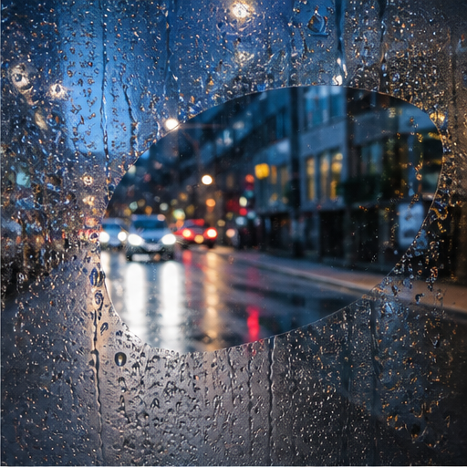

# 09. 镜头表面与介质

> `idea_only` 图文页面。图片是概念示意，不代表已量产效果；来源链接用于理解相关技术或产品边界。

*图 09：镜头表面与介质的概念示意。画面用于帮助理解用户最终看到的效果，不是论文原图或真实产品截图。*

## 看图理解

镜头表面和透明介质本身也可以成为可处理对象。雨滴、雾气、污渍、保护壳反射与玻璃折射需要区分场景内容，才能实现可逆抑制或创作增强。

本簇收录 24 条基础 IDEA，默认真实性边界包括 faithful, generative, perceptual；代表场景：雨天, 户外, 车载, 运动。

## 本簇 IDEA

### NATIVE-0145｜雨滴水珠：可逆抑制录像

- **用户效果**：围绕雨滴水珠，检测镜头或玻璃上的动态水滴；通过可逆抑制实现生成干净层并保留介质 Mask。
- **核心机制**：可逆抑制：生成干净层并保留介质 Mask。需要跨帧维护目标状态、遮挡关系和质量置信度。
- **手机输入**：video、focus sweep、IMU、background memory
- **适用场景**：雨天、户外、车载、运动
- **真实性边界**：`faithful`
- **主要风险**：时序闪烁、遮挡错误、用户控制复杂度、端侧功耗

### NATIVE-0146｜雨滴水珠：艺术化增强录像

- **用户效果**：围绕雨滴水珠，检测镜头或玻璃上的动态水滴；通过艺术化增强实现控制水滴、雾气和光晕风格。
- **核心机制**：艺术化增强：控制水滴、雾气和光晕风格。需要跨帧维护目标状态、遮挡关系和质量置信度。
- **手机输入**：video、focus sweep、IMU、background memory
- **适用场景**：雨天、户外、车载、运动
- **真实性边界**：`perceptual`
- **主要风险**：时序闪烁、遮挡错误、用户控制复杂度、端侧功耗

### NATIVE-0147｜雨滴水珠：跨帧背景记忆录像

- **用户效果**：围绕雨滴水珠，检测镜头或玻璃上的动态水滴；通过跨帧背景记忆实现利用未遮挡历史恢复背景。
- **核心机制**：跨帧背景记忆：利用未遮挡历史恢复背景。需要跨帧维护目标状态、遮挡关系和质量置信度。
- **手机输入**：video、focus sweep、IMU、background memory
- **适用场景**：雨天、户外、车载、运动
- **真实性边界**：`faithful`
- **主要风险**：时序闪烁、遮挡错误、用户控制复杂度、端侧功耗

### NATIVE-0148｜雨滴水珠：介质深度估计录像

- **用户效果**：围绕雨滴水珠，检测镜头或玻璃上的动态水滴；通过介质深度估计实现估计污渍所在光学平面。
- **核心机制**：介质深度估计：估计污渍所在光学平面。需要跨帧维护目标状态、遮挡关系和质量置信度。
- **手机输入**：video、focus sweep、IMU、background memory
- **适用场景**：雨天、户外、车载、运动
- **真实性边界**：`faithful`
- **主要风险**：时序闪烁、遮挡错误、用户控制复杂度、端侧功耗

### NATIVE-0149｜雨滴水珠：触摸清洁提示录像

- **用户效果**：围绕雨滴水珠，检测镜头或玻璃上的动态水滴；通过触摸清洁提示实现实时显示问题位置与严重度。
- **核心机制**：触摸清洁提示：实时显示问题位置与严重度。需要跨帧维护目标状态、遮挡关系和质量置信度。
- **手机输入**：video、focus sweep、IMU、background memory
- **适用场景**：雨天、户外、车载、运动
- **真实性边界**：`faithful`
- **主要风险**：时序闪烁、遮挡错误、用户控制复杂度、端侧功耗

### NATIVE-0150｜雨滴水珠：物理折射重渲染录像

- **用户效果**：围绕雨滴水珠，检测镜头或玻璃上的动态水滴；通过物理折射重渲染实现按水滴形状修正或强化折射。
- **核心机制**：物理折射重渲染：按水滴形状修正或强化折射。需要跨帧维护目标状态、遮挡关系和质量置信度。
- **手机输入**：video、focus sweep、IMU、background memory
- **适用场景**：雨天、户外、车载、运动
- **真实性边界**：`generative`
- **主要风险**：时序闪烁、遮挡错误、用户控制复杂度、端侧功耗

### NATIVE-0151｜雾气结露：可逆抑制录像

- **用户效果**：围绕雾气结露，识别缓慢变化的低对比介质；通过可逆抑制实现生成干净层并保留介质 Mask。
- **核心机制**：可逆抑制：生成干净层并保留介质 Mask。需要跨帧维护目标状态、遮挡关系和质量置信度。
- **手机输入**：video、focus sweep、IMU、background memory
- **适用场景**：雨天、户外、车载、运动
- **真实性边界**：`faithful`
- **主要风险**：时序闪烁、遮挡错误、用户控制复杂度、端侧功耗

### NATIVE-0152｜雾气结露：艺术化增强录像

- **用户效果**：围绕雾气结露，识别缓慢变化的低对比介质；通过艺术化增强实现控制水滴、雾气和光晕风格。
- **核心机制**：艺术化增强：控制水滴、雾气和光晕风格。需要跨帧维护目标状态、遮挡关系和质量置信度。
- **手机输入**：video、focus sweep、IMU、background memory
- **适用场景**：雨天、户外、车载、运动
- **真实性边界**：`perceptual`
- **主要风险**：时序闪烁、遮挡错误、用户控制复杂度、端侧功耗

### NATIVE-0153｜雾气结露：跨帧背景记忆录像

- **用户效果**：围绕雾气结露，识别缓慢变化的低对比介质；通过跨帧背景记忆实现利用未遮挡历史恢复背景。
- **核心机制**：跨帧背景记忆：利用未遮挡历史恢复背景。需要跨帧维护目标状态、遮挡关系和质量置信度。
- **手机输入**：video、focus sweep、IMU、background memory
- **适用场景**：雨天、户外、车载、运动
- **真实性边界**：`faithful`
- **主要风险**：时序闪烁、遮挡错误、用户控制复杂度、端侧功耗

### NATIVE-0154｜雾气结露：介质深度估计录像

- **用户效果**：围绕雾气结露，识别缓慢变化的低对比介质；通过介质深度估计实现估计污渍所在光学平面。
- **核心机制**：介质深度估计：估计污渍所在光学平面。需要跨帧维护目标状态、遮挡关系和质量置信度。
- **手机输入**：video、focus sweep、IMU、background memory
- **适用场景**：雨天、户外、车载、运动
- **真实性边界**：`faithful`
- **主要风险**：时序闪烁、遮挡错误、用户控制复杂度、端侧功耗

### NATIVE-0155｜雾气结露：触摸清洁提示录像

- **用户效果**：围绕雾气结露，识别缓慢变化的低对比介质；通过触摸清洁提示实现实时显示问题位置与严重度。
- **核心机制**：触摸清洁提示：实时显示问题位置与严重度。需要跨帧维护目标状态、遮挡关系和质量置信度。
- **手机输入**：video、focus sweep、IMU、background memory
- **适用场景**：雨天、户外、车载、运动
- **真实性边界**：`faithful`
- **主要风险**：时序闪烁、遮挡错误、用户控制复杂度、端侧功耗

### NATIVE-0156｜雾气结露：物理折射重渲染录像

- **用户效果**：围绕雾气结露，识别缓慢变化的低对比介质；通过物理折射重渲染实现按水滴形状修正或强化折射。
- **核心机制**：物理折射重渲染：按水滴形状修正或强化折射。需要跨帧维护目标状态、遮挡关系和质量置信度。
- **手机输入**：video、focus sweep、IMU、background memory
- **适用场景**：雨天、户外、车载、运动
- **真实性边界**：`generative`
- **主要风险**：时序闪烁、遮挡错误、用户控制复杂度、端侧功耗

### NATIVE-0157｜灰尘污点：可逆抑制录像

- **用户效果**：围绕灰尘污点，区分固定镜头污点和场景纹理；通过可逆抑制实现生成干净层并保留介质 Mask。
- **核心机制**：可逆抑制：生成干净层并保留介质 Mask。需要跨帧维护目标状态、遮挡关系和质量置信度。
- **手机输入**：video、focus sweep、IMU、background memory
- **适用场景**：雨天、户外、车载、运动
- **真实性边界**：`faithful`
- **主要风险**：时序闪烁、遮挡错误、用户控制复杂度、端侧功耗

### NATIVE-0158｜灰尘污点：艺术化增强录像

- **用户效果**：围绕灰尘污点，区分固定镜头污点和场景纹理；通过艺术化增强实现控制水滴、雾气和光晕风格。
- **核心机制**：艺术化增强：控制水滴、雾气和光晕风格。需要跨帧维护目标状态、遮挡关系和质量置信度。
- **手机输入**：video、focus sweep、IMU、background memory
- **适用场景**：雨天、户外、车载、运动
- **真实性边界**：`perceptual`
- **主要风险**：时序闪烁、遮挡错误、用户控制复杂度、端侧功耗

### NATIVE-0159｜灰尘污点：跨帧背景记忆录像

- **用户效果**：围绕灰尘污点，区分固定镜头污点和场景纹理；通过跨帧背景记忆实现利用未遮挡历史恢复背景。
- **核心机制**：跨帧背景记忆：利用未遮挡历史恢复背景。需要跨帧维护目标状态、遮挡关系和质量置信度。
- **手机输入**：video、focus sweep、IMU、background memory
- **适用场景**：雨天、户外、车载、运动
- **真实性边界**：`faithful`
- **主要风险**：时序闪烁、遮挡错误、用户控制复杂度、端侧功耗

### NATIVE-0160｜灰尘污点：介质深度估计录像

- **用户效果**：围绕灰尘污点，区分固定镜头污点和场景纹理；通过介质深度估计实现估计污渍所在光学平面。
- **核心机制**：介质深度估计：估计污渍所在光学平面。需要跨帧维护目标状态、遮挡关系和质量置信度。
- **手机输入**：video、focus sweep、IMU、background memory
- **适用场景**：雨天、户外、车载、运动
- **真实性边界**：`faithful`
- **主要风险**：时序闪烁、遮挡错误、用户控制复杂度、端侧功耗

### NATIVE-0161｜灰尘污点：触摸清洁提示录像

- **用户效果**：围绕灰尘污点，区分固定镜头污点和场景纹理；通过触摸清洁提示实现实时显示问题位置与严重度。
- **核心机制**：触摸清洁提示：实时显示问题位置与严重度。需要跨帧维护目标状态、遮挡关系和质量置信度。
- **手机输入**：video、focus sweep、IMU、background memory
- **适用场景**：雨天、户外、车载、运动
- **真实性边界**：`faithful`
- **主要风险**：时序闪烁、遮挡错误、用户控制复杂度、端侧功耗

### NATIVE-0162｜灰尘污点：物理折射重渲染录像

- **用户效果**：围绕灰尘污点，区分固定镜头污点和场景纹理；通过物理折射重渲染实现按水滴形状修正或强化折射。
- **核心机制**：物理折射重渲染：按水滴形状修正或强化折射。需要跨帧维护目标状态、遮挡关系和质量置信度。
- **手机输入**：video、focus sweep、IMU、background memory
- **适用场景**：雨天、户外、车载、运动
- **真实性边界**：`generative`
- **主要风险**：时序闪烁、遮挡错误、用户控制复杂度、端侧功耗

### NATIVE-0163｜透明保护壳：可逆抑制录像

- **用户效果**：围绕透明保护壳，处理壳体反射、划痕和炫光；通过可逆抑制实现生成干净层并保留介质 Mask。
- **核心机制**：可逆抑制：生成干净层并保留介质 Mask。需要跨帧维护目标状态、遮挡关系和质量置信度。
- **手机输入**：video、focus sweep、IMU、background memory
- **适用场景**：雨天、户外、车载、运动
- **真实性边界**：`faithful`
- **主要风险**：时序闪烁、遮挡错误、用户控制复杂度、端侧功耗

### NATIVE-0164｜透明保护壳：艺术化增强录像

- **用户效果**：围绕透明保护壳，处理壳体反射、划痕和炫光；通过艺术化增强实现控制水滴、雾气和光晕风格。
- **核心机制**：艺术化增强：控制水滴、雾气和光晕风格。需要跨帧维护目标状态、遮挡关系和质量置信度。
- **手机输入**：video、focus sweep、IMU、background memory
- **适用场景**：雨天、户外、车载、运动
- **真实性边界**：`perceptual`
- **主要风险**：时序闪烁、遮挡错误、用户控制复杂度、端侧功耗

### NATIVE-0165｜透明保护壳：跨帧背景记忆录像

- **用户效果**：围绕透明保护壳，处理壳体反射、划痕和炫光；通过跨帧背景记忆实现利用未遮挡历史恢复背景。
- **核心机制**：跨帧背景记忆：利用未遮挡历史恢复背景。需要跨帧维护目标状态、遮挡关系和质量置信度。
- **手机输入**：video、focus sweep、IMU、background memory
- **适用场景**：雨天、户外、车载、运动
- **真实性边界**：`faithful`
- **主要风险**：时序闪烁、遮挡错误、用户控制复杂度、端侧功耗

### NATIVE-0166｜透明保护壳：介质深度估计录像

- **用户效果**：围绕透明保护壳，处理壳体反射、划痕和炫光；通过介质深度估计实现估计污渍所在光学平面。
- **核心机制**：介质深度估计：估计污渍所在光学平面。需要跨帧维护目标状态、遮挡关系和质量置信度。
- **手机输入**：video、focus sweep、IMU、background memory
- **适用场景**：雨天、户外、车载、运动
- **真实性边界**：`faithful`
- **主要风险**：时序闪烁、遮挡错误、用户控制复杂度、端侧功耗

### NATIVE-0167｜透明保护壳：触摸清洁提示录像

- **用户效果**：围绕透明保护壳，处理壳体反射、划痕和炫光；通过触摸清洁提示实现实时显示问题位置与严重度。
- **核心机制**：触摸清洁提示：实时显示问题位置与严重度。需要跨帧维护目标状态、遮挡关系和质量置信度。
- **手机输入**：video、focus sweep、IMU、background memory
- **适用场景**：雨天、户外、车载、运动
- **真实性边界**：`faithful`
- **主要风险**：时序闪烁、遮挡错误、用户控制复杂度、端侧功耗

### NATIVE-0168｜透明保护壳：物理折射重渲染录像

- **用户效果**：围绕透明保护壳，处理壳体反射、划痕和炫光；通过物理折射重渲染实现按水滴形状修正或强化折射。
- **核心机制**：物理折射重渲染：按水滴形状修正或强化折射。需要跨帧维护目标状态、遮挡关系和质量置信度。
- **手机输入**：video、focus sweep、IMU、background memory
- **适用场景**：雨天、户外、车载、运动
- **真实性边界**：`generative`
- **主要风险**：时序闪烁、遮挡错误、用户控制复杂度、端侧功耗

## 相关来源

- **Cinematic mode**（E1，verified）：[外部来源](https://support.apple.com/en-us/HT212778) / [本地缓存](../../sources/official_products/official_apple_cinematic_mode.html)
- **Photographic Styles**（E1，verified）：[外部来源](https://support.apple.com/en-us/HT212788) / [本地缓存](../../sources/official_products/official_apple_photographic_styles.html)

## 阅读建议

先看图判断用户效果，再回到上面的 `idea_id` 了解处理对象和输入信号；需要落地时，再从来源、数据、时序一致性、端侧预算和真实性边界分别建立验证任务。

[返回图文图鉴总览](../手机录像后处理_IDEA图文图鉴_20260827.md)
