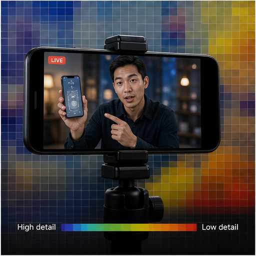

# 22. 语义感知编解码

> `idea_only` 图文页面。图片是概念示意，不代表已量产效果；来源链接用于理解相关技术或产品边界。

*图 22：语义感知编解码的概念示意。画面用于帮助理解用户最终看到的效果，不是论文原图或真实产品截图。*

## 看图理解

编码器可以根据人脸、手部、文字和运动主体分配码率，并复用运动矢量和轻量特征。用户看到的结果是低码率下主体可读、背景可压缩。

本簇收录 24 条基础 IDEA，默认真实性边界包括 faithful, generative；代表场景：直播, 长录像, 社交, 端云。

## 本簇 IDEA

### NATIVE-0457｜人脸手部：语义码率分配录像

- **用户效果**：围绕人脸手部，在低码率下优先保护身份和动作；通过语义码率分配实现按内容价值分配比特。
- **核心机制**：语义码率分配：按内容价值分配比特。需要跨帧维护目标状态、遮挡关系和质量置信度。
- **手机输入**：encoder vectors、semantic ROI、feature sidecar、bitstream metadata
- **适用场景**：直播、长录像、社交、端云
- **真实性边界**：`faithful`
- **主要风险**：时序闪烁、遮挡错误、用户控制复杂度、端侧功耗

### NATIVE-0458｜人脸手部：运动矢量共享录像

- **用户效果**：围绕人脸手部，在低码率下优先保护身份和动作；通过运动矢量共享实现算法与编码器复用运动信息。
- **核心机制**：运动矢量共享：算法与编码器复用运动信息。需要跨帧维护目标状态、遮挡关系和质量置信度。
- **手机输入**：encoder vectors、semantic ROI、feature sidecar、bitstream metadata
- **适用场景**：直播、长录像、社交、端云
- **真实性边界**：`faithful`
- **主要风险**：时序闪烁、遮挡错误、用户控制复杂度、端侧功耗

### NATIVE-0459｜人脸手部：特征伴随码流录像

- **用户效果**：围绕人脸手部，在低码率下优先保护身份和动作；通过特征伴随码流实现保存轻量恢复特征。
- **核心机制**：特征伴随码流：保存轻量恢复特征。需要跨帧维护目标状态、遮挡关系和质量置信度。
- **手机输入**：encoder vectors、semantic ROI、feature sidecar、bitstream metadata
- **适用场景**：直播、长录像、社交、端云
- **真实性边界**：`faithful`
- **主要风险**：时序闪烁、遮挡错误、用户控制复杂度、端侧功耗

### NATIVE-0460｜人脸手部：可伸缩质量层录像

- **用户效果**：围绕人脸手部，在低码率下优先保护身份和动作；通过可伸缩质量层实现即时版和母版共享码流。
- **核心机制**：可伸缩质量层：即时版和母版共享码流。需要跨帧维护目标状态、遮挡关系和质量置信度。
- **手机输入**：encoder vectors、semantic ROI、feature sidecar、bitstream metadata
- **适用场景**：直播、长录像、社交、端云
- **真实性边界**：`faithful`
- **主要风险**：时序闪烁、遮挡错误、用户控制复杂度、端侧功耗

### NATIVE-0461｜人脸手部：生成式背景编码录像

- **用户效果**：围绕人脸手部，在低码率下优先保护身份和动作；通过生成式背景编码实现背景以语义和参考帧重建。
- **核心机制**：生成式背景编码：背景以语义和参考帧重建。需要跨帧维护目标状态、遮挡关系和质量置信度。
- **手机输入**：encoder vectors、semantic ROI、feature sidecar、bitstream metadata
- **适用场景**：直播、长录像、社交、端云
- **真实性边界**：`generative`
- **主要风险**：时序闪烁、遮挡错误、用户控制复杂度、端侧功耗

### NATIVE-0462｜人脸手部：真实性水印录像

- **用户效果**：围绕人脸手部，在低码率下优先保护身份和动作；通过真实性水印实现编码生成区域和处理历史。
- **核心机制**：真实性水印：编码生成区域和处理历史。需要跨帧维护目标状态、遮挡关系和质量置信度。
- **手机输入**：encoder vectors、semantic ROI、feature sidecar、bitstream metadata
- **适用场景**：直播、长录像、社交、端云
- **真实性边界**：`faithful`
- **主要风险**：时序闪烁、遮挡错误、用户控制复杂度、端侧功耗

### NATIVE-0463｜文字屏幕：语义码率分配录像

- **用户效果**：围绕文字屏幕，优先保护可读性、色彩和刷新纹理；通过语义码率分配实现按内容价值分配比特。
- **核心机制**：语义码率分配：按内容价值分配比特。需要跨帧维护目标状态、遮挡关系和质量置信度。
- **手机输入**：encoder vectors、semantic ROI、feature sidecar、bitstream metadata
- **适用场景**：直播、长录像、社交、端云
- **真实性边界**：`faithful`
- **主要风险**：时序闪烁、遮挡错误、用户控制复杂度、端侧功耗

### NATIVE-0464｜文字屏幕：运动矢量共享录像

- **用户效果**：围绕文字屏幕，优先保护可读性、色彩和刷新纹理；通过运动矢量共享实现算法与编码器复用运动信息。
- **核心机制**：运动矢量共享：算法与编码器复用运动信息。需要跨帧维护目标状态、遮挡关系和质量置信度。
- **手机输入**：encoder vectors、semantic ROI、feature sidecar、bitstream metadata
- **适用场景**：直播、长录像、社交、端云
- **真实性边界**：`faithful`
- **主要风险**：时序闪烁、遮挡错误、用户控制复杂度、端侧功耗

### NATIVE-0465｜文字屏幕：特征伴随码流录像

- **用户效果**：围绕文字屏幕，优先保护可读性、色彩和刷新纹理；通过特征伴随码流实现保存轻量恢复特征。
- **核心机制**：特征伴随码流：保存轻量恢复特征。需要跨帧维护目标状态、遮挡关系和质量置信度。
- **手机输入**：encoder vectors、semantic ROI、feature sidecar、bitstream metadata
- **适用场景**：直播、长录像、社交、端云
- **真实性边界**：`faithful`
- **主要风险**：时序闪烁、遮挡错误、用户控制复杂度、端侧功耗

### NATIVE-0466｜文字屏幕：可伸缩质量层录像

- **用户效果**：围绕文字屏幕，优先保护可读性、色彩和刷新纹理；通过可伸缩质量层实现即时版和母版共享码流。
- **核心机制**：可伸缩质量层：即时版和母版共享码流。需要跨帧维护目标状态、遮挡关系和质量置信度。
- **手机输入**：encoder vectors、semantic ROI、feature sidecar、bitstream metadata
- **适用场景**：直播、长录像、社交、端云
- **真实性边界**：`faithful`
- **主要风险**：时序闪烁、遮挡错误、用户控制复杂度、端侧功耗

### NATIVE-0467｜文字屏幕：生成式背景编码录像

- **用户效果**：围绕文字屏幕，优先保护可读性、色彩和刷新纹理；通过生成式背景编码实现背景以语义和参考帧重建。
- **核心机制**：生成式背景编码：背景以语义和参考帧重建。需要跨帧维护目标状态、遮挡关系和质量置信度。
- **手机输入**：encoder vectors、semantic ROI、feature sidecar、bitstream metadata
- **适用场景**：直播、长录像、社交、端云
- **真实性边界**：`generative`
- **主要风险**：时序闪烁、遮挡错误、用户控制复杂度、端侧功耗

### NATIVE-0468｜文字屏幕：真实性水印录像

- **用户效果**：围绕文字屏幕，优先保护可读性、色彩和刷新纹理；通过真实性水印实现编码生成区域和处理历史。
- **核心机制**：真实性水印：编码生成区域和处理历史。需要跨帧维护目标状态、遮挡关系和质量置信度。
- **手机输入**：encoder vectors、semantic ROI、feature sidecar、bitstream metadata
- **适用场景**：直播、长录像、社交、端云
- **真实性边界**：`faithful`
- **主要风险**：时序闪烁、遮挡错误、用户控制复杂度、端侧功耗

### NATIVE-0469｜高速主体：语义码率分配录像

- **用户效果**：围绕高速主体，优先保护运动边界和关键纹理；通过语义码率分配实现按内容价值分配比特。
- **核心机制**：语义码率分配：按内容价值分配比特。需要跨帧维护目标状态、遮挡关系和质量置信度。
- **手机输入**：encoder vectors、semantic ROI、feature sidecar、bitstream metadata
- **适用场景**：直播、长录像、社交、端云
- **真实性边界**：`faithful`
- **主要风险**：时序闪烁、遮挡错误、用户控制复杂度、端侧功耗

### NATIVE-0470｜高速主体：运动矢量共享录像

- **用户效果**：围绕高速主体，优先保护运动边界和关键纹理；通过运动矢量共享实现算法与编码器复用运动信息。
- **核心机制**：运动矢量共享：算法与编码器复用运动信息。需要跨帧维护目标状态、遮挡关系和质量置信度。
- **手机输入**：encoder vectors、semantic ROI、feature sidecar、bitstream metadata
- **适用场景**：直播、长录像、社交、端云
- **真实性边界**：`faithful`
- **主要风险**：时序闪烁、遮挡错误、用户控制复杂度、端侧功耗

### NATIVE-0471｜高速主体：特征伴随码流录像

- **用户效果**：围绕高速主体，优先保护运动边界和关键纹理；通过特征伴随码流实现保存轻量恢复特征。
- **核心机制**：特征伴随码流：保存轻量恢复特征。需要跨帧维护目标状态、遮挡关系和质量置信度。
- **手机输入**：encoder vectors、semantic ROI、feature sidecar、bitstream metadata
- **适用场景**：直播、长录像、社交、端云
- **真实性边界**：`faithful`
- **主要风险**：时序闪烁、遮挡错误、用户控制复杂度、端侧功耗

### NATIVE-0472｜高速主体：可伸缩质量层录像

- **用户效果**：围绕高速主体，优先保护运动边界和关键纹理；通过可伸缩质量层实现即时版和母版共享码流。
- **核心机制**：可伸缩质量层：即时版和母版共享码流。需要跨帧维护目标状态、遮挡关系和质量置信度。
- **手机输入**：encoder vectors、semantic ROI、feature sidecar、bitstream metadata
- **适用场景**：直播、长录像、社交、端云
- **真实性边界**：`faithful`
- **主要风险**：时序闪烁、遮挡错误、用户控制复杂度、端侧功耗

### NATIVE-0473｜高速主体：生成式背景编码录像

- **用户效果**：围绕高速主体，优先保护运动边界和关键纹理；通过生成式背景编码实现背景以语义和参考帧重建。
- **核心机制**：生成式背景编码：背景以语义和参考帧重建。需要跨帧维护目标状态、遮挡关系和质量置信度。
- **手机输入**：encoder vectors、semantic ROI、feature sidecar、bitstream metadata
- **适用场景**：直播、长录像、社交、端云
- **真实性边界**：`generative`
- **主要风险**：时序闪烁、遮挡错误、用户控制复杂度、端侧功耗

### NATIVE-0474｜高速主体：真实性水印录像

- **用户效果**：围绕高速主体，优先保护运动边界和关键纹理；通过真实性水印实现编码生成区域和处理历史。
- **核心机制**：真实性水印：编码生成区域和处理历史。需要跨帧维护目标状态、遮挡关系和质量置信度。
- **手机输入**：encoder vectors、semantic ROI、feature sidecar、bitstream metadata
- **适用场景**：直播、长录像、社交、端云
- **真实性边界**：`faithful`
- **主要风险**：时序闪烁、遮挡错误、用户控制复杂度、端侧功耗

### NATIVE-0475｜静态背景：语义码率分配录像

- **用户效果**：围绕静态背景，允许更高压缩并保存重建提示；通过语义码率分配实现按内容价值分配比特。
- **核心机制**：语义码率分配：按内容价值分配比特。需要跨帧维护目标状态、遮挡关系和质量置信度。
- **手机输入**：encoder vectors、semantic ROI、feature sidecar、bitstream metadata
- **适用场景**：直播、长录像、社交、端云
- **真实性边界**：`faithful`
- **主要风险**：时序闪烁、遮挡错误、用户控制复杂度、端侧功耗

### NATIVE-0476｜静态背景：运动矢量共享录像

- **用户效果**：围绕静态背景，允许更高压缩并保存重建提示；通过运动矢量共享实现算法与编码器复用运动信息。
- **核心机制**：运动矢量共享：算法与编码器复用运动信息。需要跨帧维护目标状态、遮挡关系和质量置信度。
- **手机输入**：encoder vectors、semantic ROI、feature sidecar、bitstream metadata
- **适用场景**：直播、长录像、社交、端云
- **真实性边界**：`faithful`
- **主要风险**：时序闪烁、遮挡错误、用户控制复杂度、端侧功耗

### NATIVE-0477｜静态背景：特征伴随码流录像

- **用户效果**：围绕静态背景，允许更高压缩并保存重建提示；通过特征伴随码流实现保存轻量恢复特征。
- **核心机制**：特征伴随码流：保存轻量恢复特征。需要跨帧维护目标状态、遮挡关系和质量置信度。
- **手机输入**：encoder vectors、semantic ROI、feature sidecar、bitstream metadata
- **适用场景**：直播、长录像、社交、端云
- **真实性边界**：`faithful`
- **主要风险**：时序闪烁、遮挡错误、用户控制复杂度、端侧功耗

### NATIVE-0478｜静态背景：可伸缩质量层录像

- **用户效果**：围绕静态背景，允许更高压缩并保存重建提示；通过可伸缩质量层实现即时版和母版共享码流。
- **核心机制**：可伸缩质量层：即时版和母版共享码流。需要跨帧维护目标状态、遮挡关系和质量置信度。
- **手机输入**：encoder vectors、semantic ROI、feature sidecar、bitstream metadata
- **适用场景**：直播、长录像、社交、端云
- **真实性边界**：`faithful`
- **主要风险**：时序闪烁、遮挡错误、用户控制复杂度、端侧功耗

### NATIVE-0479｜静态背景：生成式背景编码录像

- **用户效果**：围绕静态背景，允许更高压缩并保存重建提示；通过生成式背景编码实现背景以语义和参考帧重建。
- **核心机制**：生成式背景编码：背景以语义和参考帧重建。需要跨帧维护目标状态、遮挡关系和质量置信度。
- **手机输入**：encoder vectors、semantic ROI、feature sidecar、bitstream metadata
- **适用场景**：直播、长录像、社交、端云
- **真实性边界**：`generative`
- **主要风险**：时序闪烁、遮挡错误、用户控制复杂度、端侧功耗

### NATIVE-0480｜静态背景：真实性水印录像

- **用户效果**：围绕静态背景，允许更高压缩并保存重建提示；通过真实性水印实现编码生成区域和处理历史。
- **核心机制**：真实性水印：编码生成区域和处理历史。需要跨帧维护目标状态、遮挡关系和质量置信度。
- **手机输入**：encoder vectors、semantic ROI、feature sidecar、bitstream metadata
- **适用场景**：直播、长录像、社交、端云
- **真实性边界**：`faithful`
- **主要风险**：时序闪烁、遮挡错误、用户控制复杂度、端侧功耗

## 相关来源

- **WF-VAE: Wavelet Flow VAE for Video Compression**（E3，verified）：[本地缓存](../../../20260821_ENC_DEC/papers/03_video_vae/wfvae_2411.17459.pdf)
- **MAGVIT: Masked Generative Video Transformer**（E3，verified）：[本地缓存](../../../20260821_ENC_DEC/papers/03_video_vae/magvit_2212.05199.pdf)

## 阅读建议

先看图判断用户效果，再回到上面的 `idea_id` 了解处理对象和输入信号；需要落地时，再从来源、数据、时序一致性、端侧预算和真实性边界分别建立验证任务。

[返回图文图鉴总览](../手机录像后处理_IDEA图文图鉴_20260827.md)
