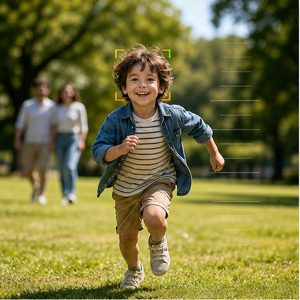

# 25. 对焦与光学机构信息

> `idea_only` 图文页面。图片是概念示意，不代表已量产效果；来源链接用于理解相关技术或产品边界。

*图 25：对焦与光学机构信息的概念示意。画面用于帮助理解用户最终看到的效果，不是论文原图或真实产品截图。*

## 看图理解

对焦和光学机构信息可以进入算法链。预测焦点平面、对焦速度、OIS/OIS 状态和逐行时间有助于减少失焦、呼吸、滚动快门和空间层级错误。

本簇收录 24 条基础 IDEA，默认真实性边界包括 faithful, perceptual；代表场景：人像, 运动, 采访, 演唱会。

## 本簇 IDEA

### NATIVE-0529｜人脸眼睛：PDAF 引导恢复录像

- **用户效果**：围绕人脸眼睛，用 PDAF 和焦点状态判断真实清晰度；通过PDAF 引导恢复实现用相位差约束去模糊和深度。
- **核心机制**：PDAF 引导恢复：用相位差约束去模糊和深度。需要跨帧维护目标状态、遮挡关系和质量置信度。
- **手机输入**：PDAF、lens position、depth、subject tracks
- **适用场景**：人像、运动、采访、演唱会
- **真实性边界**：`faithful`
- **主要风险**：时序闪烁、遮挡错误、用户控制复杂度、端侧功耗

### NATIVE-0530｜人脸眼睛：失焦预测录像

- **用户效果**：围绕人脸眼睛，用 PDAF 和焦点状态判断真实清晰度；通过失焦预测实现预测下一时刻焦点失败。
- **核心机制**：失焦预测：预测下一时刻焦点失败。需要跨帧维护目标状态、遮挡关系和质量置信度。
- **手机输入**：PDAF、lens position、depth、subject tracks
- **适用场景**：人像、运动、采访、演唱会
- **真实性边界**：`faithful`
- **主要风险**：时序闪烁、遮挡错误、用户控制复杂度、端侧功耗

### NATIVE-0531｜人脸眼睛：焦点轨迹重放录像

- **用户效果**：围绕人脸眼睛，用 PDAF 和焦点状态判断真实清晰度；通过焦点轨迹重放实现录后重新设计拉焦路径。
- **核心机制**：焦点轨迹重放：录后重新设计拉焦路径。需要跨帧维护目标状态、遮挡关系和质量置信度。
- **手机输入**：PDAF、lens position、depth、subject tracks
- **适用场景**：人像、运动、采访、演唱会
- **真实性边界**：`perceptual`
- **主要风险**：时序闪烁、遮挡错误、用户控制复杂度、端侧功耗

### NATIVE-0532｜人脸眼睛：遮挡感知跟焦录像

- **用户效果**：围绕人脸眼睛，用 PDAF 和焦点状态判断真实清晰度；通过遮挡感知跟焦实现遮挡时维持目标身份。
- **核心机制**：遮挡感知跟焦：遮挡时维持目标身份。需要跨帧维护目标状态、遮挡关系和质量置信度。
- **手机输入**：PDAF、lens position、depth、subject tracks
- **适用场景**：人像、运动、采访、演唱会
- **真实性边界**：`faithful`
- **主要风险**：时序闪烁、遮挡错误、用户控制复杂度、端侧功耗

### NATIVE-0533｜人脸眼睛：景深置信度录像

- **用户效果**：围绕人脸眼睛，用 PDAF 和焦点状态判断真实清晰度；通过景深置信度实现显示虚化和深度不确定性。
- **核心机制**：景深置信度：显示虚化和深度不确定性。需要跨帧维护目标状态、遮挡关系和质量置信度。
- **手机输入**：PDAF、lens position、depth、subject tracks
- **适用场景**：人像、运动、采访、演唱会
- **真实性边界**：`faithful`
- **主要风险**：时序闪烁、遮挡错误、用户控制复杂度、端侧功耗

### NATIVE-0534｜人脸眼睛：焦点与构图联动录像

- **用户效果**：围绕人脸眼睛，用 PDAF 和焦点状态判断真实清晰度；通过焦点与构图联动实现用叙事重点选择焦点和景别。
- **核心机制**：焦点与构图联动：用叙事重点选择焦点和景别。需要跨帧维护目标状态、遮挡关系和质量置信度。
- **手机输入**：PDAF、lens position、depth、subject tracks
- **适用场景**：人像、运动、采访、演唱会
- **真实性边界**：`perceptual`
- **主要风险**：时序闪烁、遮挡错误、用户控制复杂度、端侧功耗

### NATIVE-0535｜高速主体：PDAF 引导恢复录像

- **用户效果**：围绕高速主体，预测主体进入焦平面的时刻；通过PDAF 引导恢复实现用相位差约束去模糊和深度。
- **核心机制**：PDAF 引导恢复：用相位差约束去模糊和深度。需要跨帧维护目标状态、遮挡关系和质量置信度。
- **手机输入**：PDAF、lens position、depth、subject tracks
- **适用场景**：人像、运动、采访、演唱会
- **真实性边界**：`faithful`
- **主要风险**：时序闪烁、遮挡错误、用户控制复杂度、端侧功耗

### NATIVE-0536｜高速主体：失焦预测录像

- **用户效果**：围绕高速主体，预测主体进入焦平面的时刻；通过失焦预测实现预测下一时刻焦点失败。
- **核心机制**：失焦预测：预测下一时刻焦点失败。需要跨帧维护目标状态、遮挡关系和质量置信度。
- **手机输入**：PDAF、lens position、depth、subject tracks
- **适用场景**：人像、运动、采访、演唱会
- **真实性边界**：`faithful`
- **主要风险**：时序闪烁、遮挡错误、用户控制复杂度、端侧功耗

### NATIVE-0537｜高速主体：焦点轨迹重放录像

- **用户效果**：围绕高速主体，预测主体进入焦平面的时刻；通过焦点轨迹重放实现录后重新设计拉焦路径。
- **核心机制**：焦点轨迹重放：录后重新设计拉焦路径。需要跨帧维护目标状态、遮挡关系和质量置信度。
- **手机输入**：PDAF、lens position、depth、subject tracks
- **适用场景**：人像、运动、采访、演唱会
- **真实性边界**：`perceptual`
- **主要风险**：时序闪烁、遮挡错误、用户控制复杂度、端侧功耗

### NATIVE-0538｜高速主体：遮挡感知跟焦录像

- **用户效果**：围绕高速主体，预测主体进入焦平面的时刻；通过遮挡感知跟焦实现遮挡时维持目标身份。
- **核心机制**：遮挡感知跟焦：遮挡时维持目标身份。需要跨帧维护目标状态、遮挡关系和质量置信度。
- **手机输入**：PDAF、lens position、depth、subject tracks
- **适用场景**：人像、运动、采访、演唱会
- **真实性边界**：`faithful`
- **主要风险**：时序闪烁、遮挡错误、用户控制复杂度、端侧功耗

### NATIVE-0539｜高速主体：景深置信度录像

- **用户效果**：围绕高速主体，预测主体进入焦平面的时刻；通过景深置信度实现显示虚化和深度不确定性。
- **核心机制**：景深置信度：显示虚化和深度不确定性。需要跨帧维护目标状态、遮挡关系和质量置信度。
- **手机输入**：PDAF、lens position、depth、subject tracks
- **适用场景**：人像、运动、采访、演唱会
- **真实性边界**：`faithful`
- **主要风险**：时序闪烁、遮挡错误、用户控制复杂度、端侧功耗

### NATIVE-0540｜高速主体：焦点与构图联动录像

- **用户效果**：围绕高速主体，预测主体进入焦平面的时刻；通过焦点与构图联动实现用叙事重点选择焦点和景别。
- **核心机制**：焦点与构图联动：用叙事重点选择焦点和景别。需要跨帧维护目标状态、遮挡关系和质量置信度。
- **手机输入**：PDAF、lens position、depth、subject tracks
- **适用场景**：人像、运动、采访、演唱会
- **真实性边界**：`perceptual`
- **主要风险**：时序闪烁、遮挡错误、用户控制复杂度、端侧功耗

### NATIVE-0541｜多层场景：PDAF 引导恢复录像

- **用户效果**：围绕多层场景，维护前中后景的焦点关系；通过PDAF 引导恢复实现用相位差约束去模糊和深度。
- **核心机制**：PDAF 引导恢复：用相位差约束去模糊和深度。需要跨帧维护目标状态、遮挡关系和质量置信度。
- **手机输入**：PDAF、lens position、depth、subject tracks
- **适用场景**：人像、运动、采访、演唱会
- **真实性边界**：`faithful`
- **主要风险**：时序闪烁、遮挡错误、用户控制复杂度、端侧功耗

### NATIVE-0542｜多层场景：失焦预测录像

- **用户效果**：围绕多层场景，维护前中后景的焦点关系；通过失焦预测实现预测下一时刻焦点失败。
- **核心机制**：失焦预测：预测下一时刻焦点失败。需要跨帧维护目标状态、遮挡关系和质量置信度。
- **手机输入**：PDAF、lens position、depth、subject tracks
- **适用场景**：人像、运动、采访、演唱会
- **真实性边界**：`faithful`
- **主要风险**：时序闪烁、遮挡错误、用户控制复杂度、端侧功耗

### NATIVE-0543｜多层场景：焦点轨迹重放录像

- **用户效果**：围绕多层场景，维护前中后景的焦点关系；通过焦点轨迹重放实现录后重新设计拉焦路径。
- **核心机制**：焦点轨迹重放：录后重新设计拉焦路径。需要跨帧维护目标状态、遮挡关系和质量置信度。
- **手机输入**：PDAF、lens position、depth、subject tracks
- **适用场景**：人像、运动、采访、演唱会
- **真实性边界**：`perceptual`
- **主要风险**：时序闪烁、遮挡错误、用户控制复杂度、端侧功耗

### NATIVE-0544｜多层场景：遮挡感知跟焦录像

- **用户效果**：围绕多层场景，维护前中后景的焦点关系；通过遮挡感知跟焦实现遮挡时维持目标身份。
- **核心机制**：遮挡感知跟焦：遮挡时维持目标身份。需要跨帧维护目标状态、遮挡关系和质量置信度。
- **手机输入**：PDAF、lens position、depth、subject tracks
- **适用场景**：人像、运动、采访、演唱会
- **真实性边界**：`faithful`
- **主要风险**：时序闪烁、遮挡错误、用户控制复杂度、端侧功耗

### NATIVE-0545｜多层场景：景深置信度录像

- **用户效果**：围绕多层场景，维护前中后景的焦点关系；通过景深置信度实现显示虚化和深度不确定性。
- **核心机制**：景深置信度：显示虚化和深度不确定性。需要跨帧维护目标状态、遮挡关系和质量置信度。
- **手机输入**：PDAF、lens position、depth、subject tracks
- **适用场景**：人像、运动、采访、演唱会
- **真实性边界**：`faithful`
- **主要风险**：时序闪烁、遮挡错误、用户控制复杂度、端侧功耗

### NATIVE-0546｜多层场景：焦点与构图联动录像

- **用户效果**：围绕多层场景，维护前中后景的焦点关系；通过焦点与构图联动实现用叙事重点选择焦点和景别。
- **核心机制**：焦点与构图联动：用叙事重点选择焦点和景别。需要跨帧维护目标状态、遮挡关系和质量置信度。
- **手机输入**：PDAF、lens position、depth、subject tracks
- **适用场景**：人像、运动、采访、演唱会
- **真实性边界**：`perceptual`
- **主要风险**：时序闪烁、遮挡错误、用户控制复杂度、端侧功耗

### NATIVE-0547｜跨镜头焦点：PDAF 引导恢复录像

- **用户效果**：围绕跨镜头焦点，切镜前后保持物理对焦连续；通过PDAF 引导恢复实现用相位差约束去模糊和深度。
- **核心机制**：PDAF 引导恢复：用相位差约束去模糊和深度。需要跨帧维护目标状态、遮挡关系和质量置信度。
- **手机输入**：PDAF、lens position、depth、subject tracks
- **适用场景**：人像、运动、采访、演唱会
- **真实性边界**：`faithful`
- **主要风险**：时序闪烁、遮挡错误、用户控制复杂度、端侧功耗

### NATIVE-0548｜跨镜头焦点：失焦预测录像

- **用户效果**：围绕跨镜头焦点，切镜前后保持物理对焦连续；通过失焦预测实现预测下一时刻焦点失败。
- **核心机制**：失焦预测：预测下一时刻焦点失败。需要跨帧维护目标状态、遮挡关系和质量置信度。
- **手机输入**：PDAF、lens position、depth、subject tracks
- **适用场景**：人像、运动、采访、演唱会
- **真实性边界**：`faithful`
- **主要风险**：时序闪烁、遮挡错误、用户控制复杂度、端侧功耗

### NATIVE-0549｜跨镜头焦点：焦点轨迹重放录像

- **用户效果**：围绕跨镜头焦点，切镜前后保持物理对焦连续；通过焦点轨迹重放实现录后重新设计拉焦路径。
- **核心机制**：焦点轨迹重放：录后重新设计拉焦路径。需要跨帧维护目标状态、遮挡关系和质量置信度。
- **手机输入**：PDAF、lens position、depth、subject tracks
- **适用场景**：人像、运动、采访、演唱会
- **真实性边界**：`perceptual`
- **主要风险**：时序闪烁、遮挡错误、用户控制复杂度、端侧功耗

### NATIVE-0550｜跨镜头焦点：遮挡感知跟焦录像

- **用户效果**：围绕跨镜头焦点，切镜前后保持物理对焦连续；通过遮挡感知跟焦实现遮挡时维持目标身份。
- **核心机制**：遮挡感知跟焦：遮挡时维持目标身份。需要跨帧维护目标状态、遮挡关系和质量置信度。
- **手机输入**：PDAF、lens position、depth、subject tracks
- **适用场景**：人像、运动、采访、演唱会
- **真实性边界**：`faithful`
- **主要风险**：时序闪烁、遮挡错误、用户控制复杂度、端侧功耗

### NATIVE-0551｜跨镜头焦点：景深置信度录像

- **用户效果**：围绕跨镜头焦点，切镜前后保持物理对焦连续；通过景深置信度实现显示虚化和深度不确定性。
- **核心机制**：景深置信度：显示虚化和深度不确定性。需要跨帧维护目标状态、遮挡关系和质量置信度。
- **手机输入**：PDAF、lens position、depth、subject tracks
- **适用场景**：人像、运动、采访、演唱会
- **真实性边界**：`faithful`
- **主要风险**：时序闪烁、遮挡错误、用户控制复杂度、端侧功耗

### NATIVE-0552｜跨镜头焦点：焦点与构图联动录像

- **用户效果**：围绕跨镜头焦点，切镜前后保持物理对焦连续；通过焦点与构图联动实现用叙事重点选择焦点和景别。
- **核心机制**：焦点与构图联动：用叙事重点选择焦点和景别。需要跨帧维护目标状态、遮挡关系和质量置信度。
- **手机输入**：PDAF、lens position、depth、subject tracks
- **适用场景**：人像、运动、采访、演唱会
- **真实性边界**：`perceptual`
- **主要风险**：时序闪烁、遮挡错误、用户控制复杂度、端侧功耗

## 相关来源

- **Subject tracking**（E1，verified）：[外部来源](https://www.dji.com/osmo-pocket-3) / [本地缓存](../../sources/official_products/official_dji_subject_tracking.html)
- **Object tracking**（E1，verified）：[外部来源](https://support.apple.com/guide/final-cut-pro/track-objects-ver2a5f7f2d/mac) / [本地缓存](../../sources/official_products/official_final_cut_object_tracker.html)

## 阅读建议

先看图判断用户效果，再回到上面的 `idea_id` 了解处理对象和输入信号；需要落地时，再从来源、数据、时序一致性、端侧预算和真实性边界分别建立验证任务。

[返回图文图鉴总览](../手机录像后处理_IDEA图文图鉴_20260827.md)
