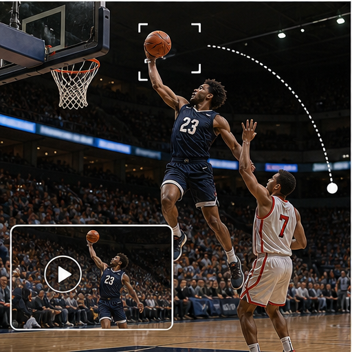

# 28. 体育与动作自动摄影

> `idea_only` 图文页面。图片是概念示意，不代表已量产效果；来源链接用于理解相关技术或产品边界。

*图 28：体育与动作自动摄影的概念示意。画面用于帮助理解用户最终看到的效果，不是论文原图或真实产品截图。*

## 看图理解

体育录像的对象不是整场画面，而是球、运动员、器械、规则事件和精彩瞬间。跟踪、轨迹、缓存、慢动作和多机位可以组成自动导播链。

本簇收录 24 条基础 IDEA，默认真实性边界包括 faithful, generative, perceptual；代表场景：球类, 跑步, 骑行, 滑雪。

## 本簇 IDEA

### NATIVE-0601｜球与器械：规则感知跟拍录像

- **用户效果**：围绕球与器械，跟踪高速小目标和轨迹；通过规则感知跟拍实现用项目规则预测事件。
- **核心机制**：规则感知跟拍：用项目规则预测事件。需要跨帧维护目标状态、遮挡关系和质量置信度。
- **手机输入**：high-fps、audio events、multi-device、object tracks
- **适用场景**：球类、跑步、骑行、滑雪
- **真实性边界**：`faithful`
- **主要风险**：时序闪烁、遮挡错误、用户控制复杂度、端侧功耗

### NATIVE-0602｜球与器械：轨迹增强录像

- **用户效果**：围绕球与器械，跟踪高速小目标和轨迹；通过轨迹增强实现可视化球、车或运动员路径。
- **核心机制**：轨迹增强：可视化球、车或运动员路径。需要跨帧维护目标状态、遮挡关系和质量置信度。
- **手机输入**：high-fps、audio events、multi-device、object tracks
- **适用场景**：球类、跑步、骑行、滑雪
- **真实性边界**：`perceptual`
- **主要风险**：时序闪烁、遮挡错误、用户控制复杂度、端侧功耗

### NATIVE-0603｜球与器械：事件前缓存录像

- **用户效果**：围绕球与器械，跟踪高速小目标和轨迹；通过事件前缓存实现预测得分和精彩动作。
- **核心机制**：事件前缓存：预测得分和精彩动作。需要跨帧维护目标状态、遮挡关系和质量置信度。
- **手机输入**：high-fps、audio events、multi-device、object tracks
- **适用场景**：球类、跑步、骑行、滑雪
- **真实性边界**：`faithful`
- **主要风险**：时序闪烁、遮挡错误、用户控制复杂度、端侧功耗

### NATIVE-0604｜球与器械：自动慢动作录像

- **用户效果**：围绕球与器械，跟踪高速小目标和轨迹；通过自动慢动作实现对关键局部重建高帧率。
- **核心机制**：自动慢动作：对关键局部重建高帧率。需要跨帧维护目标状态、遮挡关系和质量置信度。
- **手机输入**：high-fps、audio events、multi-device、object tracks
- **适用场景**：球类、跑步、骑行、滑雪
- **真实性边界**：`perceptual`
- **主要风险**：时序闪烁、遮挡错误、用户控制复杂度、端侧功耗

### NATIVE-0605｜球与器械：多机位导播录像

- **用户效果**：围绕球与器械，跟踪高速小目标和轨迹；通过多机位导播实现多手机自动选择最佳视角。
- **核心机制**：多机位导播：多手机自动选择最佳视角。需要跨帧维护目标状态、遮挡关系和质量置信度。
- **手机输入**：high-fps、audio events、multi-device、object tracks
- **适用场景**：球类、跑步、骑行、滑雪
- **真实性边界**：`faithful`
- **主要风险**：时序闪烁、遮挡错误、用户控制复杂度、端侧功耗

### NATIVE-0606｜球与器械：战术空间重构录像

- **用户效果**：围绕球与器械，跟踪高速小目标和轨迹；通过战术空间重构实现重建位置关系和运动线路。
- **核心机制**：战术空间重构：重建位置关系和运动线路。需要跨帧维护目标状态、遮挡关系和质量置信度。
- **手机输入**：high-fps、audio events、multi-device、object tracks
- **适用场景**：球类、跑步、骑行、滑雪
- **真实性边界**：`generative`
- **主要风险**：时序闪烁、遮挡错误、用户控制复杂度、端侧功耗

### NATIVE-0607｜运动员：规则感知跟拍录像

- **用户效果**：围绕运动员，维持人物、号码、姿态和动作；通过规则感知跟拍实现用项目规则预测事件。
- **核心机制**：规则感知跟拍：用项目规则预测事件。需要跨帧维护目标状态、遮挡关系和质量置信度。
- **手机输入**：high-fps、audio events、multi-device、object tracks
- **适用场景**：球类、跑步、骑行、滑雪
- **真实性边界**：`faithful`
- **主要风险**：时序闪烁、遮挡错误、用户控制复杂度、端侧功耗

### NATIVE-0608｜运动员：轨迹增强录像

- **用户效果**：围绕运动员，维持人物、号码、姿态和动作；通过轨迹增强实现可视化球、车或运动员路径。
- **核心机制**：轨迹增强：可视化球、车或运动员路径。需要跨帧维护目标状态、遮挡关系和质量置信度。
- **手机输入**：high-fps、audio events、multi-device、object tracks
- **适用场景**：球类、跑步、骑行、滑雪
- **真实性边界**：`perceptual`
- **主要风险**：时序闪烁、遮挡错误、用户控制复杂度、端侧功耗

### NATIVE-0609｜运动员：事件前缓存录像

- **用户效果**：围绕运动员，维持人物、号码、姿态和动作；通过事件前缓存实现预测得分和精彩动作。
- **核心机制**：事件前缓存：预测得分和精彩动作。需要跨帧维护目标状态、遮挡关系和质量置信度。
- **手机输入**：high-fps、audio events、multi-device、object tracks
- **适用场景**：球类、跑步、骑行、滑雪
- **真实性边界**：`faithful`
- **主要风险**：时序闪烁、遮挡错误、用户控制复杂度、端侧功耗

### NATIVE-0610｜运动员：自动慢动作录像

- **用户效果**：围绕运动员，维持人物、号码、姿态和动作；通过自动慢动作实现对关键局部重建高帧率。
- **核心机制**：自动慢动作：对关键局部重建高帧率。需要跨帧维护目标状态、遮挡关系和质量置信度。
- **手机输入**：high-fps、audio events、multi-device、object tracks
- **适用场景**：球类、跑步、骑行、滑雪
- **真实性边界**：`perceptual`
- **主要风险**：时序闪烁、遮挡错误、用户控制复杂度、端侧功耗

### NATIVE-0611｜运动员：多机位导播录像

- **用户效果**：围绕运动员，维持人物、号码、姿态和动作；通过多机位导播实现多手机自动选择最佳视角。
- **核心机制**：多机位导播：多手机自动选择最佳视角。需要跨帧维护目标状态、遮挡关系和质量置信度。
- **手机输入**：high-fps、audio events、multi-device、object tracks
- **适用场景**：球类、跑步、骑行、滑雪
- **真实性边界**：`faithful`
- **主要风险**：时序闪烁、遮挡错误、用户控制复杂度、端侧功耗

### NATIVE-0612｜运动员：战术空间重构录像

- **用户效果**：围绕运动员，维持人物、号码、姿态和动作；通过战术空间重构实现重建位置关系和运动线路。
- **核心机制**：战术空间重构：重建位置关系和运动线路。需要跨帧维护目标状态、遮挡关系和质量置信度。
- **手机输入**：high-fps、audio events、multi-device、object tracks
- **适用场景**：球类、跑步、骑行、滑雪
- **真实性边界**：`generative`
- **主要风险**：时序闪烁、遮挡错误、用户控制复杂度、端侧功耗

### NATIVE-0613｜比赛区域：规则感知跟拍录像

- **用户效果**：围绕比赛区域，理解边界、球门、篮筐和赛道；通过规则感知跟拍实现用项目规则预测事件。
- **核心机制**：规则感知跟拍：用项目规则预测事件。需要跨帧维护目标状态、遮挡关系和质量置信度。
- **手机输入**：high-fps、audio events、multi-device、object tracks
- **适用场景**：球类、跑步、骑行、滑雪
- **真实性边界**：`faithful`
- **主要风险**：时序闪烁、遮挡错误、用户控制复杂度、端侧功耗

### NATIVE-0614｜比赛区域：轨迹增强录像

- **用户效果**：围绕比赛区域，理解边界、球门、篮筐和赛道；通过轨迹增强实现可视化球、车或运动员路径。
- **核心机制**：轨迹增强：可视化球、车或运动员路径。需要跨帧维护目标状态、遮挡关系和质量置信度。
- **手机输入**：high-fps、audio events、multi-device、object tracks
- **适用场景**：球类、跑步、骑行、滑雪
- **真实性边界**：`perceptual`
- **主要风险**：时序闪烁、遮挡错误、用户控制复杂度、端侧功耗

### NATIVE-0615｜比赛区域：事件前缓存录像

- **用户效果**：围绕比赛区域，理解边界、球门、篮筐和赛道；通过事件前缓存实现预测得分和精彩动作。
- **核心机制**：事件前缓存：预测得分和精彩动作。需要跨帧维护目标状态、遮挡关系和质量置信度。
- **手机输入**：high-fps、audio events、multi-device、object tracks
- **适用场景**：球类、跑步、骑行、滑雪
- **真实性边界**：`faithful`
- **主要风险**：时序闪烁、遮挡错误、用户控制复杂度、端侧功耗

### NATIVE-0616｜比赛区域：自动慢动作录像

- **用户效果**：围绕比赛区域，理解边界、球门、篮筐和赛道；通过自动慢动作实现对关键局部重建高帧率。
- **核心机制**：自动慢动作：对关键局部重建高帧率。需要跨帧维护目标状态、遮挡关系和质量置信度。
- **手机输入**：high-fps、audio events、multi-device、object tracks
- **适用场景**：球类、跑步、骑行、滑雪
- **真实性边界**：`perceptual`
- **主要风险**：时序闪烁、遮挡错误、用户控制复杂度、端侧功耗

### NATIVE-0617｜比赛区域：多机位导播录像

- **用户效果**：围绕比赛区域，理解边界、球门、篮筐和赛道；通过多机位导播实现多手机自动选择最佳视角。
- **核心机制**：多机位导播：多手机自动选择最佳视角。需要跨帧维护目标状态、遮挡关系和质量置信度。
- **手机输入**：high-fps、audio events、multi-device、object tracks
- **适用场景**：球类、跑步、骑行、滑雪
- **真实性边界**：`faithful`
- **主要风险**：时序闪烁、遮挡错误、用户控制复杂度、端侧功耗

### NATIVE-0618｜比赛区域：战术空间重构录像

- **用户效果**：围绕比赛区域，理解边界、球门、篮筐和赛道；通过战术空间重构实现重建位置关系和运动线路。
- **核心机制**：战术空间重构：重建位置关系和运动线路。需要跨帧维护目标状态、遮挡关系和质量置信度。
- **手机输入**：high-fps、audio events、multi-device、object tracks
- **适用场景**：球类、跑步、骑行、滑雪
- **真实性边界**：`generative`
- **主要风险**：时序闪烁、遮挡错误、用户控制复杂度、端侧功耗

### NATIVE-0619｜观众反应：规则感知跟拍录像

- **用户效果**：围绕观众反应，同步捕捉欢呼和关键反应；通过规则感知跟拍实现用项目规则预测事件。
- **核心机制**：规则感知跟拍：用项目规则预测事件。需要跨帧维护目标状态、遮挡关系和质量置信度。
- **手机输入**：high-fps、audio events、multi-device、object tracks
- **适用场景**：球类、跑步、骑行、滑雪
- **真实性边界**：`faithful`
- **主要风险**：时序闪烁、遮挡错误、用户控制复杂度、端侧功耗

### NATIVE-0620｜观众反应：轨迹增强录像

- **用户效果**：围绕观众反应，同步捕捉欢呼和关键反应；通过轨迹增强实现可视化球、车或运动员路径。
- **核心机制**：轨迹增强：可视化球、车或运动员路径。需要跨帧维护目标状态、遮挡关系和质量置信度。
- **手机输入**：high-fps、audio events、multi-device、object tracks
- **适用场景**：球类、跑步、骑行、滑雪
- **真实性边界**：`perceptual`
- **主要风险**：时序闪烁、遮挡错误、用户控制复杂度、端侧功耗

### NATIVE-0621｜观众反应：事件前缓存录像

- **用户效果**：围绕观众反应，同步捕捉欢呼和关键反应；通过事件前缓存实现预测得分和精彩动作。
- **核心机制**：事件前缓存：预测得分和精彩动作。需要跨帧维护目标状态、遮挡关系和质量置信度。
- **手机输入**：high-fps、audio events、multi-device、object tracks
- **适用场景**：球类、跑步、骑行、滑雪
- **真实性边界**：`faithful`
- **主要风险**：时序闪烁、遮挡错误、用户控制复杂度、端侧功耗

### NATIVE-0622｜观众反应：自动慢动作录像

- **用户效果**：围绕观众反应，同步捕捉欢呼和关键反应；通过自动慢动作实现对关键局部重建高帧率。
- **核心机制**：自动慢动作：对关键局部重建高帧率。需要跨帧维护目标状态、遮挡关系和质量置信度。
- **手机输入**：high-fps、audio events、multi-device、object tracks
- **适用场景**：球类、跑步、骑行、滑雪
- **真实性边界**：`perceptual`
- **主要风险**：时序闪烁、遮挡错误、用户控制复杂度、端侧功耗

### NATIVE-0623｜观众反应：多机位导播录像

- **用户效果**：围绕观众反应，同步捕捉欢呼和关键反应；通过多机位导播实现多手机自动选择最佳视角。
- **核心机制**：多机位导播：多手机自动选择最佳视角。需要跨帧维护目标状态、遮挡关系和质量置信度。
- **手机输入**：high-fps、audio events、multi-device、object tracks
- **适用场景**：球类、跑步、骑行、滑雪
- **真实性边界**：`faithful`
- **主要风险**：时序闪烁、遮挡错误、用户控制复杂度、端侧功耗

### NATIVE-0624｜观众反应：战术空间重构录像

- **用户效果**：围绕观众反应，同步捕捉欢呼和关键反应；通过战术空间重构实现重建位置关系和运动线路。
- **核心机制**：战术空间重构：重建位置关系和运动线路。需要跨帧维护目标状态、遮挡关系和质量置信度。
- **手机输入**：high-fps、audio events、multi-device、object tracks
- **适用场景**：球类、跑步、骑行、滑雪
- **真实性边界**：`generative`
- **主要风险**：时序闪烁、遮挡错误、用户控制复杂度、端侧功耗

## 相关来源

- **ActiveTrack subject tracking**（E2，verified）：[外部来源](https://www.dji.com/a3/info) / [本地缓存](../../sources/official_products/official_dji_active_track.html)
- **Subject tracking**（E1，verified）：[外部来源](https://www.dji.com/osmo-pocket-3) / [本地缓存](../../sources/official_products/official_dji_subject_tracking.html)

## 阅读建议

先看图判断用户效果，再回到上面的 `idea_id` 了解处理对象和输入信号；需要落地时，再从来源、数据、时序一致性、端侧预算和真实性边界分别建立验证任务。

[返回图文图鉴总览](../手机录像后处理_IDEA图文图鉴_20260827.md)
