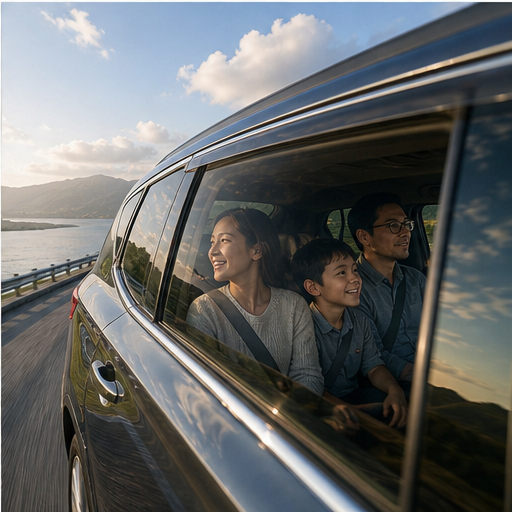

# 30. 车内与移动空间录像

> `idea_only` 图文页面。图片是概念示意，不代表已量产效果；来源链接用于理解相关技术或产品边界。

*图 30：车内与移动空间录像的概念示意。画面用于帮助理解用户最终看到的效果，不是论文原图或真实产品截图。*

## 看图理解

车内和移动空间同时存在玻璃反射、道路振动、内外曝光差、乘员人像和快速光照变化，适合做空间分层与稳像协同。

本簇收录 24 条基础 IDEA，默认真实性边界包括 faithful, generative；代表场景：车载, 旅行, 夜景, 直播。

## 本簇 IDEA

### NATIVE-0649｜车窗外景：内外景分层录像

- **用户效果**：围绕车窗外景，处理高速景物、反射和曝光；通过内外景分层实现分离车窗透射和反射。
- **核心机制**：内外景分层：分离车窗透射和反射。需要跨帧维护目标状态、遮挡关系和质量置信度。
- **手机输入**：IMU、GPS、window masks、row timestamps
- **适用场景**：车载、旅行、夜景、直播
- **真实性边界**：`faithful`
- **主要风险**：时序闪烁、遮挡错误、用户控制复杂度、端侧功耗

### NATIVE-0650｜车窗外景：运动 HDR录像

- **用户效果**：围绕车窗外景，处理高速景物、反射和曝光；通过运动 HDR实现车内人物与高速外景分别曝光。
- **核心机制**：运动 HDR：车内人物与高速外景分别曝光。需要跨帧维护目标状态、遮挡关系和质量置信度。
- **手机输入**：IMU、GPS、window masks、row timestamps
- **适用场景**：车载、旅行、夜景、直播
- **真实性边界**：`faithful`
- **主要风险**：时序闪烁、遮挡错误、用户控制复杂度、端侧功耗

### NATIVE-0651｜车窗外景：玻璃介质恢复录像

- **用户效果**：围绕车窗外景，处理高速景物、反射和曝光；通过玻璃介质恢复实现去除雨滴雾气和局部污渍。
- **核心机制**：玻璃介质恢复：去除雨滴雾气和局部污渍。需要跨帧维护目标状态、遮挡关系和质量置信度。
- **手机输入**：IMU、GPS、window masks、row timestamps
- **适用场景**：车载、旅行、夜景、直播
- **真实性边界**：`faithful`
- **主要风险**：时序闪烁、遮挡错误、用户控制复杂度、端侧功耗

### NATIVE-0652｜车窗外景：道路稳定录像

- **用户效果**：围绕车窗外景，处理高速景物、反射和曝光；通过道路稳定实现利用车辆运动约束地平线。
- **核心机制**：道路稳定：利用车辆运动约束地平线。需要跨帧维护目标状态、遮挡关系和质量置信度。
- **手机输入**：IMU、GPS、window masks、row timestamps
- **适用场景**：车载、旅行、夜景、直播
- **真实性边界**：`faithful`
- **主要风险**：时序闪烁、遮挡错误、用户控制复杂度、端侧功耗

### NATIVE-0653｜车窗外景：HUD 保护录像

- **用户效果**：围绕车窗外景，处理高速景物、反射和曝光；通过HUD 保护实现锁定导航和显示文字。
- **核心机制**：HUD 保护：锁定导航和显示文字。需要跨帧维护目标状态、遮挡关系和质量置信度。
- **手机输入**：IMU、GPS、window masks、row timestamps
- **适用场景**：车载、旅行、夜景、直播
- **真实性边界**：`faithful`
- **主要风险**：时序闪烁、遮挡错误、用户控制复杂度、端侧功耗

### NATIVE-0654｜车窗外景：旅行氛围重构录像

- **用户效果**：围绕车窗外景，处理高速景物、反射和曝光；通过旅行氛围重构实现受控增强沿途天气和光效。
- **核心机制**：旅行氛围重构：受控增强沿途天气和光效。需要跨帧维护目标状态、遮挡关系和质量置信度。
- **手机输入**：IMU、GPS、window masks、row timestamps
- **适用场景**：车载、旅行、夜景、直播
- **真实性边界**：`generative`
- **主要风险**：时序闪烁、遮挡错误、用户控制复杂度、端侧功耗

### NATIVE-0655｜车内人物：内外景分层录像

- **用户效果**：围绕车内人物，保护逆光人脸和混合色温；通过内外景分层实现分离车窗透射和反射。
- **核心机制**：内外景分层：分离车窗透射和反射。需要跨帧维护目标状态、遮挡关系和质量置信度。
- **手机输入**：IMU、GPS、window masks、row timestamps
- **适用场景**：车载、旅行、夜景、直播
- **真实性边界**：`faithful`
- **主要风险**：时序闪烁、遮挡错误、用户控制复杂度、端侧功耗

### NATIVE-0656｜车内人物：运动 HDR录像

- **用户效果**：围绕车内人物，保护逆光人脸和混合色温；通过运动 HDR实现车内人物与高速外景分别曝光。
- **核心机制**：运动 HDR：车内人物与高速外景分别曝光。需要跨帧维护目标状态、遮挡关系和质量置信度。
- **手机输入**：IMU、GPS、window masks、row timestamps
- **适用场景**：车载、旅行、夜景、直播
- **真实性边界**：`faithful`
- **主要风险**：时序闪烁、遮挡错误、用户控制复杂度、端侧功耗

### NATIVE-0657｜车内人物：玻璃介质恢复录像

- **用户效果**：围绕车内人物，保护逆光人脸和混合色温；通过玻璃介质恢复实现去除雨滴雾气和局部污渍。
- **核心机制**：玻璃介质恢复：去除雨滴雾气和局部污渍。需要跨帧维护目标状态、遮挡关系和质量置信度。
- **手机输入**：IMU、GPS、window masks、row timestamps
- **适用场景**：车载、旅行、夜景、直播
- **真实性边界**：`faithful`
- **主要风险**：时序闪烁、遮挡错误、用户控制复杂度、端侧功耗

### NATIVE-0658｜车内人物：道路稳定录像

- **用户效果**：围绕车内人物，保护逆光人脸和混合色温；通过道路稳定实现利用车辆运动约束地平线。
- **核心机制**：道路稳定：利用车辆运动约束地平线。需要跨帧维护目标状态、遮挡关系和质量置信度。
- **手机输入**：IMU、GPS、window masks、row timestamps
- **适用场景**：车载、旅行、夜景、直播
- **真实性边界**：`faithful`
- **主要风险**：时序闪烁、遮挡错误、用户控制复杂度、端侧功耗

### NATIVE-0659｜车内人物：HUD 保护录像

- **用户效果**：围绕车内人物，保护逆光人脸和混合色温；通过HUD 保护实现锁定导航和显示文字。
- **核心机制**：HUD 保护：锁定导航和显示文字。需要跨帧维护目标状态、遮挡关系和质量置信度。
- **手机输入**：IMU、GPS、window masks、row timestamps
- **适用场景**：车载、旅行、夜景、直播
- **真实性边界**：`faithful`
- **主要风险**：时序闪烁、遮挡错误、用户控制复杂度、端侧功耗

### NATIVE-0660｜车内人物：旅行氛围重构录像

- **用户效果**：围绕车内人物，保护逆光人脸和混合色温；通过旅行氛围重构实现受控增强沿途天气和光效。
- **核心机制**：旅行氛围重构：受控增强沿途天气和光效。需要跨帧维护目标状态、遮挡关系和质量置信度。
- **手机输入**：IMU、GPS、window masks、row timestamps
- **适用场景**：车载、旅行、夜景、直播
- **真实性边界**：`generative`
- **主要风险**：时序闪烁、遮挡错误、用户控制复杂度、端侧功耗

### NATIVE-0661｜挡风玻璃：内外景分层录像

- **用户效果**：围绕挡风玻璃，处理雨滴、污渍、HUD 和眩光；通过内外景分层实现分离车窗透射和反射。
- **核心机制**：内外景分层：分离车窗透射和反射。需要跨帧维护目标状态、遮挡关系和质量置信度。
- **手机输入**：IMU、GPS、window masks、row timestamps
- **适用场景**：车载、旅行、夜景、直播
- **真实性边界**：`faithful`
- **主要风险**：时序闪烁、遮挡错误、用户控制复杂度、端侧功耗

### NATIVE-0662｜挡风玻璃：运动 HDR录像

- **用户效果**：围绕挡风玻璃，处理雨滴、污渍、HUD 和眩光；通过运动 HDR实现车内人物与高速外景分别曝光。
- **核心机制**：运动 HDR：车内人物与高速外景分别曝光。需要跨帧维护目标状态、遮挡关系和质量置信度。
- **手机输入**：IMU、GPS、window masks、row timestamps
- **适用场景**：车载、旅行、夜景、直播
- **真实性边界**：`faithful`
- **主要风险**：时序闪烁、遮挡错误、用户控制复杂度、端侧功耗

### NATIVE-0663｜挡风玻璃：玻璃介质恢复录像

- **用户效果**：围绕挡风玻璃，处理雨滴、污渍、HUD 和眩光；通过玻璃介质恢复实现去除雨滴雾气和局部污渍。
- **核心机制**：玻璃介质恢复：去除雨滴雾气和局部污渍。需要跨帧维护目标状态、遮挡关系和质量置信度。
- **手机输入**：IMU、GPS、window masks、row timestamps
- **适用场景**：车载、旅行、夜景、直播
- **真实性边界**：`faithful`
- **主要风险**：时序闪烁、遮挡错误、用户控制复杂度、端侧功耗

### NATIVE-0664｜挡风玻璃：道路稳定录像

- **用户效果**：围绕挡风玻璃，处理雨滴、污渍、HUD 和眩光；通过道路稳定实现利用车辆运动约束地平线。
- **核心机制**：道路稳定：利用车辆运动约束地平线。需要跨帧维护目标状态、遮挡关系和质量置信度。
- **手机输入**：IMU、GPS、window masks、row timestamps
- **适用场景**：车载、旅行、夜景、直播
- **真实性边界**：`faithful`
- **主要风险**：时序闪烁、遮挡错误、用户控制复杂度、端侧功耗

### NATIVE-0665｜挡风玻璃：HUD 保护录像

- **用户效果**：围绕挡风玻璃，处理雨滴、污渍、HUD 和眩光；通过HUD 保护实现锁定导航和显示文字。
- **核心机制**：HUD 保护：锁定导航和显示文字。需要跨帧维护目标状态、遮挡关系和质量置信度。
- **手机输入**：IMU、GPS、window masks、row timestamps
- **适用场景**：车载、旅行、夜景、直播
- **真实性边界**：`faithful`
- **主要风险**：时序闪烁、遮挡错误、用户控制复杂度、端侧功耗

### NATIVE-0666｜挡风玻璃：旅行氛围重构录像

- **用户效果**：围绕挡风玻璃，处理雨滴、污渍、HUD 和眩光；通过旅行氛围重构实现受控增强沿途天气和光效。
- **核心机制**：旅行氛围重构：受控增强沿途天气和光效。需要跨帧维护目标状态、遮挡关系和质量置信度。
- **手机输入**：IMU、GPS、window masks、row timestamps
- **适用场景**：车载、旅行、夜景、直播
- **真实性边界**：`generative`
- **主要风险**：时序闪烁、遮挡错误、用户控制复杂度、端侧功耗

### NATIVE-0667｜道路灯光：内外景分层录像

- **用户效果**：围绕道路灯光，控制夜间车灯、路灯和频闪；通过内外景分层实现分离车窗透射和反射。
- **核心机制**：内外景分层：分离车窗透射和反射。需要跨帧维护目标状态、遮挡关系和质量置信度。
- **手机输入**：IMU、GPS、window masks、row timestamps
- **适用场景**：车载、旅行、夜景、直播
- **真实性边界**：`faithful`
- **主要风险**：时序闪烁、遮挡错误、用户控制复杂度、端侧功耗

### NATIVE-0668｜道路灯光：运动 HDR录像

- **用户效果**：围绕道路灯光，控制夜间车灯、路灯和频闪；通过运动 HDR实现车内人物与高速外景分别曝光。
- **核心机制**：运动 HDR：车内人物与高速外景分别曝光。需要跨帧维护目标状态、遮挡关系和质量置信度。
- **手机输入**：IMU、GPS、window masks、row timestamps
- **适用场景**：车载、旅行、夜景、直播
- **真实性边界**：`faithful`
- **主要风险**：时序闪烁、遮挡错误、用户控制复杂度、端侧功耗

### NATIVE-0669｜道路灯光：玻璃介质恢复录像

- **用户效果**：围绕道路灯光，控制夜间车灯、路灯和频闪；通过玻璃介质恢复实现去除雨滴雾气和局部污渍。
- **核心机制**：玻璃介质恢复：去除雨滴雾气和局部污渍。需要跨帧维护目标状态、遮挡关系和质量置信度。
- **手机输入**：IMU、GPS、window masks、row timestamps
- **适用场景**：车载、旅行、夜景、直播
- **真实性边界**：`faithful`
- **主要风险**：时序闪烁、遮挡错误、用户控制复杂度、端侧功耗

### NATIVE-0670｜道路灯光：道路稳定录像

- **用户效果**：围绕道路灯光，控制夜间车灯、路灯和频闪；通过道路稳定实现利用车辆运动约束地平线。
- **核心机制**：道路稳定：利用车辆运动约束地平线。需要跨帧维护目标状态、遮挡关系和质量置信度。
- **手机输入**：IMU、GPS、window masks、row timestamps
- **适用场景**：车载、旅行、夜景、直播
- **真实性边界**：`faithful`
- **主要风险**：时序闪烁、遮挡错误、用户控制复杂度、端侧功耗

### NATIVE-0671｜道路灯光：HUD 保护录像

- **用户效果**：围绕道路灯光，控制夜间车灯、路灯和频闪；通过HUD 保护实现锁定导航和显示文字。
- **核心机制**：HUD 保护：锁定导航和显示文字。需要跨帧维护目标状态、遮挡关系和质量置信度。
- **手机输入**：IMU、GPS、window masks、row timestamps
- **适用场景**：车载、旅行、夜景、直播
- **真实性边界**：`faithful`
- **主要风险**：时序闪烁、遮挡错误、用户控制复杂度、端侧功耗

### NATIVE-0672｜道路灯光：旅行氛围重构录像

- **用户效果**：围绕道路灯光，控制夜间车灯、路灯和频闪；通过旅行氛围重构实现受控增强沿途天气和光效。
- **核心机制**：旅行氛围重构：受控增强沿途天气和光效。需要跨帧维护目标状态、遮挡关系和质量置信度。
- **手机输入**：IMU、GPS、window masks、row timestamps
- **适用场景**：车载、旅行、夜景、直播
- **真实性边界**：`generative`
- **主要风险**：时序闪烁、遮挡错误、用户控制复杂度、端侧功耗

## 相关来源

- **Cinematic mode**（E1，verified）：[外部来源](https://support.apple.com/en-us/HT212778) / [本地缓存](../../sources/official_products/official_apple_cinematic_mode.html)
- **Photographic Styles**（E1，verified）：[外部来源](https://support.apple.com/en-us/HT212788) / [本地缓存](../../sources/official_products/official_apple_photographic_styles.html)

## 阅读建议

先看图判断用户效果，再回到上面的 `idea_id` 了解处理对象和输入信号；需要落地时，再从来源、数据、时序一致性、端侧预算和真实性边界分别建立验证任务。

[返回图文图鉴总览](../手机录像后处理_IDEA图文图鉴_20260827.md)
