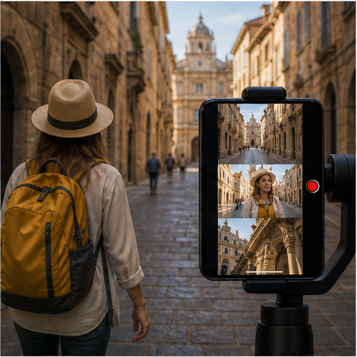

# 33. 旅行与城市叙事

> `idea_only` 图文页面。图片是概念示意，不代表已量产效果；来源链接用于理解相关技术或产品边界。

*图 33：旅行与城市叙事的概念示意。画面用于帮助理解用户最终看到的效果，不是论文原图或真实产品截图。*

## 看图理解

旅行录像可以把主体、城市、地标和路线组织成连续叙事，并跨焦段、跨片段维护色彩、构图和运动风格。

本簇收录 24 条基础 IDEA，默认真实性边界包括 faithful, generative, perceptual；代表场景：旅行, 城市, 户外, Vlog。

## 本簇 IDEA

### NATIVE-0721｜地标建筑：净景记忆录像

- **用户效果**：围绕地标建筑，保持几何、文字和人群关系；通过净景记忆实现利用真实历史帧移除短时路人。
- **核心机制**：净景记忆：利用真实历史帧移除短时路人。需要跨帧维护目标状态、遮挡关系和质量置信度。
- **手机输入**：GPS、depth、scene memory、OCR
- **适用场景**：旅行、城市、户外、Vlog
- **真实性边界**：`faithful`
- **主要风险**：时序闪烁、遮挡错误、用户控制复杂度、端侧功耗

### NATIVE-0722｜地标建筑：空间运镜录像

- **用户效果**：围绕地标建筑，保持几何、文字和人群关系；通过空间运镜实现从高分辨率和深度生成小幅机位。
- **核心机制**：空间运镜：从高分辨率和深度生成小幅机位。需要跨帧维护目标状态、遮挡关系和质量置信度。
- **手机输入**：GPS、depth、scene memory、OCR
- **适用场景**：旅行、城市、户外、Vlog
- **真实性边界**：`perceptual`
- **主要风险**：时序闪烁、遮挡错误、用户控制复杂度、端侧功耗

### NATIVE-0723｜地标建筑：天气联动编辑录像

- **用户效果**：围绕地标建筑，保持几何、文字和人群关系；通过天气联动编辑实现天空、地面和人物光照协同。
- **核心机制**：天气联动编辑：天空、地面和人物光照协同。需要跨帧维护目标状态、遮挡关系和质量置信度。
- **手机输入**：GPS、depth、scene memory、OCR
- **适用场景**：旅行、城市、户外、Vlog
- **真实性边界**：`generative`
- **主要风险**：时序闪烁、遮挡错误、用户控制复杂度、端侧功耗

### NATIVE-0724｜地标建筑：地标事实保护录像

- **用户效果**：围绕地标建筑，保持几何、文字和人群关系；通过地标事实保护实现锁定建筑、文字和标志。
- **核心机制**：地标事实保护：锁定建筑、文字和标志。需要跨帧维护目标状态、遮挡关系和质量置信度。
- **手机输入**：GPS、depth、scene memory、OCR
- **适用场景**：旅行、城市、户外、Vlog
- **真实性边界**：`faithful`
- **主要风险**：时序闪烁、遮挡错误、用户控制复杂度、端侧功耗

### NATIVE-0725｜地标建筑：自动旅行镜头组录像

- **用户效果**：围绕地标建筑，保持几何、文字和人群关系；通过自动旅行镜头组实现按地点和动作组织远中近景。
- **核心机制**：自动旅行镜头组：按地点和动作组织远中近景。需要跨帧维护目标状态、遮挡关系和质量置信度。
- **手机输入**：GPS、depth、scene memory、OCR
- **适用场景**：旅行、城市、户外、Vlog
- **真实性边界**：`perceptual`
- **主要风险**：时序闪烁、遮挡错误、用户控制复杂度、端侧功耗

### NATIVE-0726｜地标建筑：跨日外观连续录像

- **用户效果**：围绕地标建筑，保持几何、文字和人群关系；通过跨日外观连续实现统一不同地点设备和天气。
- **核心机制**：跨日外观连续：统一不同地点设备和天气。需要跨帧维护目标状态、遮挡关系和质量置信度。
- **手机输入**：GPS、depth、scene memory、OCR
- **适用场景**：旅行、城市、户外、Vlog
- **真实性边界**：`perceptual`
- **主要风险**：时序闪烁、遮挡错误、用户控制复杂度、端侧功耗

### NATIVE-0727｜自然风景：净景记忆录像

- **用户效果**：围绕自然风景，控制天空、水面、雾和光照；通过净景记忆实现利用真实历史帧移除短时路人。
- **核心机制**：净景记忆：利用真实历史帧移除短时路人。需要跨帧维护目标状态、遮挡关系和质量置信度。
- **手机输入**：GPS、depth、scene memory、OCR
- **适用场景**：旅行、城市、户外、Vlog
- **真实性边界**：`faithful`
- **主要风险**：时序闪烁、遮挡错误、用户控制复杂度、端侧功耗

### NATIVE-0728｜自然风景：空间运镜录像

- **用户效果**：围绕自然风景，控制天空、水面、雾和光照；通过空间运镜实现从高分辨率和深度生成小幅机位。
- **核心机制**：空间运镜：从高分辨率和深度生成小幅机位。需要跨帧维护目标状态、遮挡关系和质量置信度。
- **手机输入**：GPS、depth、scene memory、OCR
- **适用场景**：旅行、城市、户外、Vlog
- **真实性边界**：`perceptual`
- **主要风险**：时序闪烁、遮挡错误、用户控制复杂度、端侧功耗

### NATIVE-0729｜自然风景：天气联动编辑录像

- **用户效果**：围绕自然风景，控制天空、水面、雾和光照；通过天气联动编辑实现天空、地面和人物光照协同。
- **核心机制**：天气联动编辑：天空、地面和人物光照协同。需要跨帧维护目标状态、遮挡关系和质量置信度。
- **手机输入**：GPS、depth、scene memory、OCR
- **适用场景**：旅行、城市、户外、Vlog
- **真实性边界**：`generative`
- **主要风险**：时序闪烁、遮挡错误、用户控制复杂度、端侧功耗

### NATIVE-0730｜自然风景：地标事实保护录像

- **用户效果**：围绕自然风景，控制天空、水面、雾和光照；通过地标事实保护实现锁定建筑、文字和标志。
- **核心机制**：地标事实保护：锁定建筑、文字和标志。需要跨帧维护目标状态、遮挡关系和质量置信度。
- **手机输入**：GPS、depth、scene memory、OCR
- **适用场景**：旅行、城市、户外、Vlog
- **真实性边界**：`faithful`
- **主要风险**：时序闪烁、遮挡错误、用户控制复杂度、端侧功耗

### NATIVE-0731｜自然风景：自动旅行镜头组录像

- **用户效果**：围绕自然风景，控制天空、水面、雾和光照；通过自动旅行镜头组实现按地点和动作组织远中近景。
- **核心机制**：自动旅行镜头组：按地点和动作组织远中近景。需要跨帧维护目标状态、遮挡关系和质量置信度。
- **手机输入**：GPS、depth、scene memory、OCR
- **适用场景**：旅行、城市、户外、Vlog
- **真实性边界**：`perceptual`
- **主要风险**：时序闪烁、遮挡错误、用户控制复杂度、端侧功耗

### NATIVE-0732｜自然风景：跨日外观连续录像

- **用户效果**：围绕自然风景，控制天空、水面、雾和光照；通过跨日外观连续实现统一不同地点设备和天气。
- **核心机制**：跨日外观连续：统一不同地点设备和天气。需要跨帧维护目标状态、遮挡关系和质量置信度。
- **手机输入**：GPS、depth、scene memory、OCR
- **适用场景**：旅行、城市、户外、Vlog
- **真实性边界**：`perceptual`
- **主要风险**：时序闪烁、遮挡错误、用户控制复杂度、端侧功耗

### NATIVE-0733｜街道行进：净景记忆录像

- **用户效果**：围绕街道行进，稳定步行、路人和沿途空间；通过净景记忆实现利用真实历史帧移除短时路人。
- **核心机制**：净景记忆：利用真实历史帧移除短时路人。需要跨帧维护目标状态、遮挡关系和质量置信度。
- **手机输入**：GPS、depth、scene memory、OCR
- **适用场景**：旅行、城市、户外、Vlog
- **真实性边界**：`faithful`
- **主要风险**：时序闪烁、遮挡错误、用户控制复杂度、端侧功耗

### NATIVE-0734｜街道行进：空间运镜录像

- **用户效果**：围绕街道行进，稳定步行、路人和沿途空间；通过空间运镜实现从高分辨率和深度生成小幅机位。
- **核心机制**：空间运镜：从高分辨率和深度生成小幅机位。需要跨帧维护目标状态、遮挡关系和质量置信度。
- **手机输入**：GPS、depth、scene memory、OCR
- **适用场景**：旅行、城市、户外、Vlog
- **真实性边界**：`perceptual`
- **主要风险**：时序闪烁、遮挡错误、用户控制复杂度、端侧功耗

### NATIVE-0735｜街道行进：天气联动编辑录像

- **用户效果**：围绕街道行进，稳定步行、路人和沿途空间；通过天气联动编辑实现天空、地面和人物光照协同。
- **核心机制**：天气联动编辑：天空、地面和人物光照协同。需要跨帧维护目标状态、遮挡关系和质量置信度。
- **手机输入**：GPS、depth、scene memory、OCR
- **适用场景**：旅行、城市、户外、Vlog
- **真实性边界**：`generative`
- **主要风险**：时序闪烁、遮挡错误、用户控制复杂度、端侧功耗

### NATIVE-0736｜街道行进：地标事实保护录像

- **用户效果**：围绕街道行进，稳定步行、路人和沿途空间；通过地标事实保护实现锁定建筑、文字和标志。
- **核心机制**：地标事实保护：锁定建筑、文字和标志。需要跨帧维护目标状态、遮挡关系和质量置信度。
- **手机输入**：GPS、depth、scene memory、OCR
- **适用场景**：旅行、城市、户外、Vlog
- **真实性边界**：`faithful`
- **主要风险**：时序闪烁、遮挡错误、用户控制复杂度、端侧功耗

### NATIVE-0737｜街道行进：自动旅行镜头组录像

- **用户效果**：围绕街道行进，稳定步行、路人和沿途空间；通过自动旅行镜头组实现按地点和动作组织远中近景。
- **核心机制**：自动旅行镜头组：按地点和动作组织远中近景。需要跨帧维护目标状态、遮挡关系和质量置信度。
- **手机输入**：GPS、depth、scene memory、OCR
- **适用场景**：旅行、城市、户外、Vlog
- **真实性边界**：`perceptual`
- **主要风险**：时序闪烁、遮挡错误、用户控制复杂度、端侧功耗

### NATIVE-0738｜街道行进：跨日外观连续录像

- **用户效果**：围绕街道行进，稳定步行、路人和沿途空间；通过跨日外观连续实现统一不同地点设备和天气。
- **核心机制**：跨日外观连续：统一不同地点设备和天气。需要跨帧维护目标状态、遮挡关系和质量置信度。
- **手机输入**：GPS、depth、scene memory、OCR
- **适用场景**：旅行、城市、户外、Vlog
- **真实性边界**：`perceptual`
- **主要风险**：时序闪烁、遮挡错误、用户控制复杂度、端侧功耗

### NATIVE-0739｜行程片段：净景记忆录像

- **用户效果**：围绕行程片段，跨地点形成连贯色彩和叙事；通过净景记忆实现利用真实历史帧移除短时路人。
- **核心机制**：净景记忆：利用真实历史帧移除短时路人。需要跨帧维护目标状态、遮挡关系和质量置信度。
- **手机输入**：GPS、depth、scene memory、OCR
- **适用场景**：旅行、城市、户外、Vlog
- **真实性边界**：`faithful`
- **主要风险**：时序闪烁、遮挡错误、用户控制复杂度、端侧功耗

### NATIVE-0740｜行程片段：空间运镜录像

- **用户效果**：围绕行程片段，跨地点形成连贯色彩和叙事；通过空间运镜实现从高分辨率和深度生成小幅机位。
- **核心机制**：空间运镜：从高分辨率和深度生成小幅机位。需要跨帧维护目标状态、遮挡关系和质量置信度。
- **手机输入**：GPS、depth、scene memory、OCR
- **适用场景**：旅行、城市、户外、Vlog
- **真实性边界**：`perceptual`
- **主要风险**：时序闪烁、遮挡错误、用户控制复杂度、端侧功耗

### NATIVE-0741｜行程片段：天气联动编辑录像

- **用户效果**：围绕行程片段，跨地点形成连贯色彩和叙事；通过天气联动编辑实现天空、地面和人物光照协同。
- **核心机制**：天气联动编辑：天空、地面和人物光照协同。需要跨帧维护目标状态、遮挡关系和质量置信度。
- **手机输入**：GPS、depth、scene memory、OCR
- **适用场景**：旅行、城市、户外、Vlog
- **真实性边界**：`generative`
- **主要风险**：时序闪烁、遮挡错误、用户控制复杂度、端侧功耗

### NATIVE-0742｜行程片段：地标事实保护录像

- **用户效果**：围绕行程片段，跨地点形成连贯色彩和叙事；通过地标事实保护实现锁定建筑、文字和标志。
- **核心机制**：地标事实保护：锁定建筑、文字和标志。需要跨帧维护目标状态、遮挡关系和质量置信度。
- **手机输入**：GPS、depth、scene memory、OCR
- **适用场景**：旅行、城市、户外、Vlog
- **真实性边界**：`faithful`
- **主要风险**：时序闪烁、遮挡错误、用户控制复杂度、端侧功耗

### NATIVE-0743｜行程片段：自动旅行镜头组录像

- **用户效果**：围绕行程片段，跨地点形成连贯色彩和叙事；通过自动旅行镜头组实现按地点和动作组织远中近景。
- **核心机制**：自动旅行镜头组：按地点和动作组织远中近景。需要跨帧维护目标状态、遮挡关系和质量置信度。
- **手机输入**：GPS、depth、scene memory、OCR
- **适用场景**：旅行、城市、户外、Vlog
- **真实性边界**：`perceptual`
- **主要风险**：时序闪烁、遮挡错误、用户控制复杂度、端侧功耗

### NATIVE-0744｜行程片段：跨日外观连续录像

- **用户效果**：围绕行程片段，跨地点形成连贯色彩和叙事；通过跨日外观连续实现统一不同地点设备和天气。
- **核心机制**：跨日外观连续：统一不同地点设备和天气。需要跨帧维护目标状态、遮挡关系和质量置信度。
- **手机输入**：GPS、depth、scene memory、OCR
- **适用场景**：旅行、城市、户外、Vlog
- **真实性边界**：`perceptual`
- **主要风险**：时序闪烁、遮挡错误、用户控制复杂度、端侧功耗

## 相关来源

- **Me Mode**（E2，verified）：[外部来源](https://www.insta360.com/product/insta360-x3) / [本地缓存](../../sources/official_products/official_insta360_me_mode.html)
- **Cinematic mode**（E1，verified）：[外部来源](https://support.apple.com/en-us/HT212778) / [本地缓存](../../sources/official_products/official_apple_cinematic_mode.html)

## 阅读建议

先看图判断用户效果，再回到上面的 `idea_id` 了解处理对象和输入信号；需要落地时，再从来源、数据、时序一致性、端侧预算和真实性边界分别建立验证任务。

[返回图文图鉴总览](../手机录像后处理_IDEA图文图鉴_20260827.md)
