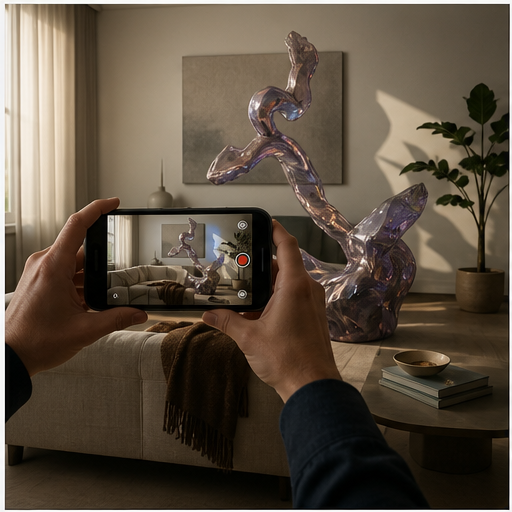

# 37. AR 与现实融合录像

> `idea_only` 图文页面。图片是概念示意，不代表已量产效果；来源链接用于理解相关技术或产品边界。

*图 37：AR 与现实融合录像的概念示意。画面用于帮助理解用户最终看到的效果，不是论文原图或真实产品截图。*

## 看图理解

AR 与现实融合录像需要稳定的空间锚点、遮挡关系、真实阴影和材质响应，否则虚拟内容会漂浮在画面上。

本簇收录 24 条基础 IDEA，默认真实性边界包括 faithful, generative, perceptual；代表场景：AR, 社交, 教育, 游戏。

## 本簇 IDEA

### NATIVE-0817｜虚拟物体：深度遮挡合成录像

- **用户效果**：围绕虚拟物体，保持遮挡、光照和接触关系；通过深度遮挡合成实现真实与虚拟对象正确遮挡。
- **核心机制**：深度遮挡合成：真实与虚拟对象正确遮挡。需要跨帧维护目标状态、遮挡关系和质量置信度。
- **手机输入**：SLAM、depth、body tracking、multi-device anchors
- **适用场景**：AR、社交、教育、游戏
- **真实性边界**：`faithful`
- **主要风险**：时序闪烁、遮挡错误、用户控制复杂度、端侧功耗

### NATIVE-0818｜虚拟物体：环境光匹配录像

- **用户效果**：围绕虚拟物体，保持遮挡、光照和接触关系；通过环境光匹配实现虚拟物体继承真实照明。
- **核心机制**：环境光匹配：虚拟物体继承真实照明。需要跨帧维护目标状态、遮挡关系和质量置信度。
- **手机输入**：SLAM、depth、body tracking、multi-device anchors
- **适用场景**：AR、社交、教育、游戏
- **真实性边界**：`perceptual`
- **主要风险**：时序闪烁、遮挡错误、用户控制复杂度、端侧功耗

### NATIVE-0819｜虚拟物体：空间锚点稳定录像

- **用户效果**：围绕虚拟物体，保持遮挡、光照和接触关系；通过空间锚点稳定实现跨帧和跨设备保持位置。
- **核心机制**：空间锚点稳定：跨帧和跨设备保持位置。需要跨帧维护目标状态、遮挡关系和质量置信度。
- **手机输入**：SLAM、depth、body tracking、multi-device anchors
- **适用场景**：AR、社交、教育、游戏
- **真实性边界**：`faithful`
- **主要风险**：时序闪烁、遮挡错误、用户控制复杂度、端侧功耗

### NATIVE-0820｜虚拟物体：物理交互模拟录像

- **用户效果**：围绕虚拟物体，保持遮挡、光照和接触关系；通过物理交互模拟实现接触、碰撞和阴影一致。
- **核心机制**：物理交互模拟：接触、碰撞和阴影一致。需要跨帧维护目标状态、遮挡关系和质量置信度。
- **手机输入**：SLAM、depth、body tracking、multi-device anchors
- **适用场景**：AR、社交、教育、游戏
- **真实性边界**：`generative`
- **主要风险**：时序闪烁、遮挡错误、用户控制复杂度、端侧功耗

### NATIVE-0821｜虚拟物体：录后虚拟元素重排录像

- **用户效果**：围绕虚拟物体，保持遮挡、光照和接触关系；通过录后虚拟元素重排实现在空间工程中重新编辑。
- **核心机制**：录后虚拟元素重排：在空间工程中重新编辑。需要跨帧维护目标状态、遮挡关系和质量置信度。
- **手机输入**：SLAM、depth、body tracking、multi-device anchors
- **适用场景**：AR、社交、教育、游戏
- **真实性边界**：`generative`
- **主要风险**：时序闪烁、遮挡错误、用户控制复杂度、端侧功耗

### NATIVE-0822｜虚拟物体：虚实区域标记录像

- **用户效果**：围绕虚拟物体，保持遮挡、光照和接触关系；通过虚实区域标记实现导出对象来源与生成信息。
- **核心机制**：虚实区域标记：导出对象来源与生成信息。需要跨帧维护目标状态、遮挡关系和质量置信度。
- **手机输入**：SLAM、depth、body tracking、multi-device anchors
- **适用场景**：AR、社交、教育、游戏
- **真实性边界**：`faithful`
- **主要风险**：时序闪烁、遮挡错误、用户控制复杂度、端侧功耗

### NATIVE-0823｜空间标注：深度遮挡合成录像

- **用户效果**：围绕空间标注，把箭头、文字和路径固定在真实位置；通过深度遮挡合成实现真实与虚拟对象正确遮挡。
- **核心机制**：深度遮挡合成：真实与虚拟对象正确遮挡。需要跨帧维护目标状态、遮挡关系和质量置信度。
- **手机输入**：SLAM、depth、body tracking、multi-device anchors
- **适用场景**：AR、社交、教育、游戏
- **真实性边界**：`faithful`
- **主要风险**：时序闪烁、遮挡错误、用户控制复杂度、端侧功耗

### NATIVE-0824｜空间标注：环境光匹配录像

- **用户效果**：围绕空间标注，把箭头、文字和路径固定在真实位置；通过环境光匹配实现虚拟物体继承真实照明。
- **核心机制**：环境光匹配：虚拟物体继承真实照明。需要跨帧维护目标状态、遮挡关系和质量置信度。
- **手机输入**：SLAM、depth、body tracking、multi-device anchors
- **适用场景**：AR、社交、教育、游戏
- **真实性边界**：`perceptual`
- **主要风险**：时序闪烁、遮挡错误、用户控制复杂度、端侧功耗

### NATIVE-0825｜空间标注：空间锚点稳定录像

- **用户效果**：围绕空间标注，把箭头、文字和路径固定在真实位置；通过空间锚点稳定实现跨帧和跨设备保持位置。
- **核心机制**：空间锚点稳定：跨帧和跨设备保持位置。需要跨帧维护目标状态、遮挡关系和质量置信度。
- **手机输入**：SLAM、depth、body tracking、multi-device anchors
- **适用场景**：AR、社交、教育、游戏
- **真实性边界**：`faithful`
- **主要风险**：时序闪烁、遮挡错误、用户控制复杂度、端侧功耗

### NATIVE-0826｜空间标注：物理交互模拟录像

- **用户效果**：围绕空间标注，把箭头、文字和路径固定在真实位置；通过物理交互模拟实现接触、碰撞和阴影一致。
- **核心机制**：物理交互模拟：接触、碰撞和阴影一致。需要跨帧维护目标状态、遮挡关系和质量置信度。
- **手机输入**：SLAM、depth、body tracking、multi-device anchors
- **适用场景**：AR、社交、教育、游戏
- **真实性边界**：`generative`
- **主要风险**：时序闪烁、遮挡错误、用户控制复杂度、端侧功耗

### NATIVE-0827｜空间标注：录后虚拟元素重排录像

- **用户效果**：围绕空间标注，把箭头、文字和路径固定在真实位置；通过录后虚拟元素重排实现在空间工程中重新编辑。
- **核心机制**：录后虚拟元素重排：在空间工程中重新编辑。需要跨帧维护目标状态、遮挡关系和质量置信度。
- **手机输入**：SLAM、depth、body tracking、multi-device anchors
- **适用场景**：AR、社交、教育、游戏
- **真实性边界**：`generative`
- **主要风险**：时序闪烁、遮挡错误、用户控制复杂度、端侧功耗

### NATIVE-0828｜空间标注：虚实区域标记录像

- **用户效果**：围绕空间标注，把箭头、文字和路径固定在真实位置；通过虚实区域标记实现导出对象来源与生成信息。
- **核心机制**：虚实区域标记：导出对象来源与生成信息。需要跨帧维护目标状态、遮挡关系和质量置信度。
- **手机输入**：SLAM、depth、body tracking、multi-device anchors
- **适用场景**：AR、社交、教育、游戏
- **真实性边界**：`faithful`
- **主要风险**：时序闪烁、遮挡错误、用户控制复杂度、端侧功耗

### NATIVE-0829｜人物特效：深度遮挡合成录像

- **用户效果**：围绕人物特效，让特效随身体、衣服和环境交互；通过深度遮挡合成实现真实与虚拟对象正确遮挡。
- **核心机制**：深度遮挡合成：真实与虚拟对象正确遮挡。需要跨帧维护目标状态、遮挡关系和质量置信度。
- **手机输入**：SLAM、depth、body tracking、multi-device anchors
- **适用场景**：AR、社交、教育、游戏
- **真实性边界**：`faithful`
- **主要风险**：时序闪烁、遮挡错误、用户控制复杂度、端侧功耗

### NATIVE-0830｜人物特效：环境光匹配录像

- **用户效果**：围绕人物特效，让特效随身体、衣服和环境交互；通过环境光匹配实现虚拟物体继承真实照明。
- **核心机制**：环境光匹配：虚拟物体继承真实照明。需要跨帧维护目标状态、遮挡关系和质量置信度。
- **手机输入**：SLAM、depth、body tracking、multi-device anchors
- **适用场景**：AR、社交、教育、游戏
- **真实性边界**：`perceptual`
- **主要风险**：时序闪烁、遮挡错误、用户控制复杂度、端侧功耗

### NATIVE-0831｜人物特效：空间锚点稳定录像

- **用户效果**：围绕人物特效，让特效随身体、衣服和环境交互；通过空间锚点稳定实现跨帧和跨设备保持位置。
- **核心机制**：空间锚点稳定：跨帧和跨设备保持位置。需要跨帧维护目标状态、遮挡关系和质量置信度。
- **手机输入**：SLAM、depth、body tracking、multi-device anchors
- **适用场景**：AR、社交、教育、游戏
- **真实性边界**：`faithful`
- **主要风险**：时序闪烁、遮挡错误、用户控制复杂度、端侧功耗

### NATIVE-0832｜人物特效：物理交互模拟录像

- **用户效果**：围绕人物特效，让特效随身体、衣服和环境交互；通过物理交互模拟实现接触、碰撞和阴影一致。
- **核心机制**：物理交互模拟：接触、碰撞和阴影一致。需要跨帧维护目标状态、遮挡关系和质量置信度。
- **手机输入**：SLAM、depth、body tracking、multi-device anchors
- **适用场景**：AR、社交、教育、游戏
- **真实性边界**：`generative`
- **主要风险**：时序闪烁、遮挡错误、用户控制复杂度、端侧功耗

### NATIVE-0833｜人物特效：录后虚拟元素重排录像

- **用户效果**：围绕人物特效，让特效随身体、衣服和环境交互；通过录后虚拟元素重排实现在空间工程中重新编辑。
- **核心机制**：录后虚拟元素重排：在空间工程中重新编辑。需要跨帧维护目标状态、遮挡关系和质量置信度。
- **手机输入**：SLAM、depth、body tracking、multi-device anchors
- **适用场景**：AR、社交、教育、游戏
- **真实性边界**：`generative`
- **主要风险**：时序闪烁、遮挡错误、用户控制复杂度、端侧功耗

### NATIVE-0834｜人物特效：虚实区域标记录像

- **用户效果**：围绕人物特效，让特效随身体、衣服和环境交互；通过虚实区域标记实现导出对象来源与生成信息。
- **核心机制**：虚实区域标记：导出对象来源与生成信息。需要跨帧维护目标状态、遮挡关系和质量置信度。
- **手机输入**：SLAM、depth、body tracking、multi-device anchors
- **适用场景**：AR、社交、教育、游戏
- **真实性边界**：`faithful`
- **主要风险**：时序闪烁、遮挡错误、用户控制复杂度、端侧功耗

### NATIVE-0835｜多人共享：深度遮挡合成录像

- **用户效果**：围绕多人共享，多个设备看到一致的虚实状态；通过深度遮挡合成实现真实与虚拟对象正确遮挡。
- **核心机制**：深度遮挡合成：真实与虚拟对象正确遮挡。需要跨帧维护目标状态、遮挡关系和质量置信度。
- **手机输入**：SLAM、depth、body tracking、multi-device anchors
- **适用场景**：AR、社交、教育、游戏
- **真实性边界**：`faithful`
- **主要风险**：时序闪烁、遮挡错误、用户控制复杂度、端侧功耗

### NATIVE-0836｜多人共享：环境光匹配录像

- **用户效果**：围绕多人共享，多个设备看到一致的虚实状态；通过环境光匹配实现虚拟物体继承真实照明。
- **核心机制**：环境光匹配：虚拟物体继承真实照明。需要跨帧维护目标状态、遮挡关系和质量置信度。
- **手机输入**：SLAM、depth、body tracking、multi-device anchors
- **适用场景**：AR、社交、教育、游戏
- **真实性边界**：`perceptual`
- **主要风险**：时序闪烁、遮挡错误、用户控制复杂度、端侧功耗

### NATIVE-0837｜多人共享：空间锚点稳定录像

- **用户效果**：围绕多人共享，多个设备看到一致的虚实状态；通过空间锚点稳定实现跨帧和跨设备保持位置。
- **核心机制**：空间锚点稳定：跨帧和跨设备保持位置。需要跨帧维护目标状态、遮挡关系和质量置信度。
- **手机输入**：SLAM、depth、body tracking、multi-device anchors
- **适用场景**：AR、社交、教育、游戏
- **真实性边界**：`faithful`
- **主要风险**：时序闪烁、遮挡错误、用户控制复杂度、端侧功耗

### NATIVE-0838｜多人共享：物理交互模拟录像

- **用户效果**：围绕多人共享，多个设备看到一致的虚实状态；通过物理交互模拟实现接触、碰撞和阴影一致。
- **核心机制**：物理交互模拟：接触、碰撞和阴影一致。需要跨帧维护目标状态、遮挡关系和质量置信度。
- **手机输入**：SLAM、depth、body tracking、multi-device anchors
- **适用场景**：AR、社交、教育、游戏
- **真实性边界**：`generative`
- **主要风险**：时序闪烁、遮挡错误、用户控制复杂度、端侧功耗

### NATIVE-0839｜多人共享：录后虚拟元素重排录像

- **用户效果**：围绕多人共享，多个设备看到一致的虚实状态；通过录后虚拟元素重排实现在空间工程中重新编辑。
- **核心机制**：录后虚拟元素重排：在空间工程中重新编辑。需要跨帧维护目标状态、遮挡关系和质量置信度。
- **手机输入**：SLAM、depth、body tracking、multi-device anchors
- **适用场景**：AR、社交、教育、游戏
- **真实性边界**：`generative`
- **主要风险**：时序闪烁、遮挡错误、用户控制复杂度、端侧功耗

### NATIVE-0840｜多人共享：虚实区域标记录像

- **用户效果**：围绕多人共享，多个设备看到一致的虚实状态；通过虚实区域标记实现导出对象来源与生成信息。
- **核心机制**：虚实区域标记：导出对象来源与生成信息。需要跨帧维护目标状态、遮挡关系和质量置信度。
- **手机输入**：SLAM、depth、body tracking、multi-device anchors
- **适用场景**：AR、社交、教育、游戏
- **真实性边界**：`faithful`
- **主要风险**：时序闪烁、遮挡错误、用户控制复杂度、端侧功耗

## 相关来源

- 本簇暂未绑定具体论文或产品来源；图像用于解释概念外观，不能作为已实现功能证据。

## 阅读建议

先看图判断用户效果，再回到上面的 `idea_id` 了解处理对象和输入信号；需要落地时，再从来源、数据、时序一致性、端侧预算和真实性边界分别建立验证任务。

[返回图文图鉴总览](../手机录像后处理_IDEA图文图鉴_20260827.md)
