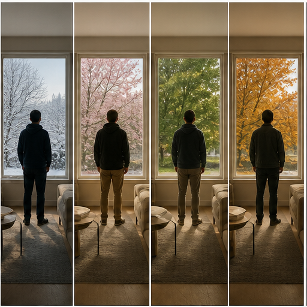

# 38. 个人记忆与长期叙事

> `idea_only` 图文页面。图片是概念示意，不代表已量产效果；来源链接用于理解相关技术或产品边界。

*图 38：个人记忆与长期叙事的概念示意。画面用于帮助理解用户最终看到的效果，不是论文原图或真实产品截图。*

## 看图理解

个人记忆录像可以跨时间、地点和季节维护人物、构图与声音线索，形成可检索、可重混、可持续更新的长期叙事资产。

本簇收录 24 条基础 IDEA，默认真实性边界包括 faithful, perceptual；代表场景：家庭, 旅行, 创作, 成长记录。

## 本簇 IDEA

### NATIVE-0841｜家庭人物：长期身份索引录像

- **用户效果**：围绕家庭人物，跨日期保持人物身份和自然外观；通过长期身份索引实现本地关联人物和宠物。
- **核心机制**：长期身份索引：本地关联人物和宠物。需要跨帧维护目标状态、遮挡关系和质量置信度。
- **手机输入**：local identity index、GPS、scene retrieval、timeline
- **适用场景**：家庭、旅行、创作、成长记录
- **真实性边界**：`faithful`
- **主要风险**：时序闪烁、遮挡错误、用户控制复杂度、端侧功耗

### NATIVE-0842｜家庭人物：地点时间对齐录像

- **用户效果**：围绕家庭人物，跨日期保持人物身份和自然外观；通过地点时间对齐实现重建相同视角的变化。
- **核心机制**：地点时间对齐：重建相同视角的变化。需要跨帧维护目标状态、遮挡关系和质量置信度。
- **手机输入**：local identity index、GPS、scene retrieval、timeline
- **适用场景**：家庭、旅行、创作、成长记录
- **真实性边界**：`faithful`
- **主要风险**：时序闪烁、遮挡错误、用户控制复杂度、端侧功耗

### NATIVE-0843｜家庭人物：自动镜头日记录像

- **用户效果**：围绕家庭人物，跨日期保持人物身份和自然外观；通过自动镜头日记实现按事件组织短片而非只按日期。
- **核心机制**：自动镜头日记：按事件组织短片而非只按日期。需要跨帧维护目标状态、遮挡关系和质量置信度。
- **手机输入**：local identity index、GPS、scene retrieval、timeline
- **适用场景**：家庭、旅行、创作、成长记录
- **真实性边界**：`perceptual`
- **主要风险**：时序闪烁、遮挡错误、用户控制复杂度、端侧功耗

### NATIVE-0844｜家庭人物：连续性检查录像

- **用户效果**：围绕家庭人物，跨日期保持人物身份和自然外观；通过连续性检查实现检测服装、物体和场景突变。
- **核心机制**：连续性检查：检测服装、物体和场景突变。需要跨帧维护目标状态、遮挡关系和质量置信度。
- **手机输入**：local identity index、GPS、scene retrieval、timeline
- **适用场景**：家庭、旅行、创作、成长记录
- **真实性边界**：`faithful`
- **主要风险**：时序闪烁、遮挡错误、用户控制复杂度、端侧功耗

### NATIVE-0845｜家庭人物：记忆风格重映录像

- **用户效果**：围绕家庭人物，跨日期保持人物身份和自然外观；通过记忆风格重映实现按用户选择统一历史外观。
- **核心机制**：记忆风格重映：按用户选择统一历史外观。需要跨帧维护目标状态、遮挡关系和质量置信度。
- **手机输入**：local identity index、GPS、scene retrieval、timeline
- **适用场景**：家庭、旅行、创作、成长记录
- **真实性边界**：`perceptual`
- **主要风险**：时序闪烁、遮挡错误、用户控制复杂度、端侧功耗

### NATIVE-0846｜家庭人物：隐私分层分享录像

- **用户效果**：围绕家庭人物，跨日期保持人物身份和自然外观；通过隐私分层分享实现按人物授权生成不同版本。
- **核心机制**：隐私分层分享：按人物授权生成不同版本。需要跨帧维护目标状态、遮挡关系和质量置信度。
- **手机输入**：local identity index、GPS、scene retrieval、timeline
- **适用场景**：家庭、旅行、创作、成长记录
- **真实性边界**：`faithful`
- **主要风险**：时序闪烁、遮挡错误、用户控制复杂度、端侧功耗

### NATIVE-0847｜地点变化：长期身份索引录像

- **用户效果**：围绕地点变化，记录同一地点的季节和时间演化；通过长期身份索引实现本地关联人物和宠物。
- **核心机制**：长期身份索引：本地关联人物和宠物。需要跨帧维护目标状态、遮挡关系和质量置信度。
- **手机输入**：local identity index、GPS、scene retrieval、timeline
- **适用场景**：家庭、旅行、创作、成长记录
- **真实性边界**：`faithful`
- **主要风险**：时序闪烁、遮挡错误、用户控制复杂度、端侧功耗

### NATIVE-0848｜地点变化：地点时间对齐录像

- **用户效果**：围绕地点变化，记录同一地点的季节和时间演化；通过地点时间对齐实现重建相同视角的变化。
- **核心机制**：地点时间对齐：重建相同视角的变化。需要跨帧维护目标状态、遮挡关系和质量置信度。
- **手机输入**：local identity index、GPS、scene retrieval、timeline
- **适用场景**：家庭、旅行、创作、成长记录
- **真实性边界**：`faithful`
- **主要风险**：时序闪烁、遮挡错误、用户控制复杂度、端侧功耗

### NATIVE-0849｜地点变化：自动镜头日记录像

- **用户效果**：围绕地点变化，记录同一地点的季节和时间演化；通过自动镜头日记实现按事件组织短片而非只按日期。
- **核心机制**：自动镜头日记：按事件组织短片而非只按日期。需要跨帧维护目标状态、遮挡关系和质量置信度。
- **手机输入**：local identity index、GPS、scene retrieval、timeline
- **适用场景**：家庭、旅行、创作、成长记录
- **真实性边界**：`perceptual`
- **主要风险**：时序闪烁、遮挡错误、用户控制复杂度、端侧功耗

### NATIVE-0850｜地点变化：连续性检查录像

- **用户效果**：围绕地点变化，记录同一地点的季节和时间演化；通过连续性检查实现检测服装、物体和场景突变。
- **核心机制**：连续性检查：检测服装、物体和场景突变。需要跨帧维护目标状态、遮挡关系和质量置信度。
- **手机输入**：local identity index、GPS、scene retrieval、timeline
- **适用场景**：家庭、旅行、创作、成长记录
- **真实性边界**：`faithful`
- **主要风险**：时序闪烁、遮挡错误、用户控制复杂度、端侧功耗

### NATIVE-0851｜地点变化：记忆风格重映录像

- **用户效果**：围绕地点变化，记录同一地点的季节和时间演化；通过记忆风格重映实现按用户选择统一历史外观。
- **核心机制**：记忆风格重映：按用户选择统一历史外观。需要跨帧维护目标状态、遮挡关系和质量置信度。
- **手机输入**：local identity index、GPS、scene retrieval、timeline
- **适用场景**：家庭、旅行、创作、成长记录
- **真实性边界**：`perceptual`
- **主要风险**：时序闪烁、遮挡错误、用户控制复杂度、端侧功耗

### NATIVE-0852｜地点变化：隐私分层分享录像

- **用户效果**：围绕地点变化，记录同一地点的季节和时间演化；通过隐私分层分享实现按人物授权生成不同版本。
- **核心机制**：隐私分层分享：按人物授权生成不同版本。需要跨帧维护目标状态、遮挡关系和质量置信度。
- **手机输入**：local identity index、GPS、scene retrieval、timeline
- **适用场景**：家庭、旅行、创作、成长记录
- **真实性边界**：`faithful`
- **主要风险**：时序闪烁、遮挡错误、用户控制复杂度、端侧功耗

### NATIVE-0853｜成长过程：长期身份索引录像

- **用户效果**：围绕成长过程，自动关联儿童、宠物和重要事件；通过长期身份索引实现本地关联人物和宠物。
- **核心机制**：长期身份索引：本地关联人物和宠物。需要跨帧维护目标状态、遮挡关系和质量置信度。
- **手机输入**：local identity index、GPS、scene retrieval、timeline
- **适用场景**：家庭、旅行、创作、成长记录
- **真实性边界**：`faithful`
- **主要风险**：时序闪烁、遮挡错误、用户控制复杂度、端侧功耗

### NATIVE-0854｜成长过程：地点时间对齐录像

- **用户效果**：围绕成长过程，自动关联儿童、宠物和重要事件；通过地点时间对齐实现重建相同视角的变化。
- **核心机制**：地点时间对齐：重建相同视角的变化。需要跨帧维护目标状态、遮挡关系和质量置信度。
- **手机输入**：local identity index、GPS、scene retrieval、timeline
- **适用场景**：家庭、旅行、创作、成长记录
- **真实性边界**：`faithful`
- **主要风险**：时序闪烁、遮挡错误、用户控制复杂度、端侧功耗

### NATIVE-0855｜成长过程：自动镜头日记录像

- **用户效果**：围绕成长过程，自动关联儿童、宠物和重要事件；通过自动镜头日记实现按事件组织短片而非只按日期。
- **核心机制**：自动镜头日记：按事件组织短片而非只按日期。需要跨帧维护目标状态、遮挡关系和质量置信度。
- **手机输入**：local identity index、GPS、scene retrieval、timeline
- **适用场景**：家庭、旅行、创作、成长记录
- **真实性边界**：`perceptual`
- **主要风险**：时序闪烁、遮挡错误、用户控制复杂度、端侧功耗

### NATIVE-0856｜成长过程：连续性检查录像

- **用户效果**：围绕成长过程，自动关联儿童、宠物和重要事件；通过连续性检查实现检测服装、物体和场景突变。
- **核心机制**：连续性检查：检测服装、物体和场景突变。需要跨帧维护目标状态、遮挡关系和质量置信度。
- **手机输入**：local identity index、GPS、scene retrieval、timeline
- **适用场景**：家庭、旅行、创作、成长记录
- **真实性边界**：`faithful`
- **主要风险**：时序闪烁、遮挡错误、用户控制复杂度、端侧功耗

### NATIVE-0857｜成长过程：记忆风格重映录像

- **用户效果**：围绕成长过程，自动关联儿童、宠物和重要事件；通过记忆风格重映实现按用户选择统一历史外观。
- **核心机制**：记忆风格重映：按用户选择统一历史外观。需要跨帧维护目标状态、遮挡关系和质量置信度。
- **手机输入**：local identity index、GPS、scene retrieval、timeline
- **适用场景**：家庭、旅行、创作、成长记录
- **真实性边界**：`perceptual`
- **主要风险**：时序闪烁、遮挡错误、用户控制复杂度、端侧功耗

### NATIVE-0858｜成长过程：隐私分层分享录像

- **用户效果**：围绕成长过程，自动关联儿童、宠物和重要事件；通过隐私分层分享实现按人物授权生成不同版本。
- **核心机制**：隐私分层分享：按人物授权生成不同版本。需要跨帧维护目标状态、遮挡关系和质量置信度。
- **手机输入**：local identity index、GPS、scene retrieval、timeline
- **适用场景**：家庭、旅行、创作、成长记录
- **真实性边界**：`faithful`
- **主要风险**：时序闪烁、遮挡错误、用户控制复杂度、端侧功耗

### NATIVE-0859｜创作项目：长期身份索引录像

- **用户效果**：围绕创作项目，保持角色、道具、色彩和镜头连续；通过长期身份索引实现本地关联人物和宠物。
- **核心机制**：长期身份索引：本地关联人物和宠物。需要跨帧维护目标状态、遮挡关系和质量置信度。
- **手机输入**：local identity index、GPS、scene retrieval、timeline
- **适用场景**：家庭、旅行、创作、成长记录
- **真实性边界**：`faithful`
- **主要风险**：时序闪烁、遮挡错误、用户控制复杂度、端侧功耗

### NATIVE-0860｜创作项目：地点时间对齐录像

- **用户效果**：围绕创作项目，保持角色、道具、色彩和镜头连续；通过地点时间对齐实现重建相同视角的变化。
- **核心机制**：地点时间对齐：重建相同视角的变化。需要跨帧维护目标状态、遮挡关系和质量置信度。
- **手机输入**：local identity index、GPS、scene retrieval、timeline
- **适用场景**：家庭、旅行、创作、成长记录
- **真实性边界**：`faithful`
- **主要风险**：时序闪烁、遮挡错误、用户控制复杂度、端侧功耗

### NATIVE-0861｜创作项目：自动镜头日记录像

- **用户效果**：围绕创作项目，保持角色、道具、色彩和镜头连续；通过自动镜头日记实现按事件组织短片而非只按日期。
- **核心机制**：自动镜头日记：按事件组织短片而非只按日期。需要跨帧维护目标状态、遮挡关系和质量置信度。
- **手机输入**：local identity index、GPS、scene retrieval、timeline
- **适用场景**：家庭、旅行、创作、成长记录
- **真实性边界**：`perceptual`
- **主要风险**：时序闪烁、遮挡错误、用户控制复杂度、端侧功耗

### NATIVE-0862｜创作项目：连续性检查录像

- **用户效果**：围绕创作项目，保持角色、道具、色彩和镜头连续；通过连续性检查实现检测服装、物体和场景突变。
- **核心机制**：连续性检查：检测服装、物体和场景突变。需要跨帧维护目标状态、遮挡关系和质量置信度。
- **手机输入**：local identity index、GPS、scene retrieval、timeline
- **适用场景**：家庭、旅行、创作、成长记录
- **真实性边界**：`faithful`
- **主要风险**：时序闪烁、遮挡错误、用户控制复杂度、端侧功耗

### NATIVE-0863｜创作项目：记忆风格重映录像

- **用户效果**：围绕创作项目，保持角色、道具、色彩和镜头连续；通过记忆风格重映实现按用户选择统一历史外观。
- **核心机制**：记忆风格重映：按用户选择统一历史外观。需要跨帧维护目标状态、遮挡关系和质量置信度。
- **手机输入**：local identity index、GPS、scene retrieval、timeline
- **适用场景**：家庭、旅行、创作、成长记录
- **真实性边界**：`perceptual`
- **主要风险**：时序闪烁、遮挡错误、用户控制复杂度、端侧功耗

### NATIVE-0864｜创作项目：隐私分层分享录像

- **用户效果**：围绕创作项目，保持角色、道具、色彩和镜头连续；通过隐私分层分享实现按人物授权生成不同版本。
- **核心机制**：隐私分层分享：按人物授权生成不同版本。需要跨帧维护目标状态、遮挡关系和质量置信度。
- **手机输入**：local identity index、GPS、scene retrieval、timeline
- **适用场景**：家庭、旅行、创作、成长记录
- **真实性边界**：`faithful`
- **主要风险**：时序闪烁、遮挡错误、用户控制复杂度、端侧功耗

## 相关来源

- **Single Take**（E2，verified）：[外部来源](https://www.samsung.com/us/support/answer/ANS00087284/) / [本地缓存](../../sources/official_products/official_samsung_single_take.html)
- **Cinematic mode**（E1，verified）：[外部来源](https://support.apple.com/en-us/HT212778) / [本地缓存](../../sources/official_products/official_apple_cinematic_mode.html)

## 阅读建议

先看图判断用户效果，再回到上面的 `idea_id` 了解处理对象和输入信号；需要落地时，再从来源、数据、时序一致性、端侧预算和真实性边界分别建立验证任务。

[返回图文图鉴总览](../手机录像后处理_IDEA图文图鉴_20260827.md)
