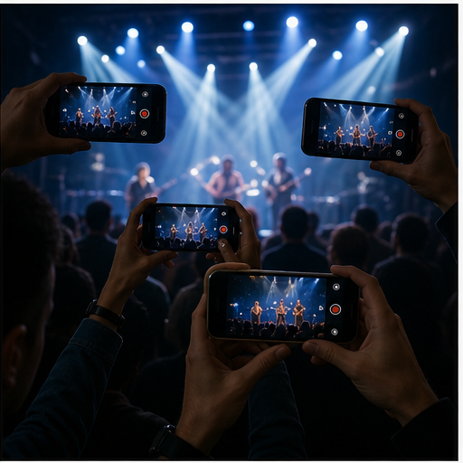

# 39. 协同拍摄与群体录像

> `idea_only` 图文页面。图片是概念示意，不代表已量产效果；来源链接用于理解相关技术或产品边界。

*图 39：协同拍摄与群体录像的概念示意。画面用于帮助理解用户最终看到的效果，不是论文原图或真实产品截图。*

## 看图理解

多设备协同的重点是时间码、颜色、位姿、主体轨迹、声音和导播策略共享，让多部手机像一台分布式电影机。

本簇收录 24 条基础 IDEA，默认真实性边界包括 faithful, generative, perceptual；代表场景：活动, 体育, 旅行, 采访。

## 本簇 IDEA

### NATIVE-0865｜同一活动：时间码同步录像

- **用户效果**：围绕同一活动，多个手机共同覆盖舞台、观众和环境；通过时间码同步实现通过音频、UWB 和网络对齐。
- **核心机制**：时间码同步：通过音频、UWB 和网络对齐。需要跨帧维护目标状态、遮挡关系和质量置信度。
- **手机输入**：UWB、network time、multi-camera、audio sync
- **适用场景**：活动、体育、旅行、采访
- **真实性边界**：`faithful`
- **主要风险**：时序闪烁、遮挡错误、用户控制复杂度、端侧功耗

### NATIVE-0866｜同一活动：共享主体轨迹录像

- **用户效果**：围绕同一活动，多个手机共同覆盖舞台、观众和环境；通过共享主体轨迹实现跨设备维持同一人物和物体 ID。
- **核心机制**：共享主体轨迹：跨设备维持同一人物和物体 ID。需要跨帧维护目标状态、遮挡关系和质量置信度。
- **手机输入**：UWB、network time、multi-camera、audio sync
- **适用场景**：活动、体育、旅行、采访
- **真实性边界**：`faithful`
- **主要风险**：时序闪烁、遮挡错误、用户控制复杂度、端侧功耗

### NATIVE-0867｜同一活动：自动最佳机位录像

- **用户效果**：围绕同一活动，多个手机共同覆盖舞台、观众和环境；通过自动最佳机位实现按遮挡、清晰度和构图选择。
- **核心机制**：自动最佳机位：按遮挡、清晰度和构图选择。需要跨帧维护目标状态、遮挡关系和质量置信度。
- **手机输入**：UWB、network time、multi-camera、audio sync
- **适用场景**：活动、体育、旅行、采访
- **真实性边界**：`faithful`
- **主要风险**：时序闪烁、遮挡错误、用户控制复杂度、端侧功耗

### NATIVE-0868｜同一活动：跨设备色彩母版录像

- **用户效果**：围绕同一活动，多个手机共同覆盖舞台、观众和环境；通过跨设备色彩母版实现统一相机和曝光风格。
- **核心机制**：跨设备色彩母版：统一相机和曝光风格。需要跨帧维护目标状态、遮挡关系和质量置信度。
- **手机输入**：UWB、network time、multi-camera、audio sync
- **适用场景**：活动、体育、旅行、采访
- **真实性边界**：`faithful`
- **主要风险**：时序闪烁、遮挡错误、用户控制复杂度、端侧功耗

### NATIVE-0869｜同一活动：空间声场合成录像

- **用户效果**：围绕同一活动，多个手机共同覆盖舞台、观众和环境；通过空间声场合成实现合并多个麦克风视角。
- **核心机制**：空间声场合成：合并多个麦克风视角。需要跨帧维护目标状态、遮挡关系和质量置信度。
- **手机输入**：UWB、network time、multi-camera、audio sync
- **适用场景**：活动、体育、旅行、采访
- **真实性边界**：`perceptual`
- **主要风险**：时序闪烁、遮挡错误、用户控制复杂度、端侧功耗

### NATIVE-0870｜同一活动：协同三维重构录像

- **用户效果**：围绕同一活动，多个手机共同覆盖舞台、观众和环境；通过协同三维重构实现利用多视角生成空间录像。
- **核心机制**：协同三维重构：利用多视角生成空间录像。需要跨帧维护目标状态、遮挡关系和质量置信度。
- **手机输入**：UWB、network time、multi-camera、audio sync
- **适用场景**：活动、体育、旅行、采访
- **真实性边界**：`generative`
- **主要风险**：时序闪烁、遮挡错误、用户控制复杂度、端侧功耗

### NATIVE-0871｜体育比赛：时间码同步录像

- **用户效果**：围绕体育比赛，多视角覆盖运动员、球和比分区域；通过时间码同步实现通过音频、UWB 和网络对齐。
- **核心机制**：时间码同步：通过音频、UWB 和网络对齐。需要跨帧维护目标状态、遮挡关系和质量置信度。
- **手机输入**：UWB、network time、multi-camera、audio sync
- **适用场景**：活动、体育、旅行、采访
- **真实性边界**：`faithful`
- **主要风险**：时序闪烁、遮挡错误、用户控制复杂度、端侧功耗

### NATIVE-0872｜体育比赛：共享主体轨迹录像

- **用户效果**：围绕体育比赛，多视角覆盖运动员、球和比分区域；通过共享主体轨迹实现跨设备维持同一人物和物体 ID。
- **核心机制**：共享主体轨迹：跨设备维持同一人物和物体 ID。需要跨帧维护目标状态、遮挡关系和质量置信度。
- **手机输入**：UWB、network time、multi-camera、audio sync
- **适用场景**：活动、体育、旅行、采访
- **真实性边界**：`faithful`
- **主要风险**：时序闪烁、遮挡错误、用户控制复杂度、端侧功耗

### NATIVE-0873｜体育比赛：自动最佳机位录像

- **用户效果**：围绕体育比赛，多视角覆盖运动员、球和比分区域；通过自动最佳机位实现按遮挡、清晰度和构图选择。
- **核心机制**：自动最佳机位：按遮挡、清晰度和构图选择。需要跨帧维护目标状态、遮挡关系和质量置信度。
- **手机输入**：UWB、network time、multi-camera、audio sync
- **适用场景**：活动、体育、旅行、采访
- **真实性边界**：`faithful`
- **主要风险**：时序闪烁、遮挡错误、用户控制复杂度、端侧功耗

### NATIVE-0874｜体育比赛：跨设备色彩母版录像

- **用户效果**：围绕体育比赛，多视角覆盖运动员、球和比分区域；通过跨设备色彩母版实现统一相机和曝光风格。
- **核心机制**：跨设备色彩母版：统一相机和曝光风格。需要跨帧维护目标状态、遮挡关系和质量置信度。
- **手机输入**：UWB、network time、multi-camera、audio sync
- **适用场景**：活动、体育、旅行、采访
- **真实性边界**：`faithful`
- **主要风险**：时序闪烁、遮挡错误、用户控制复杂度、端侧功耗

### NATIVE-0875｜体育比赛：空间声场合成录像

- **用户效果**：围绕体育比赛，多视角覆盖运动员、球和比分区域；通过空间声场合成实现合并多个麦克风视角。
- **核心机制**：空间声场合成：合并多个麦克风视角。需要跨帧维护目标状态、遮挡关系和质量置信度。
- **手机输入**：UWB、network time、multi-camera、audio sync
- **适用场景**：活动、体育、旅行、采访
- **真实性边界**：`perceptual`
- **主要风险**：时序闪烁、遮挡错误、用户控制复杂度、端侧功耗

### NATIVE-0876｜体育比赛：协同三维重构录像

- **用户效果**：围绕体育比赛，多视角覆盖运动员、球和比分区域；通过协同三维重构实现利用多视角生成空间录像。
- **核心机制**：协同三维重构：利用多视角生成空间录像。需要跨帧维护目标状态、遮挡关系和质量置信度。
- **手机输入**：UWB、network time、multi-camera、audio sync
- **适用场景**：活动、体育、旅行、采访
- **真实性边界**：`generative`
- **主要风险**：时序闪烁、遮挡错误、用户控制复杂度、端侧功耗

### NATIVE-0877｜旅行同行：时间码同步录像

- **用户效果**：围绕旅行同行，自动合并不同人的视角和声音；通过时间码同步实现通过音频、UWB 和网络对齐。
- **核心机制**：时间码同步：通过音频、UWB 和网络对齐。需要跨帧维护目标状态、遮挡关系和质量置信度。
- **手机输入**：UWB、network time、multi-camera、audio sync
- **适用场景**：活动、体育、旅行、采访
- **真实性边界**：`faithful`
- **主要风险**：时序闪烁、遮挡错误、用户控制复杂度、端侧功耗

### NATIVE-0878｜旅行同行：共享主体轨迹录像

- **用户效果**：围绕旅行同行，自动合并不同人的视角和声音；通过共享主体轨迹实现跨设备维持同一人物和物体 ID。
- **核心机制**：共享主体轨迹：跨设备维持同一人物和物体 ID。需要跨帧维护目标状态、遮挡关系和质量置信度。
- **手机输入**：UWB、network time、multi-camera、audio sync
- **适用场景**：活动、体育、旅行、采访
- **真实性边界**：`faithful`
- **主要风险**：时序闪烁、遮挡错误、用户控制复杂度、端侧功耗

### NATIVE-0879｜旅行同行：自动最佳机位录像

- **用户效果**：围绕旅行同行，自动合并不同人的视角和声音；通过自动最佳机位实现按遮挡、清晰度和构图选择。
- **核心机制**：自动最佳机位：按遮挡、清晰度和构图选择。需要跨帧维护目标状态、遮挡关系和质量置信度。
- **手机输入**：UWB、network time、multi-camera、audio sync
- **适用场景**：活动、体育、旅行、采访
- **真实性边界**：`faithful`
- **主要风险**：时序闪烁、遮挡错误、用户控制复杂度、端侧功耗

### NATIVE-0880｜旅行同行：跨设备色彩母版录像

- **用户效果**：围绕旅行同行，自动合并不同人的视角和声音；通过跨设备色彩母版实现统一相机和曝光风格。
- **核心机制**：跨设备色彩母版：统一相机和曝光风格。需要跨帧维护目标状态、遮挡关系和质量置信度。
- **手机输入**：UWB、network time、multi-camera、audio sync
- **适用场景**：活动、体育、旅行、采访
- **真实性边界**：`faithful`
- **主要风险**：时序闪烁、遮挡错误、用户控制复杂度、端侧功耗

### NATIVE-0881｜旅行同行：空间声场合成录像

- **用户效果**：围绕旅行同行，自动合并不同人的视角和声音；通过空间声场合成实现合并多个麦克风视角。
- **核心机制**：空间声场合成：合并多个麦克风视角。需要跨帧维护目标状态、遮挡关系和质量置信度。
- **手机输入**：UWB、network time、multi-camera、audio sync
- **适用场景**：活动、体育、旅行、采访
- **真实性边界**：`perceptual`
- **主要风险**：时序闪烁、遮挡错误、用户控制复杂度、端侧功耗

### NATIVE-0882｜旅行同行：协同三维重构录像

- **用户效果**：围绕旅行同行，自动合并不同人的视角和声音；通过协同三维重构实现利用多视角生成空间录像。
- **核心机制**：协同三维重构：利用多视角生成空间录像。需要跨帧维护目标状态、遮挡关系和质量置信度。
- **手机输入**：UWB、network time、multi-camera、audio sync
- **适用场景**：活动、体育、旅行、采访
- **真实性边界**：`generative`
- **主要风险**：时序闪烁、遮挡错误、用户控制复杂度、端侧功耗

### NATIVE-0883｜采访制作：时间码同步录像

- **用户效果**：围绕采访制作，主机位、侧机位和环境机位协同；通过时间码同步实现通过音频、UWB 和网络对齐。
- **核心机制**：时间码同步：通过音频、UWB 和网络对齐。需要跨帧维护目标状态、遮挡关系和质量置信度。
- **手机输入**：UWB、network time、multi-camera、audio sync
- **适用场景**：活动、体育、旅行、采访
- **真实性边界**：`faithful`
- **主要风险**：时序闪烁、遮挡错误、用户控制复杂度、端侧功耗

### NATIVE-0884｜采访制作：共享主体轨迹录像

- **用户效果**：围绕采访制作，主机位、侧机位和环境机位协同；通过共享主体轨迹实现跨设备维持同一人物和物体 ID。
- **核心机制**：共享主体轨迹：跨设备维持同一人物和物体 ID。需要跨帧维护目标状态、遮挡关系和质量置信度。
- **手机输入**：UWB、network time、multi-camera、audio sync
- **适用场景**：活动、体育、旅行、采访
- **真实性边界**：`faithful`
- **主要风险**：时序闪烁、遮挡错误、用户控制复杂度、端侧功耗

### NATIVE-0885｜采访制作：自动最佳机位录像

- **用户效果**：围绕采访制作，主机位、侧机位和环境机位协同；通过自动最佳机位实现按遮挡、清晰度和构图选择。
- **核心机制**：自动最佳机位：按遮挡、清晰度和构图选择。需要跨帧维护目标状态、遮挡关系和质量置信度。
- **手机输入**：UWB、network time、multi-camera、audio sync
- **适用场景**：活动、体育、旅行、采访
- **真实性边界**：`faithful`
- **主要风险**：时序闪烁、遮挡错误、用户控制复杂度、端侧功耗

### NATIVE-0886｜采访制作：跨设备色彩母版录像

- **用户效果**：围绕采访制作，主机位、侧机位和环境机位协同；通过跨设备色彩母版实现统一相机和曝光风格。
- **核心机制**：跨设备色彩母版：统一相机和曝光风格。需要跨帧维护目标状态、遮挡关系和质量置信度。
- **手机输入**：UWB、network time、multi-camera、audio sync
- **适用场景**：活动、体育、旅行、采访
- **真实性边界**：`faithful`
- **主要风险**：时序闪烁、遮挡错误、用户控制复杂度、端侧功耗

### NATIVE-0887｜采访制作：空间声场合成录像

- **用户效果**：围绕采访制作，主机位、侧机位和环境机位协同；通过空间声场合成实现合并多个麦克风视角。
- **核心机制**：空间声场合成：合并多个麦克风视角。需要跨帧维护目标状态、遮挡关系和质量置信度。
- **手机输入**：UWB、network time、multi-camera、audio sync
- **适用场景**：活动、体育、旅行、采访
- **真实性边界**：`perceptual`
- **主要风险**：时序闪烁、遮挡错误、用户控制复杂度、端侧功耗

### NATIVE-0888｜采访制作：协同三维重构录像

- **用户效果**：围绕采访制作，主机位、侧机位和环境机位协同；通过协同三维重构实现利用多视角生成空间录像。
- **核心机制**：协同三维重构：利用多视角生成空间录像。需要跨帧维护目标状态、遮挡关系和质量置信度。
- **手机输入**：UWB、network time、multi-camera、audio sync
- **适用场景**：活动、体育、旅行、采访
- **真实性边界**：`generative`
- **主要风险**：时序闪烁、遮挡错误、用户控制复杂度、端侧功耗

## 相关来源

- **Me Mode**（E2，verified）：[外部来源](https://www.insta360.com/product/insta360-x3) / [本地缓存](../../sources/official_products/official_insta360_me_mode.html)
- **Single Take**（E2，verified）：[外部来源](https://www.samsung.com/us/support/answer/ANS00087284/) / [本地缓存](../../sources/official_products/official_samsung_single_take.html)

## 阅读建议

先看图判断用户效果，再回到上面的 `idea_id` 了解处理对象和输入信号；需要落地时，再从来源、数据、时序一致性、端侧预算和真实性边界分别建立验证任务。

[返回图文图鉴总览](../手机录像后处理_IDEA图文图鉴_20260827.md)
