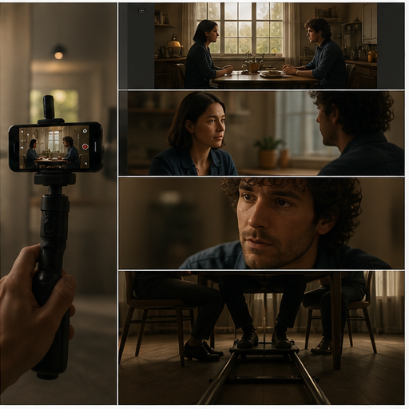

# 42. 电影镜头语言辅助

> `idea_only` 图文页面。图片是概念示意，不代表已量产效果；来源链接用于理解相关技术或产品边界。

*图 42：电影镜头语言辅助的概念示意。画面用于帮助理解用户最终看到的效果，不是论文原图或真实产品截图。*

## 看图理解

手机录像可以提供镜头语言辅助：景别、视线、推拉、滑轨、环绕、节奏和反应镜头被作为可编辑的拍摄意图。

本簇收录 24 条基础 IDEA，默认真实性边界包括 faithful, generative, perceptual；代表场景：短片, 采访, 旅行, 家庭。

## 本簇 IDEA

### NATIVE-0937｜人物对话：运镜语法识别录像

- **用户效果**：围绕人物对话，规划正反打、反应和景别变化；通过运镜语法识别实现识别推拉摇移跟升降环绕。
- **核心机制**：运镜语法识别：识别推拉摇移跟升降环绕。需要跨帧维护目标状态、遮挡关系和质量置信度。
- **手机输入**：scene graph、body gaze、camera pose、editing history
- **适用场景**：短片、采访、旅行、家庭
- **真实性边界**：`faithful`
- **主要风险**：时序闪烁、遮挡错误、用户控制复杂度、端侧功耗

### NATIVE-0938｜人物对话：镜头意图建议录像

- **用户效果**：围绕人物对话，规划正反打、反应和景别变化；通过镜头意图建议实现根据场景推荐下一镜头。
- **核心机制**：镜头意图建议：根据场景推荐下一镜头。需要跨帧维护目标状态、遮挡关系和质量置信度。
- **手机输入**：scene graph、body gaze、camera pose、editing history
- **适用场景**：短片、采访、旅行、家庭
- **真实性边界**：`perceptual`
- **主要风险**：时序闪烁、遮挡错误、用户控制复杂度、端侧功耗

### NATIVE-0939｜人物对话：连续性守护录像

- **用户效果**：围绕人物对话，规划正反打、反应和景别变化；通过连续性守护实现检查视线、方向和轴线。
- **核心机制**：连续性守护：检查视线、方向和轴线。需要跨帧维护目标状态、遮挡关系和质量置信度。
- **手机输入**：scene graph、body gaze、camera pose、editing history
- **适用场景**：短片、采访、旅行、家庭
- **真实性边界**：`faithful`
- **主要风险**：时序闪烁、遮挡错误、用户控制复杂度、端侧功耗

### NATIVE-0940｜人物对话：自动镜头组录像

- **用户效果**：围绕人物对话，规划正反打、反应和景别变化；通过自动镜头组实现从长素材生成镜头组合。
- **核心机制**：自动镜头组：从长素材生成镜头组合。需要跨帧维护目标状态、遮挡关系和质量置信度。
- **手机输入**：scene graph、body gaze、camera pose、editing history
- **适用场景**：短片、采访、旅行、家庭
- **真实性边界**：`perceptual`
- **主要风险**：时序闪烁、遮挡错误、用户控制复杂度、端侧功耗

### NATIVE-0941｜人物对话：受约束镜头补拍录像

- **用户效果**：围绕人物对话，规划正反打、反应和景别变化；通过受约束镜头补拍实现生成缺失的小幅过渡镜头。
- **核心机制**：受约束镜头补拍：生成缺失的小幅过渡镜头。需要跨帧维护目标状态、遮挡关系和质量置信度。
- **手机输入**：scene graph、body gaze、camera pose、editing history
- **适用场景**：短片、采访、旅行、家庭
- **真实性边界**：`generative`
- **主要风险**：时序闪烁、遮挡错误、用户控制复杂度、端侧功耗

### NATIVE-0942｜人物对话：摄影风格记忆录像

- **用户效果**：围绕人物对话，规划正反打、反应和景别变化；通过摄影风格记忆实现学习个人构图和运动偏好。
- **核心机制**：摄影风格记忆：学习个人构图和运动偏好。需要跨帧维护目标状态、遮挡关系和质量置信度。
- **手机输入**：scene graph、body gaze、camera pose、editing history
- **适用场景**：短片、采访、旅行、家庭
- **真实性边界**：`perceptual`
- **主要风险**：时序闪烁、遮挡错误、用户控制复杂度、端侧功耗

### NATIVE-0943｜动作场面：运镜语法识别录像

- **用户效果**：围绕动作场面，规划跟拍、甩镜和慢动作节点；通过运镜语法识别实现识别推拉摇移跟升降环绕。
- **核心机制**：运镜语法识别：识别推拉摇移跟升降环绕。需要跨帧维护目标状态、遮挡关系和质量置信度。
- **手机输入**：scene graph、body gaze、camera pose、editing history
- **适用场景**：短片、采访、旅行、家庭
- **真实性边界**：`faithful`
- **主要风险**：时序闪烁、遮挡错误、用户控制复杂度、端侧功耗

### NATIVE-0944｜动作场面：镜头意图建议录像

- **用户效果**：围绕动作场面，规划跟拍、甩镜和慢动作节点；通过镜头意图建议实现根据场景推荐下一镜头。
- **核心机制**：镜头意图建议：根据场景推荐下一镜头。需要跨帧维护目标状态、遮挡关系和质量置信度。
- **手机输入**：scene graph、body gaze、camera pose、editing history
- **适用场景**：短片、采访、旅行、家庭
- **真实性边界**：`perceptual`
- **主要风险**：时序闪烁、遮挡错误、用户控制复杂度、端侧功耗

### NATIVE-0945｜动作场面：连续性守护录像

- **用户效果**：围绕动作场面，规划跟拍、甩镜和慢动作节点；通过连续性守护实现检查视线、方向和轴线。
- **核心机制**：连续性守护：检查视线、方向和轴线。需要跨帧维护目标状态、遮挡关系和质量置信度。
- **手机输入**：scene graph、body gaze、camera pose、editing history
- **适用场景**：短片、采访、旅行、家庭
- **真实性边界**：`faithful`
- **主要风险**：时序闪烁、遮挡错误、用户控制复杂度、端侧功耗

### NATIVE-0946｜动作场面：自动镜头组录像

- **用户效果**：围绕动作场面，规划跟拍、甩镜和慢动作节点；通过自动镜头组实现从长素材生成镜头组合。
- **核心机制**：自动镜头组：从长素材生成镜头组合。需要跨帧维护目标状态、遮挡关系和质量置信度。
- **手机输入**：scene graph、body gaze、camera pose、editing history
- **适用场景**：短片、采访、旅行、家庭
- **真实性边界**：`perceptual`
- **主要风险**：时序闪烁、遮挡错误、用户控制复杂度、端侧功耗

### NATIVE-0947｜动作场面：受约束镜头补拍录像

- **用户效果**：围绕动作场面，规划跟拍、甩镜和慢动作节点；通过受约束镜头补拍实现生成缺失的小幅过渡镜头。
- **核心机制**：受约束镜头补拍：生成缺失的小幅过渡镜头。需要跨帧维护目标状态、遮挡关系和质量置信度。
- **手机输入**：scene graph、body gaze、camera pose、editing history
- **适用场景**：短片、采访、旅行、家庭
- **真实性边界**：`generative`
- **主要风险**：时序闪烁、遮挡错误、用户控制复杂度、端侧功耗

### NATIVE-0948｜动作场面：摄影风格记忆录像

- **用户效果**：围绕动作场面，规划跟拍、甩镜和慢动作节点；通过摄影风格记忆实现学习个人构图和运动偏好。
- **核心机制**：摄影风格记忆：学习个人构图和运动偏好。需要跨帧维护目标状态、遮挡关系和质量置信度。
- **手机输入**：scene graph、body gaze、camera pose、editing history
- **适用场景**：短片、采访、旅行、家庭
- **真实性边界**：`perceptual`
- **主要风险**：时序闪烁、遮挡错误、用户控制复杂度、端侧功耗

### NATIVE-0949｜空间建立：运镜语法识别录像

- **用户效果**：围绕空间建立，生成建立镜头、过肩和细节关系；通过运镜语法识别实现识别推拉摇移跟升降环绕。
- **核心机制**：运镜语法识别：识别推拉摇移跟升降环绕。需要跨帧维护目标状态、遮挡关系和质量置信度。
- **手机输入**：scene graph、body gaze、camera pose、editing history
- **适用场景**：短片、采访、旅行、家庭
- **真实性边界**：`faithful`
- **主要风险**：时序闪烁、遮挡错误、用户控制复杂度、端侧功耗

### NATIVE-0950｜空间建立：镜头意图建议录像

- **用户效果**：围绕空间建立，生成建立镜头、过肩和细节关系；通过镜头意图建议实现根据场景推荐下一镜头。
- **核心机制**：镜头意图建议：根据场景推荐下一镜头。需要跨帧维护目标状态、遮挡关系和质量置信度。
- **手机输入**：scene graph、body gaze、camera pose、editing history
- **适用场景**：短片、采访、旅行、家庭
- **真实性边界**：`perceptual`
- **主要风险**：时序闪烁、遮挡错误、用户控制复杂度、端侧功耗

### NATIVE-0951｜空间建立：连续性守护录像

- **用户效果**：围绕空间建立，生成建立镜头、过肩和细节关系；通过连续性守护实现检查视线、方向和轴线。
- **核心机制**：连续性守护：检查视线、方向和轴线。需要跨帧维护目标状态、遮挡关系和质量置信度。
- **手机输入**：scene graph、body gaze、camera pose、editing history
- **适用场景**：短片、采访、旅行、家庭
- **真实性边界**：`faithful`
- **主要风险**：时序闪烁、遮挡错误、用户控制复杂度、端侧功耗

### NATIVE-0952｜空间建立：自动镜头组录像

- **用户效果**：围绕空间建立，生成建立镜头、过肩和细节关系；通过自动镜头组实现从长素材生成镜头组合。
- **核心机制**：自动镜头组：从长素材生成镜头组合。需要跨帧维护目标状态、遮挡关系和质量置信度。
- **手机输入**：scene graph、body gaze、camera pose、editing history
- **适用场景**：短片、采访、旅行、家庭
- **真实性边界**：`perceptual`
- **主要风险**：时序闪烁、遮挡错误、用户控制复杂度、端侧功耗

### NATIVE-0953｜空间建立：受约束镜头补拍录像

- **用户效果**：围绕空间建立，生成建立镜头、过肩和细节关系；通过受约束镜头补拍实现生成缺失的小幅过渡镜头。
- **核心机制**：受约束镜头补拍：生成缺失的小幅过渡镜头。需要跨帧维护目标状态、遮挡关系和质量置信度。
- **手机输入**：scene graph、body gaze、camera pose、editing history
- **适用场景**：短片、采访、旅行、家庭
- **真实性边界**：`generative`
- **主要风险**：时序闪烁、遮挡错误、用户控制复杂度、端侧功耗

### NATIVE-0954｜空间建立：摄影风格记忆录像

- **用户效果**：围绕空间建立，生成建立镜头、过肩和细节关系；通过摄影风格记忆实现学习个人构图和运动偏好。
- **核心机制**：摄影风格记忆：学习个人构图和运动偏好。需要跨帧维护目标状态、遮挡关系和质量置信度。
- **手机输入**：scene graph、body gaze、camera pose、editing history
- **适用场景**：短片、采访、旅行、家庭
- **真实性边界**：`perceptual`
- **主要风险**：时序闪烁、遮挡错误、用户控制复杂度、端侧功耗

### NATIVE-0955｜情绪表达：运镜语法识别录像

- **用户效果**：围绕情绪表达，用焦距、光线、运动和色彩表达情绪；通过运镜语法识别实现识别推拉摇移跟升降环绕。
- **核心机制**：运镜语法识别：识别推拉摇移跟升降环绕。需要跨帧维护目标状态、遮挡关系和质量置信度。
- **手机输入**：scene graph、body gaze、camera pose、editing history
- **适用场景**：短片、采访、旅行、家庭
- **真实性边界**：`faithful`
- **主要风险**：时序闪烁、遮挡错误、用户控制复杂度、端侧功耗

### NATIVE-0956｜情绪表达：镜头意图建议录像

- **用户效果**：围绕情绪表达，用焦距、光线、运动和色彩表达情绪；通过镜头意图建议实现根据场景推荐下一镜头。
- **核心机制**：镜头意图建议：根据场景推荐下一镜头。需要跨帧维护目标状态、遮挡关系和质量置信度。
- **手机输入**：scene graph、body gaze、camera pose、editing history
- **适用场景**：短片、采访、旅行、家庭
- **真实性边界**：`perceptual`
- **主要风险**：时序闪烁、遮挡错误、用户控制复杂度、端侧功耗

### NATIVE-0957｜情绪表达：连续性守护录像

- **用户效果**：围绕情绪表达，用焦距、光线、运动和色彩表达情绪；通过连续性守护实现检查视线、方向和轴线。
- **核心机制**：连续性守护：检查视线、方向和轴线。需要跨帧维护目标状态、遮挡关系和质量置信度。
- **手机输入**：scene graph、body gaze、camera pose、editing history
- **适用场景**：短片、采访、旅行、家庭
- **真实性边界**：`faithful`
- **主要风险**：时序闪烁、遮挡错误、用户控制复杂度、端侧功耗

### NATIVE-0958｜情绪表达：自动镜头组录像

- **用户效果**：围绕情绪表达，用焦距、光线、运动和色彩表达情绪；通过自动镜头组实现从长素材生成镜头组合。
- **核心机制**：自动镜头组：从长素材生成镜头组合。需要跨帧维护目标状态、遮挡关系和质量置信度。
- **手机输入**：scene graph、body gaze、camera pose、editing history
- **适用场景**：短片、采访、旅行、家庭
- **真实性边界**：`perceptual`
- **主要风险**：时序闪烁、遮挡错误、用户控制复杂度、端侧功耗

### NATIVE-0959｜情绪表达：受约束镜头补拍录像

- **用户效果**：围绕情绪表达，用焦距、光线、运动和色彩表达情绪；通过受约束镜头补拍实现生成缺失的小幅过渡镜头。
- **核心机制**：受约束镜头补拍：生成缺失的小幅过渡镜头。需要跨帧维护目标状态、遮挡关系和质量置信度。
- **手机输入**：scene graph、body gaze、camera pose、editing history
- **适用场景**：短片、采访、旅行、家庭
- **真实性边界**：`generative`
- **主要风险**：时序闪烁、遮挡错误、用户控制复杂度、端侧功耗

### NATIVE-0960｜情绪表达：摄影风格记忆录像

- **用户效果**：围绕情绪表达，用焦距、光线、运动和色彩表达情绪；通过摄影风格记忆实现学习个人构图和运动偏好。
- **核心机制**：摄影风格记忆：学习个人构图和运动偏好。需要跨帧维护目标状态、遮挡关系和质量置信度。
- **手机输入**：scene graph、body gaze、camera pose、editing history
- **适用场景**：短片、采访、旅行、家庭
- **真实性边界**：`perceptual`
- **主要风险**：时序闪烁、遮挡错误、用户控制复杂度、端侧功耗

## 相关来源

- **Cinematic mode**（E1，verified）：[外部来源](https://support.apple.com/en-us/HT212778) / [本地缓存](../../sources/official_products/official_apple_cinematic_mode.html)
- **Object tracking**（E1，verified）：[外部来源](https://support.apple.com/guide/final-cut-pro/track-objects-ver2a5f7f2d/mac) / [本地缓存](../../sources/official_products/official_final_cut_object_tracker.html)

## 阅读建议

先看图判断用户效果，再回到上面的 `idea_id` 了解处理对象和输入信号；需要落地时，再从来源、数据、时序一致性、端侧预算和真实性边界分别建立验证任务。

[返回图文图鉴总览](../手机录像后处理_IDEA图文图鉴_20260827.md)
