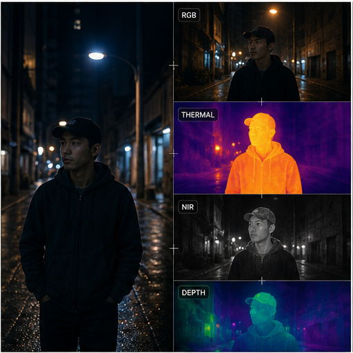

# 44. 多光谱与辅助成像

> `idea_only` 图文页面。图片是概念示意，不代表已量产效果；来源链接用于理解相关技术或产品边界。

*图 44：多光谱与辅助成像的概念示意。画面用于帮助理解用户最终看到的效果，不是论文原图或真实产品截图。*

## 看图理解

多光谱、近红外、热成像和深度可以作为 RGB 的辅助证据，改善夜景、低照、遮挡和材质识别；这里强调的是融合潜力，不代表当前手机普遍具备这些传感器。

本簇收录 24 条基础 IDEA，默认真实性边界包括 faithful, perceptual；代表场景：夜景, 户外, 科研, 安全。

## 本簇 IDEA

### NATIVE-0985｜近红外人像：辅助通道融合录像

- **用户效果**：围绕近红外人像，在低照中提供结构但保护肤色；通过辅助通道融合实现只在低置信区域使用辅助信息。
- **核心机制**：辅助通道融合：只在低置信区域使用辅助信息。需要跨帧维护目标状态、遮挡关系和质量置信度。
- **手机输入**：RGB、NIR、thermal、polarization
- **适用场景**：夜景、户外、科研、安全
- **真实性边界**：`faithful`
- **主要风险**：时序闪烁、遮挡错误、用户控制复杂度、端侧功耗

### NATIVE-0986｜近红外人像：跨光谱颜色恢复录像

- **用户效果**：围绕近红外人像，在低照中提供结构但保护肤色；通过跨光谱颜色恢复实现从可见光约束真实颜色。
- **核心机制**：跨光谱颜色恢复：从可见光约束真实颜色。需要跨帧维护目标状态、遮挡关系和质量置信度。
- **手机输入**：RGB、NIR、thermal、polarization
- **适用场景**：夜景、户外、科研、安全
- **真实性边界**：`faithful`
- **主要风险**：时序闪烁、遮挡错误、用户控制复杂度、端侧功耗

### NATIVE-0987｜近红外人像：反射偏振控制录像

- **用户效果**：围绕近红外人像，在低照中提供结构但保护肤色；通过反射偏振控制实现利用偏振差分抑制反光。
- **核心机制**：反射偏振控制：利用偏振差分抑制反光。需要跨帧维护目标状态、遮挡关系和质量置信度。
- **手机输入**：RGB、NIR、thermal、polarization
- **适用场景**：夜景、户外、科研、安全
- **真实性边界**：`faithful`
- **主要风险**：时序闪烁、遮挡错误、用户控制复杂度、端侧功耗

### NATIVE-0988｜近红外人像：热目标提示录像

- **用户效果**：围绕近红外人像，在低照中提供结构但保护肤色；通过热目标提示实现低照中提示人物动物和设备。
- **核心机制**：热目标提示：低照中提示人物动物和设备。需要跨帧维护目标状态、遮挡关系和质量置信度。
- **手机输入**：RGB、NIR、thermal、polarization
- **适用场景**：夜景、户外、科研、安全
- **真实性边界**：`perceptual`
- **主要风险**：时序闪烁、遮挡错误、用户控制复杂度、端侧功耗

### NATIVE-0989｜近红外人像：多模态分层录像录像

- **用户效果**：围绕近红外人像，在低照中提供结构但保护肤色；通过多模态分层录像实现保存可见光和辅助层。
- **核心机制**：多模态分层录像：保存可见光和辅助层。需要跨帧维护目标状态、遮挡关系和质量置信度。
- **手机输入**：RGB、NIR、thermal、polarization
- **适用场景**：夜景、户外、科研、安全
- **真实性边界**：`faithful`
- **主要风险**：时序闪烁、遮挡错误、用户控制复杂度、端侧功耗

### NATIVE-0990｜近红外人像：科学可视化模式录像

- **用户效果**：围绕近红外人像，在低照中提供结构但保护肤色；通过科学可视化模式实现将不可见信息转成标记效果。
- **核心机制**：科学可视化模式：将不可见信息转成标记效果。需要跨帧维护目标状态、遮挡关系和质量置信度。
- **手机输入**：RGB、NIR、thermal、polarization
- **适用场景**：夜景、户外、科研、安全
- **真实性边界**：`perceptual`
- **主要风险**：时序闪烁、遮挡错误、用户控制复杂度、端侧功耗

### NATIVE-0991｜热信息：辅助通道融合录像

- **用户效果**：围绕热信息，辅助夜间主体发现和温度可视化；通过辅助通道融合实现只在低置信区域使用辅助信息。
- **核心机制**：辅助通道融合：只在低置信区域使用辅助信息。需要跨帧维护目标状态、遮挡关系和质量置信度。
- **手机输入**：RGB、NIR、thermal、polarization
- **适用场景**：夜景、户外、科研、安全
- **真实性边界**：`faithful`
- **主要风险**：时序闪烁、遮挡错误、用户控制复杂度、端侧功耗

### NATIVE-0992｜热信息：跨光谱颜色恢复录像

- **用户效果**：围绕热信息，辅助夜间主体发现和温度可视化；通过跨光谱颜色恢复实现从可见光约束真实颜色。
- **核心机制**：跨光谱颜色恢复：从可见光约束真实颜色。需要跨帧维护目标状态、遮挡关系和质量置信度。
- **手机输入**：RGB、NIR、thermal、polarization
- **适用场景**：夜景、户外、科研、安全
- **真实性边界**：`faithful`
- **主要风险**：时序闪烁、遮挡错误、用户控制复杂度、端侧功耗

### NATIVE-0993｜热信息：反射偏振控制录像

- **用户效果**：围绕热信息，辅助夜间主体发现和温度可视化；通过反射偏振控制实现利用偏振差分抑制反光。
- **核心机制**：反射偏振控制：利用偏振差分抑制反光。需要跨帧维护目标状态、遮挡关系和质量置信度。
- **手机输入**：RGB、NIR、thermal、polarization
- **适用场景**：夜景、户外、科研、安全
- **真实性边界**：`faithful`
- **主要风险**：时序闪烁、遮挡错误、用户控制复杂度、端侧功耗

### NATIVE-0994｜热信息：热目标提示录像

- **用户效果**：围绕热信息，辅助夜间主体发现和温度可视化；通过热目标提示实现低照中提示人物动物和设备。
- **核心机制**：热目标提示：低照中提示人物动物和设备。需要跨帧维护目标状态、遮挡关系和质量置信度。
- **手机输入**：RGB、NIR、thermal、polarization
- **适用场景**：夜景、户外、科研、安全
- **真实性边界**：`perceptual`
- **主要风险**：时序闪烁、遮挡错误、用户控制复杂度、端侧功耗

### NATIVE-0995｜热信息：多模态分层录像录像

- **用户效果**：围绕热信息，辅助夜间主体发现和温度可视化；通过多模态分层录像实现保存可见光和辅助层。
- **核心机制**：多模态分层录像：保存可见光和辅助层。需要跨帧维护目标状态、遮挡关系和质量置信度。
- **手机输入**：RGB、NIR、thermal、polarization
- **适用场景**：夜景、户外、科研、安全
- **真实性边界**：`faithful`
- **主要风险**：时序闪烁、遮挡错误、用户控制复杂度、端侧功耗

### NATIVE-0996｜热信息：科学可视化模式录像

- **用户效果**：围绕热信息，辅助夜间主体发现和温度可视化；通过科学可视化模式实现将不可见信息转成标记效果。
- **核心机制**：科学可视化模式：将不可见信息转成标记效果。需要跨帧维护目标状态、遮挡关系和质量置信度。
- **手机输入**：RGB、NIR、thermal、polarization
- **适用场景**：夜景、户外、科研、安全
- **真实性边界**：`perceptual`
- **主要风险**：时序闪烁、遮挡错误、用户控制复杂度、端侧功耗

### NATIVE-0997｜偏振信息：辅助通道融合录像

- **用户效果**：围绕偏振信息，分离反射、天空和材质高光；通过辅助通道融合实现只在低置信区域使用辅助信息。
- **核心机制**：辅助通道融合：只在低置信区域使用辅助信息。需要跨帧维护目标状态、遮挡关系和质量置信度。
- **手机输入**：RGB、NIR、thermal、polarization
- **适用场景**：夜景、户外、科研、安全
- **真实性边界**：`faithful`
- **主要风险**：时序闪烁、遮挡错误、用户控制复杂度、端侧功耗

### NATIVE-0998｜偏振信息：跨光谱颜色恢复录像

- **用户效果**：围绕偏振信息，分离反射、天空和材质高光；通过跨光谱颜色恢复实现从可见光约束真实颜色。
- **核心机制**：跨光谱颜色恢复：从可见光约束真实颜色。需要跨帧维护目标状态、遮挡关系和质量置信度。
- **手机输入**：RGB、NIR、thermal、polarization
- **适用场景**：夜景、户外、科研、安全
- **真实性边界**：`faithful`
- **主要风险**：时序闪烁、遮挡错误、用户控制复杂度、端侧功耗

### NATIVE-0999｜偏振信息：反射偏振控制录像

- **用户效果**：围绕偏振信息，分离反射、天空和材质高光；通过反射偏振控制实现利用偏振差分抑制反光。
- **核心机制**：反射偏振控制：利用偏振差分抑制反光。需要跨帧维护目标状态、遮挡关系和质量置信度。
- **手机输入**：RGB、NIR、thermal、polarization
- **适用场景**：夜景、户外、科研、安全
- **真实性边界**：`faithful`
- **主要风险**：时序闪烁、遮挡错误、用户控制复杂度、端侧功耗

### NATIVE-1000｜偏振信息：热目标提示录像

- **用户效果**：围绕偏振信息，分离反射、天空和材质高光；通过热目标提示实现低照中提示人物动物和设备。
- **核心机制**：热目标提示：低照中提示人物动物和设备。需要跨帧维护目标状态、遮挡关系和质量置信度。
- **手机输入**：RGB、NIR、thermal、polarization
- **适用场景**：夜景、户外、科研、安全
- **真实性边界**：`perceptual`
- **主要风险**：时序闪烁、遮挡错误、用户控制复杂度、端侧功耗

### NATIVE-1001｜偏振信息：多模态分层录像录像

- **用户效果**：围绕偏振信息，分离反射、天空和材质高光；通过多模态分层录像实现保存可见光和辅助层。
- **核心机制**：多模态分层录像：保存可见光和辅助层。需要跨帧维护目标状态、遮挡关系和质量置信度。
- **手机输入**：RGB、NIR、thermal、polarization
- **适用场景**：夜景、户外、科研、安全
- **真实性边界**：`faithful`
- **主要风险**：时序闪烁、遮挡错误、用户控制复杂度、端侧功耗

### NATIVE-1002｜偏振信息：科学可视化模式录像

- **用户效果**：围绕偏振信息，分离反射、天空和材质高光；通过科学可视化模式实现将不可见信息转成标记效果。
- **核心机制**：科学可视化模式：将不可见信息转成标记效果。需要跨帧维护目标状态、遮挡关系和质量置信度。
- **手机输入**：RGB、NIR、thermal、polarization
- **适用场景**：夜景、户外、科研、安全
- **真实性边界**：`perceptual`
- **主要风险**：时序闪烁、遮挡错误、用户控制复杂度、端侧功耗

### NATIVE-1003｜环境传感：辅助通道融合录像

- **用户效果**：围绕环境传感，结合光谱、天气和空间数据；通过辅助通道融合实现只在低置信区域使用辅助信息。
- **核心机制**：辅助通道融合：只在低置信区域使用辅助信息。需要跨帧维护目标状态、遮挡关系和质量置信度。
- **手机输入**：RGB、NIR、thermal、polarization
- **适用场景**：夜景、户外、科研、安全
- **真实性边界**：`faithful`
- **主要风险**：时序闪烁、遮挡错误、用户控制复杂度、端侧功耗

### NATIVE-1004｜环境传感：跨光谱颜色恢复录像

- **用户效果**：围绕环境传感，结合光谱、天气和空间数据；通过跨光谱颜色恢复实现从可见光约束真实颜色。
- **核心机制**：跨光谱颜色恢复：从可见光约束真实颜色。需要跨帧维护目标状态、遮挡关系和质量置信度。
- **手机输入**：RGB、NIR、thermal、polarization
- **适用场景**：夜景、户外、科研、安全
- **真实性边界**：`faithful`
- **主要风险**：时序闪烁、遮挡错误、用户控制复杂度、端侧功耗

### NATIVE-1005｜环境传感：反射偏振控制录像

- **用户效果**：围绕环境传感，结合光谱、天气和空间数据；通过反射偏振控制实现利用偏振差分抑制反光。
- **核心机制**：反射偏振控制：利用偏振差分抑制反光。需要跨帧维护目标状态、遮挡关系和质量置信度。
- **手机输入**：RGB、NIR、thermal、polarization
- **适用场景**：夜景、户外、科研、安全
- **真实性边界**：`faithful`
- **主要风险**：时序闪烁、遮挡错误、用户控制复杂度、端侧功耗

### NATIVE-1006｜环境传感：热目标提示录像

- **用户效果**：围绕环境传感，结合光谱、天气和空间数据；通过热目标提示实现低照中提示人物动物和设备。
- **核心机制**：热目标提示：低照中提示人物动物和设备。需要跨帧维护目标状态、遮挡关系和质量置信度。
- **手机输入**：RGB、NIR、thermal、polarization
- **适用场景**：夜景、户外、科研、安全
- **真实性边界**：`perceptual`
- **主要风险**：时序闪烁、遮挡错误、用户控制复杂度、端侧功耗

### NATIVE-1007｜环境传感：多模态分层录像录像

- **用户效果**：围绕环境传感，结合光谱、天气和空间数据；通过多模态分层录像实现保存可见光和辅助层。
- **核心机制**：多模态分层录像：保存可见光和辅助层。需要跨帧维护目标状态、遮挡关系和质量置信度。
- **手机输入**：RGB、NIR、thermal、polarization
- **适用场景**：夜景、户外、科研、安全
- **真实性边界**：`faithful`
- **主要风险**：时序闪烁、遮挡错误、用户控制复杂度、端侧功耗

### NATIVE-1008｜环境传感：科学可视化模式录像

- **用户效果**：围绕环境传感，结合光谱、天气和空间数据；通过科学可视化模式实现将不可见信息转成标记效果。
- **核心机制**：科学可视化模式：将不可见信息转成标记效果。需要跨帧维护目标状态、遮挡关系和质量置信度。
- **手机输入**：RGB、NIR、thermal、polarization
- **适用场景**：夜景、户外、科研、安全
- **真实性边界**：`perceptual`
- **主要风险**：时序闪烁、遮挡错误、用户控制复杂度、端侧功耗

## 相关来源

- 本簇暂未绑定具体论文或产品来源；图像用于解释概念外观，不能作为已实现功能证据。

## 阅读建议

先看图判断用户效果，再回到上面的 `idea_id` 了解处理对象和输入信号；需要落地时，再从来源、数据、时序一致性、端侧预算和真实性边界分别建立验证任务。

[返回图文图鉴总览](../手机录像后处理_IDEA图文图鉴_20260827.md)
