# 手机录像后处理 IDEA 图文图鉴

日期：2026-08-27

> 这是一份个人阅读用的概念图鉴。它把手机录像后处理创意与视觉示意放在一起，帮助读者先理解‘用户会看到什么’，再回看算法、输入信号、数据和风险。

## 使用边界

- 全量基础 IDEA：1,154 条；创意簇：44 个。
- 每个创意簇配置一张概念示意图，并保留该簇全部基础 IDEA。
- 图像由统一的概念视觉母图裁切得到，不是论文原图，也不是厂商真实产品截图。
- 旧 112 条机会的来源证据与新创意的概念推演分开表达；新增创意统一标记为 `idea_only`。
- 实时预览、录制在线、录后端侧、云端、30/60 fps、ROI 等属于实现变体，请继续查看[变体全量报告](手机录像后处理_IDEA变体全量_20260827.md)。

## 总体图谱

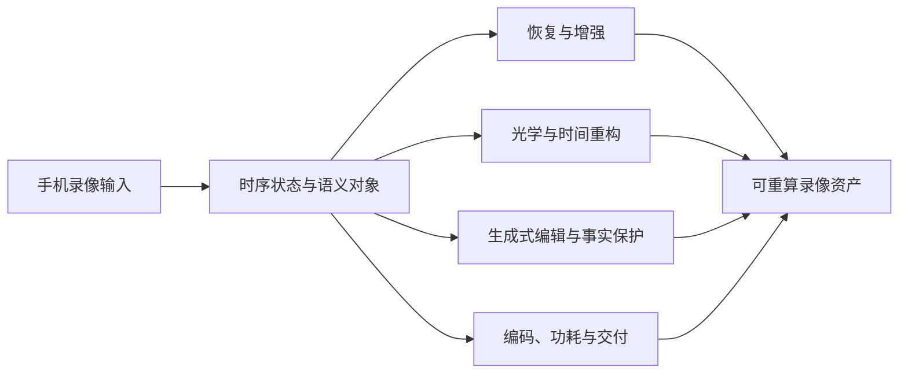

## 图文入口

### 01. [既有 112 条机会库](idea_atlas_pages/01_既有_112_条机会库.md)

这是此前证据型机会库的完整映射。图中用手机取景、夜景光源、运动主体和分层信息表达旧方向如何落到录像链路；页面下方保留全部 112 条原始机会，便于从概念图回查历史记录。 本簇收录 112 条基础 IDEA，默认真实性边界包括 faithful, generative, perceptual；代表场景：夜景, 车灯, 演唱会, 逆光, 城市灯光, 人像, 婚礼, 创作。

该簇包含：`112` 条基础 IDEA。

### 02. [此前明确提出的重点方向](idea_atlas_pages/02_此前明确提出的重点方向.md)

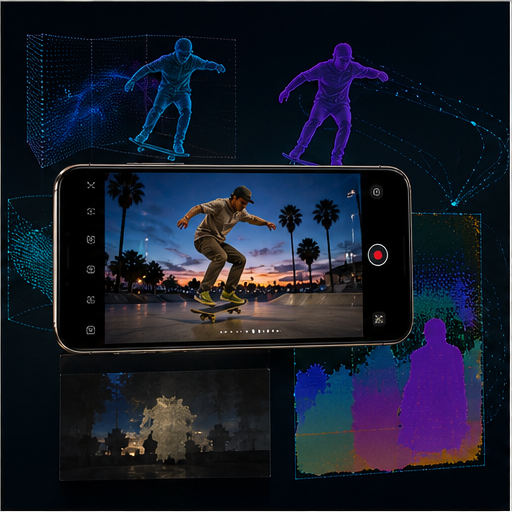

这是此前对话中明确提出的重点主线。图中把计算底片、对象级时间控制、光照层和运动状态放在同一条可重算录像链路中，强调这些是跨功能基础设施，而不是单个滤镜。 本簇收录 34 条基础 IDEA，默认真实性边界包括 perceptual；代表场景：通用录像。

该簇包含：`34` 条基础 IDEA。

### 03. [可重算影像资产](idea_atlas_pages/03_可重算影像资产.md)

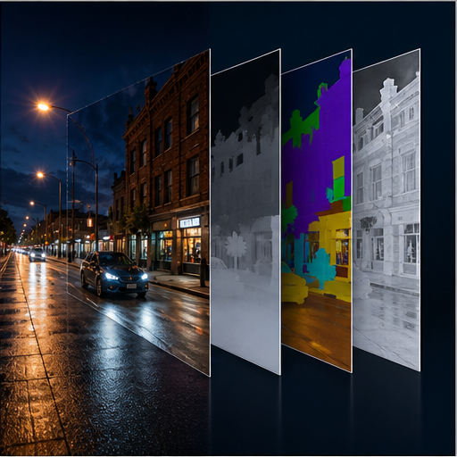

核心问题是把录像保存成可以重新计算的影像资产：除了 RGB/YUV，还保存深度、Mask、运动、曝光和相机状态。这样录后才能重新选择 ISP、光照、景深、构图或生成边界。 本簇收录 24 条基础 IDEA，默认真实性边界包括 faithful, perceptual；代表场景：专业创作, 旅行, 直播。

该簇包含：`24` 条基础 IDEA。

### 04. [对象级曝光与快门](idea_atlas_pages/04_对象级曝光与快门.md)

把整帧曝光和快门推广为对象级时间控制。人物、背景、高亮、运动轨迹可以使用不同的等效曝光策略，用户最终看到的是清晰主体与可控运动质感的组合。 本簇收录 24 条基础 IDEA，默认真实性边界包括 faithful, perceptual；代表场景：运动, 演唱会, 夜景, 旅行。

该簇包含：`24` 条基础 IDEA。

### 05. [可编辑时间画布](idea_atlas_pages/05_可编辑时间画布.md)

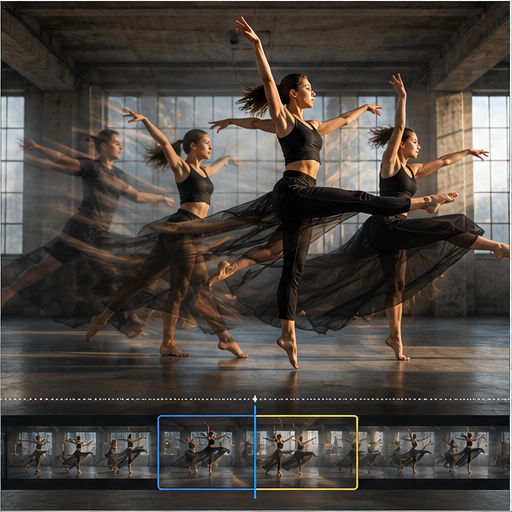

把时间从不可逆的连续帧变成可编辑画布。局部慢动作、时间拖影、事件回放和关键帧重算都可以在同一条时间轴上选择性发生。 本簇收录 24 条基础 IDEA，默认真实性边界包括 generative, perceptual；代表场景：儿童, 宠物, 运动, 舞蹈。

该簇包含：`24` 条基础 IDEA。

### 06. [意图感知运动控制](idea_atlas_pages/06_意图感知运动控制.md)

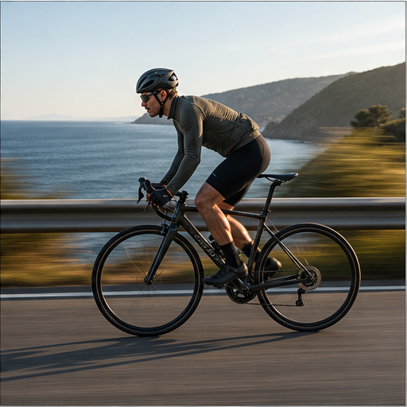

稳定算法不再只追求‘越稳越好’，而是识别摇摄、跟拍、甩镜和升降等创作者意图，抑制手抖同时保留主动运动。 本簇收录 24 条基础 IDEA，默认真实性边界包括 faithful, perceptual；代表场景：Vlog, 运动, 骑行, 车载。

该簇包含：`24` 条基础 IDEA。

### 07. [运动细节与畸变恢复](idea_atlas_pages/07_运动细节与畸变恢复.md)

重点是恢复运动主体的结构与细节，并显式处理运动模糊、滚动快门、遮挡和跨帧纹理传播。适合人脸、手部、器械、车辆文字等高价值 ROI。 本簇收录 24 条基础 IDEA，默认真实性边界包括 faithful, perceptual；代表场景：运动, 夜景, 车载, 演唱会。

该簇包含：`24` 条基础 IDEA。

### 08. [可编程镜头特性](idea_atlas_pages/08_可编程镜头特性.md)

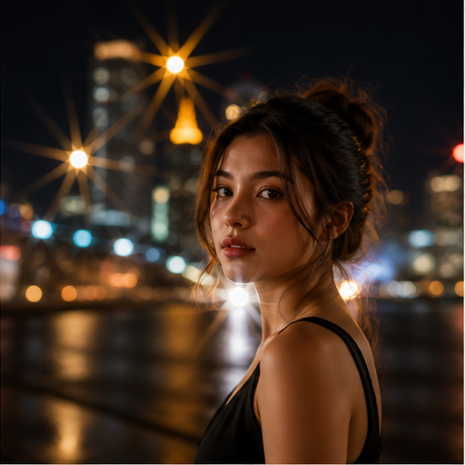

把物理镜头特性参数化为可编辑的时序渲染：星芒、flare、焦外、柔焦、暗角、像差和镜头呼吸都可以由光源、深度与相机姿态驱动。 本簇收录 24 条基础 IDEA，默认真实性边界包括 generative, perceptual；代表场景：夜景, 人像, 演唱会, 专业创作。

该簇包含：`24` 条基础 IDEA。

### 09. [镜头表面与介质](idea_atlas_pages/09_镜头表面与介质.md)

镜头表面和透明介质本身也可以成为可处理对象。雨滴、雾气、污渍、保护壳反射与玻璃折射需要区分场景内容，才能实现可逆抑制或创作增强。 本簇收录 24 条基础 IDEA，默认真实性边界包括 faithful, generative, perceptual；代表场景：雨天, 户外, 车载, 运动。

该簇包含：`24` 条基础 IDEA。

### 10. [视频光场与光源分解](idea_atlas_pages/10_视频光场与光源分解.md)

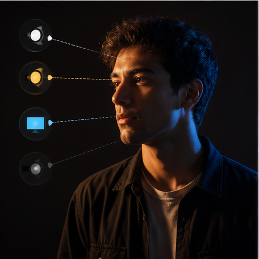

图中的人物被拆成主光、轮廓光、屏幕光、环境光和阴影层。用户效果不是简单提亮，而是让虚拟光受深度、遮挡、材质和真实阴影约束。 本簇收录 24 条基础 IDEA，默认真实性边界包括 faithful, generative, perceptual；代表场景：人像, 直播, 商品, 室内。

该簇包含：`24` 条基础 IDEA。

### 11. [复杂人造光录像](idea_atlas_pages/11_复杂人造光录像.md)

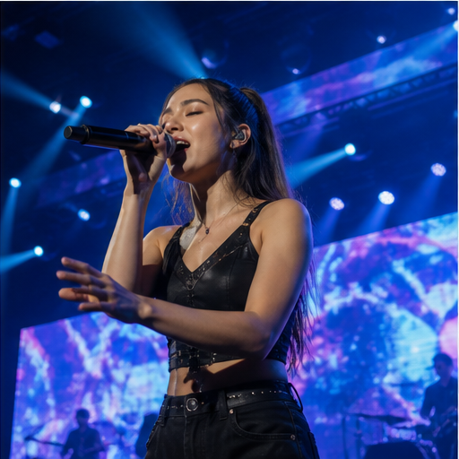

演唱会、LED 屏幕、霓虹和车灯要求同时处理高光、频闪、颜色、烟雾和主体曝光。手机录像需要把光源频率与主体语义放进同一个时序模型。 本簇收录 24 条基础 IDEA，默认真实性边界包括 faithful, generative, perceptual；代表场景：演唱会, 夜景, 车载, 室内。

该簇包含：`24` 条基础 IDEA。

### 12. [连续焦段与跨摄像头一致性](idea_atlas_pages/12_连续焦段与跨摄像头一致性.md)

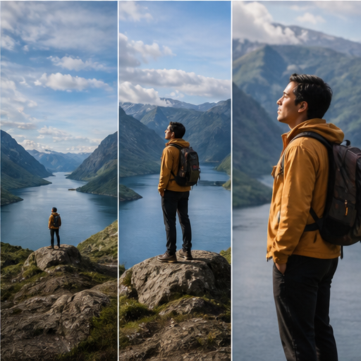

多摄的关键不是单次切镜，而是跨镜头持续保持曝光、白平衡、肤色、噪声、纹理、运动和景深风格。连续焦段是一个系统一致性问题。 本簇收录 24 条基础 IDEA，默认真实性边界包括 faithful, perceptual；代表场景：旅行, 人像, 演唱会, 运动。

该簇包含：`24` 条基础 IDEA。

### 13. [空间录像与录后运镜](idea_atlas_pages/13_空间录像与录后运镜.md)

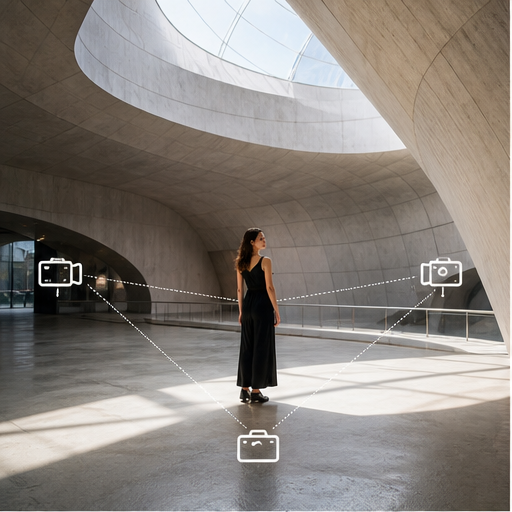

空间录像和录后运镜依赖深度、SLAM、IMU 与多摄信息。优先在已观测区域内做受约束重投影，只有在明确授权时才使用生成式画外补全。 本簇收录 24 条基础 IDEA，默认真实性边界包括 faithful, generative, perceptual；代表场景：旅行, 商品, 人像, 空间视频。

该簇包含：`24` 条基础 IDEA。

### 14. [人像区域可信增强](idea_atlas_pages/14_人像区域可信增强.md)

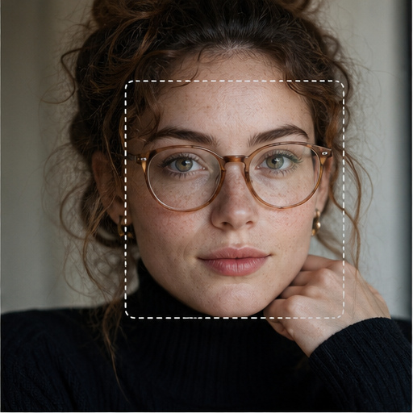

人像不应只用一个全脸强度。眼睛、皮肤、嘴唇、牙齿、头发、眼镜和服装需要不同的恢复与真实性约束，并持续检查身份、几何和时序纹理。 本簇收录 24 条基础 IDEA，默认真实性边界包括 faithful, perceptual；代表场景：人像, 直播, 采访, 夜景。

该簇包含：`24` 条基础 IDEA。

### 15. [人体动作与服装细节](idea_atlas_pages/15_人体动作与服装细节.md)

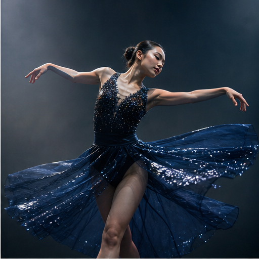

人体动作录像的难点是手指、衣摆、器械和快速姿态。姿态、部件 Mask、高帧率缓存和局部清晰窗口可以共同保护这些细节。 本簇收录 24 条基础 IDEA，默认真实性边界包括 faithful, perceptual；代表场景：舞蹈, 运动, 直播, 教育。

该簇包含：`24` 条基础 IDEA。

### 16. [反射透明与材质分层](idea_atlas_pages/16_反射透明与材质分层.md)

玻璃、金属、水面、纱帘和半透明介质不能按普通纹理处理。需要把反射、透射、散射和材质高光分层，才能做可信的抑制、增强或替换。 本簇收录 24 条基础 IDEA，默认真实性边界包括 faithful, generative, perceptual；代表场景：车内, 商品, 旅行, 美食。

该簇包含：`24` 条基础 IDEA。

### 17. [场景持续记忆与清理](idea_atlas_pages/17_场景持续记忆与清理.md)

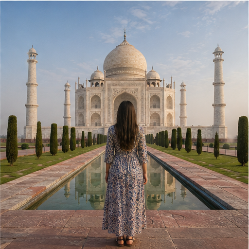

持续场景记忆允许用历史真实背景恢复短时遮挡，也支持路人移除、污点清理和遮挡因果判断。只有没有真实观测时，才应进入生成式补全。 本簇收录 24 条基础 IDEA，默认真实性边界包括 faithful, generative, perceptual；代表场景：旅行, 街拍, 直播, 车载。

该簇包含：`24` 条基础 IDEA。

### 18. [天气与空气介质](idea_atlas_pages/18_天气与空气介质.md)

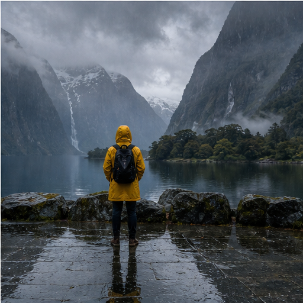

天气编辑不只是给画面加雨雾。天空、空气透视、地面湿润反射、阴影和人物光照需要联动，并把生成区域和可信度保存下来。 本簇收录 24 条基础 IDEA，默认真实性边界包括 faithful, generative, perceptual；代表场景：旅行, 车载, 户外, 直播。

该簇包含：`24` 条基础 IDEA。

### 19. [语义色彩与影调](idea_atlas_pages/19_语义色彩与影调.md)

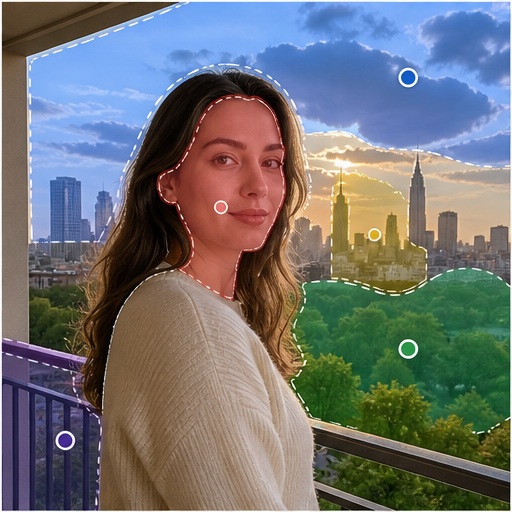

语义色彩把肤色、天空、植被、灯光、高光和阴影分区处理，同时维持跨帧、跨镜头和跨显示设备的连续性。 本簇收录 24 条基础 IDEA，默认真实性边界包括 faithful, perceptual；代表场景：专业创作, 旅行, 人像, 直播。

该簇包含：`24` 条基础 IDEA。

### 20. [声音驱动自动摄影](idea_atlas_pages/20_声音驱动自动摄影.md)

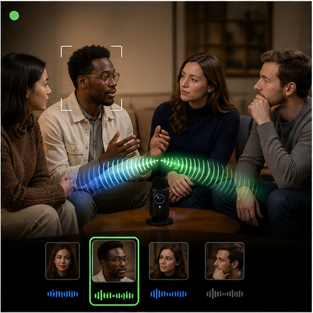

手机麦克风阵列可以成为摄影控制信号：声源方向、对白轮次、节拍和突发声音事件可驱动跟焦、构图、运镜、缓存和自动成片。 本簇收录 24 条基础 IDEA，默认真实性边界包括 faithful, generative, perceptual；代表场景：采访, 演唱会, 儿童, 直播。

该簇包含：`24` 条基础 IDEA。

### 21. [可信生成与事实保护](idea_atlas_pages/21_可信生成与事实保护.md)

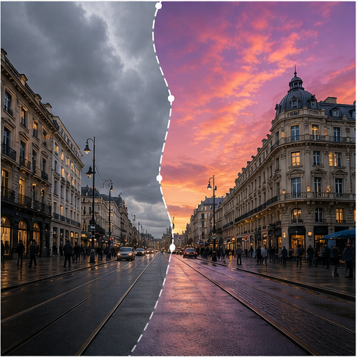

生成式录像的核心不是‘全部重画’，而是保护区、世界状态和不确定性管理。脸、文字、商标、建筑几何和事件事实应默认锁定。 本簇收录 24 条基础 IDEA，默认真实性边界包括 faithful, generative；代表场景：新闻, 旅行, 人像, 社交。

该簇包含：`24` 条基础 IDEA。

### 22. [语义感知编解码](idea_atlas_pages/22_语义感知编解码.md)

编码器可以根据人脸、手部、文字和运动主体分配码率，并复用运动矢量和轻量特征。用户看到的结果是低码率下主体可读、背景可压缩。 本簇收录 24 条基础 IDEA，默认真实性边界包括 faithful, generative；代表场景：直播, 长录像, 社交, 端云。

该簇包含：`24` 条基础 IDEA。

### 23. [功耗与热稳定录像](idea_atlas_pages/23_功耗与热稳定录像.md)

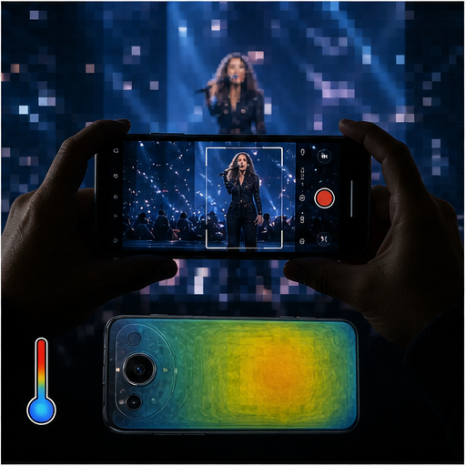

长时间录像需要把 ISP、DSP、NPU、GPU 和 VPU 当成一个系统调度问题。温度、功耗、ROI、关键帧和代理模型共同决定质量如何稳定下降。 本簇收录 24 条基础 IDEA，默认真实性边界包括 faithful, perceptual；代表场景：直播, 演唱会, 旅行, 长录像。

该簇包含：`24` 条基础 IDEA。

### 24. [高速事件与新型传感器](idea_atlas_pages/24_高速事件与新型传感器.md)

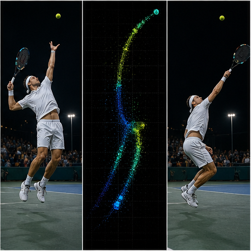

事件传感器提供普通 RGB 帧之间的高时间分辨率变化，适合高速运动、低照、频闪、去模糊、插帧和高频稳定。当前页面是前沿概念方向，未绑定量产器件。 本簇收录 24 条基础 IDEA，默认真实性边界包括 faithful, perceptual；代表场景：运动, 夜景, 演唱会, 车载。

该簇包含：`24` 条基础 IDEA。

### 25. [对焦与光学机构信息](idea_atlas_pages/25_对焦与光学机构信息.md)

对焦和光学机构信息可以进入算法链。预测焦点平面、对焦速度、OIS/OIS 状态和逐行时间有助于减少失焦、呼吸、滚动快门和空间层级错误。 本簇收录 24 条基础 IDEA，默认真实性边界包括 faithful, perceptual；代表场景：人像, 运动, 采访, 演唱会。

该簇包含：`24` 条基础 IDEA。

### 26. [隐私与安全录像](idea_atlas_pages/26_隐私与安全录像.md)

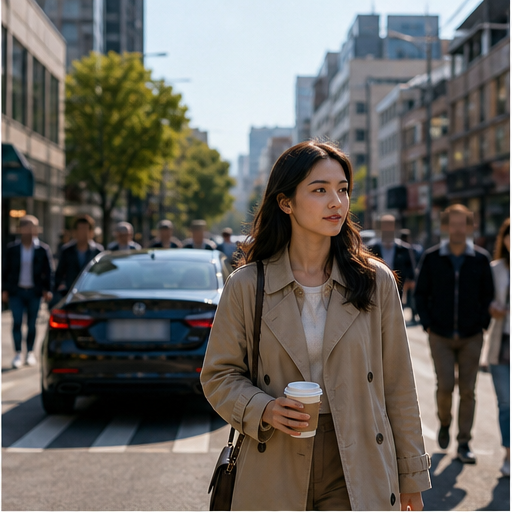

录像后处理还应处理隐私、匿名和证据链。保护区、可逆替换、分级导出和审计日志可以让效果增强与个人安全同时存在。 本簇收录 24 条基础 IDEA，默认真实性边界包括 faithful, generative；代表场景：家庭, 儿童, 直播, 公共场所。

该簇包含：`24` 条基础 IDEA。

### 27. [演唱会与舞台专用录像](idea_atlas_pages/27_演唱会与舞台专用录像.md)

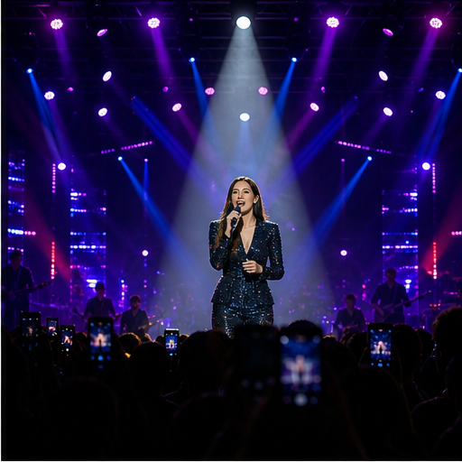

演唱会录像要优先保护远距离歌手、LED 内容、肤色、高光和声音关联，再叠加虚拟追光、节拍光效和稳定导播。 本簇收录 24 条基础 IDEA，默认真实性边界包括 faithful, generative, perceptual；代表场景：演唱会, 舞台, 音乐节, 夜景。

该簇包含：`24` 条基础 IDEA。

### 28. [体育与动作自动摄影](idea_atlas_pages/28_体育与动作自动摄影.md)

体育录像的对象不是整场画面，而是球、运动员、器械、规则事件和精彩瞬间。跟踪、轨迹、缓存、慢动作和多机位可以组成自动导播链。 本簇收录 24 条基础 IDEA，默认真实性边界包括 faithful, generative, perceptual；代表场景：球类, 跑步, 骑行, 滑雪。

该簇包含：`24` 条基础 IDEA。

### 29. [儿童与宠物不可预测事件](idea_atlas_pages/29_儿童与宠物不可预测事件.md)

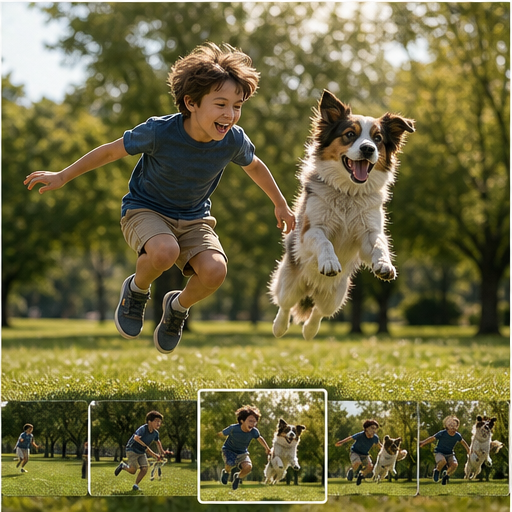

儿童和宠物动作不可预测，适合使用录制前环形缓存、声音触发、行为预测、低机位构图和人脸/毛发双路恢复。 本簇收录 24 条基础 IDEA，默认真实性边界包括 faithful, generative, perceptual；代表场景：儿童, 宠物, 家庭, 户外。

该簇包含：`24` 条基础 IDEA。

### 30. [车内与移动空间录像](idea_atlas_pages/30_车内与移动空间录像.md)

车内和移动空间同时存在玻璃反射、道路振动、内外曝光差、乘员人像和快速光照变化，适合做空间分层与稳像协同。 本簇收录 24 条基础 IDEA，默认真实性边界包括 faithful, generative；代表场景：车载, 旅行, 夜景, 直播。

该簇包含：`24` 条基础 IDEA。

### 31. [直播与长时在线录像](idea_atlas_pages/31_直播与长时在线录像.md)

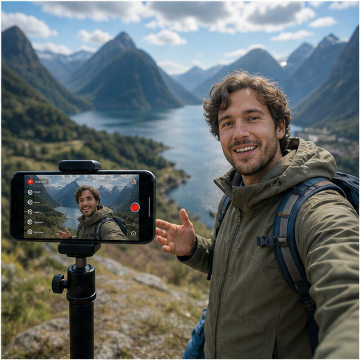

直播要求长时间稳定、低延迟、低发热和可持续的主体质量。代理路径、ROI 优先、自动构图和录后母版可以形成双轨系统。 本簇收录 24 条基础 IDEA，默认真实性边界包括 faithful, generative, perceptual；代表场景：直播, 电商, 采访, 户外。

该簇包含：`24` 条基础 IDEA。

### 32. [商品与美食录像](idea_atlas_pages/32_商品与美食录像.md)

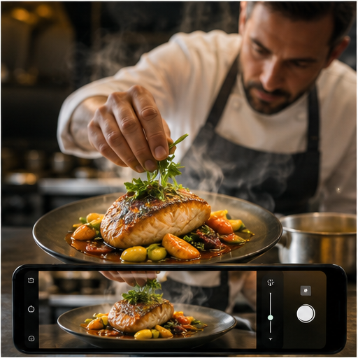

商品和美食录像强调材质、反射、高光、蒸汽、色彩和细节可读性。用户需要的是可控的展示光和真实材质，不是泛化的锐化。 本簇收录 24 条基础 IDEA，默认真实性边界包括 faithful, generative, perceptual；代表场景：电商, 美食, 直播, 广告。

该簇包含：`24` 条基础 IDEA。

### 33. [旅行与城市叙事](idea_atlas_pages/33_旅行与城市叙事.md)

旅行录像可以把主体、城市、地标和路线组织成连续叙事，并跨焦段、跨片段维护色彩、构图和运动风格。 本簇收录 24 条基础 IDEA，默认真实性边界包括 faithful, generative, perceptual；代表场景：旅行, 城市, 户外, Vlog。

该簇包含：`24` 条基础 IDEA。

### 34. [采访会议与演讲](idea_atlas_pages/34_采访会议与演讲.md)

采访和会议适合让声音、说话人身份、视线和构图共同决定自动导播，同时保护屏幕文字和多人时序一致性。 本簇收录 24 条基础 IDEA，默认真实性边界包括 faithful, perceptual；代表场景：采访, 会议, 演讲, 直播。

该簇包含：`24` 条基础 IDEA。

### 35. [无障碍与辅助录像](idea_atlas_pages/35_无障碍与辅助录像.md)

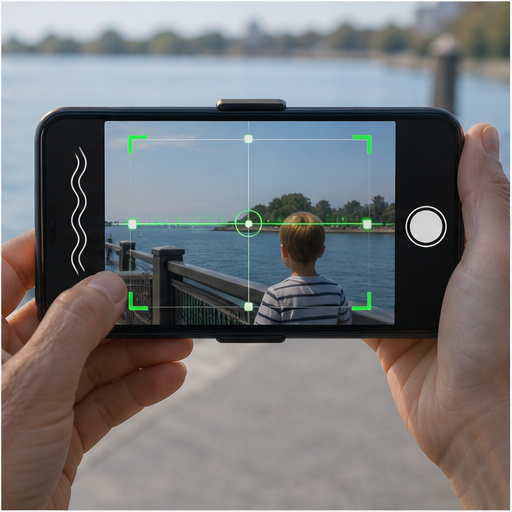

无障碍录像把画面质量守护扩展为方向、触觉、主体确认和语音反馈，让拍摄辅助成为可访问的系统功能。 本簇收录 24 条基础 IDEA，默认真实性边界包括 faithful, perceptual；代表场景：教育, 会议, 家庭, 直播。

该簇包含：`24` 条基础 IDEA。

### 36. [教育实验与科学记录](idea_atlas_pages/36_教育实验与科学记录.md)

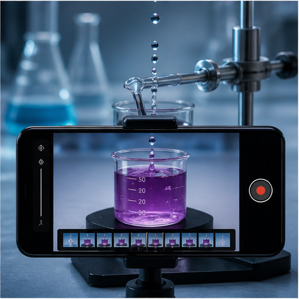

教育和科学记录强调测量标记、实验器材、事件时刻和可回放证据，生成式增强必须服从事实保护。 本簇收录 24 条基础 IDEA，默认真实性边界包括 faithful, perceptual；代表场景：教育, 实验, 维修, 科普。

该簇包含：`24` 条基础 IDEA。

### 37. [AR 与现实融合录像](idea_atlas_pages/37_AR_与现实融合录像.md)

AR 与现实融合录像需要稳定的空间锚点、遮挡关系、真实阴影和材质响应，否则虚拟内容会漂浮在画面上。 本簇收录 24 条基础 IDEA，默认真实性边界包括 faithful, generative, perceptual；代表场景：AR, 社交, 教育, 游戏。

该簇包含：`24` 条基础 IDEA。

### 38. [个人记忆与长期叙事](idea_atlas_pages/38_个人记忆与长期叙事.md)

个人记忆录像可以跨时间、地点和季节维护人物、构图与声音线索，形成可检索、可重混、可持续更新的长期叙事资产。 本簇收录 24 条基础 IDEA，默认真实性边界包括 faithful, perceptual；代表场景：家庭, 旅行, 创作, 成长记录。

该簇包含：`24` 条基础 IDEA。

### 39. [协同拍摄与群体录像](idea_atlas_pages/39_协同拍摄与群体录像.md)

多设备协同的重点是时间码、颜色、位姿、主体轨迹、声音和导播策略共享，让多部手机像一台分布式电影机。 本簇收录 24 条基础 IDEA，默认真实性边界包括 faithful, generative, perceptual；代表场景：活动, 体育, 旅行, 采访。

该簇包含：`24` 条基础 IDEA。

### 40. [社交创作与自动成片](idea_atlas_pages/40_社交创作与自动成片.md)

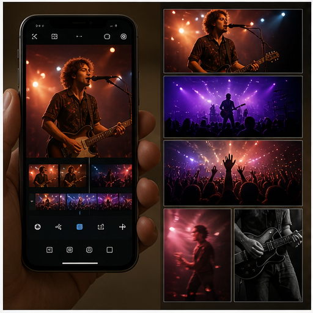

社交创作可以从一次表演自动派生多个裁切、节奏、效果和分享版本，但应保存原始事实帧和生成修改边界。 本簇收录 24 条基础 IDEA，默认真实性边界包括 faithful, generative, perceptual；代表场景：社交, 旅行, 直播, 电商。

该簇包含：`24` 条基础 IDEA。

### 41. [无人机与运动相机玩法迁移](idea_atlas_pages/41_无人机与运动相机玩法迁移.md)

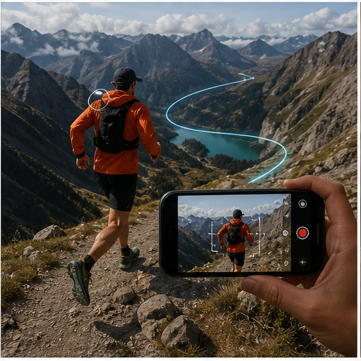

无人机和运动相机的跟拍、地平线锁定、轨迹镜头和空间移动可以迁移到手机，重点是利用手机自身 IMU、多摄和裁切余量。 本簇收录 24 条基础 IDEA，默认真实性边界包括 faithful, generative, perceptual；代表场景：运动, 旅行, 骑行, 宠物。

该簇包含：`24` 条基础 IDEA。

### 42. [电影镜头语言辅助](idea_atlas_pages/42_电影镜头语言辅助.md)

手机录像可以提供镜头语言辅助：景别、视线、推拉、滑轨、环绕、节奏和反应镜头被作为可编辑的拍摄意图。 本簇收录 24 条基础 IDEA，默认真实性边界包括 faithful, generative, perceptual；代表场景：短片, 采访, 旅行, 家庭。

该簇包含：`24` 条基础 IDEA。

### 43. [拍摄质量预测与自救](idea_atlas_pages/43_拍摄质量预测与自救.md)

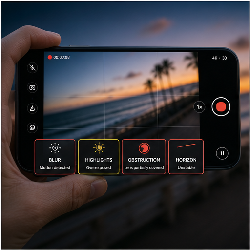

质量守护不是简单报错，而是预测失焦、过曝、遮挡、抖动、噪声和生成不确定性，并在拍摄前、录制中和录后给出可执行的补救。 本簇收录 24 条基础 IDEA，默认真实性边界包括 faithful；代表场景：所有录像, 直播, 长录像, 重要事件。

该簇包含：`24` 条基础 IDEA。

### 44. [多光谱与辅助成像](idea_atlas_pages/44_多光谱与辅助成像.md)

多光谱、近红外、热成像和深度可以作为 RGB 的辅助证据，改善夜景、低照、遮挡和材质识别；这里强调的是融合潜力，不代表当前手机普遍具备这些传感器。 本簇收录 24 条基础 IDEA，默认真实性边界包括 faithful, perceptual；代表场景：夜景, 户外, 科研, 安全。

该簇包含：`24` 条基础 IDEA。

## 数据与索引

- [基础 IDEA 全量 JSONL](../metadata/idea_universe/core_ideas.jsonl)
- [单轴变体全量 JSONL](../metadata/idea_universe/idea_variants.jsonl)
- [基础 IDEA 全量纯文本报告](手机录像后处理_IDEA全量宇宙_20260827.md)
- [实现变体全量纯文本报告](手机录像后处理_IDEA变体全量_20260827.md)
- [Excel 全量数据库](../matrix/手机录像后处理_IDEA全量宇宙_20260827.xlsx)
- [视觉资产目录](../figures/idea_atlas/)

## 图片说明

本图鉴中的图像用于建立视觉直觉：动态星芒、虚拟打光、对象级快门、多摄切镜、声音驱动、语义编码等功能分别对应用户可观察的画面或交互变化。涉及编解码、功耗、可信生成和多光谱的图像会使用可视化界面或分层表达，因为这些能力不能仅靠普通摄影画面直接呈现。

每张图片都应与页面中的文字、`idea_id`、来源状态和风险一起阅读；不能把概念图解读为已实现性能。
