# 手机录像特效重点玩法图文洞察

_50 个交互型录像特效的产品体验、实现链路、数据、Loss、风险与可核实参考 | 2026-08-27_

---

## 研究摘要

本手册从 300 个完整玩法中抽取 50 个重点案例，覆盖 12 个特效族。研究对象是用户能够在取景器或成片中直接看见、触发和调节的录像特效，不把普通防抖、常规降噪、HDR、超分或一般运镜当作主玩法。每个案例同时给出三帧概念分镜、交互状态、模块级数据流、建议训练数据、建议 Loss、移动端预览边界、录后精修和失败降级。

> **证据边界：** 14 份官方产品/软件或学术论文参考只用于证明基础能力。概念分镜不是既有产品截图，训练和 Loss 组合是工程建议，不是厂商未公开事实。性能数字只有在目标设备实测后才能进入结论。

| 资产 | 数量 | 用途 |
| --- | ---: | --- |
| 特效原子 | 120 | 可组合的最低层视觉、交互与时序能力 |
| 完整玩法 | 300 | 具有可见结果、触发、控制、预览和录后流程 |
| 组合配方 | 200 | 跨原子和玩法的显式组合 |
| 重点案例 | 50 | 本手册逐项深拆 |
| 可核实参考 | 14 | 说明能够证明与不能证明的边界 |

## 技术总线

```mermaid
flowchart LR
    accTitle: Mobile Video Effect Pipeline
    accDescr: A two-stage mobile video effect pipeline that creates a low-cost preview during recording, stores editable metadata, and recomputes a high-quality result after recording with fallbacks to the original video

    capture[采集 RGB HDR 深度 IMU 音频] --> perceive[感知 检测 分割 跟踪 姿态]
    perceive --> event[交互事件与状态机]
    event --> preview[低成本 ROI 预览合成]
    preview --> record[原片与结构化元数据]
    record --> refine[录后高分辨率重跟踪与重渲染]
    refine --> audit{置信度和真实性检查}
    audit -->|通过| output[可编辑成片]
    audit -->|失败| fallback[原片或局部回退]

    classDef source fill:#e8f1f6,stroke:#1b6b93,stroke-width:2px,color:#16324f
    classDef process fill:#e6f4ef,stroke:#00866a,stroke-width:2px,color:#145c4a
    classDef decision fill:#fff2cc,stroke:#a66a00,stroke-width:2px,color:#6b4d00
    classDef output_style fill:#fce8e6,stroke:#b43c35,stroke-width:2px,color:#7a2420
    class capture source
    class perceive,event,preview,record,refine process
    class audit decision
    class output,fallback output_style
```

## 特效族分布

| 特效族 | 重点案例数 | 主要技术难点 |
| --- | ---: | --- |
| 光轨与可编程光学 | 5 | 光效可夸张，但原始人物、场景几何和真实高光必须保留可回退版本。 |
| 面部、视线与表情 | 5 | 低置信度、强侧脸、闭眼或反光时回退原帧；不得生成新的虹膜身份特征。 |
| 身体运动与分身 | 4 | 不得把历史分身误写成现场真实人物；录制元数据应明确副本时间戳。 |
| 局部时间编辑 | 5 | 时间效果必须明确是创作性改写，原始时间线和事件顺序需保留。 |
| 空间入口与传送门 | 4 | 门户另一侧是生成或重放内容，不能被解释为真实摄像头已经观察到的空间。 |
| 虚拟光影 | 4 | 虚拟光影属于感知增强；不得覆盖脸部身份细节或改变真实安全信息。 |
| 材质变形 | 4 | 材质可生成，但目标物体轮廓、人体身份和交互接触点必须稳定。 |
| 粒子与天气 | 4 | 粒子不能遮挡关键面部、字幕或安全区域；必要时自动降低密度。 |
| 世界风格化 | 4 | 这是生成式或感知式世界改写；必须保留原片并显式标注创作效果。 |
| 音频与歌词 | 4 | 不得伪造说话内容；歌词/字幕必须与原音频绑定并保留置信度。 |
| 特效摄影 | 4 | 只保留具有明显可见效果的摄影玩法；不把普通防抖或常规运镜作为主功能。 |
| 多人互动 | 3 | 任何人的效果归属都不能串到另一人；身份不确定时停用互动层。 |

## 产品与研究原则

1. **预览负责交互，录后负责质量。** 取景器只运行 ROI、代理分辨率、分级更新和有限实例数；原片与结构化元数据必须同时保存。
2. **可见失败必须有明确降级。** 跟踪丢失、遮挡错误、身份不确定或深度漂移时，不继续扩大生成结果，而是冻结、减弱、回退屏幕空间或恢复原帧。
3. **生成内容与真实观察分离。** 空间入口、世界风格和材质重绘属于创作结果，不能被写成摄像头真实观察。
4. **人物身份优先于视觉刺激。** 人脸、瞳孔、嘴型、人体归属和多人轨迹必须有单独的身份/几何约束。
5. **性能结论必须设备实测。** 本手册不虚构毫秒、FPS、功耗、内存或温升数据。

## 重点案例

### 案例 01：指尖实时光绘轨迹屏幕拖绘·光轨光学

`PRIORITY-REALTIME-LIGHT-TRAIL`

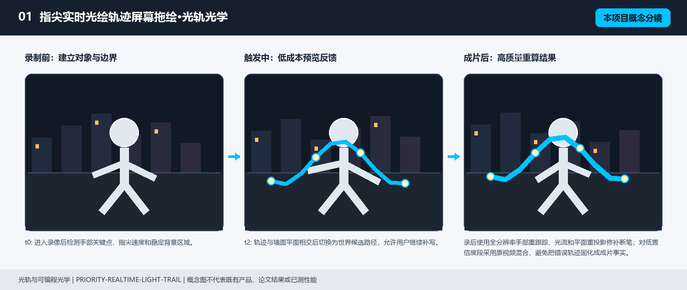
_图 1：本项目概念分镜。依次展示录制前、触发中和录后成片；不代表既有产品、论文实验结果或已测性能。_

**研究问题。** 普通手指拖尾只在屏幕平面上跟随，缺少可学习的空间关系和主动收束动作。

**目标体验。** 用户在夜景街头用食指写出一个短词；笔尖经过的路径先以低延迟光带显示，闭合时变成固定在墙面上的霓虹字，用户随后绕行观察它与路人的前后遮挡。

**可见创新。** 把指尖实时光绘轨迹的对象语义与屏幕拖绘的时序行为绑定，触发和参数共同改变可见结果，而不是只更换场景。 指尖实时光绘轨迹触发屏幕拖绘时，触摸路径被渲染为连续光轨，抬手后按设定时长衰减；屏幕触摸路径与指尖始终可见且与画面空间保持对应

**交互时间线**

- t0: 进入录像后检测手部关键点、指尖速度和稳定背景区域。
- t1: 指尖连续移动超过起笔阈值，创建一条候选二维轨迹并显示细光核。
- t2: 轨迹与墙面平面相交后切换为世界候选路径，允许用户继续补写。
- t3: 闭合手势或按下屏幕确认，路径固化并按节拍增强亮度。
- t4: 手指离开后保留衰减光字；遮挡、擦除或再次触碰负责结束。

**模块和信号链**

- RGB 帧与手部关键点网络：输出 hand_heatmap[B,1,h,w]、landmarks[B,21,3]。
- 指尖轨迹滤波器：将 landmarks[B,T,3] 转为 screen_path[T,2] 和 world_path[T,3]。
- 平面/深度模块：输出 depth[B,1,h,w]、plane_pose[4,4] 与 anchor_confidence。
- 光绘合成器：按 path、遮挡 mask 和 beat_phase 生成 emissive_layer[B,3,h,w]。
- 历史缓冲与编码器：保存事件窗口，允许录后重建完整笔画。

`rgb[B,3,H,W] + hand_landmarks[B,21,3] + depth[B,1,H,W] + imu[B,6] + beat[1] -> path[T,3] -> occlusion_mask[B,1,H,W] -> emissive_layer[B,3,H,W] -> rgb_out[B,3,H,W]。`

**数据与训练建议**

- 数据：室内外手部/人体/移动光源轨迹视频；同步相机姿态、触摸采样、手部关键点和可选深度；合成数据覆盖不同笔画、遮挡、曝光与平面姿态。
- Loss：L_path（轨迹点与速度）、L_anchor（平面/世界锚点）、L_occ（遮挡边界）、L_render（发光层重建）与 L_temp（亮度和位置时序连续）按任务分阶段组合。
- 指标：轨迹重投影误差、遮挡 F1、笔画断裂率、锚点漂移、原画面高光保真、用户起笔/闭合成功率。
- 真实性/身份约束：光效可夸张，但原始人物、场景几何和真实高光必须保留可回退版本。

**端侧预览、录后精修与控制**

- 预览：预览 720p、分级更新；手部检测 分级更新，轨迹与合成每帧更新；具体时延和算力预算需在目标设备上实测。
- 录后：录后使用全分辨率手部重跟踪、光流和平面重投影修补断笔；对低置信度段采用原视频混合，避免把错误轨迹固化成成片事实。
- 元数据：起笔帧；指尖轨迹与速度；墙面平面和锚点置信度；闭合/确认事件；笔触宽度与颜色种子；遮挡区间；结束事件
- 参数：`stroke_width`, `trail_length`, `decay_rate`, `anchor_depth`, `beat_gain`, `occlusion_softness`, `color_phase`, `closure_tolerance`
- 产品形态：录像相机中的独立“空间光绘”模式，预览可直接操作，成片保留可回看的笔画事件轨迹。

**失败与降级**

- 指尖出框：冻结最近可信端点，缩短光笔并等待重新入框。
- 墙面平面不稳定：退化为屏幕空间短拖尾，不生成世界锚点。
- 快速转腕导致轨迹跳点：用速度门控丢弃异常段并插值。
- 强光过曝：限制发光层峰值并保留原始高光。

**参考边界。** DJI subject tracking[^2]；Blackmagic Camera app[^7]。这些来源只证明对应的基础能力；不能据此声称本完整特效已经量产。

#### 光绘专门分析

实时光绘的关键不是画一条二维线，而是把一次手部动作变成可编辑事件：起笔、轨迹、平面绑定、闭合确认、遮挡和结束。预览可用短历史缓冲与低分辨率发光层；录后再用高分辨率手部重跟踪、平面重投影和遮挡重建修补断笔。训练时不应把所有模块端到端强行统一：手部关键点、深度/平面、轨迹滤波和渲染器可以分别预训练，再通过轨迹与合成损失联合微调。

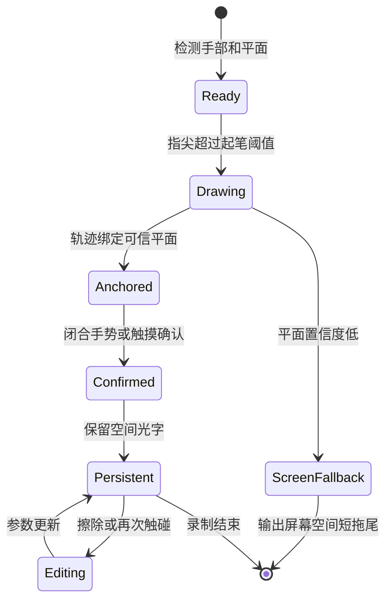
```mermaid
stateDiagram-v2
    accTitle: Spatial Light Painting States
    accDescr: The interaction states for spatial light painting from hand detection through stroke creation, world anchoring, confirmation, persistence, and fallback

    [*] --> Ready: 检测手部和平面
    Ready --> Drawing: 指尖超过起笔阈值
    Drawing --> Anchored: 轨迹绑定可信平面
    Drawing --> ScreenFallback: 平面置信度低
    Anchored --> Confirmed: 闭合手势或触摸确认
    Confirmed --> Persistent: 保留空间光字
    Persistent --> Editing: 擦除或再次触碰
    Editing --> Persistent: 参数更新
    ScreenFallback --> [*]: 输出屏幕空间短拖尾
    Persistent --> [*]: 录制结束
```

建议的联合目标可写为：`L = λp L_path + λa L_anchor + λo L_occ + λr L_render + λt L_temporal`。权重不是固定事实，必须通过梯度量级、消融实验和目标设备数据重新确定。

### 案例 02：摄像头对视矫正·视线矫正瞳孔镜头校准·面部视线表情

`PRIORITY-GAZE-EYE-CONTACT`

_图 2：本项目概念分镜。依次展示录制前、触发中和录后成片；不代表既有产品、论文实验结果或已测性能。_

**研究问题。** 前置摄像头录像时，用户看屏幕而不是镜头，回放中会产生明显的视线错位，尤其影响口播、远程会议和自拍视频。

**目标体验。** 用户打开前置录像后完成一次短校准；系统估计屏幕注视点与镜头中心的偏差，在预览中给出轻量提示，录后只重定向眼球和极小范围的眼睑/脸部形变，保留真实表情和头部运动。

**可见创新。** 把摄像头对视矫正·视线矫正的对象语义与瞳孔镜头校准的时序行为绑定，触发和参数共同改变可见结果，而不是只更换场景。 摄像头对视矫正·视线矫正触发瞳孔镜头校准时，瞳孔与虹膜被轻量重定向到镜头方向，眼睑、头姿和身份保持不变；自拍者双眼、瞳孔与镜头方向始终可见且与画面空间保持对应

**交互时间线**

- t0: 检测人脸、双眼虹膜和镜头内参，确认正脸或允许的侧脸范围。
- t1: 用户依次看屏幕中心、镜头中心和左右提示点，采集 gaze calibration 样本。
- t2: 录像中持续估计 gaze vector，并将视线目标投影到 camera-center target。
- t3: 只在视线置信度高且眼睛可见时对虹膜中心做小幅重定向。
- t4: 说话结束或脸部出框后停止修正，回到原始眼睛纹理。

**模块和信号链**

- 人脸检测与关键点：face_box[B,4]、eye_landmarks[B,2,16,2]。
- 虹膜/瞳孔估计：eye_crop[B,2,3,64,64] -> pupil_center[B,2,2]。
- 视线回归器：输入 landmarks、head_pose、screen_point，输出 gaze_vec[B,2,3]。
- 眼部局部 warp：仅修改 iris/eyelid ROI，输出 alpha[B,1,h,w] 与 warp_grid[B,h,w,2]。
- 融合器：将局部结果按 temporal confidence 与原帧混合。

`face_crop[B,3,256,256] + eye_landmarks[B,2,16,2] + head_pose[B,6] + calibration[B,K,3] -> gaze_vec[B,2,3] -> eye_warp_grid[B,2,h,w,2] + alpha[B,1,h,w] -> rgb_out[B,3,H,W]。`

**数据与训练建议**

- 数据：多机位或屏幕标定的人脸视频；包含视线目标、头姿、虹膜/眼睑关键点、眨眼、眼镜反光、侧脸和多人对话；需有身份授权。
- Loss：L_gaze（角度）、L_landmark、L_iris、L_identity、L_background、L_blink 与 L_temporal；只在眼部小 ROI 内优化，外部区域强约束为原帧。
- 指标：视线角误差、身份余弦相似度、眼睑关键点误差、眨眼保持率、双眼一致性、用户自然度评分。
- 真实性/身份约束：低置信度、强侧脸、闭眼或反光时回退原帧；不得生成新的虹膜身份特征。

**端侧预览、录后精修与控制**

- 预览：预览 720p；人脸/虹膜 分级更新，眼部 warp 分级更新；局部 ROI 处理，目标额外具体时延需在目标设备上实测，默认最大瞳孔偏移不超过虹膜直径的 12%。
- 录后：录后使用高分辨率眼部重建和双眼几何一致性优化；不对低置信度帧进行生成式补眼，避免身份、虹膜纹理和眼睑形状被改写。
- 元数据：校准点坐标；镜头内参与前摄裁切；每眼虹膜中心；head_pose；gaze_confidence；闭眼状态；修正开关与强度
- 参数：`calibration_bias`, `max_iris_shift`, `eyelid_preservation`, `confidence_threshold`, `temporal_smooth`, `face_pose_limit`, `blend_strength`
- 产品形态：前置录像中的“自然对视”开关，可作为口播、直播、会议和短视频人像模式的独立能力。

**失败与降级**

- 虹膜关键点丢失：保持原帧，不使用上一帧纹理覆盖当前眼睛。
- 侧脸超过阈值：关闭重定向，只保留轻量视线提示。
- 镜片反光干扰：降低修正强度并记录 glare flag。
- 双眼修正不一致：回退到零偏移并使用原始眼部 ROI。

**参考边界。** Apple Cinematic mode[^1]；MODNet: Real-Time Trimap-Free Portrait Matting via Objective Decomposition[^9]；SVFR: A Unified Framework for Generalized Video Face Restoration[^11]；AuthFace[^12]。这些来源只证明对应的基础能力；不能据此声称本完整特效已经量产。

#### 视线矫正专门分析

身份保持的核心不是让输出眼睛看起来更锐，而是限制允许修改的自由度。建议把编辑变量限定为小幅虹膜中心位移、局部眼睑补偿和 alpha 融合；脸型、皮肤、眉毛、睫毛、虹膜纹理和闭眼状态默认来自原帧。身份表征可由 ArcFace 类人脸识别特征、眼周局部特征和关键点几何共同计算，但身份损失只能是代理指标，不能替代人类对自然度和个人特征的判断。

建议目标：`L = λg L_gaze + λlm L_landmark + λid L_identity + λbg L_outside + λb L_blink + λt L_temporal`。其中 `L_outside` 对眼部 ROI 外区域施加强保持；`L_blink` 避免闭眼被错误补成睁眼；低置信度样本不进入生成式补眼分支。

训练数据应覆盖屏幕中心、镜头中心、左右提示点、多头姿、不同镜片反光和不同眼型，并记录每只眼的可见性。评估不能只看视线角误差，还要同时看身份相似度、眼睑关键点、眨眼保持、双眼一致性和用户自然度。

### 案例 03：人体肢体光绘肢体动作累积·光轨光学

`PRIORITY-BODY-LIGHT-TRACE`

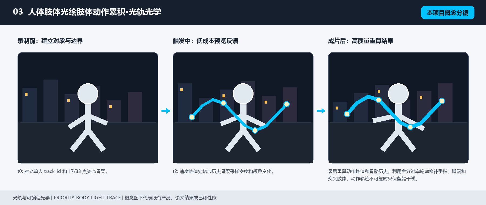
_图 3：本项目概念分镜。依次展示录制前、触发中和录后成片；不代表既有产品、论文实验结果或已测性能。_

**研究问题。** 整个人体运动拖尾容易变成普通半透明重影，既看不清动作结构，也缺少身体节奏。

**目标体验。** 舞者抬臂、转身和落步时，轨迹沿骨骼和轮廓产生可读的发光结构；身体主体保持清晰，历史姿态作为有方向的光线而非整帧复制。

**可见创新。** 把人体肢体光绘的对象语义与肢体动作累积的时序行为绑定，触发和参数共同改变可见结果，而不是只更换场景。 人体肢体光绘触发肢体动作累积时，手腕、脚踝和躯干关节分别拉出光绘线，组合成完整动作轮廓；人体关节与四肢运动路径始终可见且与画面空间保持对应

**交互时间线**

- t0: 建立单人 track_id 和 17/33 点姿态骨架。
- t1: 识别起势，记录关节速度和动作阶段。
- t2: 速度峰值处增加历史骨架采样密度和颜色变化。
- t3: 当前姿态进入稳定段，旧姿态沿关节方向展开为光线。
- t4: 动作停止或主体出框，按骨骼置信度逐段淡出。

**模块和信号链**

- 姿态模型：pose_heatmap[B,J,h,w] -> keypoints[B,J,3]。
- 骨骼历史：缓存 keypoints[T,J,3]、joint_conf[T,J] 和 phase[T]。
- 关节轨迹：按骨段连接生成 polyline[B,J-1,T,3]。
- 轮廓与遮挡：body_mask[B,1,H,W] 与 depth ordering 分层。
- 渲染：骨架 emissive、轮廓 rim 和 afterimage alpha 分开合成。

`rgb[B,3,H,W] + pose[B,J,3] + body_mask[B,1,H,W] + motion_phase[T,J] -> skeleton_path[T,J,3] -> line_layer[B,3,H,W] + alpha[B,1,H,W] -> rgb_out。`

**数据与训练建议**

- 数据：室内外手部/人体/移动光源轨迹视频；同步相机姿态、触摸采样、手部关键点和可选深度；合成数据覆盖不同笔画、遮挡、曝光与平面姿态。
- Loss：L_path（轨迹点与速度）、L_anchor（平面/世界锚点）、L_occ（遮挡边界）、L_render（发光层重建）与 L_temp（亮度和位置时序连续）按任务分阶段组合。
- 指标：轨迹重投影误差、遮挡 F1、笔画断裂率、锚点漂移、原画面高光保真、用户起笔/闭合成功率。
- 真实性/身份约束：光效可夸张，但原始人物、场景几何和真实高光必须保留可回退版本。

**端侧预览、录后精修与控制**

- 预览：半分辨率姿态和 mask，分级更新 合成；缓存规模按设备档位和热状态动态限制。
- 录后：录后重算动作峰值和骨骼历史，利用全分辨率轮廓修补手指、脚端和交叉肢体；动作轨迹不可靠时只保留躯干线。
- 元数据：track_id；keypoints；joint_confidence；motion_phase；sampled_pose_indices；mask version；effect seed
- 参数：`history_length`, `joint_density`, `line_width`, `phase_color`, `afterimage_alpha`, `body_occlusion`, `fade_curve`
- 产品形态：舞蹈/运动录像中的“骨骼光绘”模式，适合短视频模板和音乐节拍玩法。

**失败与降级**

- 多人身份交换：只输出最高置信度单人轨迹。
- 手脚遮挡：关节分支降级为躯干轮廓。
- 快速动作：降低采样密度而不是拉伸错误轨迹。
- 背景边缘泄漏：收缩 mask 并混合原始帧。

**参考边界。** DJI subject tracking[^2]；Blackmagic Camera app[^7]。这些来源只证明对应的基础能力；不能据此声称本完整特效已经量产。

### 案例 04：手持灯棒移动光轨灯棒星芒节点·光轨光学

`PRIORITY-SOURCE-STARBURST`

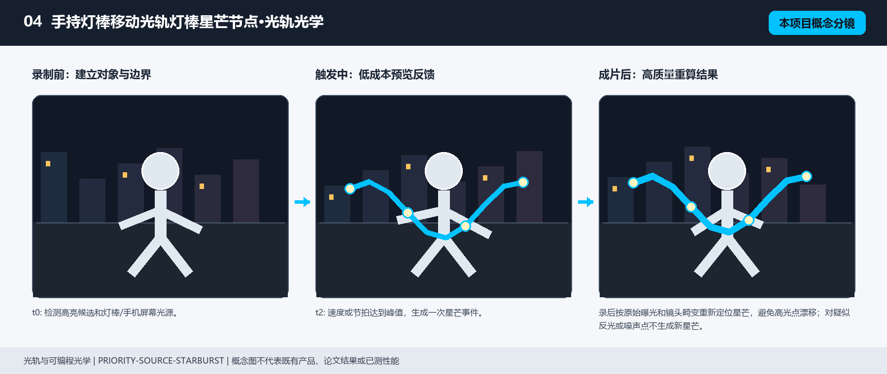
_图 4：本项目概念分镜。依次展示录制前、触发中和录后成片；不代表既有产品、论文实验结果或已测性能。_

**研究问题。** 移动点光源的星芒如果只靠固定滤镜，无法随光源亮度、镜头方向和遮挡变化，容易像贴纸。

**目标体验。** 用户拿灯棒划过夜景，灯尖在速度峰值处爆出短暂星芒；光源移动轨迹继续保留，星芒方向与镜头和真实高光保持一致。

**可见创新。** 把手持灯棒移动光轨的对象语义与灯棒星芒节点的时序行为绑定，触发和参数共同改变可见结果，而不是只更换场景。 手持灯棒移动光轨触发灯棒星芒节点时，拖尾转折点绽放星芒节点，移动段仍保持连续光线；手持灯棒或移动点光源始终可见且与画面空间保持对应

**交互时间线**

- t0: 检测高亮候选和灯棒/手机屏幕光源。
- t1: 建立光源 track_id 与亮度历史。
- t2: 速度或节拍达到峰值，生成一次星芒事件。
- t3: 按光源朝向和曝光估计调节射线长度。
- t4: 光源被遮挡或离开后，星芒衰减并回到普通高光。

**模块和信号链**

- 高光检测与连通域提取。
- 光源跟踪和亮度时间滤波。
- 相机姿态/镜头模型估计光学轴。
- 星芒射线几何生成与颜色分离。
- 遮挡 mask、bloom 和原视频混合。

`rgb[B,3,H,W] -> luminance[B,1,H,W] + blobs[N,5] + imu[B,6] -> source_track[N,T,2] -> rays[N,R,2] -> bloom/ray_layer[B,3,H,W] -> rgb_out。`

**数据与训练建议**

- 数据：室内外手部/人体/移动光源轨迹视频；同步相机姿态、触摸采样、手部关键点和可选深度；合成数据覆盖不同笔画、遮挡、曝光与平面姿态。
- Loss：L_path（轨迹点与速度）、L_anchor（平面/世界锚点）、L_occ（遮挡边界）、L_render（发光层重建）与 L_temp（亮度和位置时序连续）按任务分阶段组合。
- 指标：轨迹重投影误差、遮挡 F1、笔画断裂率、锚点漂移、原画面高光保真、用户起笔/闭合成功率。
- 真实性/身份约束：光效可夸张，但原始人物、场景几何和真实高光必须保留可回退版本。

**端侧预览、录后精修与控制**

- 预览：低分辨率高光检测 分级更新，星芒实例最多 8 个；具体时延和算力预算需在目标设备上实测。
- 录后：录后按原始曝光和镜头畸变重新定位星芒，避免高光点漂移；对疑似反光或噪声点不生成新星芒。
- 元数据：source_track_id；centroid；luminance peak；ray angle；ray count；occlusion confidence；exposure state
- 参数：`ray_count`, `ray_length`, `ray_angle`, `threshold`, `bloom_radius`, `chromatic_split`, `event_hold`
- 产品形态：夜景录像中的“动态星芒”滤镜，支持点按光源锁定和节拍模式。

**失败与降级**

- 高光过密：只保留前 8 个显著光源。
- 光源跟踪跳变：冻结上一位置并缩短射线。
- 滚动快门不一致：降低射线长度。
- 反光误检：要求连续两帧亮度和位置确认。

**参考边界。** DJI subject tracking[^2]；Blackmagic Camera app[^7]。这些来源只证明对应的基础能力；不能据此声称本完整特效已经量产。

### 案例 05：世界空间锚定书写镜头移动固字·光轨光学

`PRIORITY-WORLD-ANCHOR-LIGHT`

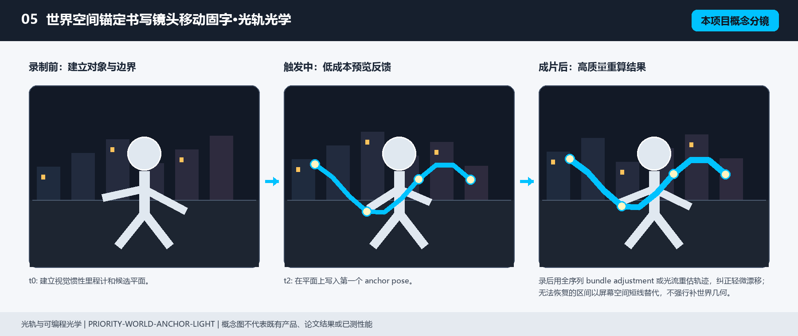
_图 5：本项目概念分镜。依次展示录制前、触发中和录后成片；不代表既有产品、论文实验结果或已测性能。_

**研究问题。** 光绘如果不锁定真实场景，镜头一动就会漂移，无法形成空间叙事。

**目标体验。** 用户沿墙面或地面划出一条线，手机前进后线仍停留在原来的空间位置；路人走过时线被遮挡，用户可确认它确实存在于场景中。

**可见创新。** 把世界空间锚定书写的对象语义与镜头移动固字的时序行为绑定，触发和参数共同改变可见结果，而不是只更换场景。 世界空间锚定书写触发镜头移动固字时，发光文字固定在原场景位置，镜头平移旋转后仍保持透视和遮挡；场景平面上的发光文字始终可见且与画面空间保持对应

**交互时间线**

- t0: 建立视觉惯性里程计和候选平面。
- t1: 指尖/灯源轨迹连续超过稳定窗口。
- t2: 在平面上写入第一个 anchor pose。
- t3: 相机移动时重投影光线并更新前后遮挡。
- t4: anchor 丢失或用户擦除时，按世界坐标回收光线。

**模块和信号链**

- VIO/IMU 融合相机位姿。
- 单目深度和局部平面估计。
- 轨迹采样与世界坐标转换。
- 动态前景分割与深度排序。
- 世界空间线段重投影、光照和回退合成。

`rgb[B,3,H,W] + imu[B,6] + depth[B,1,H,W] + camera_pose[B,4,4] + path[T,2] -> anchor_path[T,3] -> reproj_path[B,T,2] + occlusion[B,1,H,W] -> rgb_out。`

**数据与训练建议**

- 数据：室内外手部/人体/移动光源轨迹视频；同步相机姿态、触摸采样、手部关键点和可选深度；合成数据覆盖不同笔画、遮挡、曝光与平面姿态。
- Loss：L_path（轨迹点与速度）、L_anchor（平面/世界锚点）、L_occ（遮挡边界）、L_render（发光层重建）与 L_temp（亮度和位置时序连续）按任务分阶段组合。
- 指标：轨迹重投影误差、遮挡 F1、笔画断裂率、锚点漂移、原画面高光保真、用户起笔/闭合成功率。
- 真实性/身份约束：光效可夸张，但原始人物、场景几何和真实高光必须保留可回退版本。

**端侧预览、录后精修与控制**

- 预览：VIO 分级更新，深度 分级更新，世界路径最多 256 个采样点；跟踪丢失时冻结最后可信锚点，保证预览连续。
- 录后：录后用全序列 bundle adjustment 或光流重估轨迹，纠正轻微漂移；无法恢复的区间以屏幕空间短线替代，不强行补世界几何。
- 元数据：initial_camera_pose；anchor_pose；plane_normal；path samples；camera keyframes；anchor confidence；occlusion events
- 参数：`anchor_persistence`, `plane_snap`, `path_sampling`, `reprojection_smooth`, `occlusion_strength`, `drift_limit`, `fade_rate`
- 产品形态：支持 AR 光绘、地面文字、墙面签名和空间标记的录像基础能力。

**失败与降级**

- VIO 失锁：冻结最后可信世界层并显示短时屏幕拖尾。
- 平面不稳定：禁止固化锚点。
- 动态物体被当平面：缩小作用区并回退原帧。
- 深度反转：关闭前后遮挡，只保留发光线。

**参考边界。** DJI subject tracking[^2]；Blackmagic Camera app[^7]。这些来源只证明对应的基础能力；不能据此声称本完整特效已经量产。

### 案例 06：节拍星芒变色光轨强拍变色脉冲·光轨光学

`PRIORITY-BEAT-LIGHT-PULSE`

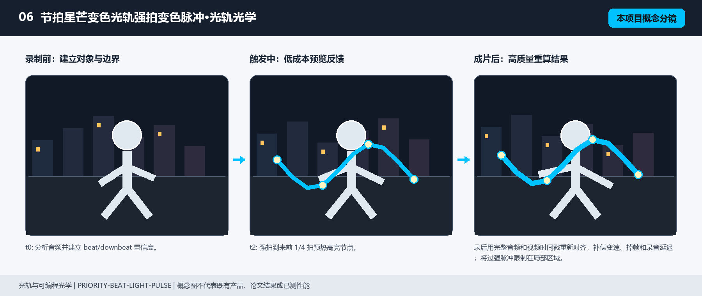
_图 6：本项目概念分镜。依次展示录制前、触发中和录后成片；不代表既有产品、论文实验结果或已测性能。_

**研究问题。** 节拍特效常把全画面统一闪烁，容易刺眼且与用户动作没有关系。

**目标体验。** 音乐强拍到来时，已有光轨节点依次增强而不是整屏闪白；用户可以用手部轨迹制造节拍路径，形成能读出节奏的动态光绘。

**可见创新。** 把节拍星芒变色光轨的对象语义与强拍变色脉冲的时序行为绑定，触发和参数共同改变可见结果，而不是只更换场景。 节拍星芒变色光轨触发强拍变色脉冲时，整条历史光轨在强拍瞬间变色并向外脉冲，拍间平滑回落；随音乐变化的历史光轨始终可见且与画面空间保持对应

**交互时间线**

- t0: 分析音频并建立 beat/downbeat 置信度。
- t1: 录像中保存轨迹节点与事件时间戳。
- t2: 强拍到来前 1/4 拍预热高亮节点。
- t3: 强拍时按路径顺序释放亮度脉冲。
- t4: 音乐段落切换时更新色板并平滑衰减旧节点。

**模块和信号链**

- 音频 FFT/节拍估计。
- 轨迹节点和时间窗口缓存。
- beat phase 与视频 PTS 对齐。
- 节点级亮度/颜色脉冲。
- 限幅、抗闪烁与输出合成。

`audio[T,1] -> mel[T,F] -> beat_phase[T] + confidence[T]; path_nodes[N,3] + phase -> pulse[N,1] -> emissive_layer[B,3,H,W] -> rgb_out。`

**数据与训练建议**

- 数据：室内外手部/人体/移动光源轨迹视频；同步相机姿态、触摸采样、手部关键点和可选深度；合成数据覆盖不同笔画、遮挡、曝光与平面姿态。
- Loss：L_path（轨迹点与速度）、L_anchor（平面/世界锚点）、L_occ（遮挡边界）、L_render（发光层重建）与 L_temp（亮度和位置时序连续）按任务分阶段组合。
- 指标：轨迹重投影误差、遮挡 F1、笔画断裂率、锚点漂移、原画面高光保真、用户起笔/闭合成功率。
- 真实性/身份约束：光效可夸张，但原始人物、场景几何和真实高光必须保留可回退版本。

**端侧预览、录后精修与控制**

- 预览：音频分析 分级更新；具体时延和算力预算需在目标设备上实测。
- 录后：录后用完整音频和视频时间戳重新对齐，补偿变速、掉帧和录音延迟；将过强脉冲限制在局部区域。
- 元数据：audio_pts；beat timestamps；tempo estimate；path node ids；phase offset；color section；flash safety limit
- 参数：`beat_gain`, `prebeat_time`, `pulse_width`, `color_palette`, `node_order`, `flash_limit`, `decay`
- 产品形态：音乐录像模式中的局部节拍光效，支持人手、灯棒和文字路径作为输入。

**失败与降级**

- 节拍置信度低：使用音量包络替代精确 beat。
- 音视频不同步：按视频 PTS 重采样音频相位。
- 连续强拍过密：合并相邻脉冲。
- 亮度过高：触发安全限幅并保留原始曝光。

**参考边界。** DJI subject tracking[^2]；Blackmagic Camera app[^7]。这些来源只证明对应的基础能力；不能据此声称本完整特效已经量产。

### 案例 07：时间分身延迟跟随·身体运动分身

`PRIORITY-TIME-DELAY-CLONE`

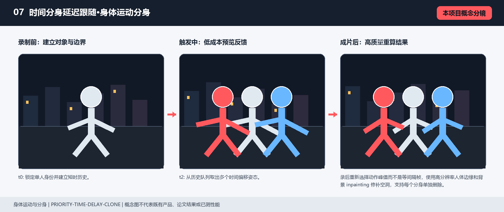
_图 7：本项目概念分镜。依次展示录制前、触发中和录后成片；不代表既有产品、论文实验结果或已测性能。_

**研究问题。** 普通延迟分身通常整帧复制，背景和主体一起重影，遮挡关系不真实。

**目标体验。** 人物向前跑时，延迟分身只保留人体，前后几个姿态沿运动方向排列；背景保持实时，主体经过柱子时分身被柱子正确截断。

**可见创新。** 把时间分身的对象语义与延迟跟随的时序行为绑定，触发和参数共同改变可见结果，而不是只更换场景。 时间分身触发延迟跟随时，完整时间分身沿主身旧路径延迟跟随并逐步淡出；同一人物全身轮廓始终可见且与画面空间保持对应

**交互时间线**

- t0: 锁定单人身份并建立短时历史。
- t1: 主体进入运动速度门限。
- t2: 从历史队列取出多个时间偏移姿态。
- t3: 分身按深度顺序合成，当前主体保持最高优先级。
- t4: 速度下降后减少分身数量并淡出。

**模块和信号链**

- 人像/人体检测与 tracking。
- 人体 mask 和深度排序。
- 历史帧环形缓冲与按时间取样。
- 分身 ROI 重投影和边缘修补。
- 前景/背景/遮挡层合成。

`rgb[B,T,3,H,W] + track[B,T,4] + body_mask[B,T,1,H,W] + depth -> delayed_rois[K,3,h,w] + alpha[K,1,h,w] -> layered_composite[B,3,H,W]。`

**数据与训练建议**

- 数据：多动作人体视频、姿态与人体 mask、长短遮挡片段、不同服装和背景；通过时间偏移与轨迹重排生成分身监督。
- Loss：L_mask、L_pose、L_id、L_flow、L_occ 与 L_temp；对分身外区域使用背景重建约束，对身份敏感 ROI 使用特征一致性。
- 指标：身份相似度、姿态误差、mask 边界 F1、遮挡顺序错误率、克隆闪烁率和动作时间偏差。
- 真实性/身份约束：不得把历史分身误写成现场真实人物；录制元数据应明确副本时间戳。

**端侧预览、录后精修与控制**

- 预览：预览 540p ROI 缓冲 0.8 s，最多 4 个分身；具体时延和算力预算需在目标设备上实测。
- 录后：录后重新选择动作峰值而不是等间隔帧，使用高分辨率人体边缘和背景 inpainting 修补空洞，支持每个分身单独删除。
- 元数据：track_id；delay offsets；body masks；depth order；crop boxes；occlusion confidence；fade state
- 参数：`clone_count`, `delay_step`, `clone_scale`, `alpha_curve`, `mask_feather`, `depth_bias`, `motion_threshold`
- 产品形态：运动录像中的时间分身模式，预览可调延迟，录后可重新选姿态。

**失败与降级**

- 身份丢失：冻结最近可信分身并快速淡出。
- 人体与背景粘连：收缩 mask，分身仅保留骨架轮廓。
- 遮挡缺帧：跳过该分身而不复制错误内容。
- 内存不足：降低 ROI 分辨率和分身数量。

**参考边界。** DJI subject tracking[^2]；Robust High-Resolution Video Matting with Temporal Guidance[^8]；AuthFace[^12]。这些来源只证明对应的基础能力；不能据此声称本完整特效已经量产。

### 案例 08：影子分身影子逆动作·身体运动分身

`PRIORITY-SHADOW-REVERSE`

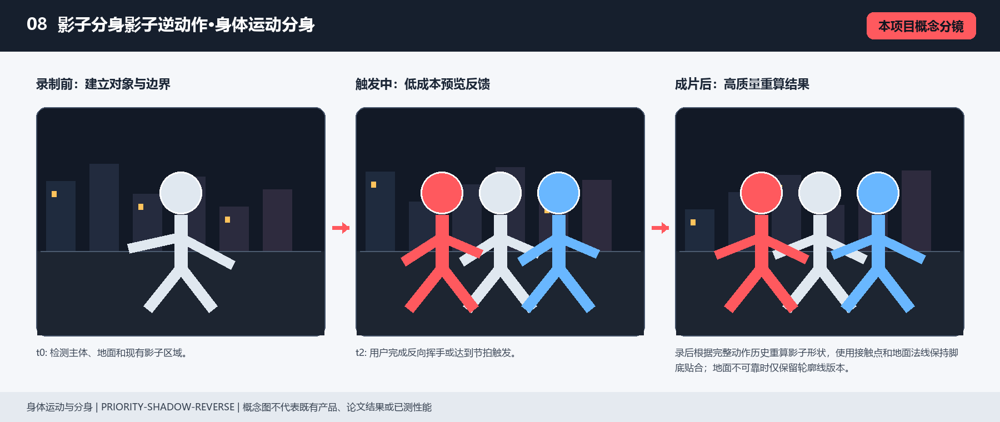
_图 8：本项目概念分镜。依次展示录制前、触发中和录后成片；不代表既有产品、论文实验结果或已测性能。_

**研究问题。** 人物反向影子容易与真实阴影混合，用户看不出是动作回放还是光影变化。

**目标体验。** 人物抬手后，影子先沿地面向后回收，再反向完成抬手动作；真实人物保持正向，影子成为一个可读的时间分身。

**可见创新。** 把影子分身的对象语义与影子逆动作的时序行为绑定，触发和参数共同改变可见结果，而不是只更换场景。 影子分身触发影子逆动作时，影子分身倒序表演上一段动作，主体保持当前时间；人物投在地面的影子始终可见且与画面空间保持对应

**交互时间线**

- t0: 检测主体、地面和现有影子区域。
- t1: 记录动作历史与影子锚点。
- t2: 用户完成反向挥手或达到节拍触发。
- t3: 影子按逆序采样并投影到地面。
- t4: 影子回到主体脚底并平滑消失。

**模块和信号链**

- body/pose segmentation。
- 地面平面和阴影估计。
- 动作历史逆序队列。
- 影子形变、软边和接触点投影。
- 真实阴影与合成影子分层混合。

`body_mask[B,1,H,W] + ground_plane[4] + pose_history[T,J,3] + shadow_mask -> reverse_pose[T,J,3] -> projected_shadow[B,1,H,W] + contact_alpha -> rgb_out。`

**数据与训练建议**

- 数据：多动作人体视频、姿态与人体 mask、长短遮挡片段、不同服装和背景；通过时间偏移与轨迹重排生成分身监督。
- Loss：L_mask、L_pose、L_id、L_flow、L_occ 与 L_temp；对分身外区域使用背景重建约束，对身份敏感 ROI 使用特征一致性。
- 指标：身份相似度、姿态误差、mask 边界 F1、遮挡顺序错误率、克隆闪烁率和动作时间偏差。
- 真实性/身份约束：不得把历史分身误写成现场真实人物；录制元数据应明确副本时间戳。

**端侧预览、录后精修与控制**

- 预览：预览 540p 影子层、最多 3 个历史姿态；具体时延和算力预算需在目标设备上实测。
- 录后：录后根据完整动作历史重算影子形状，使用接触点和地面法线保持脚底贴合；地面不可靠时仅保留轮廓线版本。
- 元数据：ground_plane；shadow anchor；pose history；reverse window；contact points；shadow confidence；trigger event
- 参数：`reverse_window`, `shadow_length`, `softness`, `opacity`, `contact_strength`, `pose_sampling`, `return_speed`
- 产品形态：具有时间方向感的影子分身录像模式，适合舞蹈、变装和剧情短片。

**失败与降级**

- 无地面：回退为主体旁的二维影子轮廓。
- 真实阴影混杂：减弱原阴影并标记低置信度。
- 脚部遮挡：冻结接触点。
- 反向动作过长：限制窗口并自动收束。

**参考边界。** DJI subject tracking[^2]；Robust High-Resolution Video Matting with Temporal Guidance[^8]；AuthFace[^12]。这些来源只证明对应的基础能力；不能据此声称本完整特效已经量产。

### 案例 09：走位剪影队列姿态阶段分色·身体运动分身

`PRIORITY-POSE-COLOR-SLICES`

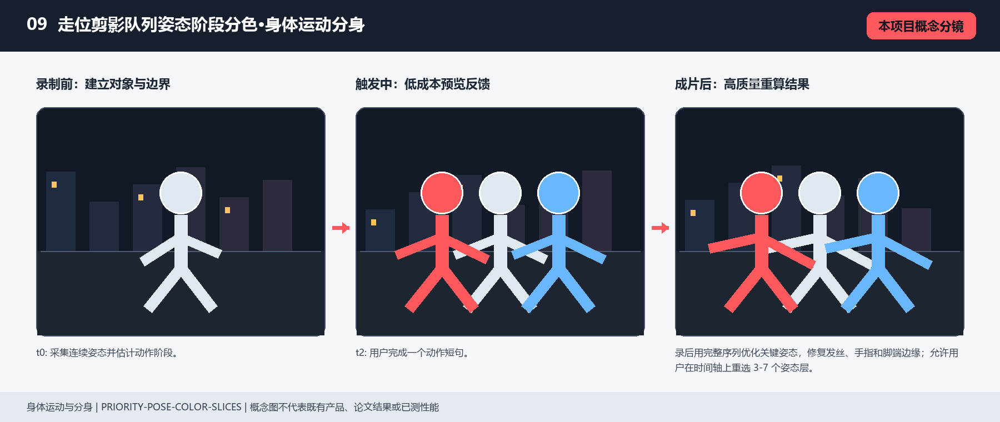
_图 9：本项目概念分镜。依次展示录制前、触发中和录后成片；不代表既有产品、论文实验结果或已测性能。_

**研究问题。** 多姿态效果如果按固定间隔抽帧，会抓到大量相似姿态，动作结构和颜色层次都不清楚。

**目标体验。** 舞者起跳、转身、落地三个关键姿态分别呈现冷、中、暖三种色层；颜色对应动作阶段，脚底和躯干对齐，形成可读的动作谱。

**可见创新。** 把走位剪影队列的对象语义与姿态阶段分色的时序行为绑定，触发和参数共同改变可见结果，而不是只更换场景。 走位剪影队列触发姿态阶段分色时，不同动作阶段的姿态切片显示不同颜色并保持顺序；连续走位的身体剪影始终可见且与画面空间保持对应

**交互时间线**

- t0: 采集连续姿态并估计动作阶段。
- t1: 找到速度峰值、转向点和接触点。
- t2: 用户完成一个动作短句。
- t3: 从历史中选择差异最大的姿态而非等间隔帧。
- t4: 旧姿态按颜色和深度排序淡出。

**模块和信号链**

- pose tracking 与关节置信度。
- 动作相位分割。
- 姿态差异/峰值选择器。
- 人体 ROI 着色和轮廓提取。
- 分层遮挡和颜色合成。

`keypoints[T,J,3] + joint_conf[T,J] -> phase[T] + pose_indices[K] -> pose_masks[K,1,H,W] + color_codes[K,3] -> layered_pose[B,3,H,W]。`

**数据与训练建议**

- 数据：多动作人体视频、姿态与人体 mask、长短遮挡片段、不同服装和背景；通过时间偏移与轨迹重排生成分身监督。
- Loss：L_mask、L_pose、L_id、L_flow、L_occ 与 L_temp；对分身外区域使用背景重建约束，对身份敏感 ROI 使用特征一致性。
- 指标：身份相似度、姿态误差、mask 边界 F1、遮挡顺序错误率、克隆闪烁率和动作时间偏差。
- 真实性/身份约束：不得把历史分身误写成现场真实人物；录制元数据应明确副本时间戳。

**端侧预览、录后精修与控制**

- 预览：预览半分辨率 mask，最多 5 层；具体时延和算力预算需在目标设备上实测。
- 录后：录后用完整序列优化关键姿态，修复发丝、手指和脚端边缘；允许用户在时间轴上重选 3-7 个姿态层。
- 元数据：pose indices；phase labels；joint confidence；foot contacts；layer colors；occlusion order；event PTS
- 参数：`layer_count`, `phase_threshold`, `color_map`, `slice_offset`, `mask_feather`, `alpha`, `selection_mode`
- 产品形态：舞蹈、体操和运动短片中的动作分解模式，支持自动选峰和手动选帧。

**失败与降级**

- 姿态相似：减少层数并扩大动作差异门限。
- 肢体交叉：丢弃交叉区域低置信像素。
- 脚底不可见：隐藏接触对齐。
- 颜色过饱和：回到亮度编码而非色相编码。

**参考边界。** DJI subject tracking[^2]；Robust High-Resolution Video Matting with Temporal Guidance[^8]；AuthFace[^12]。这些来源只证明对应的基础能力；不能据此声称本完整特效已经量产。

### 案例 10：双向镜像人格镜像人格脱离·身体运动分身

`PRIORITY-MIRROR-BREAK`

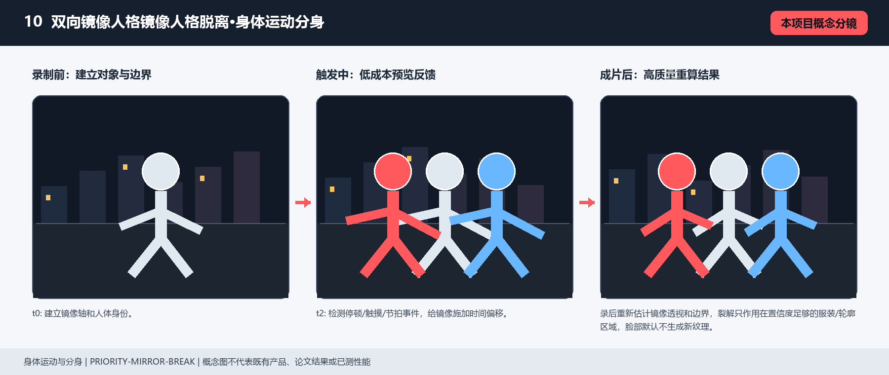
_图 10：本项目概念分镜。依次展示录制前、触发中和录后成片；不代表既有产品、论文实验结果或已测性能。_

**研究问题。** 镜像分身通常只是左右翻转，缺少“镜像副本拥有不同时间状态”的戏剧性。

**目标体验。** 人物抬手时镜像同步；当用户做出停顿手势，镜像延迟半拍后继续动作并从镜面边界裂开，最后两者重新对齐。

**可见创新。** 把双向镜像人格的对象语义与镜像人格脱离的时序行为绑定，触发和参数共同改变可见结果，而不是只更换场景。 双向镜像人格触发镜像人格脱离时，镜像副本从对称位置脱离并沿独立路径移动；人物左右两侧的镜像身体始终可见且与画面空间保持对应

**交互时间线**

- t0: 建立镜像轴和人体身份。
- t1: 复制当前姿态作为同步镜像。
- t2: 检测停顿/触摸/节拍事件，给镜像施加时间偏移。
- t3: 镜像边界出现裂解材质和局部错位。
- t4: 用户再次动作或超时，镜像回到同步状态。

**模块和信号链**

- 人体 mask 与姿态 tracking。
- 镜像轴估计和透视校正。
- 延迟队列与姿态差异检测。
- 裂解边界/碎片材质生成。
- 镜像层与真实层遮挡合成。

`body_roi[B,3,h,w] + mirror_axis[3] + pose_history[T,J,3] + trigger -> mirrored_roi[B,3,h,w] + delay_state -> fragment_alpha[B,1,h,w] -> rgb_out。`

**数据与训练建议**

- 数据：多动作人体视频、姿态与人体 mask、长短遮挡片段、不同服装和背景；通过时间偏移与轨迹重排生成分身监督。
- Loss：L_mask、L_pose、L_id、L_flow、L_occ 与 L_temp；对分身外区域使用背景重建约束，对身份敏感 ROI 使用特征一致性。
- 指标：身份相似度、姿态误差、mask 边界 F1、遮挡顺序错误率、克隆闪烁率和动作时间偏差。
- 真实性/身份约束：不得把历史分身误写成现场真实人物；录制元数据应明确副本时间戳。

**端侧预览、录后精修与控制**

- 预览：预览 540p 镜像 ROI，裂解碎片最多 96 个；具体时延和算力预算需在目标设备上实测。
- 录后：录后重新估计镜像透视和边界，裂解只作用在置信度足够的服装/轮廓区域，脸部默认不生成新纹理。
- 元数据：mirror_axis；pose history；delay state；fracture seed；trigger timestamps；identity；blend curve
- 参数：`mirror_offset`, `delay`, `fracture_progress`, `fragment_count`, `axis_smoothing`, `alpha`, `remerge_time`
- 产品形态：双人镜像、镜面舞蹈和变身视频中的可控镜像角色模式。

**失败与降级**

- 镜像轴漂移：固定最近稳定轴。
- 人物越过轴：缩小镜像区域并淡出。
- 脸部错位：锁定脸部原图。
- 碎片过多：退回简单镜像叠加。

**参考边界。** DJI subject tracking[^2]；Robust High-Resolution Video Matting with Temporal Guidance[^8]；AuthFace[^12]。这些来源只证明对应的基础能力；不能据此声称本完整特效已经量产。

### 案例 11：多人对话对视重定向对话对象重定向·面部视线表情

`PRIORITY-DIALOGUE-GAZE-REDIRECT`

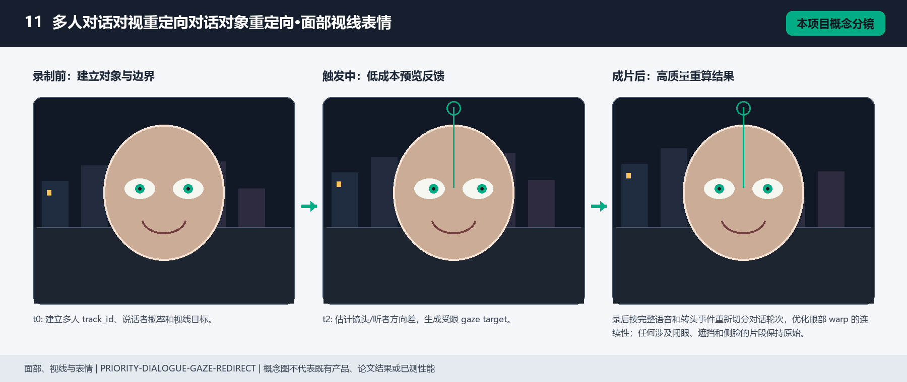
_图 11：本项目概念分镜。依次展示录制前、触发中和录后成片；不代表既有产品、论文实验结果或已测性能。_

**研究问题。** 多人对话录像中，人物看向对方但镜头位置不在对话轴上，观众会感到视线关系断裂。

**目标体验。** 两个人对话时，系统只在说话者和听者都稳定可见的片段轻微调整视线方向，使对话更像对镜头旁的自然交流；头部姿态和嘴型不被改写。

**可见创新。** 把多人对话对视重定向的对象语义与对话对象重定向的时序行为绑定，触发和参数共同改变可见结果，而不是只更换场景。 多人对话对视重定向触发对话对象重定向时，双方眼球与虹膜朝向被重定向到对方眼睛，形成连续虚拟对视；对话双方的眼球、虹膜和目标人物始终可见且与画面空间保持对应

**交互时间线**

- t0: 建立多人 track_id、说话者概率和视线目标。
- t1: 说话峰值开始，锁定当前听者。
- t2: 估计镜头/听者方向差，生成受限 gaze target。
- t3: 在说话窗口内做小幅眼球重定向。
- t4: 说话者切换或遮挡发生，立即回到原始眼睛。

**模块和信号链**

- 多人脸检测与 tracking。
- 语音活动检测和说话者关联。
- gaze vector 与对话图推理。
- 眼部 ROI warp 与表情保护。
- 按说话者事件合成和回退。

`faces[N,3,h,w] + landmarks[N,68,2] + audio[T] + relation_graph[N,N] -> speaker_prob[N,T] + target_vec[N,T,3] -> eye_warp[N,h,w,2] + alpha -> rgb_out。`

**数据与训练建议**

- 数据：多机位或屏幕标定的人脸视频；包含视线目标、头姿、虹膜/眼睑关键点、眨眼、眼镜反光、侧脸和多人对话；需有身份授权。
- Loss：L_gaze（角度）、L_landmark、L_iris、L_identity、L_background、L_blink 与 L_temporal；只在眼部小 ROI 内优化，外部区域强约束为原帧。
- 指标：视线角误差、身份余弦相似度、眼睑关键点误差、眨眼保持率、双眼一致性、用户自然度评分。
- 真实性/身份约束：低置信度、强侧脸、闭眼或反光时回退原帧；不得生成新的虹膜身份特征。

**端侧预览、录后精修与控制**

- 预览：多人脸 分级更新、眼部 ROI 分级更新；具体时延和算力预算需在目标设备上实测。
- 录后：录后按完整语音和转头事件重新切分对话轮次，优化眼部 warp 的连续性；任何涉及闭眼、遮挡和侧脸的片段保持原始。
- 元数据：person ids；speaker probability；listener id；gaze vectors；dialogue turns；eye confidence；warp amount
- 参数：`target_bias`, `max_gaze_shift`, `turn_smoothing`, `speaker_threshold`, `eye_blend`, `turn_hold`, `side_face_limit`
- 产品形态：多人采访、短剧和直播录像中的自然对视增强模式。

**失败与降级**

- 说话者不确定：不做重定向。
- 多人重叠：只处理最前且高置信人脸。
- 闭眼：保持原帧。
- 视线差过大：分段减弱，禁止跨大角度生成。

**参考边界。** Apple Cinematic mode[^1]；MODNet: Real-Time Trimap-Free Portrait Matting via Objective Decomposition[^9]；SVFR: A Unified Framework for Generalized Video Face Restoration[^11]；AuthFace[^12]。这些来源只证明对应的基础能力；不能据此声称本完整特效已经量产。

### 案例 12：视线点亮目标视线扫光路径·面部视线表情

`PRIORITY-GAZE-GLOW-TRAIL`

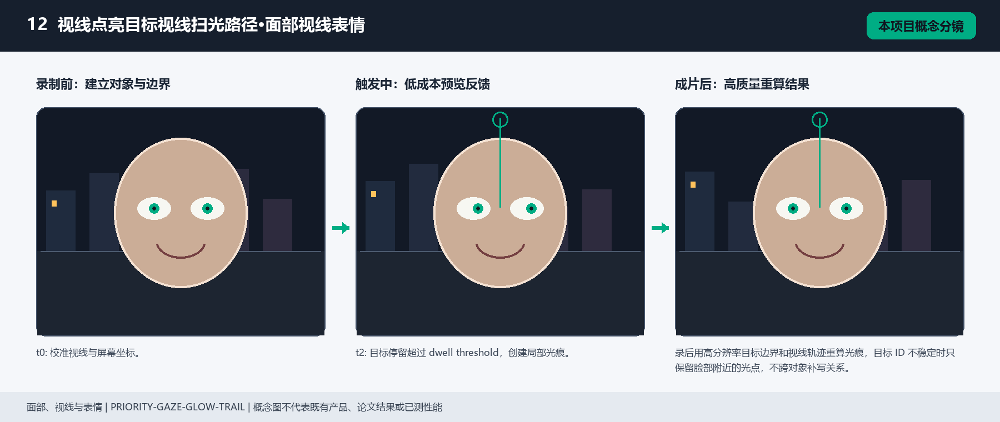
_图 12：本项目概念分镜。依次展示录制前、触发中和录后成片；不代表既有产品、论文实验结果或已测性能。_

**研究问题。** 视线驱动光效若只围绕脸部发光，用户看哪里与画面发生什么之间缺少明确因果。

**目标体验。** 人物扫视一排霓虹招牌，视线经过的目标依次留下短暂光痕；镜头转回时，光痕按原顺序回收，形成眼神引导的叙事线。

**可见创新。** 把视线点亮目标的对象语义与视线扫光路径的时序行为绑定，触发和参数共同改变可见结果，而不是只更换场景。 视线点亮目标触发视线扫光路径时，物体按被注视顺序依次点亮并留下短时可见路径；被凝视的物体实例始终可见且与画面空间保持对应

**交互时间线**

- t0: 校准视线与屏幕坐标。
- t1: 视线射线命中第一个高亮目标。
- t2: 目标停留超过 dwell threshold，创建局部光痕。
- t3: 视线移动到下一个目标，上一目标进入衰减。
- t4: 视线回看或离开画面，光痕按时间顺序收束。

**模块和信号链**

- 人脸/虹膜跟踪。
- 视线射线与目标检测。
- 目标 ID、停留和访问顺序状态机。
- 目标边缘/路径光痕渲染。
- 遮挡、衰减与原视频合成。

`eye_landmarks[B,2,16,2] + head_pose[B,6] + objects[N,box,feat] -> gaze_ray[B,3] -> hit_id[N] + dwell_state -> trail_state[N,T] -> local_glow[B,3,H,W]。`

**数据与训练建议**

- 数据：多机位或屏幕标定的人脸视频；包含视线目标、头姿、虹膜/眼睑关键点、眨眼、眼镜反光、侧脸和多人对话；需有身份授权。
- Loss：L_gaze（角度）、L_landmark、L_iris、L_identity、L_background、L_blink 与 L_temporal；只在眼部小 ROI 内优化，外部区域强约束为原帧。
- 指标：视线角误差、身份余弦相似度、眼睑关键点误差、眨眼保持率、双眼一致性、用户自然度评分。
- 真实性/身份约束：低置信度、强侧脸、闭眼或反光时回退原帧；不得生成新的虹膜身份特征。

**端侧预览、录后精修与控制**

- 预览：对象检测 分级更新、gaze 分级更新、光痕 分级更新；具体时延和算力预算需在目标设备上实测。
- 录后：录后用高分辨率目标边界和视线轨迹重算光痕，目标 ID 不稳定时只保留脸部附近的光点，不跨对象补写关系。
- 元数据：gaze calibration；hit target IDs；dwell start/end；target confidence；trail order；occlusion state；decay timestamps
- 参数：`dwell_time`, `trail_length`, `glow_radius`, `target_limit`, `gaze_smoothing`, `decay_rate`, `color_order`
- 产品形态：视线探索、展览导览和城市夜景录像中的“看哪里亮哪里”模式。

**失败与降级**

- 视线漂移：降低目标命中范围。
- 目标遮挡：冻结旧光痕并等待重识别。
- 反光误检：要求目标连续可见。
- 人脸出框：快速清理所有视线绑定层。

**参考边界。** Apple Cinematic mode[^1]；MODNet: Real-Time Trimap-Free Portrait Matting via Objective Decomposition[^9]；SVFR: A Unified Framework for Generalized Video Face Restoration[^11]；AuthFace[^12]。这些来源只证明对应的基础能力；不能据此声称本完整特效已经量产。

### 案例 13：眼神光跟随节拍眼神光·面部视线表情

`PRIORITY-CATCHLIGHT-BEAT`

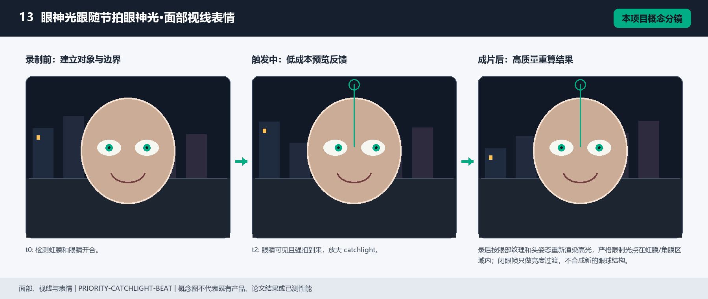
_图 13：本项目概念分镜。依次展示录制前、触发中和录后成片；不代表既有产品、论文实验结果或已测性能。_

**研究问题。** 眼神光通常是静态贴图，无法表达音乐、说话和情绪节奏。

**目标体验。** 人物随着音乐点头，眼神光在强拍处短暂变成星芒，弱拍回到柔和反射；光点始终贴合虹膜，不遮盖瞳孔。

**可见创新。** 把眼神光跟随的对象语义与节拍眼神光的时序行为绑定，触发和参数共同改变可见结果，而不是只更换场景。 眼神光跟随触发节拍眼神光时，眼神光在强拍瞬间扩大闪耀，拍间恢复原大小；双眼虹膜上的虚拟高光始终可见且与画面空间保持对应

**交互时间线**

- t0: 检测虹膜和眼睛开合。
- t1: 估计音乐节拍和当前 head_pose。
- t2: 眼睛可见且强拍到来，放大 catchlight。
- t3: 头部转动时根据虹膜法线移动高光。
- t4: 闭眼、侧脸或音乐停止时回到自然反射。

**模块和信号链**

- 眼部关键点/虹膜分割。
- 头姿态和虹膜局部法线估计。
- 音频 beat 相位。
- catchlight 形状/星芒生成。
- 眼部原纹理保护和 alpha 合成。

`eye_crop[B,2,3,64,64] + iris_mask[B,2,1,64,64] + head_pose[B,6] + beat_phase -> catchlight[B,2,3,64,64] + alpha -> eye_composite -> rgb_out。`

**数据与训练建议**

- 数据：多机位或屏幕标定的人脸视频；包含视线目标、头姿、虹膜/眼睑关键点、眨眼、眼镜反光、侧脸和多人对话；需有身份授权。
- Loss：L_gaze（角度）、L_landmark、L_iris、L_identity、L_background、L_blink 与 L_temporal；只在眼部小 ROI 内优化，外部区域强约束为原帧。
- 指标：视线角误差、身份余弦相似度、眼睑关键点误差、眨眼保持率、双眼一致性、用户自然度评分。
- 真实性/身份约束：低置信度、强侧脸、闭眼或反光时回退原帧；不得生成新的虹膜身份特征。

**端侧预览、录后精修与控制**

- 预览：眼部 ROI 64x64、双眼最多 2 个高光；具体时延和算力预算需在目标设备上实测。
- 录后：录后按眼部纹理和头姿态重新渲染高光，严格限制光点在虹膜/角膜区域内；闭眼帧只做亮度过渡，不合成新的眼球结构。
- 元数据：iris centers；iris masks；head_pose；beat timestamps；eye openness；catchlight phase；blend confidence
- 参数：`catchlight_size`, `ray_count`, `beat_gain`, `specular_softness`, `iris_limit`, `head_pose_comp`, `blend`
- 产品形态：人像音乐录像、直播和氛围自拍中的眼神光节拍模式。

**失败与降级**

- 虹膜丢失：保持上一高光短时淡出。
- 闭眼：禁止更新眼神光。
- 眼镜反光：降低高光强度。
- 强拍过亮：限制峰值并回到柔光。

**参考边界。** Apple Cinematic mode[^1]；MODNet: Real-Time Trimap-Free Portrait Matting via Objective Decomposition[^9]；SVFR: A Unified Framework for Generalized Video Face Restoration[^11]；AuthFace[^12]。这些来源只证明对应的基础能力；不能据此声称本完整特效已经量产。

### 案例 14：凝视选择特效眨眼确认选择·面部视线表情

`PRIORITY-GAZE-SELECT-CONFIRM`

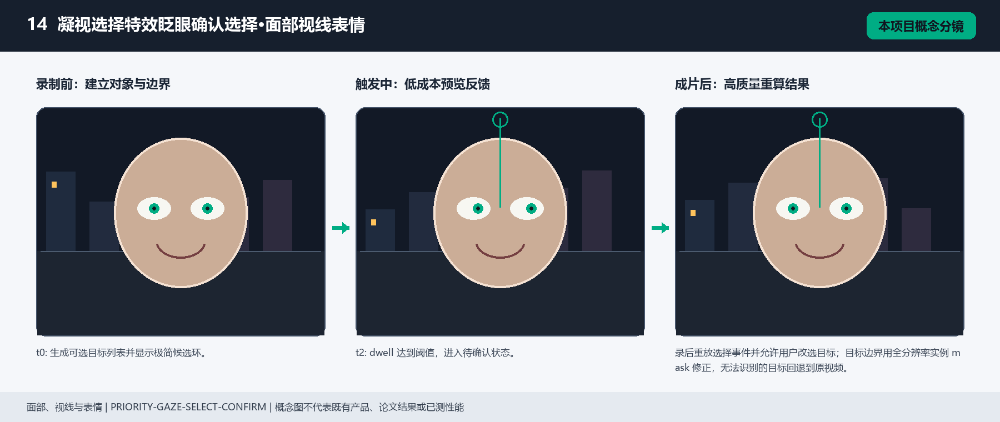
_图 14：本项目概念分镜。依次展示录制前、触发中和录后成片；不代表既有产品、论文实验结果或已测性能。_

**研究问题。** 眼神交互常只做视觉装饰，用户不知道何时选中了对象，也缺少可撤销的确认动作。

**目标体验。** 用户看向画面中的一盏灯并眨眼确认，灯被局部高亮；再次看向人物时，效果切换到人物而不是整屏套用滤镜。

**可见创新。** 把凝视选择特效的对象语义与眨眼确认选择的时序行为绑定，触发和参数共同改变可见结果，而不是只更换场景。 凝视选择特效触发眨眼确认选择时，凝视对象先出现选中环，眨眼后明确选中并展开特效；画面中的候选物体与特效入口始终可见且与画面空间保持对应

**交互时间线**

- t0: 生成可选目标列表并显示极简候选环。
- t1: 视线稳定命中目标，候选环开始收缩。
- t2: dwell 达到阈值，进入待确认状态。
- t3: 眨眼/微笑/轻点确认，目标获得特效。
- t4: 看向空白处或做取消手势，撤销选中状态。

**模块和信号链**

- 目标检测与实例跟踪。
- 视线命中测试和 dwell 状态机。
- 眨眼/表情事件检测。
- 目标选择描边与效果绑定。
- 确认、取消和超时逻辑。

`objects[N,box] + gaze_ray[B,3] + blink_state + dwell -> selected_id -> target_mask[B,1,H,W] -> effect_state -> rgb_out。`

**数据与训练建议**

- 数据：多机位或屏幕标定的人脸视频；包含视线目标、头姿、虹膜/眼睑关键点、眨眼、眼镜反光、侧脸和多人对话；需有身份授权。
- Loss：L_gaze（角度）、L_landmark、L_iris、L_identity、L_background、L_blink 与 L_temporal；只在眼部小 ROI 内优化，外部区域强约束为原帧。
- 指标：视线角误差、身份余弦相似度、眼睑关键点误差、眨眼保持率、双眼一致性、用户自然度评分。
- 真实性/身份约束：低置信度、强侧脸、闭眼或反光时回退原帧；不得生成新的虹膜身份特征。

**端侧预览、录后精修与控制**

- 预览：目标检测 分级更新、视线 分级更新；具体时延和算力预算需在目标设备上实测。
- 录后：录后重放选择事件并允许用户改选目标；目标边界用全分辨率实例 mask 修正，无法识别的目标回退到原视频。
- 元数据：candidate IDs；hit scores；dwell start/end；confirm/cancel events；selected ID；target mask；effect preset
- 参数：`dwell_time`, `confirm_window`, `gaze_radius`, `blink_threshold`, `candidate_limit`, `outline_width`, `cancel_timeout`
- 产品形态：眼神选物、展览互动和人像特效控制中的“看一眼选中”录像玩法。

**失败与降级**

- 视线不稳定：不进入待确认。
- 眨眼漏检：提供屏幕轻点后备确认。
- 目标重叠：只允许最高置信实例。
- 选中对象出框：立即取消并淡出描边。

**参考边界。** Apple Cinematic mode[^1]；MODNet: Real-Time Trimap-Free Portrait Matting via Objective Decomposition[^9]；SVFR: A Unified Framework for Generalized Video Face Restoration[^11]；AuthFace[^12]。这些来源只证明对应的基础能力；不能据此声称本完整特效已经量产。

### 案例 15：局部时间冻结触摸擦出冻结·时间编辑

`PRIORITY-FREEZE-TOUCH`

_图 15：本项目概念分镜。依次展示录制前、触发中和录后成片；不代表既有产品、论文实验结果或已测性能。_

**研究问题。** 局部定格如果只按时间点选择，用户难以在录像现场表达“冻结哪里”。

**目标体验。** 用户在录像中触摸一个正在飘动的气球，触点周围的气球被冻结，而背景、手和光线继续运动；手指移开后冻结区像玻璃一样碎开恢复。

**可见创新。** 把局部时间冻结的对象语义与触摸擦出冻结的时序行为绑定，触发和参数共同改变可见结果，而不是只更换场景。 局部时间冻结触发触摸擦出冻结时，触摸覆盖区域逐步冻结成同一帧并保留柔和边缘；人物手部或一块场景区域始终可见且与画面空间保持对应

**交互时间线**

- t0: 建立触摸轨迹和可冻结对象 mask。
- t1: 手指按下，选择触点附近实例。
- t2: 连续帧确认对象身份并保存 freeze_frame。
- t3: 对象静止而背景继续更新，触点边缘保持柔和。
- t4: 松手、滑动或再次触碰，执行碎裂/恢复过渡。

**模块和信号链**

- 触摸/手部位置检测。
- 实例分割和对象跟踪。
- 局部时间缓存与冻结帧选择。
- 边界遮挡、碎裂材质和恢复动画。
- 冻结层/实时层/背景补洞合成。

`rgb[B,T,3,H,W] + touch[B,2] + instance_mask[B,N,H,W] -> selected_instance -> freeze_frame[B,3,H,W] + live_background -> boundary_effect -> rgb_out。`

**数据与训练建议**

- 数据：具有对象 mask、光流、事件边界和动作阶段标注的视频；用正放、倒放、冻结、局部循环和时间偏移自动构造监督。
- Loss：L_recon、L_flow、L_boundary、L_cycle、L_order 与 L_seam；非编辑区域施加严格保持损失。
- 指标：循环接缝误差、边界泄漏、对象身份交换率、光流一致性、时间事件可读性和原区域保真。
- 真实性/身份约束：时间效果必须明确是创作性改写，原始时间线和事件顺序需保留。

**端侧预览、录后精修与控制**

- 预览：实例分割 分级更新，冻结 ROI 半分辨率缓存 1 s；具体时延和算力预算需在目标设备上实测。
- 录后：录后利用完整对象轨迹和高分辨率边缘重算冻结边界，支持重新指定冻结帧；边界无法恢复时以软矩形蒙版退化。
- 元数据：touch down/up；touch path；selected instance；freeze frame index；mask confidence；boundary state；resume event
- 参数：`freeze_duration`, `touch_radius`, `mask_feather`, `fragment_progress`, `resume_speed`, `object_confidence`, `history_window`
- 产品形态：触摸定格、局部暂停和互动短视频中的时间编辑模式。

**失败与降级**

- 触点离开对象：保持当前冻结对象，不跟随空白处。
- 实例合并：只冻结稳定连通区域。
- 边界抖动：增加滞回和 temporal smoothing。
- 内存不足：只保留单一冻结 ROI。

**参考边界。** Samsung Single Take[^6]；MAGVIT: Masked Generative Video Transformer[^10]。这些来源只证明对应的基础能力；不能据此声称本完整特效已经量产。

### 案例 16：局部时间循环局部往返循环·时间编辑

`PRIORITY-LOOP-PINGPONG`

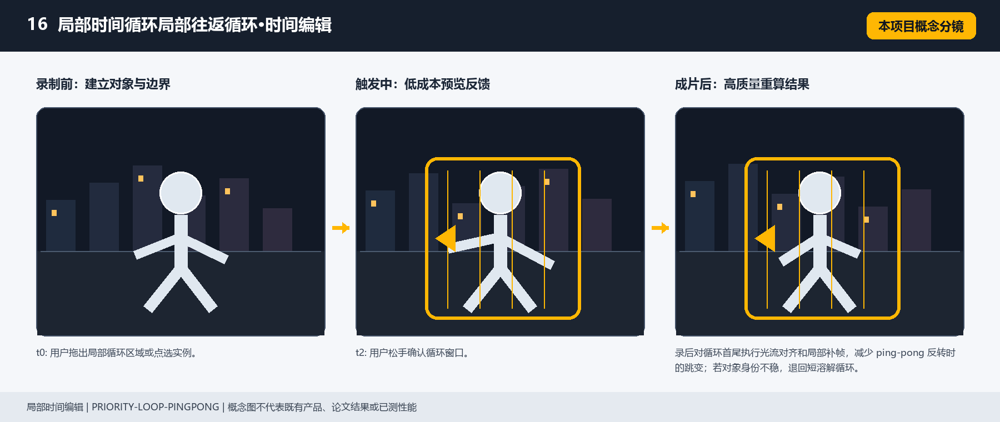
_图 16：本项目概念分镜。依次展示录制前、触发中和录后成片；不代表既有产品、论文实验结果或已测性能。_

**研究问题。** 局部循环常在首尾姿态不连续，循环对象与背景的时间关系也不清楚。

**目标体验。** 用户框选一片飘动的裙摆，裙摆在 0.6 秒历史里往返循环，而人物身体和背景继续实时，循环边界在节拍处像呼吸一样收束。

**可见创新。** 把局部时间循环的对象语义与局部往返循环的时序行为绑定，触发和参数共同改变可见结果，而不是只更换场景。 局部时间循环触发局部往返循环时，区域在历史帧中正放后倒放，避免首尾硬跳；人物发梢或水面小区域始终可见且与画面空间保持对应

**交互时间线**

- t0: 用户拖出局部循环区域或点选实例。
- t1: 系统记录 pre-roll 和对象进入稳定状态的帧。
- t2: 用户松手确认循环窗口。
- t3: 对象在正向/反向帧序之间 ping-pong 播放。
- t4: 再次触摸、节拍结束或超时，回到实时帧。

**模块和信号链**

- 区域/实例选择。
- 历史帧环形缓存。
- 首尾姿态相似度与 ping-pong 调度。
- 局部边界和遮挡修复。
- 循环层、实时层和音频相位合成。

`rgb_history[B,T,3,h,w] + mask[B,1,h,w] + select_event -> loop_buffer[L,3,h,w] -> frame_index(t) -> warped_loop + live_context -> rgb_out。`

**数据与训练建议**

- 数据：具有对象 mask、光流、事件边界和动作阶段标注的视频；用正放、倒放、冻结、局部循环和时间偏移自动构造监督。
- Loss：L_recon、L_flow、L_boundary、L_cycle、L_order 与 L_seam；非编辑区域施加严格保持损失。
- 指标：循环接缝误差、边界泄漏、对象身份交换率、光流一致性、时间事件可读性和原区域保真。
- 真实性/身份约束：时间效果必须明确是创作性改写，原始时间线和事件顺序需保留。

**端侧预览、录后精修与控制**

- 预览：循环 ROI 540p、最长 1.2 s、最多 2 个区域；缓存规模按设备档位和热状态动态限制 内。
- 录后：录后对循环首尾执行光流对齐和局部补帧，减少 ping-pong 反转时的跳变；若对象身份不稳，退回短溶解循环。
- 元数据：loop start/end；pre-roll；object ID；mask sequence；frame direction；beat alignment；exit event
- 参数：`loop_duration`, `pingpong_ratio`, `speed`, `mask_feather`, `phase_offset`, `blend`, `exit_fade`
- 产品形态：局部时间循环模式，适合舞蹈、服装、宠物和动态物体录像。

**失败与降级**

- 窗口太短：自动扩展到最近稳定动作。
- 首尾差异大：使用 crossfade 而非硬反转。
- 遮挡变化：降低循环区域并保留前景。
- 多区域超限：只保留最近一次选择。

**参考边界。** Samsung Single Take[^6]；MAGVIT: Masked Generative Video Transformer[^10]。这些来源只证明对应的基础能力；不能据此声称本完整特效已经量产。

### 案例 17：局部时间倒放遮罩内倒放·时间编辑

`PRIORITY-REVERSE-MASK`

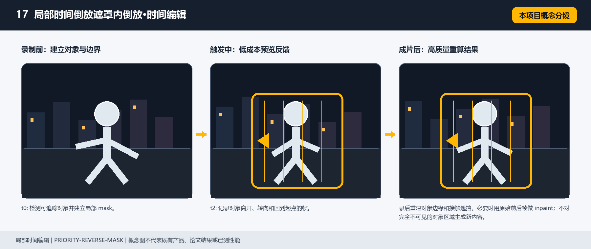
_图 17：本项目概念分镜。依次展示录制前、触发中和录后成片；不代表既有产品、论文实验结果或已测性能。_

**研究问题。** 局部倒放如果以矩形裁剪，人物和物体边缘会带着背景一起倒放，效果缺少可信遮挡。

**目标体验。** 用户框住一只飞来的纸片，纸片短暂倒飞回手中，手和背景仍正向运动；纸片经过手指时按前后深度被遮挡。

**可见创新。** 把局部时间倒放的对象语义与遮罩内倒放的时序行为绑定，触发和参数共同改变可见结果，而不是只更换场景。 局部时间倒放触发遮罩内倒放时，只有该物体区域倒放，周围对象保持当前运动；飞起的纸片或挥动手臂始终可见且与画面空间保持对应

**交互时间线**

- t0: 检测可追踪对象并建立局部 mask。
- t1: 用户拖动反向手势选择时间窗口。
- t2: 记录对象离开、转向和回到起点的帧。
- t3: 只对对象 ROI 反向播放。
- t4: 对象接触主体或窗口结束时，按原始时间线恢复。

**模块和信号链**

- 实例/点跟踪。
- 对象 mask 和深度排序。
- 逆序帧缓存。
- 对象 ROI warp 与背景空洞补全。
- 接触事件和正向回切。

`object_crop[B,T,3,h,w] + object_mask[B,T,1,h,w] + depth_order -> reverse_index[T] -> reverse_roi + live_background + occlusion -> rgb_out。`

**数据与训练建议**

- 数据：具有对象 mask、光流、事件边界和动作阶段标注的视频；用正放、倒放、冻结、局部循环和时间偏移自动构造监督。
- Loss：L_recon、L_flow、L_boundary、L_cycle、L_order 与 L_seam；非编辑区域施加严格保持损失。
- 指标：循环接缝误差、边界泄漏、对象身份交换率、光流一致性、时间事件可读性和原区域保真。
- 真实性/身份约束：时间效果必须明确是创作性改写，原始时间线和事件顺序需保留。

**端侧预览、录后精修与控制**

- 预览：对象 ROI 640p、窗口最多 24 帧；具体时延和算力预算需在目标设备上实测。
- 录后：录后重建对象边缘和接触遮挡，必要时用原始前后帧做 inpaint；不对完全不可见的对象区域生成新内容。
- 元数据：object ID；reverse window；mask sequence；contact event；depth order；crop transform；exit PTS
- 参数：`reverse_window`, `playback_speed`, `mask_feather`, `contact_snap`, `depth_bias`, `blend_time`, `object_limit`
- 产品形态：局部倒放和“时间反悔”录像模式，强调对象级时间编辑。

**失败与降级**

- 目标出框：停止倒放并平滑切回。
- 遮挡缺帧：缩短倒放窗口。
- 背景补洞不可信：使用原帧溶解。
- 追踪跳变：保持对象中心并降低边界精度。

**参考边界。** Samsung Single Take[^6]；MAGVIT: Masked Generative Video Transformer[^10]。这些来源只证明对应的基础能力；不能据此声称本完整特效已经量产。

### 案例 18：动作快门切片动作阶段快门·时间编辑

`PRIORITY-SHUTTER-POSE`

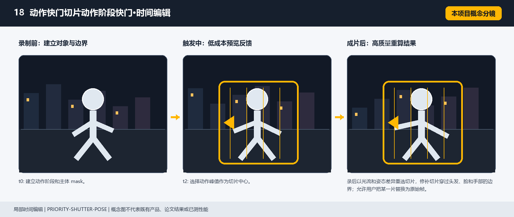
_图 18：本项目概念分镜。依次展示录制前、触发中和录后成片；不代表既有产品、论文实验结果或已测性能。_

**研究问题。** 快门切片若均匀采样，会把动作节奏压平，且切片边界容易穿过脸和手。

**目标体验。** 人物旋转时，画面像一扇由关键姿态组成的百叶窗；每片对应一个动作阶段，脸部只保留当前主体，避免多张脸叠在一起。

**可见创新。** 把动作快门切片的对象语义与动作阶段快门的时序行为绑定，触发和参数共同改变可见结果，而不是只更换场景。 动作快门切片触发动作阶段快门时，起势峰值收势分别冻结为可见姿态切片；快速转身的人体轮廓始终可见且与画面空间保持对应

**交互时间线**

- t0: 建立动作阶段和主体 mask。
- t1: 检测旋转/挥臂的方向变化。
- t2: 选择动作峰值作为切片中心。
- t3: 按运动方向展开切片并保持当前脸部。
- t4: 动作结束时切片逐一合拢。

**模块和信号链**

- 姿态/光流估计。
- 动作峰值与方向场。
- 历史帧选择器。
- 切片几何和 face-protect mask。
- 切片、主体和背景合成。

`rgb_history[B,T,3,H,W] + body_mask + face_mask + motion_field[B,2,H,W] -> pose_peaks[K] -> shutter_slices[K,3,H,W] -> protected_composite。`

**数据与训练建议**

- 数据：具有对象 mask、光流、事件边界和动作阶段标注的视频；用正放、倒放、冻结、局部循环和时间偏移自动构造监督。
- Loss：L_recon、L_flow、L_boundary、L_cycle、L_order 与 L_seam；非编辑区域施加严格保持损失。
- 指标：循环接缝误差、边界泄漏、对象身份交换率、光流一致性、时间事件可读性和原区域保真。
- 真实性/身份约束：时间效果必须明确是创作性改写，原始时间线和事件顺序需保留。

**端侧预览、录后精修与控制**

- 预览：预览 540p，最多 7 片；具体时延和算力预算需在目标设备上实测。
- 录后：录后以光流和姿态差异重选切片，修补切片穿过头发、脸和手部的边界；允许用户把某一片替换为原始帧。
- 元数据：slice center PTS；motion direction；face protect mask；pose peaks；slice spacing；depth order；fold state
- 参数：`slice_count`, `slice_spacing`, `peak_threshold`, `face_protect`, `fold_angle`, `alpha`, `merge_speed`
- 产品形态：动作切片和快门雕塑录像模式，适合舞蹈、旋转和体育动作。

**失败与降级**

- 动作峰值不足：退化为少量等间隔切片。
- 脸部边界错误：当前脸部覆盖切片。
- 光流不稳定：限制切片位移。
- 切片重叠：合并相邻层。

**参考边界。** Samsung Single Take[^6]；MAGVIT: Masked Generative Video Transformer[^10]。这些来源只证明对应的基础能力；不能据此声称本完整特效已经量产。

### 案例 19：时间借位窗口物体时间借位·时间编辑

`PRIORITY-BORROW-OBJECT`

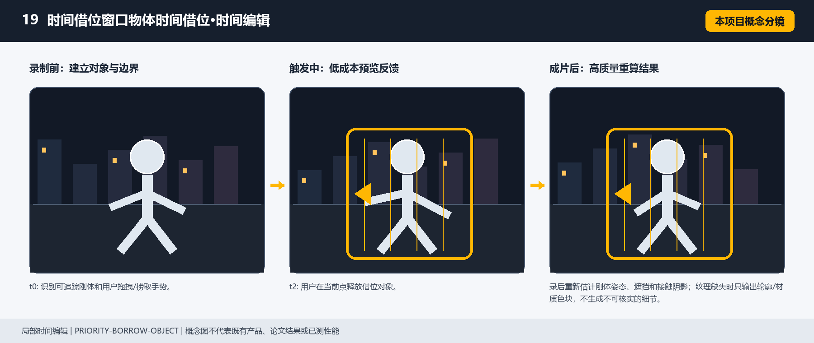
_图 19：本项目概念分镜。依次展示录制前、触发中和录后成片；不代表既有产品、论文实验结果或已测性能。_

**研究问题。** 时间借位如果没有清晰对象边界，借来的物体会把当时的背景一起带来。

**目标体验。** 用户把刚刚经过的雨伞“借”到当前画面，雨伞保持旧时刻的运动方向，但街景和行人继续实时，像从时间里拿出一件物体。

**可见创新。** 把时间借位窗口的对象语义与物体时间借位的时序行为绑定，触发和参数共同改变可见结果，而不是只更换场景。 时间借位窗口触发物体时间借位时，物体显示历史位置而持有者保持当前动作；前景人物与背景事件始终可见且与画面空间保持对应

**交互时间线**

- t0: 识别可追踪刚体和用户拖拽/捞取手势。
- t1: 保存对象历史轨迹和纹理。
- t2: 用户在当前点释放借位对象。
- t3: 对象按历史速度进入当前空间并保留短时回声。
- t4: 接触、再次拖动或超时使对象回归现实。

**模块和信号链**

- 刚体检测/姿态跟踪。
- 对象历史 crop 与 mask。
- 借位路径和当前空间重投影。
- 前景遮挡和接触阴影。
- 对象回放、缩放和原视频合成。

`object_rgb[B,T,3,h,w] + object_mask[B,T,1,h,w] + pose[B,T,6] + touch_path -> borrowed_pose[B,6] -> projected_object + shadow -> rgb_out。`

**数据与训练建议**

- 数据：具有对象 mask、光流、事件边界和动作阶段标注的视频；用正放、倒放、冻结、局部循环和时间偏移自动构造监督。
- Loss：L_recon、L_flow、L_boundary、L_cycle、L_order 与 L_seam；非编辑区域施加严格保持损失。
- 指标：循环接缝误差、边界泄漏、对象身份交换率、光流一致性、时间事件可读性和原区域保真。
- 真实性/身份约束：时间效果必须明确是创作性改写，原始时间线和事件顺序需保留。

**端侧预览、录后精修与控制**

- 预览：单对象 ROI 480-640p、历史 1 s；具体时延和算力预算需在目标设备上实测。
- 录后：录后重新估计刚体姿态、遮挡和接触阴影；纹理缺失时只输出轮廓/材质色块，不生成不可核实的细节。
- 元数据：object ID；history PTS；object pose；borrow start/end；touch path；mask confidence；contact state
- 参数：`history_offset`, `borrow_duration`, `scale`, `trajectory_gain`, `shadow_strength`, `mask_feather`, `return_mode`
- 产品形态：时间借位和“从上一秒拿东西”录像模式，适合道具、穿搭和剧情短片。

**失败与降级**

- 刚体无纹理：使用特征点和轮廓跟踪。
- 遮挡过长：缩短可借位窗口。
- 接触关系错误：去掉合成阴影。
- 对象出框：冻结当前状态并淡出。

**参考边界。** Samsung Single Take[^6]；MAGVIT: Masked Generative Video Transformer[^10]。这些来源只证明对应的基础能力；不能据此声称本完整特效已经量产。

### 案例 20：镜面穿越手掌探镜·空间入口

`PRIORITY-MIRROR-HAND-PORTAL`

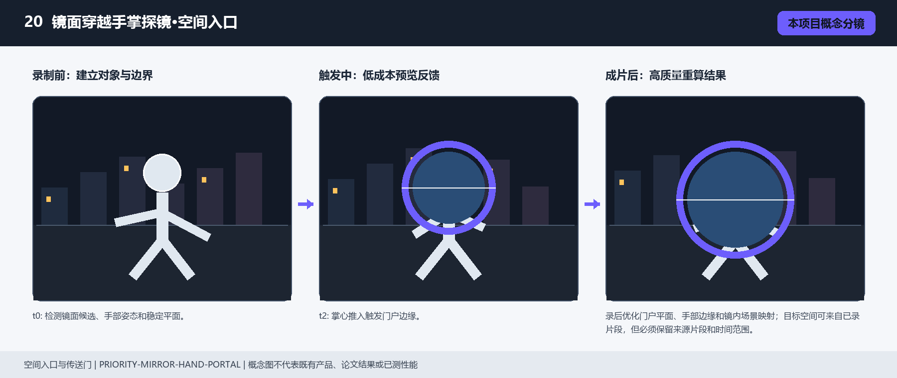
_图 20：本项目概念分镜。依次展示录制前、触发中和录后成片；不代表既有产品、论文实验结果或已测性能。_

**研究问题。** 镜面穿越容易变成一块平面贴图，手伸进去时没有真实前后关系。

**目标体验。** 用户把手伸向镜面，镜中空间先出现一圈光，再让手进入另一段已录场景；手指靠近边框时被镜面厚度和遮挡切断。

**可见创新。** 把镜面穿越的对象语义与手掌探镜的时序行为绑定，触发和参数共同改变可见结果，而不是只更换场景。 镜面穿越触发手掌探镜时，手先穿过镜面并在另一侧出现，身体仍留在原空间；镜面、橱窗或水面反射始终可见且与画面空间保持对应

**交互时间线**

- t0: 检测镜面候选、手部姿态和稳定平面。
- t1: 手掌靠近镜面并停留。
- t2: 掌心推入触发门户边缘。
- t3: 手部前后穿越门户，入口内显示目标空间。
- t4: 手掌收回或合拢手指，门户闭合。

**模块和信号链**

- 镜面/平面检测。
- 手部关键点和深度。
- 门户边界与厚度建模。
- 目标场景/历史帧映射。
- 手部前后遮挡和边缘合成。

`rgb[B,3,H,W] + hand[B,21,3] + depth[B,1,H,W] + plane[4] + portal_texture[B,3,h,w] -> portal_mesh + hand_depth_order -> rgb_out。`

**数据与训练建议**

- 数据：带深度、平面、相机位姿、镜面/地面/手掌 mask 的移动视频；配对另一场景或合成门户内容，并标注进入/退出事件。
- Loss：L_plane、L_depth、L_warp、L_border、L_occ、L_camera 与 L_temp；生成内容另加身份和几何约束。
- 指标：边框重投影误差、门户漂移、穿越遮挡正确率、视差一致性、空洞率和时间闪烁。
- 真实性/身份约束：门户另一侧是生成或重放内容，不能被解释为真实摄像头已经观察到的空间。

**端侧预览、录后精修与控制**

- 预览：门户预览 540p、手部 分级更新；具体时延和算力预算需在目标设备上实测，失败时不生成门户内容。
- 录后：录后优化门户平面、手部边缘和镜内场景映射；目标空间可来自已录片段，但必须保留来源片段和时间范围。
- 元数据：plane pose；portal polygon；hand landmarks；hand depth；entry/exit PTS；portal thickness；target scene ID
- 参数：`portal_size`, `portal_depth`, `hand_snap`, `edge_glow`, `texture_speed`, `occlusion_bias`, `close_duration`
- 产品形态：镜面穿越、空间门和 AR 叙事录像模式。

**失败与降级**

- 镜面不稳定：回退为二维镜面光圈。
- 手部深度不确定：仅显示手部轮廓。
- 目标素材不足：门户内显示原背景。
- 快速伸手：冻结边界并降低厚度。

**参考边界。** CapCut video background removal[^4]；Robust High-Resolution Video Matting with Temporal Guidance[^8]；MAGVIT: Masked Generative Video Transformer[^10]；Scalable Diffusion Models with Transformers[^13]；High-Resolution Image Synthesis with Latent Diffusion Models[^14]。这些来源只证明对应的基础能力；不能据此声称本完整特效已经量产。

### 案例 21：掌中窗口双手开窗·空间入口

`PRIORITY-PALM-PORTAL`

_图 21：本项目概念分镜。依次展示录制前、触发中和录后成片；不代表既有产品、论文实验结果或已测性能。_

**研究问题。** 手掌开门玩法如果只依赖手势识别，门的位置和空间厚度不稳定。

**目标体验。** 用户把手掌贴向墙面并张开五指，掌心像打开一扇小门，门内露出同一地点的夜景版本；收拢手指后门沿掌纹方向关闭。

**可见创新。** 把掌中窗口的对象语义与双手开窗的时序行为绑定，触发和参数共同改变可见结果，而不是只更换场景。 掌中窗口触发双手开窗时，掌间窗口随手距扩大并露出另一场景；手掌之间的悬浮窗口始终可见且与画面空间保持对应

**交互时间线**

- t0: 识别手掌朝向、张开度和墙面平面。
- t1: 掌心接近墙面，预览显示候选边缘。
- t2: 五指张开达到门限，固定门户中心。
- t3: 门内内容按深度和遮挡逐步显现。
- t4: 手指收拢或离开墙面，门户反向收束。

**模块和信号链**

- hand landmark/gesture classifier。
- 墙面平面和相机姿态。
- 掌心到门户坐标变换。
- 门户内容采样和空间边缘。
- 手部遮挡/闭合动画合成。

`hand_landmarks[B,21,3] + palm_normal[B,3] + plane_pose[4,4] + gesture[B] -> portal_pose[4,4] + portal_mask -> scene_sample + occlusion -> rgb_out。`

**数据与训练建议**

- 数据：带深度、平面、相机位姿、镜面/地面/手掌 mask 的移动视频；配对另一场景或合成门户内容，并标注进入/退出事件。
- Loss：L_plane、L_depth、L_warp、L_border、L_occ、L_camera 与 L_temp；生成内容另加身份和几何约束。
- 指标：边框重投影误差、门户漂移、穿越遮挡正确率、视差一致性、空洞率和时间闪烁。
- 真实性/身份约束：门户另一侧是生成或重放内容，不能被解释为真实摄像头已经观察到的空间。

**端侧预览、录后精修与控制**

- 预览：手势 分级更新、门户边缘 分级更新；具体时延和算力预算需在目标设备上实测。
- 录后：录后重新估计掌心姿态和墙面接缝，门户内容按真实场景纹理或已录素材映射；手掌低置信度时不扩展门户面积。
- 元数据：palm pose；finger openness；plane pose；portal center；gesture state；entry/exit events；scene source
- 参数：`open_threshold`, `portal_scale`, `depth`, `edge_width`, `scene_mix`, `close_speed`, `gesture_hysteresis`
- 产品形态：手掌开门和墙面空间入口录像模式。

**失败与降级**

- 手势误检：要求张开度和停留双重确认。
- 平面不稳：门户缩小到二维掌心光圈。
- 手指遮挡：暂停开合。
- 内容穿帮：回退原始墙面。

**参考边界。** CapCut video background removal[^4]；Robust High-Resolution Video Matting with Temporal Guidance[^8]；MAGVIT: Masked Generative Video Transformer[^10]；Scalable Diffusion Models with Transformers[^13]；High-Resolution Image Synthesis with Latent Diffusion Models[^14]。这些来源只证明对应的基础能力；不能据此声称本完整特效已经量产。

### 案例 22：地面折叠门脚步开地门·空间入口

`PRIORITY-FLOOR-STEP-PORTAL`

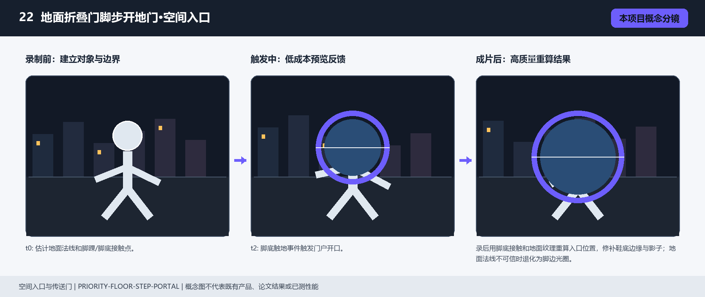
_图 22：本项目概念分镜。依次展示录制前、触发中和录后成片；不代表既有产品、论文实验结果或已测性能。_

**研究问题。** 地面门户常忽略脚底接触和前后景，人物踩上去时像贴在地面上的图层。

**目标体验。** 人物向前迈步时，脚落点打开一个薄薄的地面入口，下一步跨过后露出彩色空间；鞋底遮住边缘，门户在脚离开时留下短暂余光。

**可见创新。** 把地面折叠门的对象语义与脚步开地门的时序行为绑定，触发和参数共同改变可见结果，而不是只更换场景。 地面折叠门触发脚步开地门时，地面沿脚尖方向折开成通往另一空间的门；地面纹理与远处场景始终可见且与画面空间保持对应

**交互时间线**

- t0: 估计地面法线和脚踝/脚底接触点。
- t1: 预测下一步落脚区域。
- t2: 脚底触地事件触发门户开口。
- t3: 跨步过程中按脚底遮挡更新入口。
- t4: 脚离开并完成下一步后关闭或移动入口。

**模块和信号链**

- pose/foot contact detection。
- 地面平面估计。
- 落脚事件和门户状态机。
- 地面入口几何与内容采样。
- 脚底、影子和门户边缘合成。

`pose[B,J,3] + foot_contact[B,2] + depth + ground_plane -> step_event -> portal_quad[4,3] + foot_occlusion -> floor_portal_layer -> rgb_out。`

**数据与训练建议**

- 数据：带深度、平面、相机位姿、镜面/地面/手掌 mask 的移动视频；配对另一场景或合成门户内容，并标注进入/退出事件。
- Loss：L_plane、L_depth、L_warp、L_border、L_occ、L_camera 与 L_temp；生成内容另加身份和几何约束。
- 指标：边框重投影误差、门户漂移、穿越遮挡正确率、视差一致性、空洞率和时间闪烁。
- 真实性/身份约束：门户另一侧是生成或重放内容，不能被解释为真实摄像头已经观察到的空间。

**端侧预览、录后精修与控制**

- 预览：脚部跟踪 分级更新，地面 分级更新，门户单实例 540p；具体时延和算力预算需在目标设备上实测。
- 录后：录后用脚底接触和地面纹理重算入口位置，修补鞋底边缘与影子；地面法线不可信时退化为脚边光圈。
- 元数据：ground plane；foot contacts；step PTS；portal pose；foot mask；shadow contact；close state
- 参数：`portal_radius`, `open_duration`, `ground_snap`, `foot_occlusion`, `scene_depth`, `shadow_strength`, `close_mode`
- 产品形态：舞步、街拍和地面穿越类录像特效。

**失败与降级**

- 脚底不可见：只显示落脚光圈。
- 地面估计跳变：锁定最近可信平面。
- 多人脚部混淆：只保留主角。
- 门户过大：限制为脚步附近 ROI。

**参考边界。** CapCut video background removal[^4]；Robust High-Resolution Video Matting with Temporal Guidance[^8]；MAGVIT: Masked Generative Video Transformer[^10]；Scalable Diffusion Models with Transformers[^13]；High-Resolution Image Synthesis with Latent Diffusion Models[^14]。这些来源只证明对应的基础能力；不能据此声称本完整特效已经量产。

### 案例 23：景深隧道旋转隧道·空间入口

`PRIORITY-TUNNEL-ORBIT`

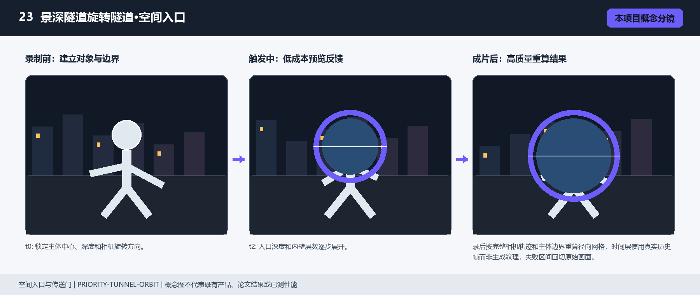
_图 23：本项目概念分镜。依次展示录制前、触发中和录后成片；不代表既有产品、论文实验结果或已测性能。_

**研究问题。** 隧道形变常只做径向缩放，镜头移动时缺乏稳定的深度层和入口出口逻辑。

**目标体验。** 用户绕一个主体转半圈，主体周围生成短隧道；隧道内壁显示同一动作的时间切片，镜头转动时能看到内壁角度变化。

**可见创新。** 把景深隧道的对象语义与旋转隧道的时序行为绑定，触发和参数共同改变可见结果，而不是只更换场景。 景深隧道触发旋转隧道时，隧道壁随手机旋转扭转，中心路径保持稳定；主体背后的空间纵深始终可见且与画面空间保持对应

**交互时间线**

- t0: 锁定主体中心、深度和相机旋转方向。
- t1: 旋转超过角度门限，创建隧道入口。
- t2: 入口深度和内壁层数逐步展开。
- t3: 隧道随镜头视差旋转，主体保持清晰。
- t4: 旋转回到起点或停止，隧道压缩退出。

**模块和信号链**

- 主体 segmentation/tracking。
- 相机运动与深度估计。
- 径向/分层隧道几何。
- 历史帧或目标纹理采样。
- 主体保护、内壁遮挡和退出动画。

`rgb[B,3,H,W] + subject_mask + depth + camera_motion -> tunnel_pose + radial_grid[B,H,W,2] + time_layers[K] -> warped_layers -> rgb_out。`

**数据与训练建议**

- 数据：带深度、平面、相机位姿、镜面/地面/手掌 mask 的移动视频；配对另一场景或合成门户内容，并标注进入/退出事件。
- Loss：L_plane、L_depth、L_warp、L_border、L_occ、L_camera 与 L_temp；生成内容另加身份和几何约束。
- 指标：边框重投影误差、门户漂移、穿越遮挡正确率、视差一致性、空洞率和时间闪烁。
- 真实性/身份约束：门户另一侧是生成或重放内容，不能被解释为真实摄像头已经观察到的空间。

**端侧预览、录后精修与控制**

- 预览：隧道中心 ROI 640p、最多 6 层；具体时延和算力预算需在目标设备上实测。
- 录后：录后按完整相机轨迹和主体边界重算径向网格，时间层使用真实历史帧而非生成纹理，失败区间回切原始画面。
- 元数据：subject ID；camera rotation；tunnel center；depth layers；entry/exit PTS；radial strength；occlusion state
- 参数：`tunnel_depth`, `layer_count`, `orbit_angle`, `radial_strength`, `center_smooth`, `subject_protect`, `exit_speed`
- 产品形态：空间隧道、环绕主体和时间切片录像模式。

**失败与降级**

- 相机旋转不足：不打开隧道。
- 中心漂移：锁定主体中心并减弱视差。
- 深度断层：减少层数。
- warp 空洞：使用原图边缘填充。

**参考边界。** CapCut video background removal[^4]；Robust High-Resolution Video Matting with Temporal Guidance[^8]；MAGVIT: Masked Generative Video Transformer[^10]；Scalable Diffusion Models with Transformers[^13]；High-Resolution Image Synthesis with Latent Diffusion Models[^14]。这些来源只证明对应的基础能力；不能据此声称本完整特效已经量产。

### 案例 24：虚拟日落边光日落色温过渡·虚拟光影

`PRIORITY-VIRTUAL-SUNSET`

_图 24：本项目概念分镜。依次展示录制前、触发中和录后成片；不代表既有产品、论文实验结果或已测性能。_

**研究问题。** 虚拟日落调色如果只改全局色温，主体受光方向和影子没有变化，效果不具备光源可信度。

**目标体验。** 用户拖动屏幕上的太阳位置，人物轮廓光从冷色切到暖色，地面影子变长；云层或建筑边缘的高光方向随太阳位置变化。

**可见创新。** 把虚拟日落边光的对象语义与日落色温过渡的时序行为绑定，触发和参数共同改变可见结果，而不是只更换场景。 虚拟日落边光触发日落色温过渡时，轮廓光从暖黄过渡到红紫并保持受光方向；人物头发和肩部边缘始终可见且与画面空间保持对应

**交互时间线**

- t0: 估计主体 mask、法线和地面。
- t1: 用户拖动虚拟太阳，显示候选轮廓光。
- t2: 光源位置稳定后锁定方向。
- t3: 轮廓光、局部高光和影子同步变化。
- t4: 用户松手或拖回原位，光照平滑恢复。

**模块和信号链**

- 主体/天空/地面分割。
- 深度和表面法线估计。
- 虚拟光源方向与强度计算。
- 轮廓光和影子重渲染。
- 原始颜色保护和局部合成。

`rgb[B,3,H,W] + masks + depth + normals + virtual_light_dir[3] -> diffuse/specular/rim/shadow layers -> tone_limited_composite。`

**数据与训练建议**

- 数据：多光源人像和场景视频；线性 RGB/HDR、主体 mask、法线、深度、光源方向和真实阴影；可用渲染器合成多样光照监督。
- Loss：L_relight、L_chroma、L_edge、L_normal、L_shadow、L_identity 与 L_temp；高光区增加饱和保护。
- 指标：受光方向一致性、肤色偏差、阴影接触误差、边缘溢光、时序闪烁和原始动态范围保持。
- 真实性/身份约束：虚拟光影属于感知增强；不得覆盖脸部身份细节或改变真实安全信息。

**端侧预览、录后精修与控制**

- 预览：光照估计 分级更新、局部重光照 540p；具体时延和算力预算需在目标设备上实测。
- 录后：录后用高分辨率法线、主体边缘和地面纹理修补轮廓光与影子；对无可靠几何区域只做色温/曝光变化。
- 元数据：light position；depth；normal confidence；subject mask；ground plane；shadow direction；temperature curve
- 参数：`light_azimuth`, `light_elevation`, `temperature`, `rim_width`, `shadow_length`, `shadow_softness`, `intensity`, `background_mix`
- 产品形态：人像日落、虚拟打光和可拖拽光源录像模式。

**失败与降级**

- 法线不可信：关闭方向性高光。
- 地面缺失：不生成长影子。
- 主体边界毛糙：减小轮廓光宽度。
- 高光过曝：限制局部增益。

**参考边界。** DJI subject tracking[^2]；Final Cut Pro object tracking[^3]；Apple Photographic Styles[^5]；Robust High-Resolution Video Matting with Temporal Guidance[^8]；MODNet: Real-Time Trimap-Free Portrait Matting via Objective Decomposition[^9]。这些来源只证明对应的基础能力；不能据此声称本完整特效已经量产。

### 案例 25：移动追光圈人物移动追光·虚拟光影

`PRIORITY-SPOTLIGHT-FOLLOW`

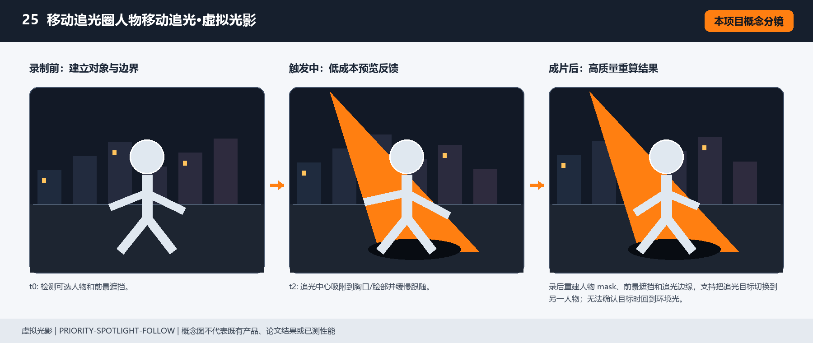
_图 25：本项目概念分镜。依次展示录制前、触发中和录后成片；不代表既有产品、论文实验结果或已测性能。_

**研究问题。** 追光效果常只是一个圆形亮斑跟随人脸，无法处理遮挡、多人切换和焦点关系。

**目标体验。** 演唱会或街拍中，用户点选一个人物，追光沿人物轮廓跟随；人物经过前景杆件时，追光被遮挡而不是穿透。

**可见创新。** 把移动追光圈的对象语义与人物移动追光的时序行为绑定，触发和参数共同改变可见结果，而不是只更换场景。 移动追光圈触发人物移动追光时，椭圆追光稳定跟随人物脚下或脸部；移动人物脚下或脸部光区始终可见且与画面空间保持对应

**交互时间线**

- t0: 检测可选人物和前景遮挡。
- t1: 用户点选或视线确认人物。
- t2: 追光中心吸附到胸口/脸部并缓慢跟随。
- t3: 人物转身时椭圆光区按姿态调整。
- t4: 人物出框或切换目标，追光交叉淡出。

**模块和信号链**

- 多人 detection/tracking。
- 主体 mask、深度和遮挡。
- spotlight target anchor。
- 椭圆光照/暗角计算。
- 目标切换和原视频合成。

`person_boxes[N,4] + tracks[N] + body_mask[N,1,H,W] + depth + selected_id -> spot_pose -> light_field[B,1,H,W] * occlusion -> rgb_out。`

**数据与训练建议**

- 数据：多光源人像和场景视频；线性 RGB/HDR、主体 mask、法线、深度、光源方向和真实阴影；可用渲染器合成多样光照监督。
- Loss：L_relight、L_chroma、L_edge、L_normal、L_shadow、L_identity 与 L_temp；高光区增加饱和保护。
- 指标：受光方向一致性、肤色偏差、阴影接触误差、边缘溢光、时序闪烁和原始动态范围保持。
- 真实性/身份约束：虚拟光影属于感知增强；不得覆盖脸部身份细节或改变真实安全信息。

**端侧预览、录后精修与控制**

- 预览：多人 分级更新、光区 540p 分级更新；具体时延和算力预算需在目标设备上实测。
- 录后：录后重建人物 mask、前景遮挡和追光边缘，支持把追光目标切换到另一人物；无法确认目标时回到环境光。
- 元数据：person IDs；selected target；spot pose；occlusion mask；target confidence；switch events；radius curve
- 参数：`spot_radius`, `ellipse_ratio`, `follow_lag`, `brightness`, `edge_softness`, `switch_time`, `occlusion_gain`
- 产品形态：演唱会、街拍和人物聚焦录像中的虚拟追光模式。

**失败与降级**

- 多人身份交换：保持上一目标短时冻结。
- 前景遮挡不稳：降低遮挡强度。
- 目标出框：按速度方向延迟淡出。
- 低照噪声：放大光区但减小增益。

**参考边界。** DJI subject tracking[^2]；Final Cut Pro object tracking[^3]；Apple Photographic Styles[^5]；Robust High-Resolution Video Matting with Temporal Guidance[^8]；MODNet: Real-Time Trimap-Free Portrait Matting via Objective Decomposition[^9]。这些来源只证明对应的基础能力；不能据此声称本完整特效已经量产。

### 案例 26：影子变长长影分叉·虚拟光影

`PRIORITY-LONG-SHADOW-SPLIT`

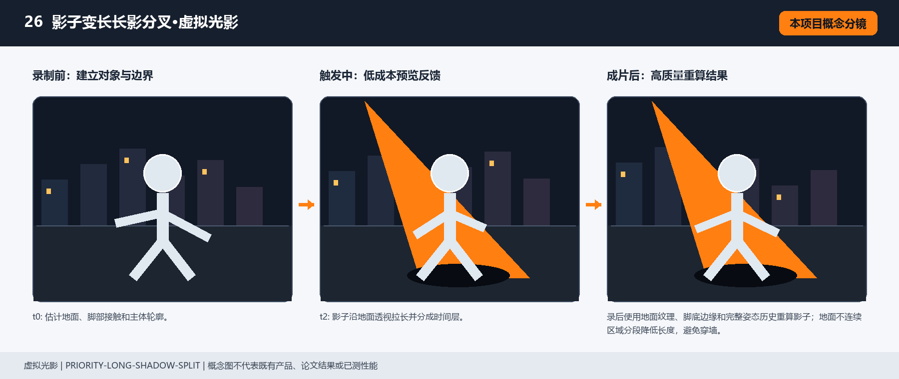
_图 26：本项目概念分镜。依次展示录制前、触发中和录后成片；不代表既有产品、论文实验结果或已测性能。_

**研究问题。** 长影子如果只按主体轮廓拉伸，会忽略地面透视和人物多个接触点。

**目标体验。** 人物向前走时，影子在地面上分成两条不同颜色的时间影线；脚步和地面接触点仍然清晰，影子方向随用户拖动的光源变化。

**可见创新。** 把影子变长的对象语义与长影分叉的时序行为绑定，触发和参数共同改变可见结果，而不是只更换场景。 影子变长触发长影分叉时，一个长影沿肢体方向分叉成多条可见剪影；主体侧后方投射的长影始终可见且与画面空间保持对应

**交互时间线**

- t0: 估计地面、脚部接触和主体轮廓。
- t1: 用户拖动光源方向或进入强拍。
- t2: 影子沿地面透视拉长并分成时间层。
- t3: 每一步更新影子分支和接触点。
- t4: 停步时影子回缩或合并。

**模块和信号链**

- 脚部/人体 mask。
- 地面平面与透视估计。
- 光源方向和影子投影。
- 历史姿态分支和颜色编码。
- 软影、接触点和原视频合成。

`body_mask + foot_contacts + ground_plane + light_dir + pose_history -> shadow_polygons[K] + contact_alpha -> colored_shadow_layer -> rgb_out。`

**数据与训练建议**

- 数据：多光源人像和场景视频；线性 RGB/HDR、主体 mask、法线、深度、光源方向和真实阴影；可用渲染器合成多样光照监督。
- Loss：L_relight、L_chroma、L_edge、L_normal、L_shadow、L_identity 与 L_temp；高光区增加饱和保护。
- 指标：受光方向一致性、肤色偏差、阴影接触误差、边缘溢光、时序闪烁和原始动态范围保持。
- 真实性/身份约束：虚拟光影属于感知增强；不得覆盖脸部身份细节或改变真实安全信息。

**端侧预览、录后精修与控制**

- 预览：地面/脚部 分级更新，影子多边形 分级更新；具体时延和算力预算需在目标设备上实测。
- 录后：录后使用地面纹理、脚底边缘和完整姿态历史重算影子；地面不连续区域分段降低长度，避免穿墙。
- 元数据：ground plane；foot contacts；light direction；shadow branches；pose PTS；contact confidence；merge state
- 参数：`shadow_length`, `branch_count`, `direction`, `softness`, `color_map`, `contact_strength`, `merge_speed`
- 产品形态：长影子、时间影子和虚拟光源录像模式。

**失败与降级**

- 地面法线跳变：锁定最近可信法线。
- 脚底遮挡：使用踝点近似接触。
- 影子穿过台阶：按深度分段。
- 分支重叠：合并并降低饱和度。

**参考边界。** DJI subject tracking[^2]；Final Cut Pro object tracking[^3]；Apple Photographic Styles[^5]；Robust High-Resolution Video Matting with Temporal Guidance[^8]；MODNet: Real-Time Trimap-Free Portrait Matting via Objective Decomposition[^9]。这些来源只证明对应的基础能力；不能据此声称本完整特效已经量产。

### 案例 27：人物投影幕墙面延迟投影·虚拟光影

`PRIORITY-SCREEN-DELAY-SHADOW`

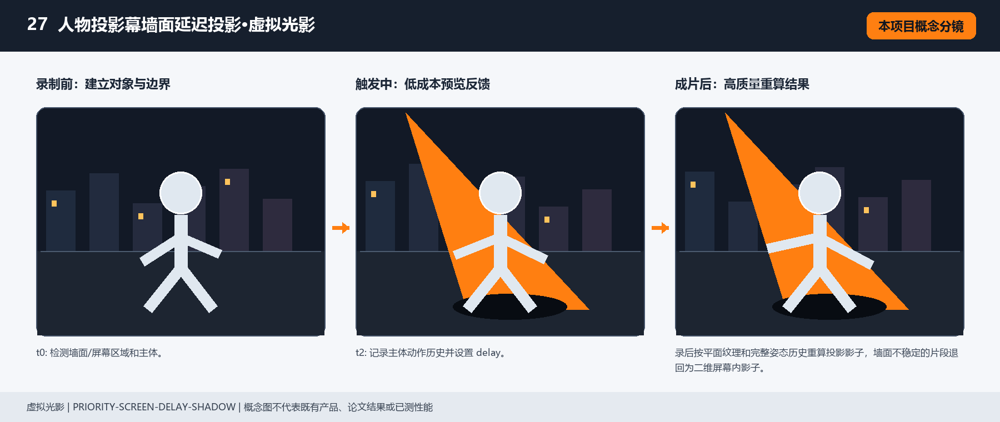
_图 27：本项目概念分镜。依次展示录制前、触发中和录后成片；不代表既有产品、论文实验结果或已测性能。_

**研究问题。** 屏幕投影影子如果没有时间延迟控制，难以形成“现在与过去”的对比。

**目标体验。** 用户把手机屏幕当作墙面投影，人物当前动作正常，而墙上的影子延迟半秒并在节拍时停住，形成真人与投影影子的对话。

**可见创新。** 把人物投影幕的对象语义与墙面延迟投影的时序行为绑定，触发和参数共同改变可见结果，而不是只更换场景。 人物投影幕触发墙面延迟投影时，墙面投影比真人慢固定时间重复动作；墙面上放大的主体轮廓始终可见且与画面空间保持对应

**交互时间线**

- t0: 检测墙面/屏幕区域和主体。
- t1: 建立主体到投影面的映射。
- t2: 记录主体动作历史并设置 delay。
- t3: 将历史影子投影到屏幕平面。
- t4: 用户触摸屏幕或停止动作，影子定格后淡出。

**模块和信号链**

- 平面/屏幕检测。
- 人体 mask 与动作历史。
- 投影映射和延迟采样。
- 影子材质/亮度和节拍停格。
- 屏幕边界、遮挡和原视频合成。

`body_mask[B,T,1,H,W] + plane_pose + pose_history[T,J,3] + delay -> projected_shadow[B,1,h,w] -> material/beat modulation -> rgb_out。`

**数据与训练建议**

- 数据：多光源人像和场景视频；线性 RGB/HDR、主体 mask、法线、深度、光源方向和真实阴影；可用渲染器合成多样光照监督。
- Loss：L_relight、L_chroma、L_edge、L_normal、L_shadow、L_identity 与 L_temp；高光区增加饱和保护。
- 指标：受光方向一致性、肤色偏差、阴影接触误差、边缘溢光、时序闪烁和原始动态范围保持。
- 真实性/身份约束：虚拟光影属于感知增强；不得覆盖脸部身份细节或改变真实安全信息。

**端侧预览、录后精修与控制**

- 预览：屏幕 ROI 540p、历史 1 s；具体时延和算力预算需在目标设备上实测。
- 录后：录后按平面纹理和完整姿态历史重算投影影子，墙面不稳定的片段退回为二维屏幕内影子。
- 元数据：screen plane；body track；delay；projection matrix；beat freeze events；shadow confidence；exit state
- 参数：`delay`, `projection_scale`, `shadow_opacity`, `material`, `beat_hold`, `edge_softness`, `screen_mix`
- 产品形态：屏幕影子、互动装置和室内录像特效模式。

**失败与降级**

- 屏幕平面丢失：固定最近平面并缩小影子。
- 主体出框：冻结最后影子短时淡出。
- 投影矩阵抖动：低通平滑。
- 亮度不足：只保留轮廓投影。

**参考边界。** DJI subject tracking[^2]；Final Cut Pro object tracking[^3]；Apple Photographic Styles[^5]；Robust High-Resolution Video Matting with Temporal Guidance[^8]；MODNet: Real-Time Trimap-Free Portrait Matting via Objective Decomposition[^9]。这些来源只证明对应的基础能力；不能据此声称本完整特效已经量产。

### 案例 28：材质溶解触摸材质溶解·材质变形

`PRIORITY-DISSOLVE-TOUCH`

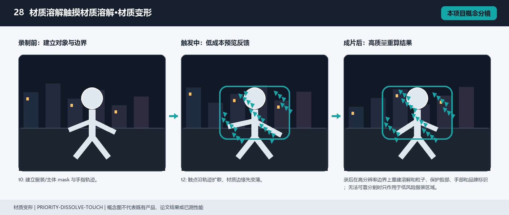
_图 28：本项目概念分镜。依次展示录制前、触发中和录后成片；不代表既有产品、论文实验结果或已测性能。_

**研究问题。** 材质溶解如果只用全局噪声，用户没有触发因果，主体边界也容易硬切。

**目标体验。** 用户手指沿人物衣袖划过，衣袖从接触点开始像砂粒一样溶解并在手指离开后回流；脸部和手部默认受到保护。

**可见创新。** 把材质溶解的对象语义与触摸材质溶解的时序行为绑定，触发和参数共同改变可见结果，而不是只更换场景。 材质溶解触发触摸材质溶解时，触摸经过处沿路径变成像素尘并露出背后内容；人物服装或手持物始终可见且与画面空间保持对应

**交互时间线**

- t0: 建立服装/主体 mask 与手指轨迹。
- t1: 手指接触目标，创建局部 dissolve seed。
- t2: 触点沿轨迹扩散，材质边缘先变薄。
- t3: 噪声阈值推进，粒子从边缘脱离。
- t4: 反向滑动或松手，粒子回流并恢复原纹理。

**模块和信号链**

- 手部关键点和接触检测。
- 服装/人体语义 mask。
- 触点到噪声场的传播。
- dissolve threshold 与粒子生成。
- 脸手保护、回流和原帧合成。

`rgb + hand_path[T,2] + clothing_mask + face_hand_protect -> distance_field -> noise_threshold(x,t) -> dissolve_alpha + particle_layer -> rgb_out。`

**数据与训练建议**

- 数据：物体/服装材质视频、实例 mask、表面法线、光流与可控材质参数；渲染合成玻璃、金属、全息和溶解状态序列。
- Loss：L_mask、L_surface、L_normal、L_reflection、L_material、L_identity 与 L_temp；边界和非编辑区施加重建损失。
- 指标：材质区域 IoU、表面附着误差、反射方向一致性、边缘泄漏、时序稳定和身份保持。
- 真实性/身份约束：材质可生成，但目标物体轮廓、人体身份和交互接触点必须稳定。

**端侧预览、录后精修与控制**

- 预览：服装 ROI 540p、粒子最多 2k；具体时延和算力预算需在目标设备上实测。
- 录后：录后在高分辨率边界上重建溶解和粒子，保护脸部、手部和品牌标识；无法可靠分割时只作用于低风险服装区域。
- 元数据：target class；hand path；contact PTS；dissolve seed；threshold curve；protected masks；reverse event
- 参数：`dissolve_radius`, `speed`, `noise_scale`, `particle_count`, `edge_width`, `return_strength`, `skin_protect`
- 产品形态：触摸溶解、材质变身和服装特效录像模式。

**失败与降级**

- 语义 mask 不稳：缩小到触点邻域。
- 手指遮挡：暂停扩散。
- 粒子过密：按面积限额。
- 目标出框：冻结当前阈值并淡出。

**参考边界。** Final Cut Pro object tracking[^3]；CapCut video background removal[^4]；MODNet: Real-Time Trimap-Free Portrait Matting via Objective Decomposition[^9]；MAGVIT: Masked Generative Video Transformer[^10]；Scalable Diffusion Models with Transformers[^13]；High-Resolution Image Synthesis with Latent Diffusion Models[^14]。这些来源只证明对应的基础能力；不能据此声称本完整特效已经量产。

### 案例 29：玻璃呼吸玻璃裂片展开·材质变形

`PRIORITY-GLASS-BREAK`

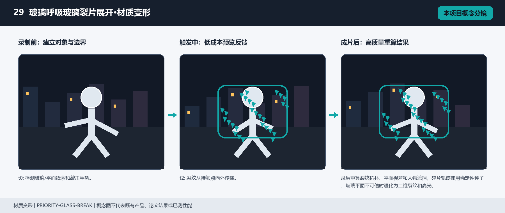
_图 29：本项目概念分镜。依次展示录制前、触发中和录后成片；不代表既有产品、论文实验结果或已测性能。_

**研究问题。** 玻璃破碎特效若不绑定真实表面和触发点，会像画面上覆盖的碎片素材。

**目标体验。** 用户敲击镜头前的窗面，窗面先出现折射高光，再沿敲击点裂开；裂纹随镜头移动保持在玻璃平面，人物在玻璃后被正确遮挡。

**可见创新。** 把玻璃呼吸的对象语义与玻璃裂片展开的时序行为绑定，触发和参数共同改变可见结果，而不是只更换场景。 玻璃呼吸触发玻璃裂片展开时，玻璃表面分裂成透明碎片向外展开但保留目标轮廓；人物轮廓或透明道具始终可见且与画面空间保持对应

**交互时间线**

- t0: 检测玻璃/平面线索和敲击手势。
- t1: 敲击点连续确认并锁定平面。
- t2: 裂纹从接触点向外传播。
- t3: 玻璃碎片按视差和透明度移动。
- t4: 手指擦除或超时，碎片回收成完整表面。

**模块和信号链**

- 平面/玻璃反射检测。
- 手指/触摸事件。
- 裂纹图拓扑和传播。
- 透明折射、碎片几何和视差。
- 人物前后层、碎片和原视频合成。

`rgb + plane_pose + reflection_map + touch_point -> crack_graph[N,E] -> shard_vertices[N,4,3] + refraction_grid -> glass_layer + occlusion -> rgb_out。`

**数据与训练建议**

- 数据：物体/服装材质视频、实例 mask、表面法线、光流与可控材质参数；渲染合成玻璃、金属、全息和溶解状态序列。
- Loss：L_mask、L_surface、L_normal、L_reflection、L_material、L_identity 与 L_temp；边界和非编辑区施加重建损失。
- 指标：材质区域 IoU、表面附着误差、反射方向一致性、边缘泄漏、时序稳定和身份保持。
- 真实性/身份约束：材质可生成，但目标物体轮廓、人体身份和交互接触点必须稳定。

**端侧预览、录后精修与控制**

- 预览：裂纹图最多 128 节点、碎片最多 64；具体时延和算力预算需在目标设备上实测。
- 录后：录后重算裂纹拓扑、平面视差和人物遮挡，碎片轨迹使用确定性种子；玻璃平面不可信时退化为二维裂纹和高光。
- 元数据：glass plane；impact point；crack graph；shard seed；depth order；touch events；recovery state
- 参数：`crack_speed`, `branch_count`, `shard_spread`, `refraction`, `opacity`, `impact_radius`, `recovery_time`
- 产品形态：镜面/玻璃敲击、破碎转场和室内空间录像模式。

**失败与降级**

- 平面不稳：固定裂纹并关闭视差。
- 敲击误检：要求接触和加速度双确认。
- 人物遮挡错误：降低碎片透明度。
- 碎片预算超限：只渲染裂纹线。

**参考边界。** Final Cut Pro object tracking[^3]；CapCut video background removal[^4]；MODNet: Real-Time Trimap-Free Portrait Matting via Objective Decomposition[^9]；MAGVIT: Masked Generative Video Transformer[^10]；Scalable Diffusion Models with Transformers[^13]；High-Resolution Image Synthesis with Latent Diffusion Models[^14]。这些来源只证明对应的基础能力；不能据此声称本完整特效已经量产。

### 案例 30：液态金属液态金属流动·材质变形

`PRIORITY-METAL-FLOW`

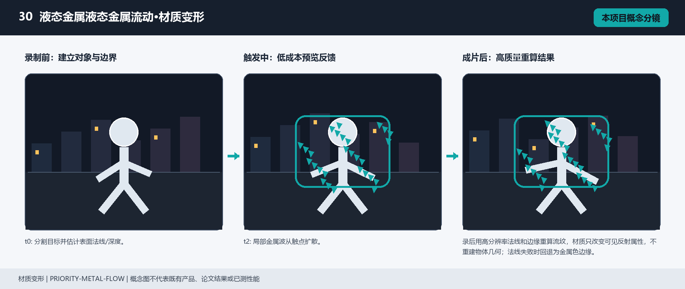
_图 30：本项目概念分镜。依次展示录制前、触发中和录后成片；不代表既有产品、论文实验结果或已测性能。_

**研究问题。** 金属流动效果容易只改变颜色，缺少与物体法线、边缘和运动方向相关的材质变化。

**目标体验。** 用户沿物体表面划过，衣服或道具像液态金属一样短暂流动；高光沿真实表面法线移动，动作结束后恢复原材质。

**可见创新。** 把液态金属的对象语义与液态金属流动的时序行为绑定，触发和参数共同改变可见结果，而不是只更换场景。 液态金属触发液态金属流动时，金属高光沿表面运动方向流动并保持形状；服饰、饰品或手臂始终可见且与画面空间保持对应

**交互时间线**

- t0: 分割目标并估计表面法线/深度。
- t1: 手指或物体运动提供流动方向。
- t2: 局部金属波从触点扩散。
- t3: 高光、边缘和金属流纹随法线变化。
- t4: 触发结束后流纹阻尼回到原始材质。

**模块和信号链**

- 目标 mask 与法线场。
- 接触轨迹和速度场。
- 材质状态/流体近似。
- 高光、反射和边缘金属色。
- 原始纹理保护与恢复合成。

`rgb + target_mask + depth/normal + touch_vector_field -> material_state[B,1,H,W] -> specular/reflection/edge layers -> rgb_out。`

**数据与训练建议**

- 数据：物体/服装材质视频、实例 mask、表面法线、光流与可控材质参数；渲染合成玻璃、金属、全息和溶解状态序列。
- Loss：L_mask、L_surface、L_normal、L_reflection、L_material、L_identity 与 L_temp；边界和非编辑区施加重建损失。
- 指标：材质区域 IoU、表面附着误差、反射方向一致性、边缘泄漏、时序稳定和身份保持。
- 真实性/身份约束：材质可生成，但目标物体轮廓、人体身份和交互接触点必须稳定。

**端侧预览、录后精修与控制**

- 预览：目标 ROI 540p，法线 分级更新，材质 shader 分级更新；具体时延和算力预算需在目标设备上实测。
- 录后：录后用高分辨率法线和边缘重算流纹，材质只改变可见反射属性，不重建物体几何；法线失败时回退为金属色边缘。
- 元数据：target mask；normal confidence；touch vector；flow seed；material state；roughness；recovery PTS
- 参数：`flow_strength`, `roughness`, `metallic`, `highlight_speed`, `wave_width`, `normal_smooth`, `recovery_damping`
- 产品形态：材质变身、科技道具和触摸金属录像模式。

**失败与降级**

- 法线不稳：关闭移动高光。
- 目标边缘丢失：收缩材质区域。
- 触发轨迹跳变：冻结流动中心。
- 反射内容不足：减弱镜面反射。

**参考边界。** Final Cut Pro object tracking[^3]；CapCut video background removal[^4]；MODNet: Real-Time Trimap-Free Portrait Matting via Objective Decomposition[^9]；MAGVIT: Masked Generative Video Transformer[^10]；Scalable Diffusion Models with Transformers[^13]；High-Resolution Image Synthesis with Latent Diffusion Models[^14]。这些来源只证明对应的基础能力；不能据此声称本完整特效已经量产。

### 案例 31：全息织物触摸全息染色·材质变形

`PRIORITY-HOLO-TOUCH`

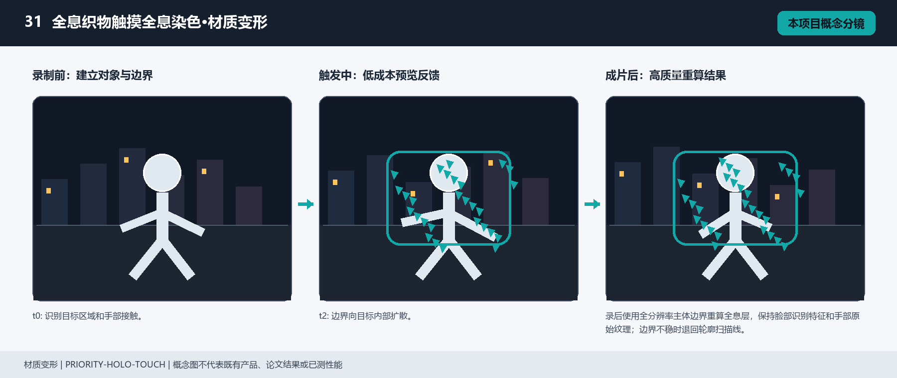
_图 31：本项目概念分镜。依次展示录制前、触发中和录后成片；不代表既有产品、论文实验结果或已测性能。_

**研究问题。** 全息化滤镜如果只有扫描线和色偏，用户动作与全息状态没有绑定。

**目标体验。** 手指划过人物肩膀后，肩部变成半透明全息层；抬手时层间扫描线被拉开，松手后按原轮廓回收。

**可见创新。** 把全息织物的对象语义与触摸全息染色的时序行为绑定，触发和参数共同改变可见结果，而不是只更换场景。 全息织物触发触摸全息染色时，触摸路径留下全息彩带并贴合衣物褶皱；衣服与头发边缘始终可见且与画面空间保持对应

**交互时间线**

- t0: 识别目标区域和手部接触。
- t1: 接触线写入 hologram boundary。
- t2: 边界向目标内部扩散。
- t3: 视角、动作和节拍驱动扫描线/色散。
- t4: 手指反向划过或动作结束，恢复真实材质。

**模块和信号链**

- 语义/实例 mask。
- 手部轨迹和接触场。
- hologram alpha/state。
- 扫描线、色散和透明材质。
- 主体遮挡、回收和原帧混合。

`rgb + target_mask + hand_path + view_dir + beat -> holo_state[B,1,H,W] + scan_phase -> rgba_holo[B,4,H,W] -> protected_composite。`

**数据与训练建议**

- 数据：物体/服装材质视频、实例 mask、表面法线、光流与可控材质参数；渲染合成玻璃、金属、全息和溶解状态序列。
- Loss：L_mask、L_surface、L_normal、L_reflection、L_material、L_identity 与 L_temp；边界和非编辑区施加重建损失。
- 指标：材质区域 IoU、表面附着误差、反射方向一致性、边缘泄漏、时序稳定和身份保持。
- 真实性/身份约束：材质可生成，但目标物体轮廓、人体身份和交互接触点必须稳定。

**端侧预览、录后精修与控制**

- 预览：目标 ROI 540p、扫描 shader 分级更新；具体时延和算力预算需在目标设备上实测。
- 录后：录后使用全分辨率主体边界重算全息层，保持脸部识别特征和手部原始纹理；边界不稳时退回轮廓扫描线。
- 元数据：target class；hand path；holo boundary；view direction；scan phase；identity；exit event
- 参数：`holo_progress`, `alpha`, `scan_density`, `hue_shift`, `edge_width`, `touch_gain`, `return_speed`
- 产品形态：全息触摸、科技人像和局部材质变换录像模式。

**失败与降级**

- 目标 mask 失稳：只显示轮廓全息线。
- 手部遮挡：暂停扩散。
- 脸部区域：默认保护不透明。
- 视角估计抖动：固定色相并减弱扫描。

**参考边界。** Final Cut Pro object tracking[^3]；CapCut video background removal[^4]；MODNet: Real-Time Trimap-Free Portrait Matting via Objective Decomposition[^9]；MAGVIT: Masked Generative Video Transformer[^10]；Scalable Diffusion Models with Transformers[^13]；High-Resolution Image Synthesis with Latent Diffusion Models[^14]。这些来源只证明对应的基础能力；不能据此声称本完整特效已经量产。

### 案例 32：歌词环绕歌词环绕旋转·粒子天气

`PRIORITY-LYRIC-ORBIT`

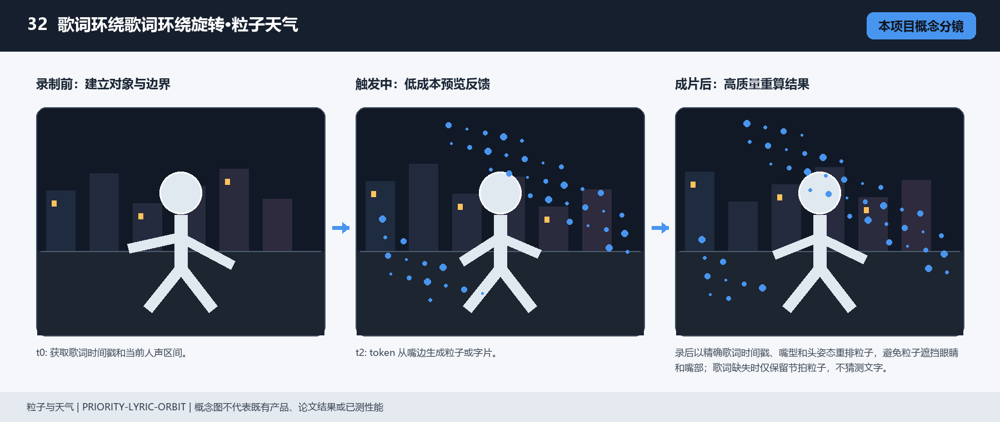
_图 32：本项目概念分镜。依次展示录制前、触发中和录后成片；不代表既有产品、论文实验结果或已测性能。_

**研究问题。** 歌词粒子如果只是把文字贴在画面上，和人物动作、视线以及空间没有关系。

**目标体验。** 副歌开始时，歌词碎片从人物嘴边释放，沿头部轨迹绕行一圈，再在下一句歌词到来前回到人物周围。

**可见创新。** 把歌词环绕的对象语义与歌词环绕旋转的时序行为绑定，触发和参数共同改变可见结果，而不是只更换场景。 歌词环绕触发歌词环绕旋转时，当前歌词沿人物头肩空间环绕并在背后被遮挡；人物头部与肩部空间始终可见且与画面空间保持对应

**交互时间线**

- t0: 获取歌词时间戳和当前人声区间。
- t1: 检测嘴型/说话者并绑定 lyric token。
- t2: token 从嘴边生成粒子或字片。
- t3: 粒子沿头部姿态和音量轨道绕行。
- t4: 句尾粒子聚合、淡出或交给下一位说话者。

**模块和信号链**

- 歌词/音频时间对齐。
- 嘴型和说话者检测。
- 头部姿态轨迹。
- 文字粒子排布、运动和遮挡。
- 人脸保护、音量驱动和合成。

`audio[T] + lyric_tokens[T] + mouth_state + head_pose[B,T,6] -> token_events -> particle_state[N,7] -> glyph_atlas + depth_sort -> rgb_out。`

**数据与训练建议**

- 数据：带深度与人物 mask 的真实/合成粒子视频；雨、花瓣、尘埃、歌词粒子与光束，覆盖不同景深、风向和遮挡。
- Loss：L_depth_order、L_particle_motion、L_occ、L_density、L_beat 与 L_temp；人物边缘使用抠像/遮挡监督。
- 指标：前后景顺序正确率、粒子轨迹平滑度、节拍同步偏差、边缘穿透率和密度稳定性。
- 真实性/身份约束：粒子不能遮挡关键面部、字幕或安全区域；必要时自动降低密度。

**端侧预览、录后精修与控制**

- 预览：歌词粒子最多 600 个、字形 atlas 预加载；具体时延和算力预算需在目标设备上实测。
- 录后：录后以精确歌词时间戳、嘴型和头姿态重排粒子，避免粒子遮挡眼睛和嘴部；歌词缺失时仅保留节拍粒子，不猜测文字。
- 元数据：lyric timestamps；speaker IDs；mouth states；head pose；token order；audio confidence；particle seed
- 参数：`orbit_radius`, `particle_count`, `font_scale`, `voice_gain`, `head_follow`, `token_delay`, `depth_bias`
- 产品形态：歌词环绕、音乐短视频和人像声画互动模式。

**失败与降级**

- 歌词时间戳不准：使用音量峰值对齐。
- 说话者不确定：不绑定嘴边生成。
- 粒子过密：按字符重要度裁剪。
- 人脸遮挡：降低面部前景粒子。

**参考边界。** Final Cut Pro object tracking[^3]；Robust High-Resolution Video Matting with Temporal Guidance[^8]；MAGVIT: Masked Generative Video Transformer[^10]；Scalable Diffusion Models with Transformers[^13]；High-Resolution Image Synthesis with Latent Diffusion Models[^14]。这些来源只证明对应的基础能力；不能据此声称本完整特效已经量产。

### 案例 33：节拍雨幕前后景雨层·粒子天气

`PRIORITY-RAIN-DEPTH`

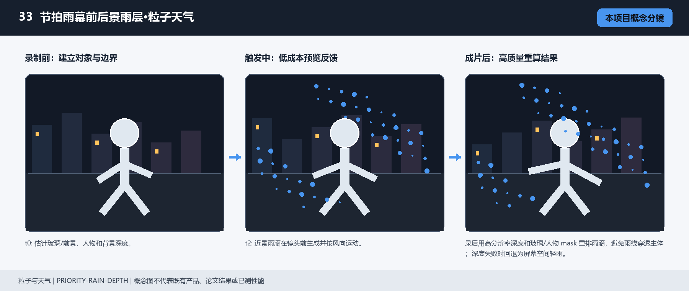
_图 33：本项目概念分镜。依次展示录制前、触发中和录后成片；不代表既有产品、论文实验结果或已测性能。_

**研究问题。** 雨效叠加常不考虑真实场景深度，雨线会穿过人物、玻璃和近景物体。

**目标体验。** 用户在室内拍窗外人物，雨线在玻璃前形成近景大颗粒，中景人物被部分遮挡，远处雨丝更细，镜头移动时三层雨场保持空间关系。

**可见创新。** 把节拍雨幕的对象语义与前后景雨层的时序行为绑定，触发和参数共同改变可见结果，而不是只更换场景。 节拍雨幕触发前后景雨层时，雨滴分布在人物前后并保持正确遮挡；人物前后景空间始终可见且与画面空间保持对应

**交互时间线**

- t0: 估计玻璃/前景、人物和背景深度。
- t1: 选择雨强和风向。
- t2: 近景雨滴在镜头前生成并按风向运动。
- t3: 中远景雨丝按深度和视差变化。
- t4: 触摸/节拍改变雨强后逐层衰减。

**模块和信号链**

- 深度/语义分层。
- 风向和相机运动估计。
- 三层雨粒子状态。
- 玻璃水滴/雨丝材质。
- 人物遮挡、景深和合成。

`rgb + depth[B,1,H,W] + semantic_masks + imu -> rain_particles[N,8] with z -> depth_sort + streak_shader + glass_drops -> rgb_out。`

**数据与训练建议**

- 数据：带深度与人物 mask 的真实/合成粒子视频；雨、花瓣、尘埃、歌词粒子与光束，覆盖不同景深、风向和遮挡。
- Loss：L_depth_order、L_particle_motion、L_occ、L_density、L_beat 与 L_temp；人物边缘使用抠像/遮挡监督。
- 指标：前后景顺序正确率、粒子轨迹平滑度、节拍同步偏差、边缘穿透率和密度稳定性。
- 真实性/身份约束：粒子不能遮挡关键面部、字幕或安全区域；必要时自动降低密度。

**端侧预览、录后精修与控制**

- 预览：最多 1500 个雨粒子，近/中/远三层；具体时延和算力预算需在目标设备上实测。
- 录后：录后用高分辨率深度和玻璃/人物 mask 重排雨滴，避免雨线穿透主体；深度失败时回退为屏幕空间轻雨。
- 元数据：depth layers；wind vector；rain seed；particle z；glass mask；subject mask；rain intensity events
- 参数：`rain_rate`, `wind_angle`, `streak_length`, `depth_layers`, `drop_size`, `glass_strength`, `occlusion`
- 产品形态：雨天、玻璃窗和氛围叙事录像模式。

**失败与降级**

- 深度断层：减少层数。
- 人物 mask 不稳：主体前只保留少量近景雨滴。
- 性能超限：降低远景粒子。
- 玻璃误检：关闭水滴贴附。

**参考边界。** Final Cut Pro object tracking[^3]；Robust High-Resolution Video Matting with Temporal Guidance[^8]；MAGVIT: Masked Generative Video Transformer[^10]；Scalable Diffusion Models with Transformers[^13]；High-Resolution Image Synthesis with Latent Diffusion Models[^14]。这些来源只证明对应的基础能力；不能据此声称本完整特效已经量产。

### 案例 34：花瓣旋涡手势花瓣旋涡·粒子天气

`PRIORITY-PETAL-GESTURE`

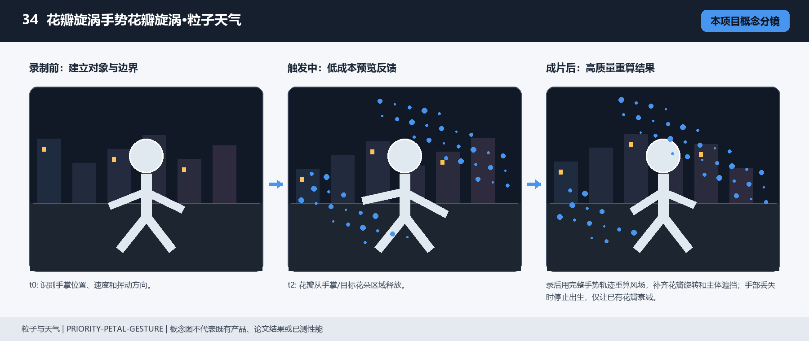
_图 34：本项目概念分镜。依次展示录制前、触发中和录后成片；不代表既有产品、论文实验结果或已测性能。_

**研究问题。** 花瓣粒子常只随随机风飘动，用户动作无法塑造花瓣流向。

**目标体验。** 用户挥手把花瓣从掌心扇向镜头，花瓣沿手势切线形成花流，手掌停下时花瓣悬停片刻后落地。

**可见创新。** 把花瓣旋涡的对象语义与手势花瓣旋涡的时序行为绑定，触发和参数共同改变可见结果，而不是只更换场景。 花瓣旋涡触发手势花瓣旋涡时，花瓣从掌心发射并沿手势方向形成旋涡；手掌或人物周围始终可见且与画面空间保持对应

**交互时间线**

- t0: 识别手掌位置、速度和挥动方向。
- t1: 手掌速度超过门限，创建局部风场。
- t2: 花瓣从手掌/目标花朵区域释放。
- t3: 粒子受手势风场、重力和相机视差影响。
- t4: 手势结束后风场阻尼，花瓣自然落下。

**模块和信号链**

- 手部 tracking。
- 局部向量场和动作阶段。
- 粒子出生/生命周期。
- 花瓣 atlas、旋转和深度排序。
- 主体遮挡、风场和地面落点合成。

`hand[B,21,3] + velocity[B,2] + body_mask + depth -> gesture_wind_field[B,2,H,W] -> petal_state[N,9] -> atlas_particles + occlusion -> rgb_out。`

**数据与训练建议**

- 数据：带深度与人物 mask 的真实/合成粒子视频；雨、花瓣、尘埃、歌词粒子与光束，覆盖不同景深、风向和遮挡。
- Loss：L_depth_order、L_particle_motion、L_occ、L_density、L_beat 与 L_temp；人物边缘使用抠像/遮挡监督。
- 指标：前后景顺序正确率、粒子轨迹平滑度、节拍同步偏差、边缘穿透率和密度稳定性。
- 真实性/身份约束：粒子不能遮挡关键面部、字幕或安全区域；必要时自动降低密度。

**端侧预览、录后精修与控制**

- 预览：最多 1200 花瓣、半分辨率粒子场；具体时延和算力预算需在目标设备上实测。
- 录后：录后用完整手势轨迹重算风场，补齐花瓣旋转和主体遮挡；手部丢失时停止出生，仅让已有花瓣衰减。
- 元数据：hand track；gesture velocity；wind field；particle seed；birth PTS；depth layer；ground contact
- 参数：`birth_rate`, `wind_gain`, `gravity`, `petal_scale`, `spin`, `lifetime`, `ground_bounce`
- 产品形态：手势花瓣、婚礼和春日氛围录像模式。

**失败与降级**

- 手势跳变：冻结风场短时平滑。
- 手部出框：停止新粒子。
- 粒子过密：限制屏幕面积。
- 深度不可靠：去掉前后穿插。

**参考边界。** Final Cut Pro object tracking[^3]；Robust High-Resolution Video Matting with Temporal Guidance[^8]；MAGVIT: Masked Generative Video Transformer[^10]；Scalable Diffusion Models with Transformers[^13]；High-Resolution Image Synthesis with Latent Diffusion Models[^14]。这些来源只证明对应的基础能力；不能据此声称本完整特效已经量产。

### 案例 35：尘埃聚焦光束尘埃·粒子天气

`PRIORITY-DUST-LIGHT`

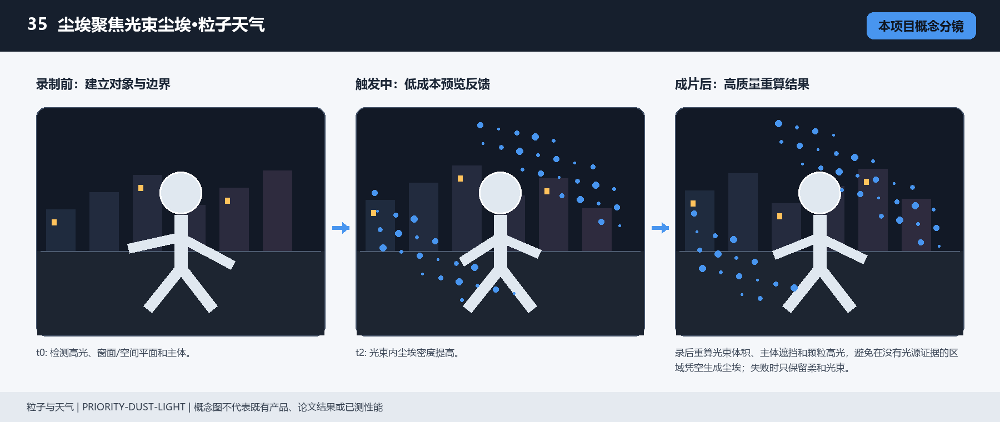
_图 35：本项目概念分镜。依次展示录制前、触发中和录后成片；不代表既有产品、论文实验结果或已测性能。_

**研究问题。** 尘埃光束若没有真实高光和体积方向，容易像随机噪点叠加。

**目标体验。** 镜头扫过窗边时，尘埃只在虚拟光束中显现；人物经过光束时，尘埃被前景遮挡，光束方向和相机转动保持一致。

**可见创新。** 把尘埃聚焦的对象语义与光束尘埃的时序行为绑定，触发和参数共同改变可见结果，而不是只更换场景。 尘埃聚焦触发光束尘埃时，只有光束覆盖区域内的尘埃被照亮并显示景深；一束光与被注视的物体始终可见且与画面空间保持对应

**交互时间线**

- t0: 检测高光、窗面/空间平面和主体。
- t1: 用户拖动或自动选择光束方向。
- t2: 光束内尘埃密度提高。
- t3: 颗粒受深度、风和镜头运动影响。
- t4: 光束移开后尘埃按生命周期衰减。

**模块和信号链**

- 高光/窗面和主体分割。
- 深度与光束几何。
- 尘埃粒子生命周期。
- 体积散射和高光采样。
- 主体遮挡、色调和合成。

`rgb + depth + highlight_map + beam_pose -> volume_density[B,1,H,W] -> dust_particles[N,8] -> scattering_layer + occlusion -> rgb_out。`

**数据与训练建议**

- 数据：带深度与人物 mask 的真实/合成粒子视频；雨、花瓣、尘埃、歌词粒子与光束，覆盖不同景深、风向和遮挡。
- Loss：L_depth_order、L_particle_motion、L_occ、L_density、L_beat 与 L_temp；人物边缘使用抠像/遮挡监督。
- 指标：前后景顺序正确率、粒子轨迹平滑度、节拍同步偏差、边缘穿透率和密度稳定性。
- 真实性/身份约束：粒子不能遮挡关键面部、字幕或安全区域；必要时自动降低密度。

**端侧预览、录后精修与控制**

- 预览：光束 ROI 540p、最多 800 粒子；具体时延和算力预算需在目标设备上实测。
- 录后：录后重算光束体积、主体遮挡和颗粒高光，避免在没有光源证据的区域凭空生成尘埃；失败时只保留柔和光束。
- 元数据：beam pose；highlight map；depth；dust seed；particle birth；occlusion mask；camera motion
- 参数：`beam_angle`, `density`, `particle_size`, `scattering`, `wind`, `lifetime`, `occlusion`
- 产品形态：窗边尘埃、舞台体积光和室内氛围录像模式。

**失败与降级**

- 高光不足：降低尘埃密度。
- 深度错误：取消体积前后关系。
- 主体遮挡不稳：尘埃只在背景层。
- 性能超限：改用纹理化尘埃层。

**参考边界。** Final Cut Pro object tracking[^3]；Robust High-Resolution Video Matting with Temporal Guidance[^8]；MAGVIT: Masked Generative Video Transformer[^10]；Scalable Diffusion Models with Transformers[^13]；High-Resolution Image Synthesis with Latent Diffusion Models[^14]。这些来源只证明对应的基础能力；不能据此声称本完整特效已经量产。

### 案例 36：季节翻转转身换季·世界风格

`PRIORITY-SEASON-ROTATE`

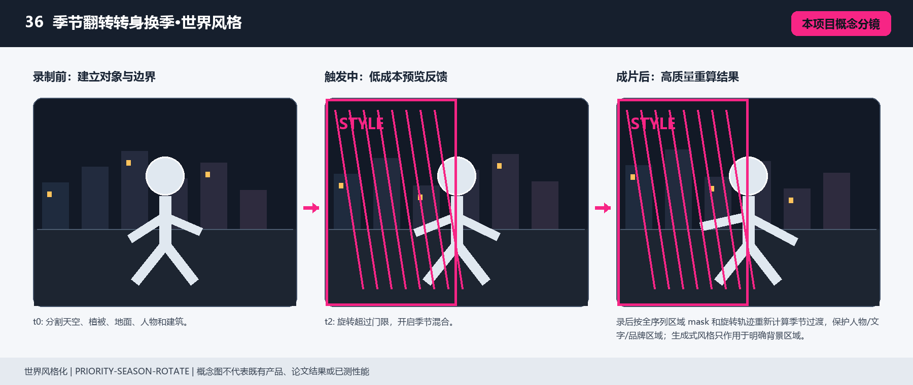
_图 36：本项目概念分镜。依次展示录制前、触发中和录后成片；不代表既有产品、论文实验结果或已测性能。_

**研究问题。** 季节转换容易是全画面色调切换，人物、天空和地面没有分别的时序。

**目标体验。** 用户旋转手机，春夏秋冬沿旋转角逐步过渡；人物保持原始身份，背景植物、天空和地面材质按区域变化。

**可见创新。** 把季节翻转的对象语义与转身换季的时序行为绑定，触发和参数共同改变可见结果，而不是只更换场景。 季节翻转触发转身换季时，新朝向逐渐显露另一季节且接缝固定在世界空间；背景天空、植物与地面始终可见且与画面空间保持对应

**交互时间线**

- t0: 分割天空、植被、地面、人物和建筑。
- t1: 检测手机旋转方向和角度。
- t2: 旋转超过门限，开启季节混合。
- t3: 不同语义区域使用不同过渡进度。
- t4: 停止旋转，锁定当前季节或回到起点。

**模块和信号链**

- 语义分割与主体保护。
- IMU/视觉旋转估计。
- 按区域的风格/材质混合。
- 季节粒子、天空和颜色映射。
- 前景边界和区域一致性合成。

`rgb + semantic_masks[C,H,W] + camera_rotation + depth -> season_progress[C] -> palette/material/particle layers -> protected_composite。`

**数据与训练建议**

- 数据：多场景长视频及风格参考；相机轨迹、深度、语义 mask、结构边缘和色彩统计；需覆盖昼夜、季节和复杂运动。
- Loss：L_structure、L_content、L_style、L_semantic、L_identity、L_flow 与 L_temp；生成式区域加入事实和几何保持门控。
- 指标：结构边缘保持、身份相似度、风格一致性、光流扭曲误差、闪烁率和事实改写人工审查。
- 真实性/身份约束：这是生成式或感知式世界改写；必须保留原片并显式标注创作效果。

**端侧预览、录后精修与控制**

- 预览：语义分割 分级更新，风格层半分辨率 分级更新；具体时延和算力预算需在目标设备上实测。
- 录后：录后按全序列区域 mask 和旋转轨迹重新计算季节过渡，保护人物/文字/品牌区域；生成式风格只作用于明确背景区域。
- 元数据：semantic masks；rotation angle；season progress；region confidence；palette seed；particle state；lock event
- 参数：`rotation_range`, `region_weights`, `season_mix`, `sky_strength`, `foliage_density`, `particle_rate`, `subject_protect`
- 产品形态：旅行、城市和季节转场录像模式。

**失败与降级**

- 分割不稳：只对天空和大面积地面做颜色变化。
- 旋转抖动：用 IMU 和视觉融合。
- 人物误改：扩大保护 mask。
- 风格延迟：使用预计算材质层。

**参考边界。** CapCut video background removal[^4]；Apple Photographic Styles[^5]；MAGVIT: Masked Generative Video Transformer[^10]；SVFR: A Unified Framework for Generalized Video Face Restoration[^11]；Scalable Diffusion Models with Transformers[^13]；High-Resolution Image Synthesis with Latent Diffusion Models[^14]。这些来源只证明对应的基础能力；不能据此声称本完整特效已经量产。

### 案例 37：漫画街景凝视漫画化·世界风格

`PRIORITY-COMIC-GAZE`

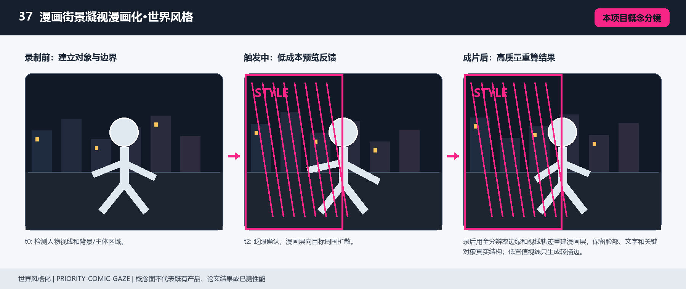
_图 37：本项目概念分镜。依次展示录制前、触发中和录后成片；不代表既有产品、论文实验结果或已测性能。_

**研究问题。** 漫画化如果全局处理，会让用户的视线与强调对象消失。

**目标体验。** 人物看向远处招牌，视线经过的区域先变成漫画速度线和网点，人物脸部保持真实；眨眼后漫画层扩展到背景。

**可见创新。** 把漫画街景的对象语义与凝视漫画化的时序行为绑定，触发和参数共同改变可见结果，而不是只更换场景。 漫画街景触发凝视漫画化时，被注视对象先变成高对比线稿，背景保持真实；建筑边缘与人物轮廓始终可见且与画面空间保持对应

**交互时间线**

- t0: 检测人物视线和背景/主体区域。
- t1: 视线停留在目标，目标边缘出现漫画线。
- t2: 眨眼确认，漫画层向目标周围扩散。
- t3: 视线移动时旧区域保留短暂网点回声。
- t4: 视线回到人物或闭眼，漫画层收束。

**模块和信号链**

- 人脸/视线跟踪。
- 目标检测和区域命中。
- 漫画边缘/网点生成。
- 局部风格和速度线。
- 脸部保护与时间衰减合成。

`rgb + gaze_ray + object_masks + face_mask -> target_id + dwell -> edge_map + halftone_field + speed_lines -> face_protected_output。`

**数据与训练建议**

- 数据：多场景长视频及风格参考；相机轨迹、深度、语义 mask、结构边缘和色彩统计；需覆盖昼夜、季节和复杂运动。
- Loss：L_structure、L_content、L_style、L_semantic、L_identity、L_flow 与 L_temp；生成式区域加入事实和几何保持门控。
- 指标：结构边缘保持、身份相似度、风格一致性、光流扭曲误差、闪烁率和事实改写人工审查。
- 真实性/身份约束：这是生成式或感知式世界改写；必须保留原片并显式标注创作效果。

**端侧预览、录后精修与控制**

- 预览：目标/边缘 分级更新、漫画层 540p；具体时延和算力预算需在目标设备上实测。
- 录后：录后用全分辨率边缘和视线轨迹重建漫画层，保留脸部、文字和关键对象真实结构；低置信视线只生成轻描边。
- 元数据：gaze target；dwell PTS；blink event；face protect mask；edge map；style state；decay window
- 参数：`dwell_time`, `line_density`, `dot_scale`, `style_progress`, `face_protect`, `echo_decay`, `target_limit`
- 产品形态：漫画凝视、目标强调和风格化人像录像模式。

**失败与降级**

- 视线漂移：缩小命中区域。
- 目标边界不清：仅生成局部描边。
- 脸部泄漏：强制保护。
- 风格层过重：混合回原始纹理。

**参考边界。** CapCut video background removal[^4]；Apple Photographic Styles[^5]；MAGVIT: Masked Generative Video Transformer[^10]；SVFR: A Unified Framework for Generalized Video Face Restoration[^11]；Scalable Diffusion Models with Transformers[^13]；High-Resolution Image Synthesis with Latent Diffusion Models[^14]。这些来源只证明对应的基础能力；不能据此声称本完整特效已经量产。

### 案例 38：水下城市水下焦散世界·世界风格

`PRIORITY-WATER-CAUSTIC`

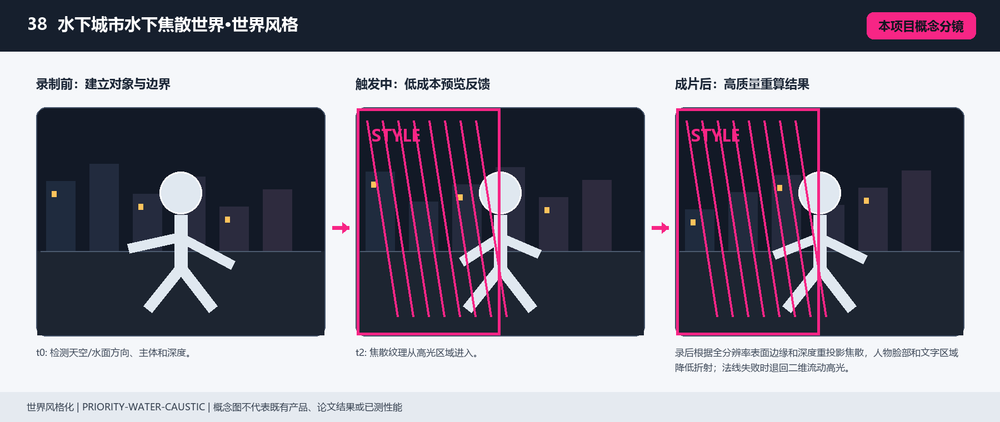
_图 38：本项目概念分镜。依次展示录制前、触发中和录后成片；不代表既有产品、论文实验结果或已测性能。_

**研究问题。** 水下风格如果只叠蓝色和气泡，缺少水面焦散、深度和光线方向。

**目标体验。** 用户把手机对准人物，水面焦散从上方扫过脸部和墙面，近处高光更清晰，远处颜色和对比度逐渐衰减。

**可见创新。** 把水下城市的对象语义与水下焦散世界的时序行为绑定，触发和参数共同改变可见结果，而不是只更换场景。 水下城市触发水下焦散世界时，建筑和地面出现随深度变化的流动焦散；背景建筑和空气层始终可见且与画面空间保持对应

**交互时间线**

- t0: 检测天空/水面方向、主体和深度。
- t1: 用户旋转手机或拖动水面方向。
- t2: 焦散纹理从高光区域进入。
- t3: 焦散按深度和法线改变形状。
- t4: 停止操作后焦散缓慢回到静态水纹。

**模块和信号链**

- 主体/天空/表面分割。
- 深度与法线估计。
- 水面焦散纹理投影。
- 体积色彩和景深。
- 主体保护和光纹合成。

`rgb + depth + normals + surface_masks + water_direction -> caustic_field[B,1,H,W] + depth_tint -> refraction/caustic_layer -> rgb_out。`

**数据与训练建议**

- 数据：多场景长视频及风格参考；相机轨迹、深度、语义 mask、结构边缘和色彩统计；需覆盖昼夜、季节和复杂运动。
- Loss：L_structure、L_content、L_style、L_semantic、L_identity、L_flow 与 L_temp；生成式区域加入事实和几何保持门控。
- 指标：结构边缘保持、身份相似度、风格一致性、光流扭曲误差、闪烁率和事实改写人工审查。
- 真实性/身份约束：这是生成式或感知式世界改写；必须保留原片并显式标注创作效果。

**端侧预览、录后精修与控制**

- 预览：焦散纹理半分辨率 分级更新，深度/法线 分级更新；具体时延和算力预算需在目标设备上实测。
- 录后：录后根据全分辨率表面边缘和深度重投影焦散，人物脸部和文字区域降低折射；法线失败时退回二维流动高光。
- 元数据：water direction；depth；normal confidence；caustic phase；surface masks；subject mask；style progress
- 参数：`caustic_scale`, `speed`, `direction`, `depth_falloff`, `refraction`, `blue_gain`, `subject_protect`
- 产品形态：水下、泳池和梦幻光纹录像模式。

**失败与降级**

- 深度断层：降低远近差。
- 法线不稳：改用平面焦散。
- 主体误改：扩大保护 mask。
- 纹理漂移：锁定水面坐标。

**参考边界。** CapCut video background removal[^4]；Apple Photographic Styles[^5]；MAGVIT: Masked Generative Video Transformer[^10]；SVFR: A Unified Framework for Generalized Video Face Restoration[^11]；Scalable Diffusion Models with Transformers[^13]；High-Resolution Image Synthesis with Latent Diffusion Models[^14]。这些来源只证明对应的基础能力；不能据此声称本完整特效已经量产。

### 案例 39：霓虹世界人声霓虹频谱·世界风格

`PRIORITY-NEON-VOICE`

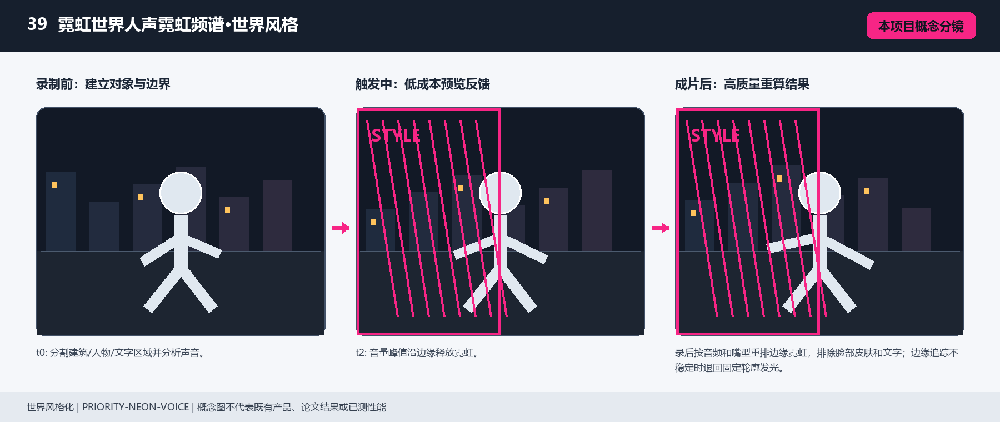
_图 39：本项目概念分镜。依次展示录制前、触发中和录后成片；不代表既有产品、论文实验结果或已测性能。_

**研究问题。** 霓虹风格如果不与声音和场景边缘绑定，只是全局色彩 LUT。

**目标体验。** 人物说话时，嘴型和声音峰值把周围建筑边缘点亮成霓虹线；声音停止后霓虹沿说话方向回收，人物肤色保持自然。

**可见创新。** 把霓虹世界的对象语义与人声霓虹频谱的时序行为绑定，触发和参数共同改变可见结果，而不是只更换场景。 霓虹世界触发人声霓虹频谱时，街景霓虹颜色和高度随声音频谱变化；街道灯牌和主体边缘始终可见且与画面空间保持对应

**交互时间线**

- t0: 分割建筑/人物/文字区域并分析声音。
- t1: 人声活动开始，锁定附近边缘。
- t2: 音量峰值沿边缘释放霓虹。
- t3: 嘴型节奏改变线宽和颜色。
- t4: 句尾或静音，霓虹按时间顺序熄灭。

**模块和信号链**

- 音频 VAD/音量包络。
- 嘴型和人脸跟踪。
- 场景边缘/语义筛选。
- 霓虹线段和 bloom。
- 肤色保护、遮挡和衰减合成。

`audio[T] + mouth_state + edge_map + semantic_masks -> voice_envelope[T] + edge_tracks[N] -> neon_strokes[N,7] + bloom -> rgb_out。`

**数据与训练建议**

- 数据：多场景长视频及风格参考；相机轨迹、深度、语义 mask、结构边缘和色彩统计；需覆盖昼夜、季节和复杂运动。
- Loss：L_structure、L_content、L_style、L_semantic、L_identity、L_flow 与 L_temp；生成式区域加入事实和几何保持门控。
- 指标：结构边缘保持、身份相似度、风格一致性、光流扭曲误差、闪烁率和事实改写人工审查。
- 真实性/身份约束：这是生成式或感知式世界改写；必须保留原片并显式标注创作效果。

**端侧预览、录后精修与控制**

- 预览：边缘提取 分级更新、音频 分级更新、线段合成 分级更新；具体时延和算力预算需在目标设备上实测。
- 录后：录后按音频和嘴型重排边缘霓虹，排除脸部皮肤和文字；边缘追踪不稳定时退回固定轮廓发光。
- 元数据：voice activity；volume peaks；mouth states；edge tracks；semantic classes；neon seed；sentence PTS
- 参数：`neon_width`, `voice_gain`, `color_map`, `bloom`, `edge_limit`, `decay`, `skin_protect`
- 产品形态：霓虹口播、城市夜景和声音驱动风格录像模式。

**失败与降级**

- 环境噪声：使用人声频段门控。
- 嘴型漏检：只用音量包络。
- 边缘过密：按语义和亮度筛选。
- 肤色染色：扩大皮肤保护区域。

**参考边界。** CapCut video background removal[^4]；Apple Photographic Styles[^5]；MAGVIT: Masked Generative Video Transformer[^10]；SVFR: A Unified Framework for Generalized Video Face Restoration[^11]；Scalable Diffusion Models with Transformers[^13]；High-Resolution Image Synthesis with Latent Diffusion Models[^14]。这些来源只证明对应的基础能力；不能据此声称本完整特效已经量产。

### 案例 40：声源彩带声源彩带移交·音频歌词

`PRIORITY-RIBBON-HANDOFF`

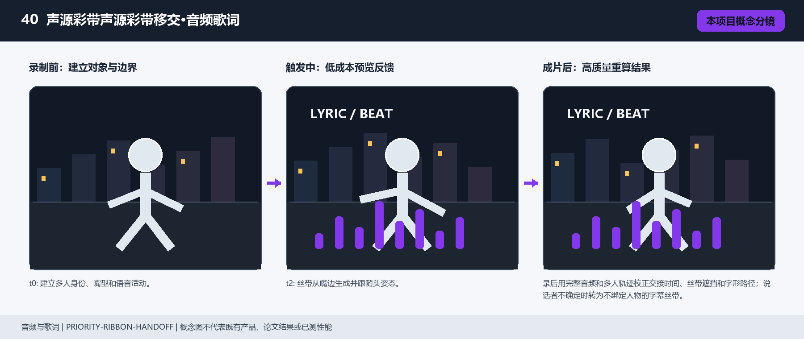
_图 40：本项目概念分镜。依次展示录制前、触发中和录后成片；不代表既有产品、论文实验结果或已测性能。_

**研究问题。** 歌词/音频丝带在多人场景中常没有说话者交接，文字会穿过错误人物。

**目标体验。** 两个人轮流唱一句，歌词丝带从第一人的嘴边绕到第二人的肩侧，交接瞬间由两人的视线和声音共同确认。

**可见创新。** 把声源彩带的对象语义与声源彩带移交的时序行为绑定，触发和参数共同改变可见结果，而不是只更换场景。 声源彩带触发声源彩带移交时，彩带沿两人空间路径移动到新说话者；说话者周围的空间方向始终可见且与画面空间保持对应

**交互时间线**

- t0: 建立多人身份、嘴型和语音活动。
- t1: 识别第一位说话者和歌词 token。
- t2: 丝带从嘴边生成并跟随头姿态。
- t3: 下一位说话者出现时，丝带跨过两人的关系边。
- t4: 句尾丝带收束到最后说话者或变成字幕。

**模块和信号链**

- 多人 face/track。
- VAD/说话者 diarization。
- 歌词时间轴和 token。
- 丝带路径、头姿态和深度排序。
- 多人遮挡、交接和合成。

`audio[T] + speaker_probs[N,T] + mouth[N,T] + head_pose[N,T] + lyric_tokens -> handoff_graph -> ribbon_curve[T,3] + glyph_atlas -> depth_sorted_composite。`

**数据与训练建议**

- 数据：多说话人/演唱视频、分离音轨、说话人时间戳、ASR 字幕、嘴型关键点、声源方向和人物轨迹。
- Loss：L_sync、L_speaker、L_lip、L_layout、L_occ、L_readability 与 L_temp；错误 ASR 使用低置信度隐藏策略。
- 指标：音画同步偏差、说话人归属准确率、字幕可读性、遮挡正确率、嘴型关联和切换抖动。
- 真实性/身份约束：不得伪造说话内容；歌词/字幕必须与原音频绑定并保留置信度。

**端侧预览、录后精修与控制**

- 预览：最多 3 人、1 条主丝带、600 字形粒子；具体时延和算力预算需在目标设备上实测。
- 录后：录后用完整音频和多人轨迹校正交接时间、丝带遮挡和字形路径；说话者不确定时转为不绑定人物的字幕丝带。
- 元数据：speaker IDs；speaker probabilities；lyric PTS；mouth states；head poses；handoff events；ribbon path
- 参数：`ribbon_width`, `handoff_time`, `voice_gain`, `orbit_radius`, `depth_bias`, `font_scale`, `fade`
- 产品形态：多人合唱、对话和音乐录像中的歌词丝带玩法。

**失败与降级**

- 说话者不确定：冻结当前丝带，不跨人交接。
- 人物重叠：按深度切断丝带。
- 歌词缺失：只保留无文字彩带。
- 音频延迟：按 PTS 校正。

**参考边界。** Final Cut Pro object tracking[^3]；Blackmagic Camera app[^7]。这些来源只证明对应的基础能力；不能据此声称本完整特效已经量产。

### 案例 41：人声光谱面罩嘴型频谱开合·音频歌词

`PRIORITY-MOUTH-LYRIC-MASK`

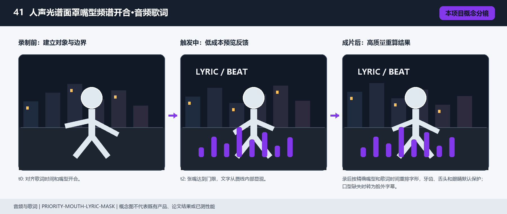
_图 41：本项目概念分镜。依次展示录制前、触发中和录后成片；不代表既有产品、论文实验结果或已测性能。_

**研究问题。** 歌词遮罩如果不看嘴型，文字会提前或滞后覆盖脸部，口型与字幕缺少节奏。

**目标体验。** 用户唱歌时，嘴型张开让当前词从嘴内显现，闭嘴时词片沿下巴边缘散开；字幕时间、口型和音量共同决定遮罩强度。

**可见创新。** 把人声光谱面罩的对象语义与嘴型频谱开合的时序行为绑定，触发和参数共同改变可见结果，而不是只更换场景。 人声光谱面罩触发嘴型频谱开合时，频谱面罩随嘴巴开合展开和收缩；人物脸部和嘴部周围始终可见且与画面空间保持对应

**交互时间线**

- t0: 对齐歌词时间和嘴型开合。
- t1: 当前 token 进入嘴部候选区域。
- t2: 张嘴达到门限，文字从唇线内部显现。
- t3: 音量峰值使字符扩大或分裂。
- t4: 闭嘴/句尾，文字从嘴边释放并淡出。

**模块和信号链**

- 嘴型/唇部关键点。
- 歌词/音频时间对齐。
- 唇部 mask 和保护区。
- 字形 atlas、遮罩和粒子。
- 肤色、牙齿和眼部保护合成。

`mouth_landmarks[B,20,2] + mouth_open[B] + lyric_token[t] + volume[t] -> lip_mask + token_state -> glyph_layer + particle_alpha -> face_protected_output。`

**数据与训练建议**

- 数据：多说话人/演唱视频、分离音轨、说话人时间戳、ASR 字幕、嘴型关键点、声源方向和人物轨迹。
- Loss：L_sync、L_speaker、L_lip、L_layout、L_occ、L_readability 与 L_temp；错误 ASR 使用低置信度隐藏策略。
- 指标：音画同步偏差、说话人归属准确率、字幕可读性、遮挡正确率、嘴型关联和切换抖动。
- 真实性/身份约束：不得伪造说话内容；歌词/字幕必须与原音频绑定并保留置信度。

**端侧预览、录后精修与控制**

- 预览：唇部 ROI 128x64、字形粒子最多 200；具体时延和算力预算需在目标设备上实测。
- 录后：录后按精确嘴型和歌词时间重排字形，牙齿、舌头和眼睛默认保护；口型缺失时转为脸外字幕。
- 元数据：lyric token PTS；mouth landmarks；mouth openness；volume；lip mask；token state；face protect
- 参数：`token_delay`, `mouth_threshold`, `font_scale`, `volume_gain`, `mask_feather`, `particle_spread`, `face_protect`
- 产品形态：演唱、口播和歌词人像录像模式。

**失败与降级**

- 歌词错位：用嘴型/音量局部校正。
- 唇部关键点丢失：字形移到下巴边。
- 脸部遮挡：不生成嘴内文字。
- 字符过密：只显示当前词首字或轮廓。

**参考边界。** Final Cut Pro object tracking[^3]；Blackmagic Camera app[^7]。这些来源只证明对应的基础能力；不能据此声称本完整特效已经量产。

### 案例 42：多人接唱球触碰合唱连线·音频歌词

`PRIORITY-DUET-TOUCH`

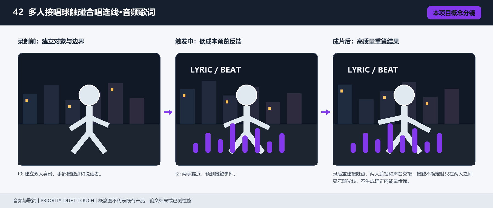
_图 42：本项目概念分镜。依次展示录制前、触发中和录后成片；不代表既有产品、论文实验结果或已测性能。_

**研究问题。** 双人互动音效常只按两个人同时出现触发，缺少接触、声音和关系方向。

**目标体验。** 两个人唱到同一句时碰拳，能量从一个人的嘴边沿手臂传到另一个人，碰拳瞬间粒子和歌词同步爆开。

**可见创新。** 把多人接唱球的对象语义与触碰合唱连线的时序行为绑定，触发和参数共同改变可见结果，而不是只更换场景。 多人接唱球触发触碰合唱连线时，接触点生成连接双方的歌词光线；两到三位演唱者之间始终可见且与画面空间保持对应

**交互时间线**

- t0: 建立双人身份、手部接触点和说话者。
- t1: 第一人唱词并生成能量起点。
- t2: 两手靠近，预测接触事件。
- t3: 接触确认且第二人进入人声，能量完成交接。
- t4: 句尾能量沿两人关系边衰减。

**模块和信号链**

- 多人/手部 tracking。
- 接触关系和距离状态机。
- 音频/歌词对齐。
- 能量路径和粒子爆发。
- 人体遮挡、交接和合成。

`persons[N] + hands[N,2] + contact_graph[N,N] + audio + lyric -> handoff_edge -> energy_curve[T,3] + burst_particles -> depth_sorted_rgb_out。`

**数据与训练建议**

- 数据：多说话人/演唱视频、分离音轨、说话人时间戳、ASR 字幕、嘴型关键点、声源方向和人物轨迹。
- Loss：L_sync、L_speaker、L_lip、L_layout、L_occ、L_readability 与 L_temp；错误 ASR 使用低置信度隐藏策略。
- 指标：音画同步偏差、说话人归属准确率、字幕可读性、遮挡正确率、嘴型关联和切换抖动。
- 真实性/身份约束：不得伪造说话内容；歌词/字幕必须与原音频绑定并保留置信度。

**端侧预览、录后精修与控制**

- 预览：最多 2 人、800 粒子、接触图 分级更新；具体时延和算力预算需在目标设备上实测。
- 录后：录后重建接触点、两人遮挡和声音交接；接触不确定时只在两人之间显示弱光线，不生成确定的能量传递。
- 元数据：person IDs；hand landmarks；contact PTS；speaker IDs；lyric token；energy source；handoff confidence
- 参数：`contact_radius`, `energy_speed`, `burst_gain`, `particle_count`, `voice_gate`, `path_width`, `fade`
- 产品形态：双人合唱、朋友互动和碰拳能量录像模式。

**失败与降级**

- 人物身份交换：暂停交接。
- 手部遮挡：使用腕点近似但降低强度。
- 说话者不清：不触发能量。
- 粒子超限：保留能量线和核心爆点。

**参考边界。** Final Cut Pro object tracking[^3]；Blackmagic Camera app[^7]。这些来源只证明对应的基础能力；不能据此声称本完整特效已经量产。

### 案例 43：低音地震字幕声源侧字幕·音频歌词

`PRIORITY-SUBTITLE-DIRECTION`

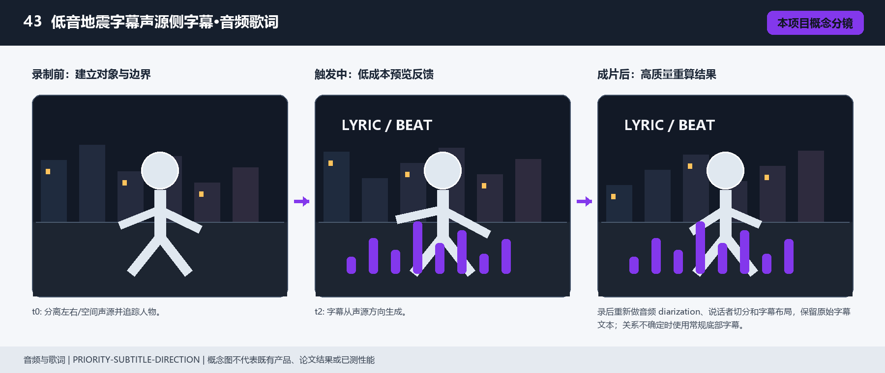
_图 43：本项目概念分镜。依次展示录制前、触发中和录后成片；不代表既有产品、论文实验结果或已测性能。_

**研究问题。** 字幕通常固定在底部，无法表达声音来自谁、哪个方向和谁正在被注视。

**目标体验。** 画面外的人说话时，字幕从声音方向进入；说话者转头看向画内人物，字幕沿视线方向弯曲并停在两人之间。

**可见创新。** 把低音地震字幕的对象语义与声源侧字幕的时序行为绑定，触发和参数共同改变可见结果，而不是只更换场景。 低音地震字幕触发声源侧字幕时，字幕移动到当前说话者一侧并保留阅读方向；地面与悬浮字幕始终可见且与画面空间保持对应

**交互时间线**

- t0: 分离左右/空间声源并追踪人物。
- t1: 识别当前说话者和目标听者。
- t2: 字幕从声源方向生成。
- t3: 视线和头姿态改变字幕弧线。
- t4: 句尾字幕折回说话者或沉入画面底部。

**模块和信号链**

- 音源方向/声纹或 VAD。
- 多人脸与头姿态。
- 说话者-听者关系。
- 字幕排版和曲线路径。
- 遮挡、可读性和合成。

`audio[T,C] + speaker_probs[N,T] + head_pose[N,T] + gaze_relation[N,N] -> subtitle_anchor + curve -> text_layout + occlusion_aware_layer -> rgb_out。`

**数据与训练建议**

- 数据：多说话人/演唱视频、分离音轨、说话人时间戳、ASR 字幕、嘴型关键点、声源方向和人物轨迹。
- Loss：L_sync、L_speaker、L_lip、L_layout、L_occ、L_readability 与 L_temp；错误 ASR 使用低置信度隐藏策略。
- 指标：音画同步偏差、说话人归属准确率、字幕可读性、遮挡正确率、嘴型关联和切换抖动。
- 真实性/身份约束：不得伪造说话内容；歌词/字幕必须与原音频绑定并保留置信度。

**端侧预览、录后精修与控制**

- 预览：字幕排版 分级更新、最多 2 行/句；具体时延和算力预算需在目标设备上实测，保证文字可读性优先。
- 录后：录后重新做音频 diarization、说话者切分和字幕布局，保留原始字幕文本；关系不确定时使用常规底部字幕。
- 元数据：audio channels；speaker IDs；listener IDs；lyric/text PTS；head/gaze relation；subtitle curve；layout version
- 参数：`anchor_offset`, `curve_strength`, `font_scale`, `entry_speed`, `line_limit`, `speaker_color`, `readability_margin`
- 产品形态：空间字幕、对话录像和可视化声音方向模式。

**失败与降级**

- 声源方向不可靠：回退底部字幕。
- 说话者不确定：不绑定人物。
- 文字遮挡主体：自动避让。
- 多人同时说话：分栏而非重叠。

**参考边界。** Final Cut Pro object tracking[^3]；Blackmagic Camera app[^7]。这些来源只证明对应的基础能力；不能据此声称本完整特效已经量产。

### 案例 44：节拍变焦手势冲击变焦·特效摄影

`PRIORITY-ZOOM-PUNCH`

_图 44：本项目概念分镜。依次展示录制前、触发中和录后成片；不代表既有产品、论文实验结果或已测性能。_

**研究问题。** 数字冲击变焦如果只缩放全画面，主体和背景同时放大，缺少注意力方向。

**目标体验。** 鼓点到来时，画面快速推向人物手中的道具，背景短暂产生径向拉伸；道具和人物脸部保持清晰，冲击结束后回弹。

**可见创新。** 把节拍变焦的对象语义与手势冲击变焦的时序行为绑定，触发和参数共同改变可见结果，而不是只更换场景。 节拍变焦触发手势冲击变焦时，焦点对象快速放大并产生一次光学冲击环；人物眼睛或场景中心始终可见且与画面空间保持对应

**交互时间线**

- t0: 检测目标、音频强拍和当前构图。
- t1: 目标稳定可见并进入预热窗口。
- t2: 强拍触发短时 punch-in。
- t3: 目标 ROI 保持清晰，背景产生方向性拉伸。
- t4: 目标回到原尺度并衰减边缘速度线。

**模块和信号链**

- 目标/人脸检测。
- 音频 beat 与目标锁定。
- ROI zoom transform。
- 背景径向 warp 和 motion blur。
- 目标保护、空洞修补和合成。

`rgb + target_box + face_protect + beat_phase -> zoom_curve -> target_warp + background_radial_warp -> protected_composite。`

**数据与训练建议**

- 数据：带焦点、深度、人物 mask、相机内参与触发事件的素材；可用自动裁切生成擦镜、分屏、冲击变焦和焦点脉冲监督。
- Loss：L_frame、L_focus、L_mask、L_transition、L_camera 与 L_temp；保持主体关键区域不被转场裁断。
- 指标：触发时刻误差、主体保留率、过渡接缝、焦点命中率、构图偏差和观感评分。
- 真实性/身份约束：只保留具有明显可见效果的摄影玩法；不把普通防抖或常规运镜作为主功能。

**端侧预览、录后精修与控制**

- 预览：目标 ROI 720p、背景 540p；具体时延和算力预算需在目标设备上实测。
- 录后：录后按目标轨迹和高分辨率边界重算变焦曲线，背景空洞从前后帧修复；目标不稳定时只做轻微整体 punch。
- 元数据：target ID；box/keypoints；beat PTS；zoom curve；face protect；warp center；exit PTS
- 参数：`zoom_amount`, `duration`, `overshoot`, `warp_strength`, `motion_blur`, `target_smooth`, `beat_gain`
- 产品形态：音乐冲击变焦、道具强调和短视频节奏镜头模式。

**失败与降级**

- 目标丢失：取消冲击。
- 目标太小：扩大 ROI 但降低倍率。
- 脸部变形：启用 face protect。
- 背景空洞：减弱径向 warp。

**参考边界。** Apple Cinematic mode[^1]；CapCut video background removal[^4]；Blackmagic Camera app[^7]；Robust High-Resolution Video Matting with Temporal Guidance[^8]。这些来源只证明对应的基础能力；不能据此声称本完整特效已经量产。

### 案例 45：遮罩擦镜人体经过擦镜·特效摄影

`PRIORITY-WIPE-BODY`

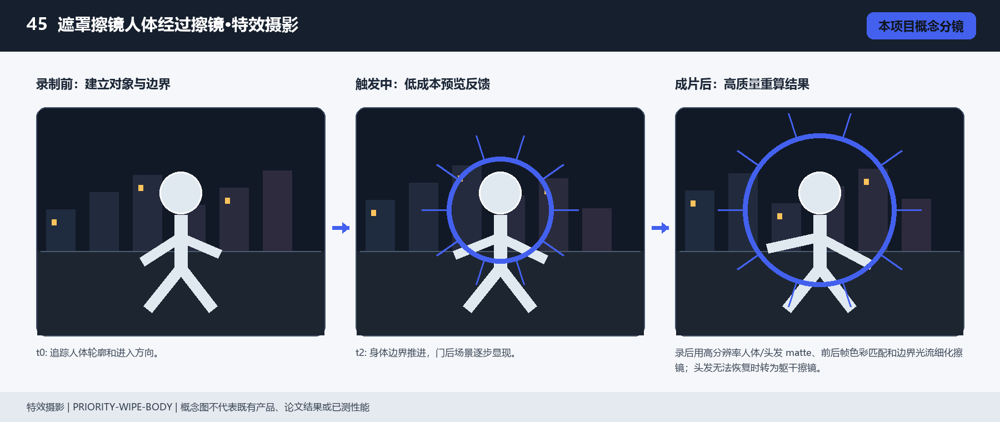
_图 45：本项目概念分镜。依次展示录制前、触发中和录后成片；不代表既有产品、论文实验结果或已测性能。_

**研究问题。** 人体擦镜如果没有身体轮廓和前后景逻辑，会像平面蒙版切换。

**目标体验。** 人物从镜头前走过，身体轮廓成为一扇擦镜门；身体经过的区域切换到另一段场景，头发和手臂边缘保留自然运动。

**可见创新。** 把遮罩擦镜的对象语义与人体经过擦镜的时序行为绑定，触发和参数共同改变可见结果，而不是只更换场景。 遮罩擦镜触发人体经过擦镜时，人体轮廓后方逐步显露下一场景；人物、门框或手掌边缘始终可见且与画面空间保持对应

**交互时间线**

- t0: 追踪人体轮廓和进入方向。
- t1: 身体覆盖画面中心，建立 wipe front。
- t2: 身体边界推进，门后场景逐步显现。
- t3: 头发/手臂作为前景保护层通过。
- t4: 身体离开后接缝闭合并回到新场景。

**模块和信号链**

- 人体/头发 mask。
- 运动方向和边界速度。
- wipe front 几何。
- 目标场景帧读取与时间对齐。
- 边缘、遮挡和色调匹配合成。

`rgb_A[B,3,H,W] + rgb_B[B,3,H,W] + body/hair_masks + motion -> wipe_front -> A/B spatial composite with foreground protection。`

**数据与训练建议**

- 数据：带焦点、深度、人物 mask、相机内参与触发事件的素材；可用自动裁切生成擦镜、分屏、冲击变焦和焦点脉冲监督。
- Loss：L_frame、L_focus、L_mask、L_transition、L_camera 与 L_temp；保持主体关键区域不被转场裁断。
- 指标：触发时刻误差、主体保留率、过渡接缝、焦点命中率、构图偏差和观感评分。
- 真实性/身份约束：只保留具有明显可见效果的摄影玩法；不把普通防抖或常规运镜作为主功能。

**端侧预览、录后精修与控制**

- 预览：人体 mask 540p、头发边缘 360p、背景场景 540p；具体时延和算力预算需在目标设备上实测。
- 录后：录后用高分辨率人体/头发 matte、前后帧色彩匹配和边界光流细化擦镜；头发无法恢复时转为躯干擦镜。
- 元数据：body track；hair mask；wipe start/end；direction；source scene IDs；edge confidence；color match
- 参数：`wipe_width`, `direction`, `edge_feather`, `scene_mix`, `hair_detail`, `color_match`, `close_speed`
- 产品形态：人体擦镜、转场和一镜到底录像模式。

**失败与降级**

- 人体出框：停止推进并溶解。
- 头发 mask 不稳：缩小到身体轮廓。
- 两段场景曝光差：增加色彩匹配。
- 遮挡错层：回到原始场景。

**参考边界。** Apple Cinematic mode[^1]；CapCut video background removal[^4]；Blackmagic Camera app[^7]；Robust High-Resolution Video Matting with Temporal Guidance[^8]。这些来源只证明对应的基础能力；不能据此声称本完整特效已经量产。

### 案例 46：分屏追拍前后景分屏·特效摄影

`PRIORITY-SPLIT-DEPTH`

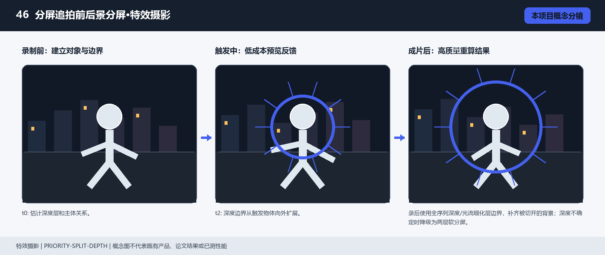
_图 46：本项目概念分镜。依次展示录制前、触发中和录后成片；不代表既有产品、论文实验结果或已测性能。_

**研究问题。** 前后景分屏如果只按屏幕位置切割，会把深度关系变成平面排版。

**目标体验。** 人物从镜头前经过时，前景和背景被分到两个时间层；镜头轻微移动，分屏边界沿深度而不是固定屏幕线滑动。

**可见创新。** 把分屏追拍的对象语义与前后景分屏的时序行为绑定，触发和参数共同改变可见结果，而不是只更换场景。 分屏追拍触发前后景分屏时，前后景分别进入两个分屏并保持遮挡；同一人物的左右运动路径始终可见且与画面空间保持对应

**交互时间线**

- t0: 估计深度层和主体关系。
- t1: 检测前景物体进入边界。
- t2: 深度边界从触发物体向外扩展。
- t3: 前景播放当前时间，背景播放另一时间/风格。
- t4: 物体离开后两层沿深度边界重新合并。

**模块和信号链**

- 深度估计与实例 mask。
- 前景/背景层分配。
- 深度边界和相机运动。
- 多时间源/多风格层读取。
- 层间遮挡、边缘和合成。

`rgb + depth + instance_masks + camera_motion -> depth_order_layers[K] -> per_layer_time/style sampling -> boundary_aware_composite。`

**数据与训练建议**

- 数据：带焦点、深度、人物 mask、相机内参与触发事件的素材；可用自动裁切生成擦镜、分屏、冲击变焦和焦点脉冲监督。
- Loss：L_frame、L_focus、L_mask、L_transition、L_camera 与 L_temp；保持主体关键区域不被转场裁断。
- 指标：触发时刻误差、主体保留率、过渡接缝、焦点命中率、构图偏差和观感评分。
- 真实性/身份约束：只保留具有明显可见效果的摄影玩法；不把普通防抖或常规运镜作为主功能。

**端侧预览、录后精修与控制**

- 预览：深度 分级更新、层合成 分级更新，最多 3 层；具体时延和算力预算需在目标设备上实测，优先保障边界不闪烁。
- 录后：录后使用全序列深度/光流细化层边界，补齐被切开的背景；深度不确定时降级为两层软分屏。
- 元数据：depth map；instance IDs；boundary PTS；layer sources；camera pose；edge confidence；merge event
- 参数：`depth_threshold`, `layer_count`, `boundary_smooth`, `time_offset`, `style_mix`, `edge_feather`, `merge_speed`
- 产品形态：深度分屏、前后景时间错位和空间叙事录像模式。

**失败与降级**

- 深度反转：冻结上一层级。
- 细杆/头发漏分：使用软边。
- 层源缺失：回到当前帧。
- 性能超限：减少层数和分辨率。

**参考边界。** Apple Cinematic mode[^1]；CapCut video background removal[^4]；Blackmagic Camera app[^7]；Robust High-Resolution Video Matting with Temporal Guidance[^8]。这些来源只证明对应的基础能力；不能据此声称本完整特效已经量产。

### 案例 47：焦点穿刺焦点穿刺光环·特效摄影

`PRIORITY-FOCUS-PULSE`

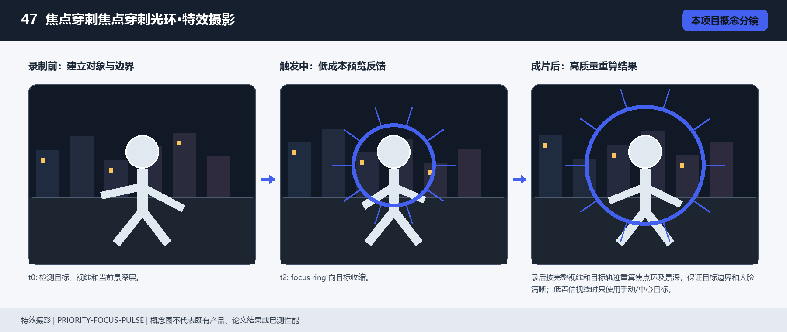
_图 47：本项目概念分镜。依次展示录制前、触发中和录后成片；不代表既有产品、论文实验结果或已测性能。_

**研究问题。** 自动焦点特效如果只改变模糊半径，用户的注意力变化没有可感知的视觉脉冲。

**目标体验。** 用户看向人物后，焦点环从镜头边缘收缩到眼睛，强拍时环短暂扩张到肩部；背景模糊和眼神光同步，焦点转移可回看。

**可见创新。** 把焦点穿刺的对象语义与焦点穿刺光环的时序行为绑定，触发和参数共同改变可见结果，而不是只更换场景。 焦点穿刺触发焦点穿刺光环时，目标清晰时出现一次沿深度扩散的光环；前景物体与远处人物始终可见且与画面空间保持对应

**交互时间线**

- t0: 检测目标、视线和当前景深层。
- t1: 视线命中目标并保持。
- t2: focus ring 向目标收缩。
- t3: 目标锁定后背景 blur 和局部高光脉冲。
- t4: 视线移开，焦点环带着残影转移或淡出。

**模块和信号链**

- 目标/人脸与视线跟踪。
- 深度排序和 focus target。
- 环形几何和动画曲线。
- 背景 blur/景深和高光。
- 目标保护、环遮挡和输出合成。

`rgb + depth + gaze_ray + target_masks -> focus_target + ring_curve -> depth_of_field + ring_layer + catchlight -> rgb_out。`

**数据与训练建议**

- 数据：带焦点、深度、人物 mask、相机内参与触发事件的素材；可用自动裁切生成擦镜、分屏、冲击变焦和焦点脉冲监督。
- Loss：L_frame、L_focus、L_mask、L_transition、L_camera 与 L_temp；保持主体关键区域不被转场裁断。
- 指标：触发时刻误差、主体保留率、过渡接缝、焦点命中率、构图偏差和观感评分。
- 真实性/身份约束：只保留具有明显可见效果的摄影玩法；不把普通防抖或常规运镜作为主功能。

**端侧预览、录后精修与控制**

- 预览：目标/深度 分级更新，模糊半分辨率 分级更新；具体时延和算力预算需在目标设备上实测。
- 录后：录后按完整视线和目标轨迹重算焦点环及景深，保证目标边界和人脸清晰；低置信视线时只使用手动/中心目标。
- 元数据：focus target；gaze dwell；depth order；ring PTS；beat PTS；blur radius；target confidence
- 参数：`ring_radius`, `ring_speed`, `blur_radius`, `pulse_gain`, `target_hold`, `gaze_smooth`, `catchlight_gain`
- 产品形态：注意力转移、焦点穿越和人像录像模式。

**失败与降级**

- 目标不清：回到中心焦点。
- 深度冲突：只显示焦点环不改变景深。
- 人脸丢失：停止眼神光联动。
- 模糊成本过高：降低背景分辨率。

**参考边界。** Apple Cinematic mode[^1]；CapCut video background removal[^4]；Blackmagic Camera app[^7]；Robust High-Resolution Video Matting with Temporal Guidance[^8]。这些来源只证明对应的基础能力；不能据此声称本完整特效已经量产。

### 案例 48：多人能量传递接触能量传递·多人互动

`PRIORITY-ENERGY-TOUCH`

_图 48：本项目概念分镜。依次展示录制前、触发中和录后成片；不代表既有产品、论文实验结果或已测性能。_

**研究问题。** 多人能量传递常只根据两人距离触发，用户无法通过真实接触控制方向和节奏。

**目标体验。** 两个人掌心接触时，一束能量沿手臂骨骼传到胸口，再在下一次击掌时爆开；能量不会穿过第三人的身体。

**可见创新。** 把多人能量传递的对象语义与接触能量传递的时序行为绑定，触发和参数共同改变可见结果，而不是只更换场景。 多人能量传递触发接触能量传递时，能量从接触点沿双方手臂传播；两人手掌之间的空间始终可见且与画面空间保持对应

**交互时间线**

- t0: 建立多人身份、手腕/掌心关键点和骨骼拓扑。
- t1: 计算两人掌心距离和相对速度。
- t2: 接触持续达到阈值，锁定传递方向。
- t3: 能量沿骨骼路径传播到第二人胸口。
- t4: 击掌/分离/节拍事件触发爆发并清空状态。

**模块和信号链**

- 多人姿态和手部跟踪。
- 接触图与方向状态机。
- 骨骼路径和能量状态。
- 粒子/光线传播与遮挡。
- 多人深度排序和合成。

`keypoints[N,J,3] + hand_points[N,2,3] + contact_graph[N,N] + depth -> directed_edge -> skeleton_path[T,3] + energy_state -> line/particle_layer -> rgb_out。`

**数据与训练建议**

- 数据：双人到多人交互视频、每人身份/姿态/mask、接触点、说话人和遮挡顺序；覆盖交叉、出入框和身份交换难例。
- Loss：L_multi_id、L_contact、L_pose、L_assignment、L_occ、L_sync 与 L_temp；用匈牙利匹配或显式轨迹 ID 保持人物归属。
- 指标：身份交换率、接触点误差、多人遮挡正确率、同步误差、互动完成率和失败回退率。
- 真实性/身份约束：任何人的效果归属都不能串到另一人；身份不确定时停用互动层。

**端侧预览、录后精修与控制**

- 预览：最多 3 人、1 条主能量边、600 粒子；具体时延和算力预算需在目标设备上实测。
- 录后：录后重建手部接触、骨骼路径和前后遮挡；接触低置信时只显示两人之间的短线，不声明已完成传递。
- 元数据：person IDs；hand contacts；graph edges；energy direction；contact PTS；skeleton confidence；burst event
- 参数：`contact_threshold`, `energy_speed`, `path_width`, `burst_gain`, `particle_count`, `depth_bias`, `decay`
- 产品形态：双人互动、击掌和多人能量传递录像模式。

**失败与降级**

- 手部遮挡：使用腕点并降低强度。
- 身份交换：暂停能量传播。
- 第三人插入：按深度切断能量。
- 粒子超限：保留骨骼光线。

**参考边界。** DJI subject tracking[^2]；Samsung Single Take[^6]；Robust High-Resolution Video Matting with Temporal Guidance[^8]。这些来源只证明对应的基础能力；不能据此声称本完整特效已经量产。

### 案例 49：双人镜像接力双人镜像接力·多人互动

`PRIORITY-MIRROR-POSE`

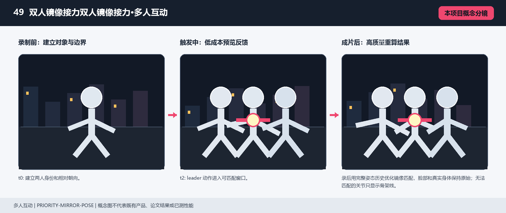
_图 49：本项目概念分镜。依次展示录制前、触发中和录后成片；不代表既有产品、论文实验结果或已测性能。_

**研究问题。** 多人镜像玩法通常没有明确同步规则，动作差异无法被用户主动控制。

**目标体验。** 两个人面对面站立，一人抬手，另一人像镜中角色一样延迟半拍完成相反动作；脚底和空间位置保持真实。

**可见创新。** 把双人镜像接力的对象语义与双人镜像接力的时序行为绑定，触发和参数共同改变可见结果，而不是只更换场景。 双人镜像接力触发双人镜像接力时，一人动作沿对称轴传给另一人并延迟重复；两个人物的对称身体动作始终可见且与画面空间保持对应

**交互时间线**

- t0: 建立两人身份和相对朝向。
- t1: 选择 leader/follower 或按站位自动指定。
- t2: leader 动作进入可匹配窗口。
- t3: follower 生成镜像目标姿态并带时间延迟。
- t4: 两人重新面对或离开，镜像状态结束。

**模块和信号链**

- 多人 pose tracking。
- 相对坐标系和镜像轴。
- 动作匹配与时间延迟。
- 局部姿态轮廓/光线渲染。
- 身份、遮挡和场景合成。

`pose[N,J,3] + person_boxes + relative_pose -> leader_motion[T,J,3] -> mirrored_target[T,J,3] + delay -> follower_effect_layer -> rgb_out。`

**数据与训练建议**

- 数据：双人到多人交互视频、每人身份/姿态/mask、接触点、说话人和遮挡顺序；覆盖交叉、出入框和身份交换难例。
- Loss：L_multi_id、L_contact、L_pose、L_assignment、L_occ、L_sync 与 L_temp；用匈牙利匹配或显式轨迹 ID 保持人物归属。
- 指标：身份交换率、接触点误差、多人遮挡正确率、同步误差、互动完成率和失败回退率。
- 真实性/身份约束：任何人的效果归属都不能串到另一人；身份不确定时停用互动层。

**端侧预览、录后精修与控制**

- 预览：最多 2 人、姿态 分级更新、效果层半分辨率；具体时延和算力预算需在目标设备上实测。
- 录后：录后用完整姿态历史优化镜像匹配，脸部和真实身体保持原始；无法匹配的关节只显示骨架线。
- 元数据：person IDs；leader ID；relative axis；pose history；delay；match score；exit event
- 参数：`delay`, `mirror_axis`, `pose_gain`, `joint_subset`, `match_threshold`, `line_width`, `fade`
- 产品形态：双人镜像舞蹈、互动挑战和对照录像模式。

**失败与降级**

- 人物重叠：切换为上半身骨架。
- 身份交换：暂停镜像。
- 动作不匹配：降低镜像强度。
- 出框：保持最后姿态短时淡出。

**参考边界。** DJI subject tracking[^2]；Samsung Single Take[^6]；Robust High-Resolution Video Matting with Temporal Guidance[^8]。这些来源只证明对应的基础能力；不能据此声称本完整特效已经量产。

### 案例 50：三人合成雕像节拍雕像换姿·多人互动

`PRIORITY-STATUE-BEAT`

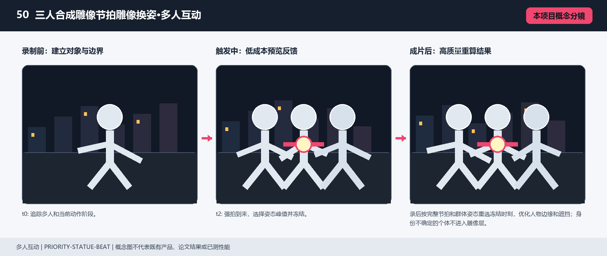
_图 50：本项目概念分镜。依次展示录制前、触发中和录后成片；不代表既有产品、论文实验结果或已测性能。_

**研究问题。** 多人定格如果只冻结人体，会缺少组合姿态的节奏和群体构图。

**目标体验。** 三个人在强拍时同时定格成一组发光雕像，弱拍时只有其中一人恢复运动；下一次强拍，雕像位置互换并留下短轮廓。

**可见创新。** 把三人合成雕像的对象语义与节拍雕像换姿的时序行为绑定，触发和参数共同改变可见结果，而不是只更换场景。 三人合成雕像触发节拍雕像换姿时，雕像在每个强拍切换到新的群体姿态；三个人体轮廓与接触边界始终可见且与画面空间保持对应

**交互时间线**

- t0: 追踪多人和当前动作阶段。
- t1: 预测下一个强拍并显示低成本候选轮廓。
- t2: 强拍到来，选择姿态峰值并冻结。
- t3: 其余人物继续运动，冻结层按群体关系保持。
- t4: 下一强拍解冻一人或重新排列雕像。

**模块和信号链**

- 多人 identity/pose tracking。
- beat clock 和姿态峰值。
- 人体冻结帧和群体布局。
- 轮廓发光/雕像材质。
- 前后遮挡和分层合成。

`pose[N,T,J,3] + body_masks[N] + beat_phase -> selected_peak[N] -> frozen_layers[N,3,H,W] + live_people -> group_composite。`

**数据与训练建议**

- 数据：双人到多人交互视频、每人身份/姿态/mask、接触点、说话人和遮挡顺序；覆盖交叉、出入框和身份交换难例。
- Loss：L_multi_id、L_contact、L_pose、L_assignment、L_occ、L_sync 与 L_temp；用匈牙利匹配或显式轨迹 ID 保持人物归属。
- 指标：身份交换率、接触点误差、多人遮挡正确率、同步误差、互动完成率和失败回退率。
- 真实性/身份约束：任何人的效果归属都不能串到另一人；身份不确定时停用互动层。

**端侧预览、录后精修与控制**

- 预览：最多 4 人、每人 540p ROI、每拍最多更新 1 人；具体时延和算力预算需在目标设备上实测。
- 录后：录后按完整节拍和群体姿态重选冻结时刻，优化人物边缘和遮挡；身份不确定的个体不进入雕像层。
- 元数据：person IDs；beat PTS；selected peaks；body masks；group depth；freeze states；release order
- 参数：`freeze_count`, `peak_window`, `release_order`, `statue_alpha`, `glow`, `group_spacing`, `beat_gain`
- 产品形态：多人定格、群体舞蹈和节拍雕像录像模式。

**失败与降级**

- 多人遮挡：减少冻结人数。
- 节拍不稳：使用动作峰值触发。
- 姿态缺失：只冻结轮廓。
- 内存不足：保存关键帧而非完整 ROI。

**参考边界。** DJI subject tracking[^2]；Samsung Single Take[^6]；Robust High-Resolution Video Matting with Temporal Guidance[^8]。这些来源只证明对应的基础能力；不能据此声称本完整特效已经量产。

## 可核实参考

参考卡中的“能够证明”和“不能证明”应成对阅读。桌面后期软件、论文原型和静态摄影能力不能自动升级为手机录像实时量产结论。

### Apple Cinematic mode

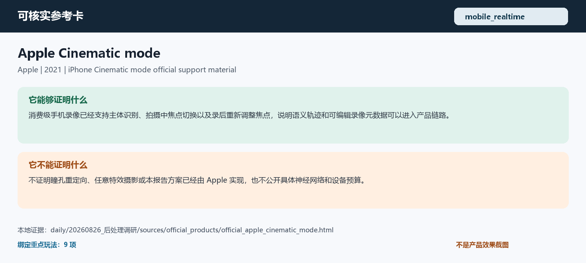
_参考卡 1：Apple，2021，边界 `mobile_realtime`。这不是产品效果截图。_

- 能够证明：消费级手机录像已经支持主体识别、拍摄中焦点切换以及录后重新调整焦点，说明语义轨迹和可编辑录像元数据可以进入产品链路。
- 不能证明：不证明瞳孔重定向、任意特效摄影或本报告方案已经由 Apple 实现，也不公开具体神经网络和设备预算。
- 本地证据：daily/20260826_后处理调研/sources/official_products/official_apple_cinematic_mode.html

### DJI subject tracking

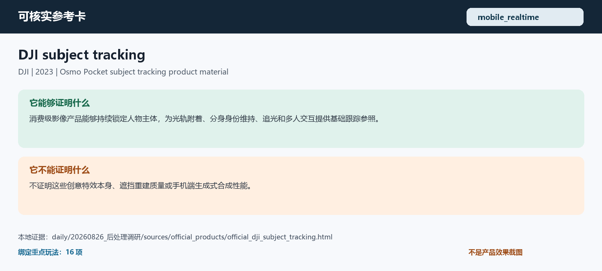
_参考卡 2：DJI，2023，边界 `mobile_realtime`。这不是产品效果截图。_

- 能够证明：消费级影像产品能够持续锁定人物主体，为光轨附着、分身身份维持、追光和多人交互提供基础跟踪参照。
- 不能证明：不证明这些创意特效本身、遮挡重建质量或手机端生成式合成性能。
- 本地证据：daily/20260826_后处理调研/sources/official_products/official_dji_subject_tracking.html

### Final Cut Pro object tracking

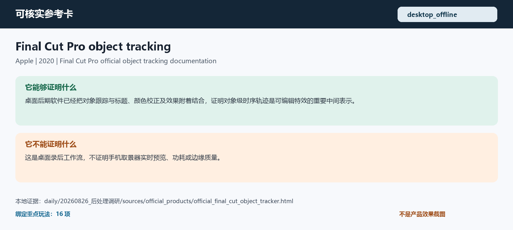
_参考卡 3：Apple，2020，边界 `desktop_offline`。这不是产品效果截图。_

- 能够证明：桌面后期软件已经把对象跟踪与标题、颜色校正及效果附着结合，证明对象级时序轨迹是可编辑特效的重要中间表示。
- 不能证明：这是桌面录后工作流，不证明手机取景器实时预览、功耗或边缘质量。
- 本地证据：daily/20260826_后处理调研/sources/official_products/official_final_cut_object_tracker.html

### CapCut video background removal

_参考卡 4：CapCut，2023，边界 `mobile_offline`。这不是产品效果截图。_

- 能够证明：视频主体抠像和背景替换已进入大众创作工具，支持把人物、手掌或物体作为空间入口和转场边界。
- 不能证明：官方页面没有披露算法，也不证明复杂遮挡、透明材质或录像中实时运行。
- 本地证据：daily/20260826_后处理调研/sources/official_products/official_capcut_video_cutout.html

### Apple Photographic Styles

_参考卡 5：Apple，2021，边界 `mobile_realtime`。这不是产品效果截图。_

- 能够证明：场景感知的影调和色彩控制可以被产品化为拍摄风格入口，为录像世界风格和虚拟光色控制提供交互参考。
- 不能证明：原始能力以静态摄影为主，不证明视频时序一致性或生成式世界改写。
- 本地证据：daily/20260826_后处理调研/sources/official_products/official_apple_photographic_styles.html

### Samsung Single Take

_参考卡 6：Samsung，2020，边界 `mobile_offline`。这不是产品效果截图。_

- 能够证明：一次录像可以派生多种结果，支持把原视频、事件轨迹和多个后处理版本作为同一拍摄资产管理。
- 不能证明：不证明局部时间冻结、倒放、分身或多人能量特效的具体实现。
- 本地证据：daily/20260826_后处理调研/sources/official_products/official_samsung_single_take.html

### Blackmagic Camera app

_参考卡 7：Blackmagic Design，2023，边界 `mobile_realtime`。这不是产品效果截图。_

- 能够证明：专业录像控制、编码和素材管理能够下沉到手机应用，为保留原片、代理预览和录后重算提供产品参照。
- 不能证明：不证明本报告任何特效模型、交互或性能预算已经实现。
- 本地证据：daily/20260826_后处理调研/sources/official_products/official_blackmagic_camera_app.html

### Robust High-Resolution Video Matting with Temporal Guidance

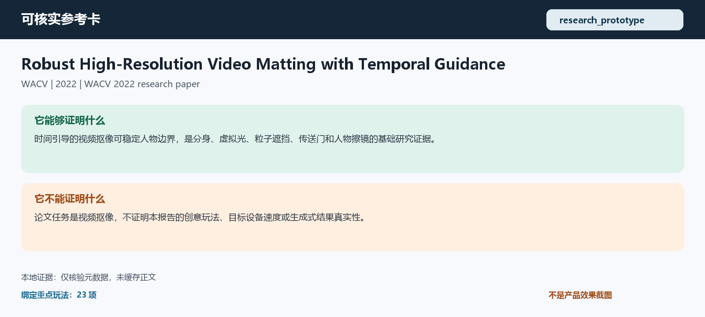
_参考卡 8：WACV，2022，边界 `research_prototype`。这不是产品效果截图。_

- 能够证明：时间引导的视频抠像可稳定人物边界，是分身、虚拟光、粒子遮挡、传送门和人物擦镜的基础研究证据。
- 不能证明：论文任务是视频抠像，不证明本报告的创意玩法、目标设备速度或生成式结果真实性。
- 本地证据：仅核验元数据

### MODNet: Real-Time Trimap-Free Portrait Matting via Objective Decomposition

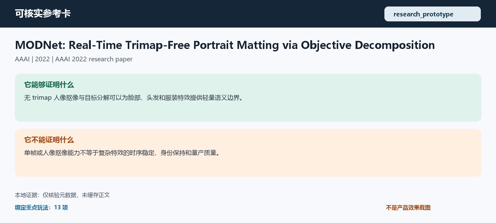
_参考卡 9：AAAI，2022，边界 `research_prototype`。这不是产品效果截图。_

- 能够证明：无 trimap 人像抠像与目标分解可以为脸部、头发和服装特效提供轻量语义边界。
- 不能证明：单帧或人像抠像能力不等于复杂特效的时序稳定、身份保持和量产质量。
- 本地证据：仅核验元数据

### MAGVIT: Masked Generative Video Transformer

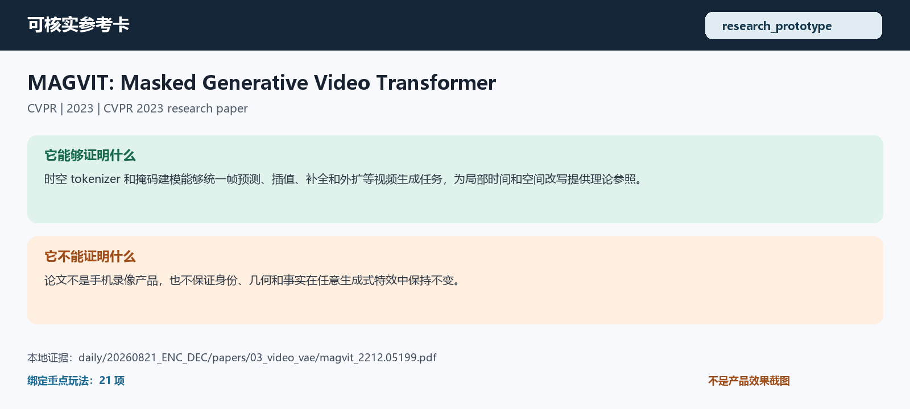
_参考卡 10：CVPR，2023，边界 `research_prototype`。这不是产品效果截图。_

- 能够证明：时空 tokenizer 和掩码建模能够统一帧预测、插值、补全和外扩等视频生成任务，为局部时间和空间改写提供理论参照。
- 不能证明：论文不是手机录像产品，也不保证身份、几何和事实在任意生成式特效中保持不变。
- 本地证据：daily/20260821_ENC_DEC/papers/03_video_vae/magvit_2212.05199.pdf

### SVFR: A Unified Framework for Generalized Video Face Restoration

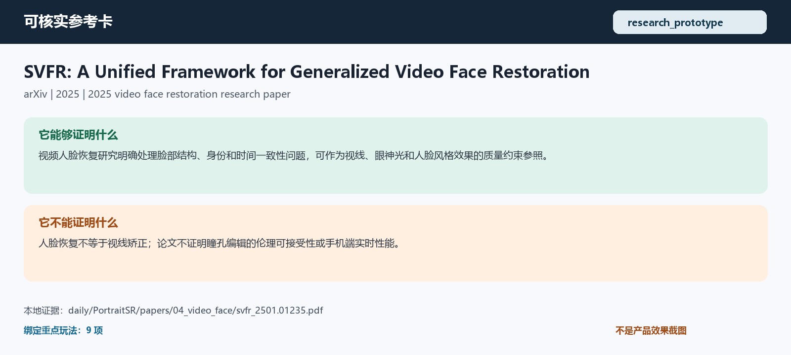
_参考卡 11：arXiv，2025，边界 `research_prototype`。这不是产品效果截图。_

- 能够证明：视频人脸恢复研究明确处理脸部结构、身份和时间一致性问题，可作为视线、眼神光和人脸风格效果的质量约束参照。
- 不能证明：人脸恢复不等于视线矫正；论文不证明瞳孔编辑的伦理可接受性或手机端实时性能。
- 本地证据：daily/PortraitSR/papers/04_video_face/svfr_2501.01235.pdf

### AuthFace

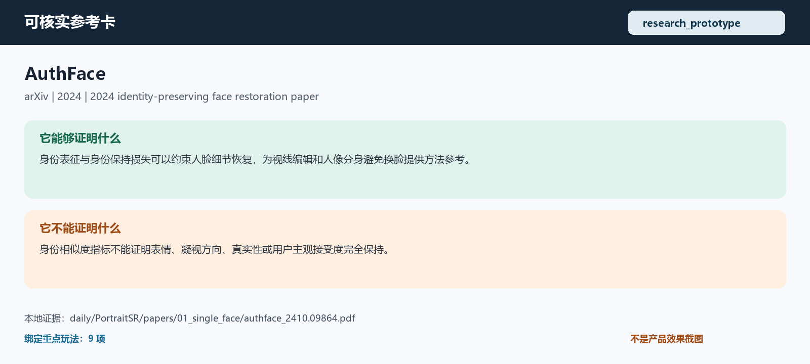
_参考卡 12：arXiv，2024，边界 `research_prototype`。这不是产品效果截图。_

- 能够证明：身份表征与身份保持损失可以约束人脸细节恢复，为视线编辑和人像分身避免换脸提供方法参考。
- 不能证明：身份相似度指标不能证明表情、凝视方向、真实性或用户主观接受度完全保持。
- 本地证据：daily/PortraitSR/papers/01_single_face/authface_2410.09864.pdf

### Scalable Diffusion Models with Transformers

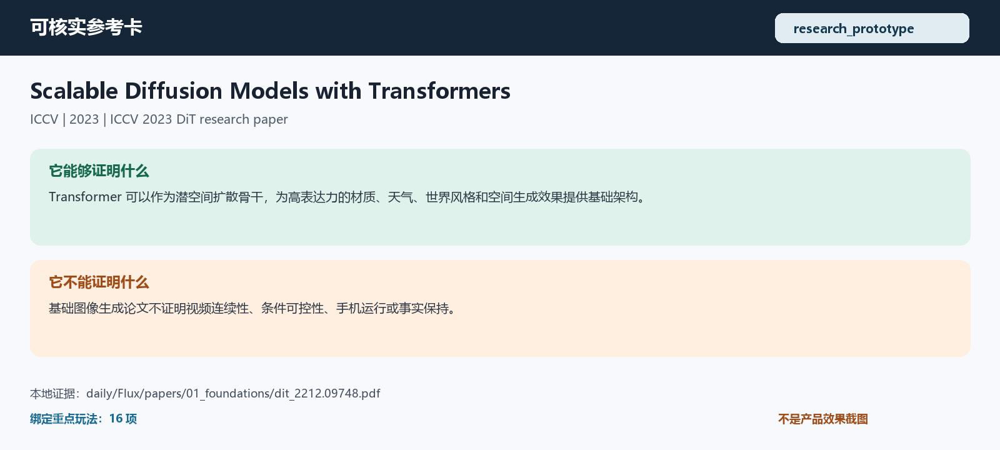
_参考卡 13：ICCV，2023，边界 `research_prototype`。这不是产品效果截图。_

- 能够证明：Transformer 可以作为潜空间扩散骨干，为高表达力的材质、天气、世界风格和空间生成效果提供基础架构。
- 不能证明：基础图像生成论文不证明视频连续性、条件可控性、手机运行或事实保持。
- 本地证据：daily/Flux/papers/01_foundations/dit_2212.09748.pdf

### High-Resolution Image Synthesis with Latent Diffusion Models

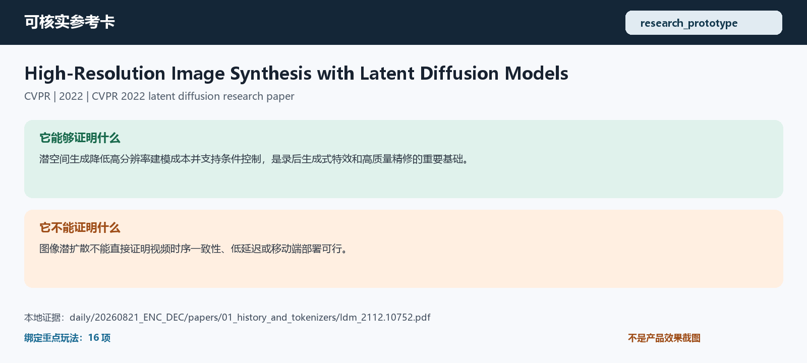
_参考卡 14：CVPR，2022，边界 `research_prototype`。这不是产品效果截图。_

- 能够证明：潜空间生成降低高分辨率建模成本并支持条件控制，是录后生成式特效和高质量精修的重要基础。
- 不能证明：图像潜扩散不能直接证明视频时序一致性、低延迟或移动端部署可行。
- 本地证据：daily/20260821_ENC_DEC/papers/01_history_and_tokenizers/ldm_2112.10752.pdf

## 结论

手机录像特效的产品机会不在于把桌面后期完整搬进取景器，而在于建立一条可编辑录像资产链：实时感知和交互负责让用户知道特效将发生在哪里，结构化元数据保留对象、事件、深度和参数，录后端侧或云端负责高质量重算。最值得优先验证的是实时光绘、视线矫正、局部时间编辑、空间入口、虚拟光影和多人互动，因为这些方向的用户可见价值强，同时能复用现有跟踪、分割、深度、音频和生成模型能力。

后续原型评估应同时报告成功率、失败降级、身份/事实保持、设备性能和用户观感，不应只展示成功样片。

## References

[^1]: Apple. (2021). "Apple Cinematic mode." https://support.apple.com/en-us/HT212778
[^2]: DJI. (2023). "DJI subject tracking." https://www.dji.com/osmo-pocket-3
[^3]: Apple. (2020). "Final Cut Pro object tracking." https://support.apple.com/guide/final-cut-pro/track-objects-ver2a5f7f2d/mac
[^4]: CapCut. (2023). "CapCut video background removal." https://www.capcut.com/tools/video-background-remover
[^5]: Apple. (2021). "Apple Photographic Styles." https://support.apple.com/en-us/HT212788
[^6]: Samsung. (2020). "Samsung Single Take." https://www.samsung.com/us/support/answer/ANS00087284/
[^7]: Blackmagic Design. (2023). "Blackmagic Camera app." https://www.blackmagicdesign.com/products/blackmagiccamera
[^8]: WACV. (2022). "Robust High-Resolution Video Matting with Temporal Guidance." https://doi.org/10.1109/WACV51458.2022.00319
[^9]: AAAI. (2022). "MODNet: Real-Time Trimap-Free Portrait Matting via Objective Decomposition." https://doi.org/10.1609/AAAI.V36I1.19999
[^10]: CVPR. (2023). "MAGVIT: Masked Generative Video Transformer." https://doi.org/10.48550/arXiv.2212.05199
[^11]: arXiv. (2025). "SVFR: A Unified Framework for Generalized Video Face Restoration." https://doi.org/10.48550/arXiv.2501.01235
[^12]: arXiv. (2024). "AuthFace." https://doi.org/10.48550/arXiv.2410.09864
[^13]: ICCV. (2023). "Scalable Diffusion Models with Transformers." https://doi.org/10.48550/arXiv.2212.09748
[^14]: CVPR. (2022). "High-Resolution Image Synthesis with Latent Diffusion Models." https://doi.org/10.48550/arXiv.2112.10752

_Last updated: 2026-08-28_
