# 人像超分与人脸细节恢复：2024-2026 工业界与前沿研究阶段性洞察

_ReadPaper PortraitSR library · 2026-08-06 · 证据截止日 2026-08-06_

---

## 摘要

本阶段研究聚焦人脸盲修复、全幅人像超分、参考身份保持、视频人脸修复、真实感与幻觉控制，以及一步化和端侧部署。当前资料库含 45 篇核心论文候选，其中 30 篇发表于 2025-2026；18 篇 PDF 已完成页数与 SHA-256 校验，并抽取了带页码的全文、架构图候选和实验表候选。工业界已由原文确认的代表包括 Xiaomi 的 TIGER 与 MeInTime、Tencent Youtu Lab 的 SVFR、vivo 参与的 OSDFace 与 HDRFace、vivo 与 Ant Group 参与的 AuthFace、Topaz Labs 的 HeadsUp、Huawei 的 IQPFR、Alibaba 的 DicFace、Kuaishou 的 LRPO、Lenovo Research 的 InfoBFR，以及 NTIRE 2026 中 Honor 与 Xiaomi 的参赛方案。数据集目录含 23 项记录，20 个官方页面或原始论文页面已归档；受限人脸数据未被自动下载。

核心判断是：前沿研究正从“单张、对齐、固定人脸裁剪”转向“身份、几何、生成先验协同的全场景修复”。视频方向强调动态姿态与身份解耦；真实感方向开始引入摄影数据、频率约束和幻觉控制；效率方向从简单减少采样步数，推进到一步流模型、量化友好网络和消费级 NPU 实测。对手机相机而言，可落地系统更可能采用分层架构：端侧完成检测、保真重建和质量判断，云端或高算力路径负责生成式纹理补全，同时通过身份与几何约束限制幻觉。

**关键词：** portrait super-resolution, blind face restoration, identity preservation, video face restoration, rectified flow, edge NPU

## 1. 研究范围与证据口径

### 1.1 三条主研究线

1. **Face restoration**：重点恢复五官、脸型、身份和皮肤细节
2. **Portrait restoration/SR**：进一步覆盖头发、服装、身体、背景和全幅构图
3. **Personalized/reference restoration**：使用同一人物参考图、身份嵌入或个性化参数约束恢复结果

视频修复与端侧效率作为贯穿三条主线的系统问题处理。

### 1.2 证据等级

| 等级 | 证据 | 可用于什么结论 |
| --- | --- | --- |
| A | 已下载原文首页、正文、表格或图 | 作者机构、方法结构、数据集、论文内实验数字 |
| B | arXiv API 原始元数据与摘要 | 标题、作者、版本日期、摘要声明、公开代码链接 |
| C | 官方项目页或数据集页快照 | 发布状态、访问入口、许可或下载说明 |
| D | 技术归类与业务推断 | 研究路线、系统架构和相机业务启示，必须标为分析判断 |

赛事赞助方、部署芯片提供者和论文引用机构不会被当作作者公司。例如 CFRNet 在 HiSilicon Hi3402 NPU 上实测，但原文作者机构不是 Huawei；NTIRE 2026 的 OPPO、Kuaishou 是赛事赞助方，不等于挑战赛论文作者公司。[^​1]

## 2. 技术图谱

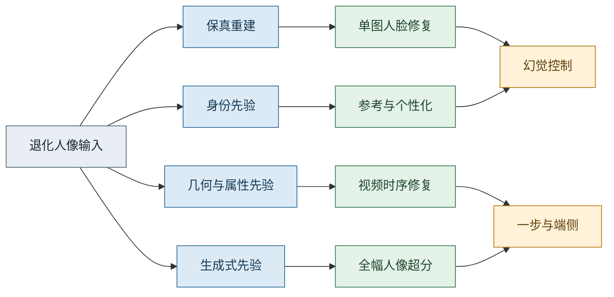
```mermaid
flowchart LR
    accTitle: Portrait restoration research map
    accDescr: Research landscape from degraded portrait observations through identity and geometry constraints to image, video, and edge restoration outputs.

    input["退化人像输入"] --> fidelity["保真重建"]
    input --> identity["身份先验"]
    input --> geometry["几何与属性先验"]
    input --> generative["生成式先验"]

    fidelity --> single["单图人脸修复"]
    identity --> reference["参考与个性化"]
    geometry --> video["视频时序修复"]
    generative --> portrait["全幅人像超分"]

    single --> honest["幻觉控制"]
    reference --> honest
    video --> efficient["一步与端侧"]
    portrait --> efficient

    classDef input_class fill:#E8EEF3,stroke:#526A7A,color:#1C2B36
    classDef prior_class fill:#DCEAF6,stroke:#2F6F9F,color:#173B55
    classDef task_class fill:#E5F2E8,stroke:#3B7A57,color:#20462F
    classDef system_class fill:#FFF2D8,stroke:#B77A16,color:#61420F
    class input input_class
    class fidelity,identity,geometry,generative prior_class
    class single,reference,video,portrait task_class
    class honest,efficient system_class
```

## 3. 2025-2026 的主要技术变化

### 3.1 从通用生成先验转向人脸专用条件

GeoMAR 指出 codebook 修复在重度退化下存在条件特征歧义和一次预测脆弱问题。其做法是先提取带空间锚点的几何化人脸组件描述，再通过 KV-Q exchange 注入低质量特征，并使用 masked autoregressive refinement 逐步修复复杂区域。[^​2] 这表明人脸修复不再只依赖一个全局语义向量，而是显式编码“眼、鼻、口等组件在哪里、应具备什么几何关系”。

AuthFace 则从数据和训练先验入手。论文团队包含 vivo 与 Ant Group，报告收集了 1,500 张原始分辨率超过 8K 的专业摄影人像，用摄影师参与的标注与筛选微调生成先验，并通过 time-aware latent facial feature loss 约束眼睛和嘴部等关键区域。[^​3] 该路线更接近手机影像业务：高质量皮肤、睫毛、牙齿和发丝恢复依赖高质量摄影分布，而不只是扩大低质量合成数据规模。

HDRFace 由 City University of Hong Kong 与 vivo BlueImage Lab 合作提出，关注重度退化下“低质量输入本身已经丢失身份关键细节”的条件不足问题。其流程先用现成人脸修复器得到结构较可靠的中间结果，再以 DINOv3 从原始低质量图和中间结果提取高维视觉表征（high-dimensional visual representations），并通过结构-细节感知自适应融合模块 SDFM（Structure-Detail aware adaptive Fusion Mechanism）注入生成模型的条件分支。结构建模阶段偏重原始输入的全局约束，细节合成阶段增强高维表征引导，从而动态平衡结构一致性（structural consistency）与细节忠实度（detail fidelity）。[^​15] 更值得关注的是，该模块不修改生成骨干，并在 SD V2.1-base 的 U-Net 扩散架构与 Qwen-Image 的 Rectified Flow DiT 架构上分别验证，说明它是一种跨生成范式的条件设计，而非只针对单一模型的技巧。

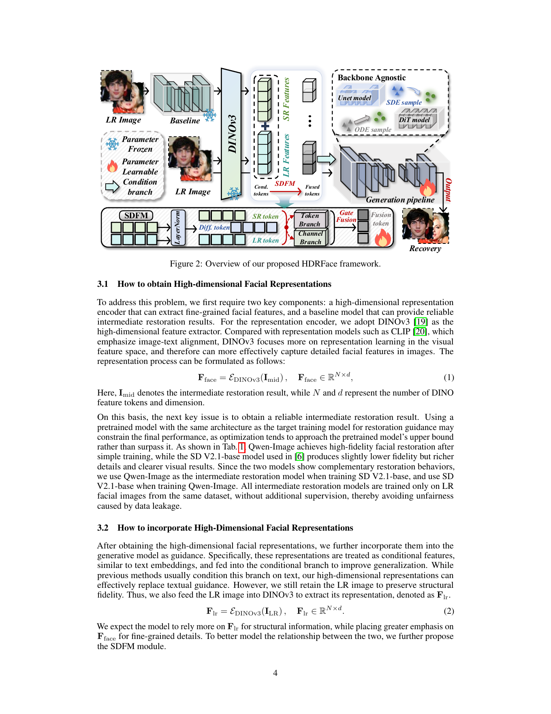
_图 1：HDRFace 原文第 4 页。DINOv3 高维表征、LQ/中间结果双条件与 SDFM 共同约束结构建模和细节合成。_

### 3.2 从人脸裁剪走向全幅 4K 人像

HeadsUp 由 Texas A&M University 与 Topaz Labs 合作提出，研究对象不是对齐人脸裁剪，而是同时包含人物、头发、服装与背景的全幅人像。其问题定义直接针对现有产品管线的缺陷：通用 SR 容易生成人脸伪影，而“通用 SR + 人脸专家 + 融合”会在脸部边界产生接缝和风格不一致。HeadsUp 以 OSEDiff 类一步潜空间扩散为基础，对 VAE encoder 与 denoiser 施加 LoRA，固定 decoder；输入低质量全图、可选参考脸和脸部 mask，一步预测高质量潜变量。训练同时优化全图恢复、脸部 fidelity、LPIPS 和 identity loss，使通常只占图像小区域的人脸获得更强监督。[^​16]

论文同时提出 PortraitSR-4K：30K 张 4K 人像，报告划分为 27K 训练、3K 测试、163K 训练参考对和 190 组人像-参考测试对。该数据集连接了通用图像 SR 与对齐人脸 SR，但原文说明图像来自 LAION2B、Photo Concept Bucket、PD12M 等网络来源；当前尚未核验独立许可和再分发权，因此本库只归档论文声明和来源入口。

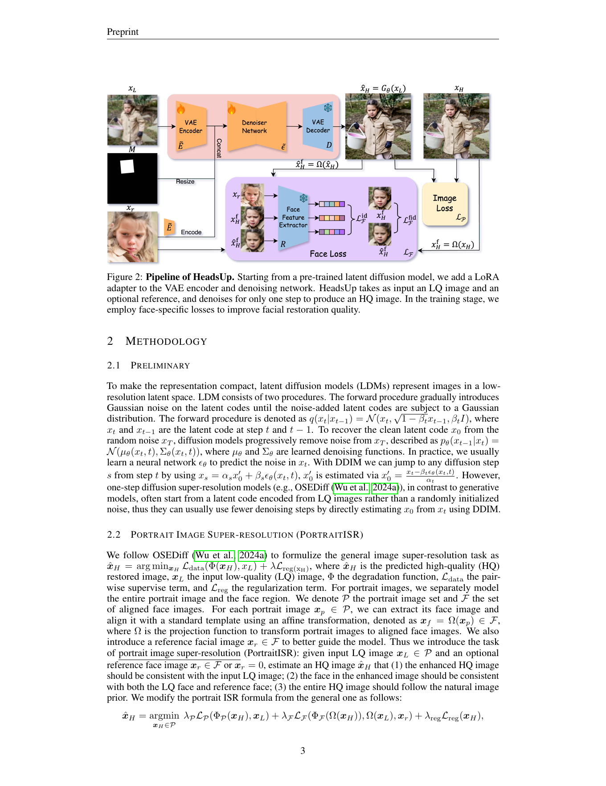
_图 2：HeadsUp 原文第 3 页。一步全幅人像超分、可选参考身份和脸部专用监督。_

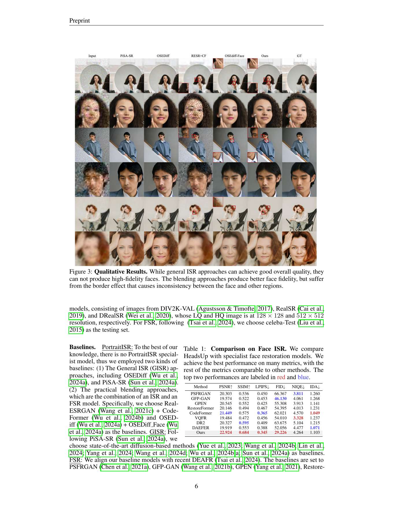
_图 3：HeadsUp 原文第 6 页。通用 SR、融合式方案与端到端人像 SR 的视觉差异。_

### 3.3 从“看起来像人”转向“仍然是这个人”

极端退化下，低清输入本身可能已不含足够身份信息。IDFSR 通过遮蔽不可靠的人脸区域、对齐参考图风格并拟合身份 embedding，将风格与身份显式解耦；论文目标是处理超过 8× 的极端人脸超分。[^​4] RestorerID 则使用单张参考图，以 FIR-Adapter 重新平衡低清内容与参考身份冲突，并随退化程度自适应调整身份强度。[^​5]

这一变化对相机产品很重要：普通照片增强可默认使用输入图保真；数字变焦或历史照片修复若启用用户相册参考，需要独立的授权、身份匹配和隐私策略，且必须提供“参考身份强度”控制，而不能把身份生成隐式埋在模型内部。

IConFace 将身份保持从全局相似度推进到局部稳定细节。它以 FLUX.2-Klein-base-4B 为骨干，支持 0-3 张同身份参考图：低质量图和参考图都保留为密集视觉 token，AdaFace 提供按可识别性加权的多参考身份向量，degraded-structure adapter 则用输入残差与全局/局部记忆反复锚定目标姿态和结构。训练采用 flow matching 与参考/目标身份损失。论文还建立人工核验的局部身份细节基准，对 167 个由配对真值与同身份参考共同支持的痣、疤痕、雀斑和色素区域进行保留率评估。[^​17] 这说明 ArcFace/AdaFace 全局分数高并不等于局部辨识细节真实存在。

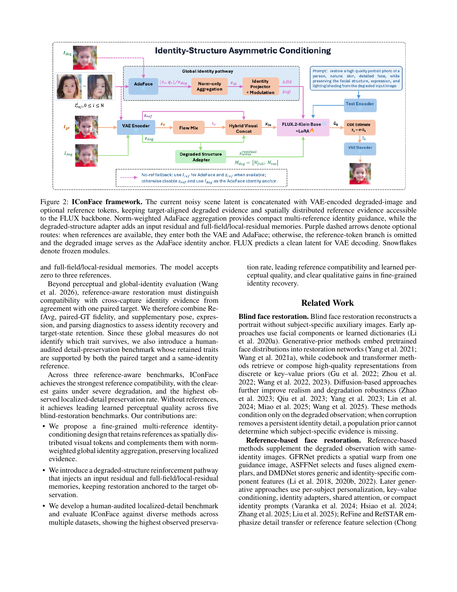
_图 4：IConFace 原文第 2 页。FLUX.2 密集参考 token、AdaFace 多参考身份引导和结构记忆路径。_

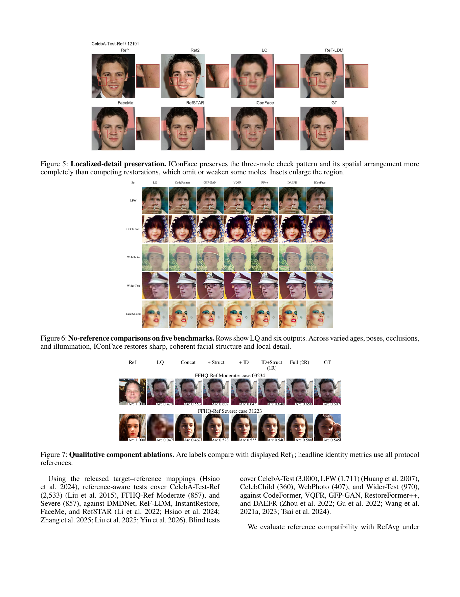
_图 5：IConFace 原文第 5 页。三颗痣等局部稳定身份特征的恢复对比。_

### 3.4 视频修复成为独立问题

Xiaomi MiLM Plus 的 TIGER 将视频人脸修复分解为 Identity、Geometry 和 Generative 三类先验。参考图提供静态身份，退化视频提供运动与视角，3D 人脸参数用于跨来源融合；生成端采用一步 rectified flow，并通过三阶段训练逐步优化结构、纹理和分布真实感。[^​6]

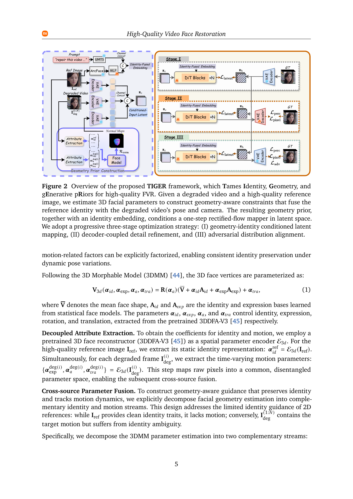
_图 1：TIGER 原文第 5 页。参考图身份、退化视频姿态和 3D 几何被融合到一步 DiT/rectified-flow 修复中。_

Tencent Youtu Lab 的 SVFR 将视频盲修复、补全和着色统一到 Stable Video Diffusion 框架中，使用任务 embedding、Unified Latent Regularization、facial prior learning 与 self-referred refinement 提升任务共享和时序稳定性。[^​7] FADRA 则使用预训练 text-to-video diffusion 的时序先验，以 LoRA、低质量像素对齐融合、重复残差适配头和频率感知损失反复回看退化观测。[^​8]

### 3.5 一步化与端侧部署开始分化

OSDFace 由 Shanghai Jiao Tong University 与 vivo 共同完成。方法通过视觉 tokenizer 与 VQ dictionary 生成 visual prompts，以身份损失约束一致性，并使用 GAN guidance 做分布对齐；论文报告一步推理，并在其统一设置下给出 0.10 秒推理时间。[^​9] 该数字只在论文指定的模型、输入与硬件设置内有效，不应直接外推到手机端。

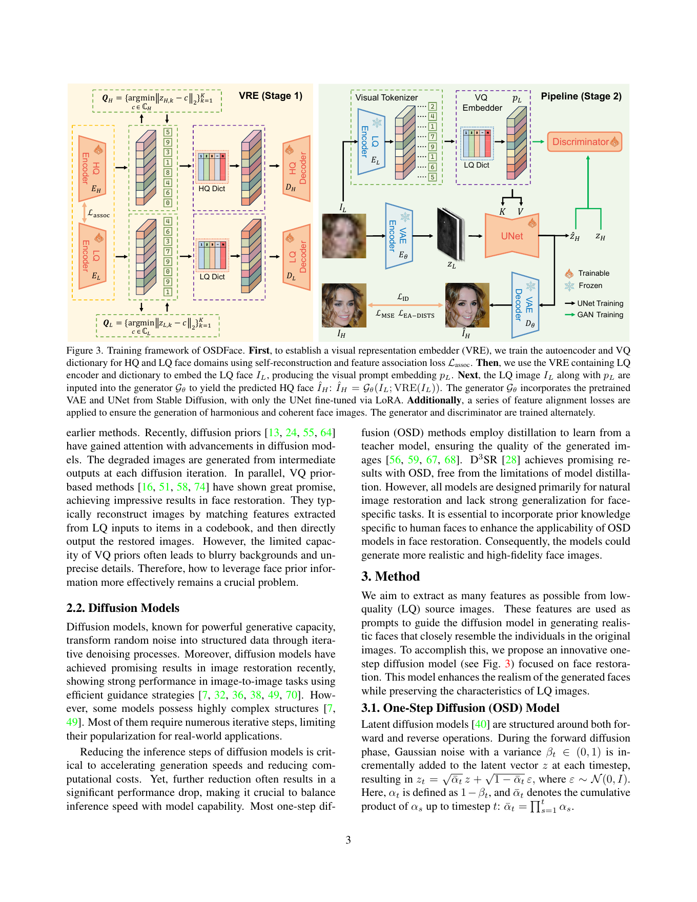
_图 2：OSDFace 原文第 3 页。VQ 视觉提示、身份损失与对抗分布对齐共同训练一步扩散修复器。_

CFRNet 则放弃大生成模型，采用 2.0M 参数 ResNet-style 网络与 Cycle-Consistent Fixed-Point Training。原文报告在 HiSilicon Hi3402 NPU 上以 INT8 运行，每个循环约 23 ms，循环次数可作为质量旋钮；这是当前资料池中少数提供消费级 NPU 实机结果的工作。[^​10] 需要注意，它只处理 256×256 人脸裁剪，不能代表全幅人像或高分辨率背景修复。

## 4. 工业界代表论文

| 公司 | 论文 | 核心创新 | 解决的问题 | 当前证据 |
| --- | --- | --- | --- | --- |
| Xiaomi | TIGER | 身份、3D 几何、生成先验；一步 rectified flow | 视频中身份漂移、视角纠缠和时序真实感 | 原文首页与架构页 |
| Tencent | SVFR | 视频盲修复、补全、着色统一；SVD 时序先验 | 单任务模型互相割裂、视频数据不足 | 原文首页与架构页 |
| vivo | OSDFace | VQ visual prompts、身份损失、GAN guidance、一步扩散 | 多步扩散慢且五官/头发/背景不协调 | 原文首页与训练架构 |
| vivo / Ant Group | AuthFace | 8K 摄影数据、摄影标注、time-aware facial feature loss | 通用 T2I 先验生成非人脸细节或皮肤过平滑 | 原文首页与方法页 |
| vivo | HDRFace | DINOv3 高维表征、LQ/中间结果双条件、SDFM；兼容 U-Net 与 DiT | 重度退化下身份关键细节缺失，兼顾结构一致性和细节忠实度 | 原文首页与第 4 页框架图 |
| Topaz Labs | HeadsUp | 一步全幅人像扩散、脸部专用监督、可选参考身份 | 通用 SR 人脸失真与双模型融合边界伪影 | 原文首页、框架页与效果页 |
| Xiaomi | MeInTime | 身份/年龄解耦、Gated Residual Fusion、Age-Aware Gradient Guidance | 跨年龄参考导致年龄漂移 | arXiv 源文件 HTML 作者机构快照 |
| Huawei | IQPFR | 无参考图像质量先验、质量条件码本与 Transformer | 训练真值平均质量限制恢复上限 | arXiv 源文件 HTML 作者机构快照 |
| Alibaba | DicFace | Dirichlet 连续化码本、时空 Transformer | 视频码本跳变与闪烁 | arXiv 源文件 HTML 作者机构快照 |
| Kuaishou | LRPO | 在线强化学习、复合奖励、似然正则 | 提升感知质量并限制偏离真值 | arXiv 源文件 HTML 作者机构快照 |
| Lenovo | InfoBFR | 信息瓶颈压缩与扩散 LoRA 补偿 | 先验偏差、结构/纹理畸变与伪影残留 | arXiv 源文件 HTML 作者机构快照 |
| Honor | NTIRE 2026 HONORAICamera | 挑战赛中的扩散修复方案 | 真实世界感知质量和身份校验 | 挑战赛论文团队章节 |
| Xiaomi | NTIRE 2026 MiLM Plus | 挑战赛参赛方案 | 真实世界人脸修复 | 挑战赛作者列表 |

## 5. 数据集与评测

### 5.1 训练数据的主要角色

| 数据角色 | 代表数据 | 用途 | 风险 |
| --- | --- | --- | --- |
| 高质量静态人脸 | FFHQ、CelebA-HQ、AuthFace 8K set | 皮肤、五官、发丝生成先验 | 人像许可、来源版权、分布偏差 |
| 全幅 4K 人像 | PortraitSR-4K | 脸、头发、服装、背景统一超分 | 网络来源、派生许可、身份与再分发权 |
| 身份数据 | VGGFace2、Celeb-Ref、Reface-HQ | 身份 embedding、参考修复 | 生物特征隐私、非商业条款 |
| 跨年龄身份 | FG-NET、AgeDB、CACD、IMDB-WIKI、UTKFace | 年龄一致性与跨年龄参考评测 | 年龄标签噪声、名人偏差、儿童与生物特征隐私 |
| 局部身份细节 | IConFace 167-trait benchmark | 痣、疤痕、雀斑、色素区域保留率 | 人工标注规模小、发布与许可尚待核验 |
| 高质量视频 | VFHQ、CelebV-HQ、HDTF | 时序修复、说话脸、姿态变化 | 视频来源权利、身份同意 |
| 真实世界评测 | LFW-Test、WIDER-Test、WebPhoto-Test、FOS、NTIRE | 复杂退化与主观质量评估 | 多数无配对 GT，指标不稳定 |

TIGER 论文报告从 OpenHumanVid、CelebV-HQ、VFHQ 等来源筛选 28,491 个训练样本，并建立 100 个真实世界视频样本的评测集；其项目页已收录，但派生数据的许可和下载条件仍需单独核验。[^​6] PortraitSR-4K、IConFace 局部细节基准、AuthFace 1.5K 摄影数据、Reface-HQ 和 Celeb-Ref 均应视为“论文中明确使用或提出，但独立许可与完整下载入口尚待核验”。当前来源异常保留为：FFHQ 页面请求超时、LFW 官方域名 DNS 失败、旧 VFRx 项目 URL 返回 404。

### 5.2 指标不能脱离任务解释

- **PSNR/SSIM** 更偏像素失真，可能奖励平滑结果
- **LPIPS/DISTS** 更接近深层感知差异，但不能验证人物身份
- **ArcFace/AdaFace similarity** 用于身份一致性，但可能受姿态、年龄和域偏差影响
- **MUSIQ/MANIQA/CLIP-IQA/TOPIQ** 属于无参考质量指标，适合真实图但可能偏好更锐、更“生成式”的纹理
- **FVD/时序指标** 用于视频一致性，但局部眼口闪烁仍需人工视频检查

NTIRE 2025 和 2026 使用加权 IQA 与 AdaFace 身份检查，反映领域正在把“视觉好看”与“身份可接受”同时纳入排名。[^​1][^​11]

## 6. 训练目标与 LOSS 组合

训练人像超分模型的难点不只是“选择更多 LOSS”，而是处理多个目标之间的结构性冲突。像素重建倾向于均值化和平滑；感知与对抗目标倾向于产生锐利但未必真实存在的细节；身份损失能约束人物整体可识别性，却不能保证痣、疤痕、牙齿、眼镜和饰品等局部事实；视频时序损失可能抑制单帧细节；参考身份过强还会把参考图的姿态、妆容或年龄错误地迁移到目标图。因而，LOSS 组合应围绕“结构锚定、人脸加权、身份约束、分布对齐、任务特定约束”分层设计，而不是从训练开始就同时打开所有大权重目标。

### 6.1 一个可解释的统一目标

下面的表达式是**跨论文归纳**，不是任一论文的原始公式：

$$
\mathcal{L}_{total}=w_{task}\mathcal{L}_{task}+w_{rec}\mathcal{L}_{rec}+w_{per}\mathcal{L}_{per}+w_{id}\mathcal{L}_{id}+w_{local}\mathcal{L}_{local}+w_{dist}\mathcal{L}_{dist}+w_{temp}\mathcal{L}_{temp}.
$$

| 目标 | 常见实现 | 主要作用 | 典型风险 | 论文证据 |
| --- | --- | --- | --- | --- |
| 任务基础目标 $L_{task}$ | diffusion noise MSE、flow-matching velocity MSE、latent MSE | 保持生成骨干原有训练几何，建立 LQ 到 HQ 的主映射 | 被其他损失压制后可能破坏采样/流轨迹 | AuthFace、IConFace、TIGER、FADRA |
| 重建 $L_{rec}$ | L1、pixel MSE、latent MSE | 锚定轮廓、颜色、低频结构和可测失真 | 大权重会平滑皮肤、睫毛和头发 | TIGER、HDRFace、Latent-PMRF |
| 感知 $L_{per}$ | LPIPS、VGG feature loss | 提升边缘、纹理和视觉接近度 | 可能奖励“像真的”而不是“真存在”的细节 | HeadsUp、TIGER、OSDFace |
| 身份 $L_{id}$ | ArcFace/AdaFace cosine loss | 保持整体身份可识别性 | 不能证明局部事实，受姿态、年龄和识别器域偏差影响 | HeadsUp、IConFace、HDRFace |
| 局部 $L_{local}$ | face crop LPIPS、眼口判别器、landmark、局部 GAN/Gram | 防止小面积脸部梯度被背景淹没 | 过强会导致局部锐化、肤质不连续或边界接缝 | AuthFace、HeadsUp、SVFR、CFRNet |
| 分布 $L_{dist}$ | GAN、VSD、distribution guidance | 提升真实感、去除平均化纹理 | 最容易引入幻觉、训练震荡和 identity drift | HeadsUp、OSDFace、TIGER、HDRFace |
| 时序/频率 $L_{temp}$ | spatiotemporal GAN、DCT/FFT、跨帧 latent regularization | 抑制闪烁并恢复高频纹理 | 过强会牺牲快速运动和单帧锐度 | TIGER、FADRA、SVFR |

### 6.2 从重建到感知：先建立锚点，再提高真实感

TIGER 的三级训练清楚展示了目标递进关系。Stage I 仅使用 latent MSE 建立身份和几何一致的潜空间映射；Stage II 联合优化 DiT mapper 与 VAE decoder，加入 LPIPS 和 pixel MSE 修复被 VAE 软化的纹理与边缘；Stage III 再引入时空判别器做分布对齐，并冻结 decoder，只优化 mapper，以降低 mode collapse 风险。其原文消融显示，不同 $\lambda_1,\lambda_2,\lambda_3,\lambda_4$ 会在身份一致性 VIRD 与感知质量 LIQE 之间形成明显交换，采用配置为 $(1.0,2.0,10.0,0.2)$。该数字只适用于 TIGER 的模型、数据和归一化方式，不应直接复制到其他网络。[^​6]

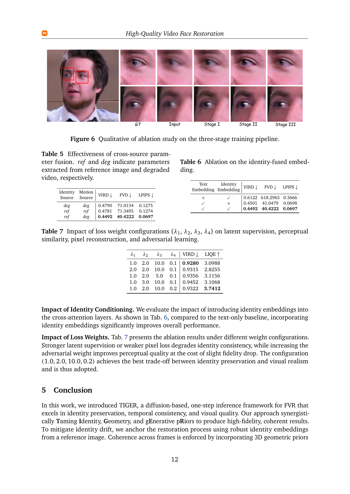
_图 12：TIGER 原文第 12 页。Stage I/II/III 的视觉递进，以及 latent、perceptual、pixel 和 adversarial 权重对身份与真实感的影响。_

HeadsUp 采用全图 MSE、LPIPS、VSD，并额外加入 face fidelity、face LPIPS、identity 和 face adversarial loss。原文给出 $\lambda_{fid}=1$、$\lambda_{face-LPIPS}=0.8$、$\lambda_{id}=4$，其余权重沿用 OSEDiff。这里的重要思想不是具体数字，而是**把小面积脸部单独提权**：全幅 4K 人像中，人脸像素可能只占很小比例，如果只算全图损失，背景和服装会主导梯度。

### 6.3 身份损失与局部细节损失必须分开

IConFace 使用冻结 AdaFace 对参考身份和目标身份施加 cosine loss，并对 identity target 使用 stop-gradient；同时按 diffusion timestep 降低高噪声状态的身份监督。这一设计承认：在高噪声时，模型尚未形成可靠人脸结构，过早强推身份 embedding 会干扰 flow matching。它还用人工核验的局部特征基准检查痣、疤痕、雀斑和色素区域，证明全局身份分数不能替代局部事实评测。[^​17]

AuthFace 则把监督集中到眼睛和嘴巴。其 Stage II 在普通 noise MSE 之外加入 time-aware latent facial feature loss，让局部判别器感知 diffusion timestep，避免用同一个静态判别边界处理从粗结构到精细纹理的全部噪声状态。论文消融指出，不带时间条件的局部判别器会破坏皮肤纹理或产生牙齿伪影，而 time-aware 版本更稳定。[^​3]

### 6.4 Flow Matching、频率、时序与固定点目标

- **Flow Matching**：IConFace 和 FADRA 保留 velocity regression 作为主目标。对于一步或少步 rectified-flow 模型，身份、感知和对抗损失应作为附加约束，不能替代速度场学习，否则可能使采样轨迹偏离基础模型的流几何。
- **频率监督**：FADRA 在 latent 上做 $8\times8$ DCT，并用 HVS/JPEG 量化表形成频率权重，把监督集中到视觉敏感且常被压缩丢失的高频分量。同一视频 clip 共享退化参数，以免训练数据本身制造随机闪烁。[^​8]
- **跨任务时序监督**：SVFR 的 $L=L_{noise}+\lambda_1L_{ULR}+\lambda_2L_{prior}$ 同时包含 diffusion noise MSE、跨任务 latent regularization 和 68 点 landmark prior。ULR 解决盲修复、着色、补全共同训练时特征空间割裂的问题，landmark loss 则补充结构先验。[^​7]
- **固定点与循环一致性**：CFRNet 的目标包含 progressive multi-cycle supervision、idempotence、re-degradation cycle、全局/局部对抗、Gram style 和 ArcFace identity。它把 $\lambda_{fp}$ 在前 100K 次迭代从 0 提升到 0.5，避免网络一开始退化成恒等映射；GAN 先 warm-up 5K，再用 5K 逐步打开 adversarial/component loss。[^​10]

### 6.5 LOSS 调度与诊断原则

1. **先任务目标，后分布目标**：先用 reconstruction/latent/flow matching 学会稳定映射，再打开 LPIPS、GAN 或 VSD。
2. **identity warm-up**：身份分支先以小权重或中低噪声 timestep 启用；参考图数量、质量和身份置信度应进入权重控制。
3. **GAN/VSD ramp**：对抗或分布损失应 warm-up 后逐步增加，且保留能回退的纯保真 checkpoint。
4. **监控梯度而非只看标量**：不同损失量纲差异很大，应记录各分支对共享参数的梯度范数、夹角和冲突比例。某个 LOSS 数值很小，不代表它对参数更新影响小。
5. **按区域和退化分桶看曲线**：至少分别查看 tiny/small/medium/large face、轻/中/重退化、正脸/侧脸、肤色、年龄、遮挡、眼镜和牙齿；全局均值可能掩盖高风险失败。
6. **建立事实细节回归集**：将痣、疤痕、雀斑、牙齿形状、眼镜框、耳饰和发际线作为可追踪属性，防止感知指标上升时事实保留率下降。

## 7. 训练数据制作方法

### 7.1 高质量真值筛选：分辨率只是第一道门槛

AuthFace 收集 1.5K 张原始分辨率超过 8K 的专业摄影人像，并增加摄影标签（photographic tags），例如光线方向、焦点、景深、构图、肤质与妆容。它解决的是通用 T2I 数据中“人脸存在但不够真实”的问题：高像素数并不自动等于高质量人脸先验，过度磨皮、错误对焦、极端滤镜和生成图都应被排除。[^​3]

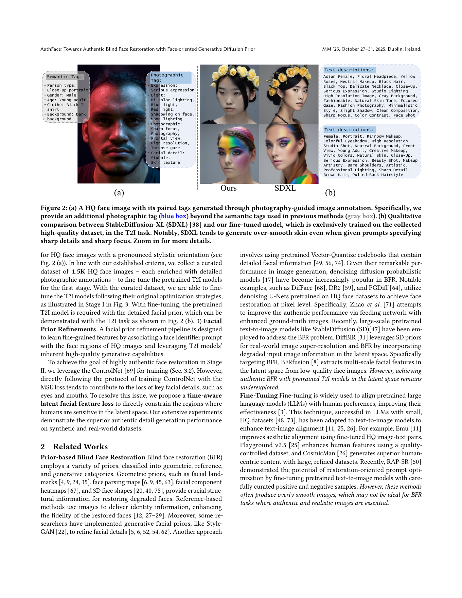
_图 13：AuthFace 原文第 3 页。语义标签之外增加摄影标签，并展示普通 SDXL 与摄影数据微调后的皮肤和细节差异。_

HeadsUp 的 PortraitSR-4K 从 LAION2B、Photo Concept Bucket、PD12M 等来源筛选候选，要求至少 3840×2160、宽高比 0.6-1.6，再以 Q-Align 做质量/美学筛选；检测到的人脸双眼距离至少 64 像素，同身份参考对的 CVLFace 相似度至少 0.65。论文报告 30K 图、27K/3K train-test、163K 训练参考对和 190 测试参考对。网络来源不等于可自由再分发，本地资料库只保存论文与入口，不保存该数据集图像。

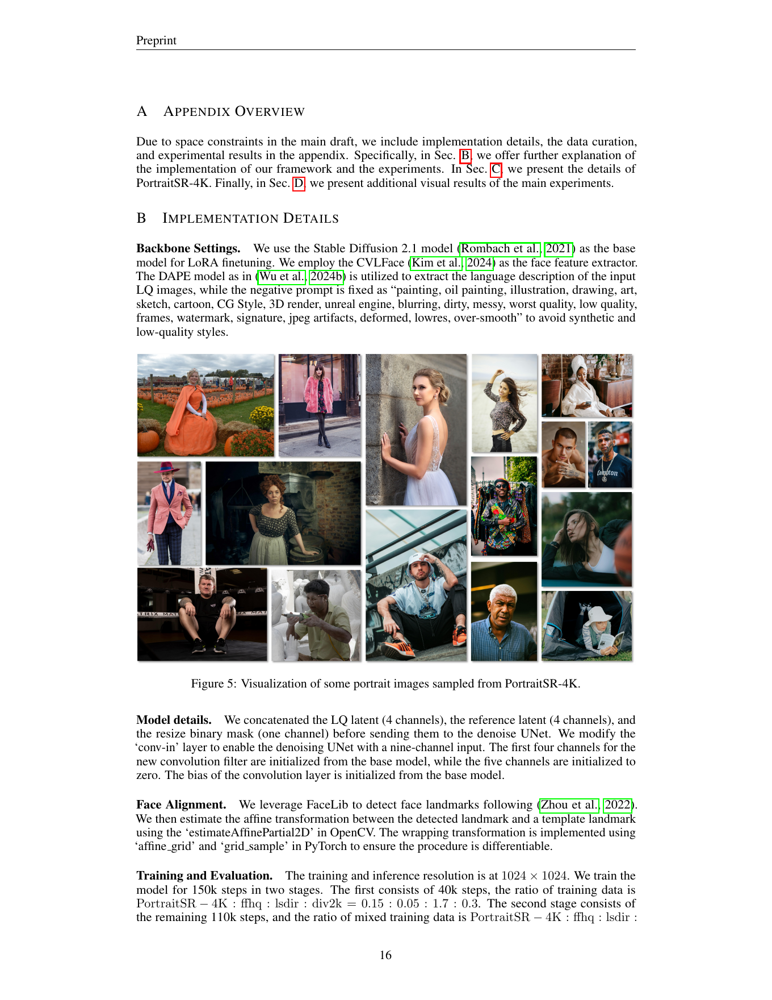
_图 14：HeadsUp 原文第 16 页。PortraitSR-4K 样例、模型输入构造及两阶段混合训练比例。_

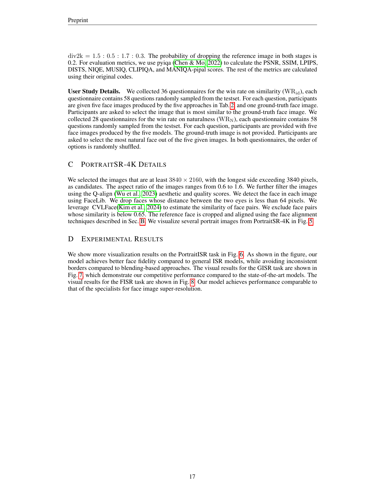
_图 15：HeadsUp 原文第 17 页。4K 分辨率、宽高比、Q-Align、人脸尺度与身份相似度筛选。_

### 7.2 建立“全幅人像 + 对齐脸 + 同身份参考”三种视图

建议每个训练样本至少保留三个逻辑视图：

1. **Full portrait view**：用于头发、服装、身体、背景和整体色彩的一致恢复。
2. **Aligned face view**：用于眼、口、鼻、皮肤和身份监督；同时保存 affine transform，确保局部 loss 能反向映射到全图。
3. **Identity reference view**：从同一身份的不同时间、姿态或场景中选取，不能与目标同帧、近重复或同一次连拍，否则模型会走捷径复制纹理。

训练、验证和测试必须按**身份级（identity-disjoint）**划分，而不是按图片随机划分。视频还应按原始 clip 或拍摄 session 隔离，避免相邻帧落入不同集合。参考图应记录身份置信度、清晰度、姿态差、年龄差、妆容差和遮挡状态；IConFace 的 0/1/2/3 张参考概率 30/30/20/20 与 HeadsUp 的 reference dropout 0.2 都是在训练模型处理“有参考、弱参考、无参考”不同工作模式。

### 7.3 合成退化：从 BSRGAN 二阶链扩展到 RAW/ISP

仅在 sRGB 图像上添加独立高斯噪声，无法覆盖真实手机成像。建议把退化分成光学、传感器、ISP、编码和显示五层，并保留每一步的参数记录：

```text
HQ linear/RAW proxy
  -> optical blur / defocus / motion / lens aberration
  -> resize and digital zoom
  -> shot noise + read noise + row/column noise
  -> demosaic -> denoise -> AWB -> CCM -> tone mapping
  -> sharpening / local contrast / face beautification residue
  -> JPEG or HEIF compression -> social-app recompression
```

RestorerID 使用 blur-resize-noise-JPEG 二阶退化，并先把 sRGB 经 ISP 模型转换到 RAW 域再加噪声，使噪声过程更接近相机成像。该设计比简单 RGB Gaussian noise 更值得手机业务复用。[^​5]

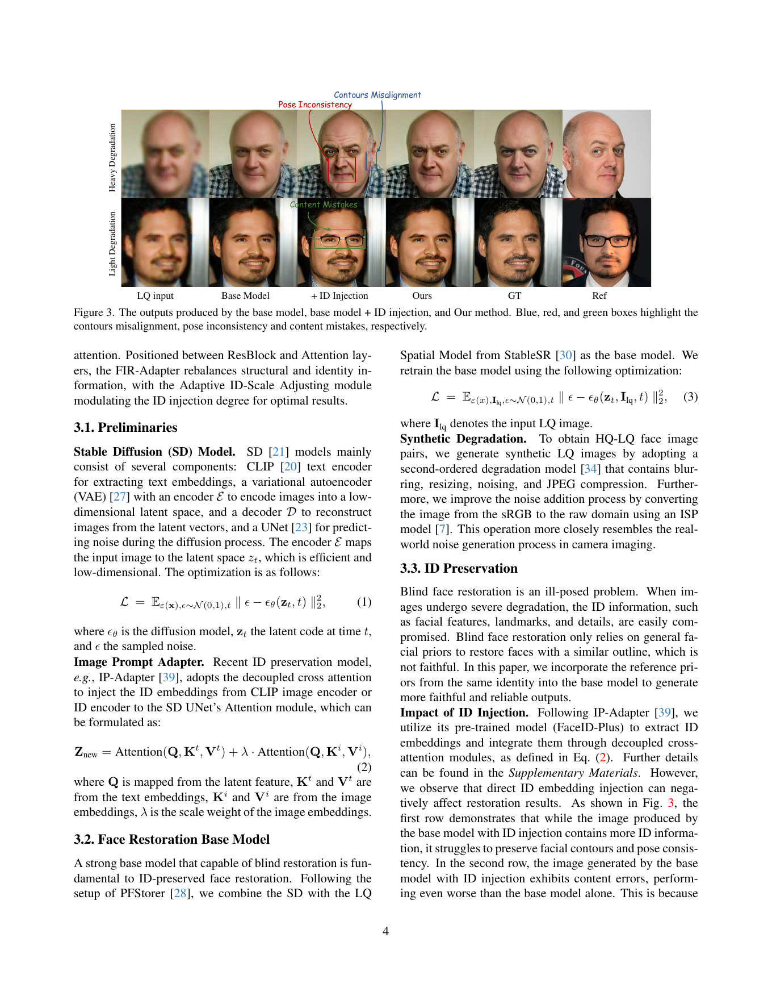
_图 16：RestorerID 原文第 4 页。二阶 blur/resize/noise/JPEG 退化，以及 sRGB 到 RAW 域的相机噪声模拟。_

IConFace 在线以 50% BSRGAN 和 50% Real-ESRGAN 生成 LQ。BSRGAN 随机打乱模糊、分阶段下采样、高斯噪声和 JPEG 顺序；Real-ESRGAN 使用两阶段混合 blur kernel、随机 resize、高斯/泊松噪声和 JPEG。退化强度 0-3、4-8、9-16 三桶概率为 0.5、0.3、0.2，这种分桶能避免训练被极重退化主导，也让后续按难度评测成为可能。[^​17]

### 7.4 视频数据：清晰度、运动和人脸占比共同筛选

TIGER 从 OpenHumanVid、CelebV-HQ 和 VFHQ 筛选视频，使用三个可量化维度：人脸中心位移小于 100 像素、clarity score 高于 0.7、人脸区域最短边大于 320 像素，最终保留 28,491 个样本。Stage I 用三类来源学习几何遵循，Stage II/III 用筛选后的 VFHQ 强化纹理与真实感；真实测试集含 100 个 VoxCeleb2 视频和同身份跨场景参考照片。[^​6]

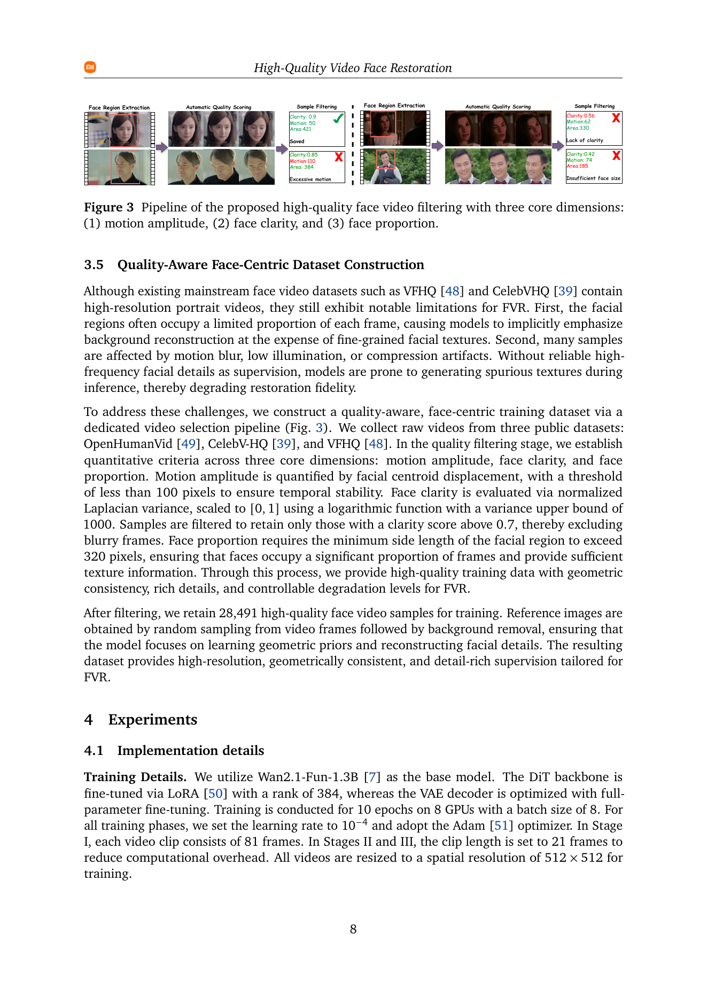
_图 17：TIGER 原文第 8 页。按运动幅度、人脸清晰度和人脸占比过滤训练视频。_

视频合成退化应在同一 clip 内共享主要参数，避免每帧随机 blur/noise/JPEG 制造不真实闪烁；同时可以加入缓慢时间漂移，模拟 AE、AWB、AF 和电子防抖的真实波动。多摄系统还需覆盖主摄/长焦/超广角之间的视角、色彩、噪声、锐化和畸变域差。

### 7.5 难例采样、许可与审计

- 按人脸尺度建立 tiny/small/medium/large 桶，并提高侧脸、快速运动、遮挡、低照度、逆光、混合光、眼镜、口罩、牙齿、首饰和复杂发型的采样概率。
- 分别统计肤色、年龄和性别呈现，避免高质量摄影数据过度集中于单一审美分布；儿童和身份数据需要更严格的许可与删除机制。
- 数据清单应记录原始来源、许可、用途限制、身份同意、可否商业使用、可否训练生物识别模型、可否再分发、删除请求入口和派生数据链。
- 网络抓取人像即使“公开可见”，也不等于获得训练、身份建模或再分发授权。报告中的 PortraitSR-4K、AuthFace 1.5K、TIGER 派生集均按“论文声明已核实，独立许可待核验”处理。

## 8. 推荐训练流程与实验设计

本节是**跨论文综合建议，不是单篇论文的原设置**。其目的在于形成一个适合人像超分、参考身份和手机相机域适配的可执行研究框架。

### 8.1 四阶段训练

| 阶段 | 训练目标 | 建议可训练模块 | 建议冻结模块 | 主要 LOSS | 退出条件 |
| --- | --- | --- | --- | --- | --- |
| Stage A 结构预训练 | 学会稳定 LQ→HQ 映射，守住轮廓、姿态、颜色 | restoration adapter、ControlNet、LoRA 或 latent mapper | 强生成骨干的大部分参数、身份识别器 | $L_{task}+L_{rec}$ | PSNR/LPIPS 与 landmark 稳定，真实图不出现明显结构漂移 |
| Stage B 人脸与身份强化 | 提升眼口、皮肤、发际线和身份 | face branch、identity projector、structure adapter | 主干可继续冻结或只解冻少量层 | $L_{task}+L_{rec}+L_{id}+L_{local}$ | 身份和局部细节提高，轻退化不被参考身份覆盖 |
| Stage C 感知与分布对齐 | 减少塑料感、平均化纹理和视频闪烁 | mapper/decoder 的受控子集、判别器 | 保留一个冻结的 fidelity checkpoint | 加 $L_{per}+L_{dist}+L_{temp}$，warm-up/ramp | 主观质量提高且事实细节、身份和时序不回退 |
| Stage D 相机域与部署适配 | 适配 RAW/ISP、夜景、数字变焦、JPEG/HEIF、多摄和端侧 | 轻量 adapter、QAT 参数、NPU 友好模块 | 云端大模型或教师模型 | 域重建、时序、蒸馏、量化/固定点一致性 | 真实设备闭环通过，失败可回退到 Stage A/B 保真路径 |

### 8.2 冻结与解冻策略

AuthFace 的“先全 U-Net 学摄影人脸先验，再冻结 U-Net 训练 ControlNet”、RestorerID 的“先训练基础修复，再只训练 FIR-Adapter”、TIGER 的“先 mapper、再 mapper+decoder、最后冻结 decoder 做对抗对齐”代表三种不同但一致的工程原则：**先让一个模块拥有清晰职责，再联合训练或添加高风险目标**。IConFace 则说明大模型可优先冻结 VAE/text encoder，用 LoRA 和专用条件模块实现参数高效适配。

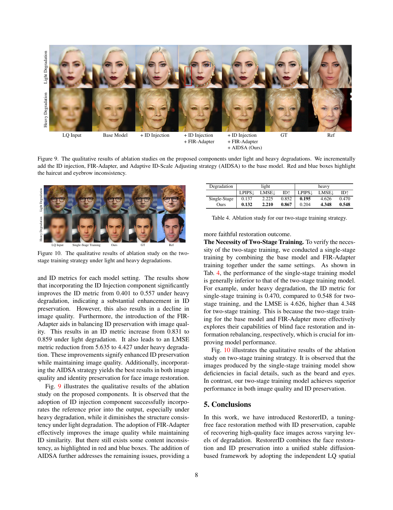
_图 18：RestorerID 原文第 8 页。单阶段联合训练与基础修复/FIR-Adapter 两阶段训练的对比。_

建议的解冻顺序为：条件分支/adapter → 高层生成 block → VAE decoder 的纹理相关层 → 必要时小学习率全量微调。每次解冻都应重新检查 identity drift、局部事实和轻退化过修复。不同模块采用分组学习率；IConFace 的 base/LoRA/identity projector 分别使用 $10^{-5}$、$5\times10^{-7}$、$3\times10^{-5}$，说明新初始化的小模块通常需要更高学习率，而预训练 LoRA 适配应更保守。[^​17]

### 8.3 LOSS 权重搜索起点

以下数值只作为**新项目消融搜索起点**，不是性能承诺，也不是从论文直接迁移的最终配方：

1. 先对每个 LOSS 做 batch 内或 EMA 尺度归一化，把 $L_{task}$ 或 $L_{rec}$ 设为锚点 1.0。
2. Stage A 只搜索 `task:rec = 1:0.5/1/2`，先确定像素/潜空间锚定强度。
3. Stage B 对 `id` 和 `local` 分别从 `0.05/0.1/0.2` 起做小网格；身份识别器置信度低或参考差异大时动态衰减。
4. Stage C 的 LPIPS 可从 `0.05/0.1/0.2` 起，GAN/VSD 从 0 warm-up 到 `0.01/0.05/0.1` 搜索；绝不能只根据 loss 数值大小决定权重。
5. 视频时序或频率损失先在静态模型收敛后加入，并对快速运动、遮挡和镜头切换设有效 mask。
6. 每组实验同时记录各 LOSS 对共享参数的 gradient norm 和 cosine similarity；若 identity 与 reconstruction 长期负相关，应改条件注入、mask 或训练阶段，而不只是继续调权重。

### 8.4 最小消融矩阵

| 维度 | 最少实验 | 必看指标/案例 |
| --- | --- | --- |
| 训练阶段 | A；A+B；A+B+C；完整 A-D | PSNR/LPIPS、IQA、ArcFace/AdaFace、局部事实保留、真实图盲测 |
| LOSS | 去掉 identity、local、perceptual、GAN/VSD、temporal/frequency | 眼口、皮肤、痣疤、发际线、背景一致性、视频闪烁 |
| 退化 | BSRGAN；Real-ESRGAN；RAW/ISP；真实采集混合 | 轻/中/重退化，夜景、数字变焦、社交压缩 |
| 参考策略 | 0/1/多参考；reference dropout；质量加权；跨年龄 | identity、pose/age leakage、无参考回退 |
| 冻结策略 | adapter-only；LoRA；decoder 解冻；全量微调 | 训练稳定性、过拟合、事实细节、部署成本 |
| 数据筛选 | 无筛选；质量筛选；人脸尺度筛选；难例重采样 | 不同尺度、肤色、年龄、遮挡和运动分桶 |

### 8.5 面向手机相机的建议配方

1. **采集覆盖**：不同 ISO、曝光、焦距、数字变焦倍率、运动速度、肤色、年龄、逆光、夜景、多脸、主摄/长焦/超广角；尽可能保存 RAW、YUV 和最终 JPEG/HEIF 对。
2. **退化复现**：RAW → shot/read noise → demosaic → AWB/CCM → tone mapping → denoise/sharpen → JPEG/HEIF；增加数字变焦、视频 CRF 和社交平台二次压缩。
3. **身份隔离**：按人物划分 train/val/test；参考图不能与目标同帧或近重复；相册参考必须有独立授权、撤回和删除路径。
4. **业务双路径**：默认输出低幻觉保真版本；只有高退化且质量闸门通过时，才启用生成式纹理增强。用户主动开启参考身份时才允许身份注入。
5. **端侧适配**：轻量网络可借鉴 CFRNet 的 fixed-point/cycle 思路或教师蒸馏；大模型负责离线教师、云端精修和困难样本伪标签，但真实设备指标必须独立测量。
6. **验收四维度**：视觉质量、身份一致、事实细节、视频时序。任何单一 IQA/ID 分数都不能作为上线条件。

训练设置与页码证据已结构化保存于 `metadata/training_evidence_matrix.json`，用于后续逐篇复核和扩展。

## 9. 对手机相机的启示

### 9.1 建议的产品分层

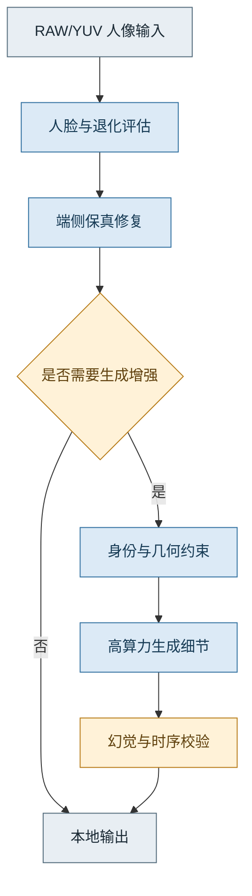
```mermaid
flowchart TB
    accTitle: Mobile portrait restoration stack
    accDescr: A layered mobile camera architecture separating deterministic reconstruction, identity controls, generative enhancement, and safety validation.

    capture["RAW/YUV 人像输入"] --> assess["人脸与退化评估"]
    assess --> edge["端侧保真修复"]
    edge --> gate{"是否需要生成增强"}
    gate -->|否| output["本地输出"]
    gate -->|是| identity["身份与几何约束"]
    identity --> cloud["高算力生成细节"]
    cloud --> validate["幻觉与时序校验"]
    validate --> output

    classDef capture_class fill:#E8EEF3,stroke:#526A7A,color:#1C2B36
    classDef process_class fill:#DCEAF6,stroke:#2F6F9F,color:#173B55
    classDef safety_class fill:#FFF2D8,stroke:#B77A16,color:#61420F
    class capture,output capture_class
    class assess,edge,identity,cloud process_class
    class gate,validate safety_class
```

1. **端侧默认路径**：检测、对齐、去噪、去压缩、温和锐化和低幻觉重建
2. **生成增强路径**：仅在严重数字变焦、老照片或用户主动选择时启用
3. **参考身份路径**：单独授权相册参考，明确显示是否使用参考人物信息
4. **视频路径**：复用跟踪、3D 人脸参数和历史帧，避免逐帧独立生成
5. **质量闸门**：检测眼镜、牙齿、文字、饰品、遮挡和多脸冲突，失败时回退到保真结果

### 9.2 当前研究空白

- 缺少 RAW 域、HDR、多摄融合与生成式人像修复的统一公开基准
- 缺少针对肤色、公平性、年龄变化和儿童人脸的系统身份风险评测
- 全幅人像超分仍明显少于对齐人脸裁剪修复，头发、服装与背景的联合一致性不足
- 消费 NPU 实测很少，扩散类论文通常只报告服务器 GPU 或理论一步数
- 参考身份数据的许可、删除权和端云隐私机制常被方法论文忽略
- 无参考质量指标可能鼓励幻觉纹理，需要建立“视觉质量、身份、事实细节、时序”四维评测

## 10. 推荐阅读路线

### 第一阶段：建立问题边界

1. CodeFormer：理解 codebook 与 fidelity-quality 控制[^​12]
2. DifFace：理解扩散后验修复[^​13]
3. NTIRE 2025/2026：理解真实世界评测、IQA 和身份检查[^​1][^​11]

### 第二阶段：工业界方法

1. AuthFace：摄影数据和真实人脸细节
2. HeadsUp：全幅 4K 人像与无缝脸部增强
3. HDRFace：高维表征与跨 U-Net/DiT 条件注入
4. IConFace：FLUX.2 多参考与局部身份细节
5. OSDFace：一步扩散与视觉提示
6. TIGER / SVFR：视频身份、几何和统一任务
7. IQPFR / InfoBFR / LRPO：质量先验、信息瓶颈与强化学习
8. CFRNet：消费 NPU 部署

### 第三阶段：前沿方法

1. GeoMAR：几何对齐与 masked autoregressive refinement
2. Latent-PMRF：感知-失真折中与潜空间 rectified flow[^​14]
3. IDFSR / RestorerID：极端超分与参考身份
4. FADRA：频率感知视频扩散
5. HeadsUp!：全幅 4K 人像一步超分与脸部无缝增强
6. Face2Scene / DVFace / DicFace：场景与视频方向，待 PDF 补齐后重点阅读

## 11. 局限与下一步

本报告是阶段性研究手册，不是完整系统综述。45 篇种子池中仍有 27 篇只有元数据或 HTML 原文证据、等待 PDF 下载；部分 2026 工作是预印本，标题、作者或实验可能随版本更新。HeadsUp 与 IConFace 已完成 PDF、页数、SHA-256 和全文抽取；Face2Scene、DVFace、MeInTime、IQPFR、DicFace、LRPO、InfoBFR 等仍待逐篇补齐 PDF。数据集官方页快照只证明页面在检索日的公开状态，不代表获得再分发授权。

本轮已补充 11 篇重点论文的训练证据矩阵，并新增 LOSS 组合、数据制作、RAW/ISP 退化、分阶段训练、冻结/解冻、消融设计和手机相机训练配方。下一轮应继续补齐全幅人像超分、相机公司论文和数据集条款，并把当前综合建议转化为可执行的实验配置模板与真实设备评测协议。

## 参考文献

[^1]: Wang, J., et al. (2026). "The Second Challenge on Real-World Face Restoration at NTIRE 2026: Methods and Results." _CVPR 2026 Workshop_. https://arxiv.org/abs/2604.10532

[^2]: Gan, L., et al. (2026). "GeoMAR: Unleashing Geometrically Aligned Features for Masked Autoregressive Blind Face Restoration." _arXiv_. https://arxiv.org/abs/2608.03923

[^3]: Liang, G., et al. (2025). "AuthFace: Towards Authentic Blind Face Restoration with Face-oriented Generative Diffusion Prior." _ACM Multimedia 2025_. https://arxiv.org/abs/2410.09864

[^4]: Yang, J., et al. (2025). "Personalized Face Super-Resolution with Identity Decoupling and Fitting." _arXiv_. https://arxiv.org/abs/2508.10937

[^5]: Ying, J., et al. (2024). "RestorerID: Towards Tuning-Free Face Restoration with ID Preservation." _arXiv_. https://arxiv.org/abs/2411.14125

[^6]: Zhou, Y., et al. (2026). "TIGER: Taming Identity, Geometry, and Generative Priors for High-Quality Face Video Restoration." _arXiv_. https://arxiv.org/abs/2606.24336

[^7]: Wang, Z., et al. (2025). "SVFR: A Unified Framework for Generalized Video Face Restoration." _arXiv_. https://arxiv.org/abs/2501.01235

[^8]: Jiang, J., et al. (2026). "FADRA: Frequency-Aware Diffusion with Residual Adaptation for Video Face Restoration." _arXiv_. https://arxiv.org/abs/2607.06389

[^9]: Wang, J., et al. (2025). "OSDFace: One-Step Diffusion Model for Face Restoration." _CVPR 2025_. https://arxiv.org/abs/2411.17163

[^10]: Li, F., et al. (2026). "CFRNet: Cycle-Consistent Fixed-Point Training for Real-Time Blind Face Restoration on Consumer Embedded NPUs." _arXiv_. https://arxiv.org/abs/2606.06850

[^11]: Chen, Z., et al. (2025). "NTIRE 2025 Challenge on Real-World Face Restoration: Methods and Results." _CVPR 2025 Workshop_. https://arxiv.org/abs/2504.14600

[^12]: Zhou, S., et al. (2022). "Towards Robust Blind Face Restoration with Codebook Lookup Transformer." _NeurIPS 2022_. https://arxiv.org/abs/2206.11253

[^13]: Yue, Z., & Loy, C. C. (2023/2024). "Diffusion-based Face Restoration." _CVPR 2023 / TPAMI 2024_. https://arxiv.org/abs/2212.06512

[^14]: Luo, X., et al. (2025). "Latent Posterior-Mean Rectified Flow for Higher-Fidelity Perceptual Face Restoration." _arXiv_. https://arxiv.org/abs/2507.00447

[^15]: Wang, Z., et al. (2026). "HDRFace: Rethinking Face Restoration with High-Dimensional Representation." _arXiv preprint_. https://arxiv.org/abs/2605.14821

[^16]: Li, R., et al. (2025). "HeadsUp! High-Fidelity Portrait Image Super-Resolution." _arXiv preprint_. https://arxiv.org/abs/2510.09924

[^17]: Niu, A., Zhang, J., & Qing, S. (2026). "IConFace: Fine-Grained Identity Conditioning for Reference-Aware Face Restoration." _arXiv preprint v2_. https://arxiv.org/abs/2605.02814

---

_完整论文、数据集、检索快照和校验记录见 `daily/PortraitSR/PortraitSR论文与数据集索引.xlsx`。_
